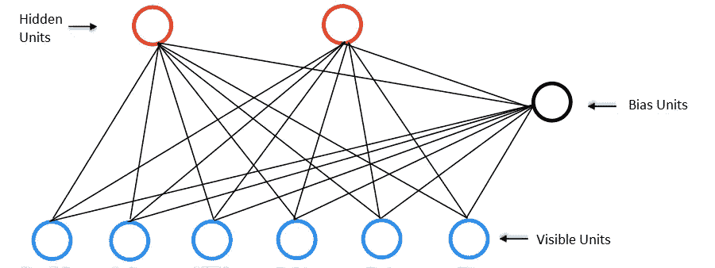
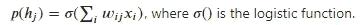
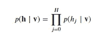
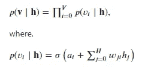
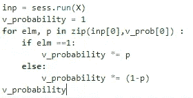

# 受限玻尔兹曼机的直观介绍(RBM)

> 原文：<https://medium.datadriveninvestor.com/an-intuitive-introduction-of-restricted-boltzmann-machine-rbm-14f4382a0dbb?source=collection_archive---------0----------------------->

# 介绍

RBM 是 [*玻尔兹曼机*](https://medium.com/@nitwmanish/an-intuitive-introduction-of-boltzmann-machine-8ec54980d789) 的变种，RBM 是保罗·斯摩棱斯基在 1986 年发明的，名为 Harmonium。2000 年中期，Geoffrey Hinton 和他的合作者发明了快速学习算法，在商业上获得了成功。

*   RBM 可用于许多应用，如**降维**、**协同过滤**、**特征学习、回归分类**和**主题建模**。
*   根据任务的不同，可以用**有监督**或**无监督**的方式训练。

## RBM 的建筑

*   这种受限玻尔兹曼机器(RBM)有一个输入层(也称为*可见层*)和一个单独的隐藏层，神经元之间的连接是受限的。
*   神经元只连接到其他层的神经元，而不连接到同一层的神经元。
*   *可见*神经元与*可见*神经元之间没有任何联系。
*   *隐藏*神经元与*隐藏*神经元之间没有任何联系。
*   在 RBM *可见的和隐藏的*神经元连接形成一个[二分图](https://en.wikipedia.org/wiki/Bipartite_graph)。
*   RBM 被认为是“受限的”,因为同一层中没有两个节点共享一个连接

Restricted Boltzmann Machine

## RBM 是如何工作的？

**RBM** 有两个阶段

*   **向前传球**
*   **向后传递**或**重建**

RBM 接受输入，并把它们翻译成一组代表它们的数字(向前传递)。然后，这些数字可以被转换回重建输入(反向传递)。

在前向传递中，RBM 接受输入并将其翻译成一组对输入进行编码的数字。

在反向传递中，它获取这组数字，并将其转换回以形成重新构造的输入。

 [## 金融中的机器学习——数据驱动的投资者

### 在我们讲述一些机器学习金融应用之前，我们先来了解一下什么是机器学习。机器…

www.datadriveninvestor.com](https://www.datadriveninvestor.com/2019/02/08/machine-learning-in-finance/) 

通过几次向前和向后传递，RBM 被训练来重构输入数据。三个步骤在整个训练过程中反复重复。

(a)通过前向传递，每个输入都与一个单独的权重和一个总体偏差相结合，并且结果被传递到隐藏层，该隐藏层可以激活也可以不激活。

(b)接下来，在反向传递中，将每个激活与单独的权重和整体偏差相结合，并将结果传递给可视层以进行重建。
(c)在可视层，将重建与原始输入进行比较，以确定结果的质量。

训练有素的 RBM 可以揭示在检测模式时哪些特征是最重要的。

一个训练有素的网络将能够以很高的准确度进行反向翻译。在这两个步骤中，权重和偏差都起着非常重要的作用。它们允许 RBM 破译输入特征之间的相互关系，并且它们还帮助 RBM 决定在检测模式时哪些输入特征是最重要的**。**

需要注意的是，RBM 实际上是在决定哪些输入要素是重要的，以及它们应该如何组合以形成模式。换句话说，RBM 是特征提取器神经网络家族的一部分，这些神经网络都被设计成识别数据中的固有模式。这些网络也被称为自动编码器，因为在某种程度上，它们必须编码自己的结构。

**注意:**RBM 使用*随机*方法来学习数据的底层结构，而自动编码器则使用*确定性*方法。

# 用一个例子理解 RBM

我们举个例子，假设在我们的例子中只有 7 个值的向量，那么**可见的**层必须有 j=7 个输入节点。第二层是**隐藏**层，在我们的例子中，它拥有 I 个神经元，我们将在隐藏层中使用 2 个节点，所以 i = 2。

每个**隐藏**节点可以具有 0 或 1 值(即 s *i* = 1 或 s *i* = 0)，其概率是从其他 j 个可见单元接收的输入的逻辑函数，称为 p(s *i* = 1)。

可见的层中的每个节点也有偏差。对于可见单位，我们将偏差表示为“ **v_b** ”。 **v_b** 由所有**可见**单元共享。

我们也为隐藏的层定义了偏差。我们将用“ **h_b** ”来表示这种偏差。 **h_b** 由所有**隐藏**单元共享。

将 tensorflow 导入为 TF
**v _ b**= TF . placeholder(" float "，[7])
**h _ b**= TF . placeholder(" float "，[2])

我们需要定义可见层和隐藏层节点之间的权重。在权重矩阵中，行数等于可见节点数，列数等于隐藏节点数。

设 **W** 为 7x2 的张量，其中 7 为可见层神经元数，2 为隐层神经元数。

***W****= TF . constant(NP . random . normal(loc = 0.0，scale=1.0，size=(7，2))。astype(np.float32))*

**正向传递:**一个训练样本 **X** 作为所有可见节点的输入，传递给所有隐藏节点。处理发生在每个隐藏层的节点。这种计算从随机决定是否传输该输入开始(确定每个隐藏层的状态)。在隐藏层的节点上， **X** 乘以一个**𝑊***𝑖𝑗**并加到 **h_b** 。这两个操作的结果被送入 sigmoid 函数，该函数产生节点的输出 p(**h**j)，其中 j 是单元号。*

**

*p( **h** *j* )是隐藏单元的概率。而所有的值合在一起称为**概率分布。** RBM 使用输入 **X** 来预测隐藏节点激活。例如，假设第一个训练项目的**ℎ**t38】p 的值为【0.51±0.84】。它告诉我们每个隐藏神经元在**正向传递:**的条件概率是多少*

*   *p(**ℎ**t44】1= 1 | v)= 0.51*
*   *p(**ℎ**t48】2= 1 | v)= 0.84*

*结果，对于训练集中的每一行，生成了**向量/张量**，在我们的情况下，其大小为【1x2】，并且总共有 n 个向量( **𝑝** (ℎ)=[nx2]).*

*然后我们以概率𝑝(ℎ *𝑗* |𝑉打开单位**ℎ**t56】𝑗，以概率 1−𝑝(ℎ *𝑗* |𝑉).关闭单位*

*因此，给定 v(对于训练样本)的 h 的配置的条件概率是:*

**

*现在，从这个概率分布𝑝(ℎ *𝑗* 中采样一个隐藏的激活向量 **h** 。也就是说，我们从隐藏层值的概率分布中采样激活向量。*

*我们举个例子。假设我们有一个经过训练的 RBM，和一个非常简单的输入向量，如[1.0，0.0，0.0，1.0，0.0，0.0，0.0]，让我们看看向前传递的输出:*

**sess = tf。session()* ***X****= TF . constant([[1.0，0.0，0.0，1.0，0.0，0.0，0.0]])
v _ state =****X******h _ b****= TF . constant([0.1，0.1])**

***向后传递(重建):**RBM 通过在**可见**和**隐藏**层之间进行几次向前和向后传递来重建数据。所以，在**向后传递** ( **重建**)中，来自隐藏层的样本( **h** )起到输入的作用。也就是说， **h** 成为**反向通道**的输入。相同的权重矩阵和可见图层偏差用于通过 sigmoid 函数。这个产生的输出是一个重构，它是原始输入的近似。*

****v _ b****= TF . constant([0.1，0.2，0.1，0.1，0.1，0.2，0.1])*
*v _ prob = sess . run(TF . nn . sigmoid(TF . matmul(h _ state，TF . transpose(****W【T75****

*RBM 学习输入的概率分布，然后，经过训练后，RBM 可以根据学习的概率分布生成新的样本。我们知道，**概率分布**，是一个数学函数，它提供了实验中不同可能结果出现的概率。*

*可见单元 v 上的条件概率分布由下式给出*

**

*因此，给定隐藏单元和权重的当前状态，基于上述**概率分布**函数，在重建阶段产生[ *1.0，0.0，0.0，1.0，0.0，0.0，0.0* 的概率是多少？*

**

*现在我们要计算 X 和 V 向量有多相似？重构的值很可能看起来不像输入向量，因为我们的网络还没有训练。我们的目标是以输入向量和重构向量相同的方式训练模型。因此，根据输入值与我们刚刚重建的值的不同程度，调整权重。*

# *结论*

*受限玻尔兹曼机是生成模型。RBM 的一个有趣的方面是数据不需要被标注。事实证明，这对于照片、视频、声音和传感器数据等真实世界的数据集非常重要——所有这些数据往往都是未标记的。RBM 不会让人们手动标记数据并引入错误，而是自动对数据进行分类，通过适当调整权重和偏差，RBM 能够提取重要特征并重建输入*

****希望这篇文章能帮助你对受限玻尔兹曼机(RBM)有基本的了解。我认为它至少会对 RBM 所涉及的步骤提供一个很好的解释。****