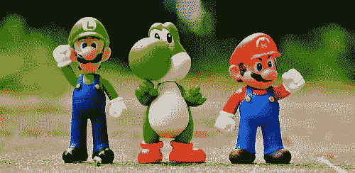
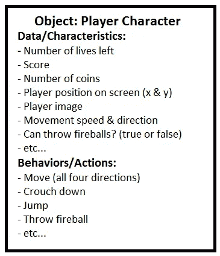

# 面向对象的蘑菇王国:使用超级马里奥兄弟理解面向对象编程

> 原文：<https://medium.datadriveninvestor.com/an-object-oriented-mushroom-kingdom-understanding-object-oriented-programming-using-super-mario-5337d33f8e0e?source=collection_archive---------17----------------------->

基于我自己作为导师、学生和专业开发人员的经历，并受到这些经历的启发，[我一直在写一本书，这本书使用现实生活中的视频游戏来教授 Java 和计算机科学导论](https://cloudyheavengames.itch.io/the-fun-of-computer-science)。在最近的一次辅导会议后，我觉得我需要更好地解释一些话题，这些话题可能需要比我迄今为止所写的更多的关注。所以这篇短文是我将会写进书里的一篇文章的第一部分。我在很大程度上使这个讨论与语言无关，并且没有代码示例…现在让我们只关注概念。

 [## DDI 编辑推荐:5 本机器学习书籍，让你从新手变成数据驱动专家…

### 机器学习行业的蓬勃发展重新引起了人们对人工智能的兴趣

go.datadriveninvestor.com](http://go.datadriveninvestor.com/5ML1) 

我看到我的许多学生的一个主要误解是面向对象编程的概念。 ***面向对象编程*** 是一种软件设计和编码的方法，其中程序或应用程序基于“对象”，这些“对象”是既有行为(在程序中表示为 ***方法*** 或 ***功能*** )又有数据(信息，在程序中存储为 ***变量*** 或 ***常量*** )的实体(或“事物”)。程序中的这些对象通常以不同的精确度模拟真实世界的对象。

此外，对象以严格定义的方式与程序交互，并根据我们赋予它们的方法、数据和其他属性相互交互。

我发现，如果没有一个好的例子，新的计算机科学学生通常很难理解整个概念。幸运的是，我还发现电子游戏是一个很好的方式来说明这一点。让我们用一个很多人都熟悉的游戏:任天堂的*超级马里奥兄弟*。如果你没有在最初的任天堂娱乐系统(NES)上玩过第一个游戏，你可能已经玩过该系列的许多游戏中的至少一个，Youtube 上也有许多该系列的游戏视频，所以希望你能够理解这个例子。

不过，让我澄清一下，这个游戏是*而不是*使用面向对象的编程方法和语言创建的，比如 Java 或 C++。它创建于 1985 年，你可以想象，游戏开发技术与今天有很大不同。然而，我们仍然可以从面向对象的角度来看这个游戏，并且我们可以使用你可能更熟悉的语言来创建类似的东西。

对于大多数游戏来说，包括 NES 的第一版，基本前提非常简单。你扮演一个冒险的水管工，他跌跌撞撞地进入了另一个名为蘑菇王国的世界，这个世界充满了被称为 Goombas 的邪恶蘑菇人、被称为 Koopa Troopas 的跟踪海龟、食人植物(食人鱼植物)和其他恶棍，以及移动平台、无底洞、管道和各种障碍。你必须穿越世界，从海龟王布瑟手中救出公主。为了做到这一点，你可以奔跑和跳跃越过障碍和敌人的顶部，并吃掉让你变大并给你火球术力量(以及后期游戏中的其他力量和变形)的增强力量。你也可以跳起来，用头猛撞积木；一些方块破裂，其他标有闪烁问号的方块释放能量或硬币。有些关卡需要你游泳。在大多数情况下，如果敌人触摸马里奥，马里奥会失去一条生命，如果他是小尺寸，或者如果他吃了一个动力蘑菇，他会恢复到小尺寸。主要的例外是当马里奥跳到敌人头上的时候。虽然游戏中有更多的细节，但这个描述基本上是游戏的一个缩影。

我相信你可以想象所有这些不同的角色和物体是如何与世界和彼此互动的。如果敌人碰到马里奥，就会对他造成危险，但是如果马里奥跳到他们头上，用火球打他们，或者在他们走在上面时打碎一个积木，大多数敌人都可以被打败。作为打败他们的回报，马里奥每派出一个敌人就会得到一定数量的积分。马里奥甚至可以使用 Koopa Troopa 炮弹作为武器，用它们来干掉其他敌人或打击和打破方块。方块可以作为障碍，坚实的地面(对马里奥和敌人来说)和潜在的敌人死亡陷阱，如果马里奥猛击一个上面有敌人的方块。从积木或户外收集足够的硬币，马里奥获得一条额外的生命。所有这些对象在游戏中都有不同的目的，并以一些严格定义的方式相互作用。

让我们看看面向对象的设计如何应用到这个游戏中。我们已经描述了这个游戏中几种不同类型的对象，例如:

*   可玩的角色(通常是马里奥或他的兄弟路易吉)
*   各种敌人，包括:

—古姆巴斯

-库帕部队

—食人鱼植物

*   不同类型的加电，包括:

—红蘑菇:增加玩家的尺寸，在失去一条生命之前允许额外的一击

—绿蘑菇:给玩家额外的生命

— Fireflowers

—星星

*   不同类型的积木:易碎的，“奖品”积木(给硬币或能量的积木)，隐形的
*   硬币

所有这些，还有更多，都是马里奥游戏世界中不同物体的例子。事实上，我们甚至可以把整个游戏世界想象成一个物体本身！

**数据和特性**

现在，关于物体我们说了什么？它们都有关联的数据和行为。让我们从讨论这些对象可能拥有的一些数据开始。什么信息与游戏中的每个对象相关联？

让我们先来看看玩家的性格。一些可能立即浮现在脑海中的角色信息可能包括:

*   剩余的生命数量
*   硬币数量
*   得分

这些特征非常明显，直接显示在屏幕上，所以玩家可能会首先想到这些信息。我们再深入一点，想出一些乍一看可能不那么明显的人物信息:

*   玩家在屏幕上的位置:如果你把你的电视或电脑屏幕想象成一个平面网格，你可以用上下和左右的距离来描述玩家在屏幕的哪个位置。在数学术语中，这些距离可以描述为一组 x/y 坐标，其中 x 是距屏幕左边缘的距离，y 是距屏幕顶部的距离，以像素为单位。这当然会随着角色的移动而改变。游戏中的实际位置比这要复杂一点，但是现在这个简单的方法就可以了。
*   玩家形象:我们的玩家由屏幕上的图片(也称为精灵)来表示，它可以根据玩家的移动和状态而变化。马里奥和路易吉的精神不同。在计算机系统上，你可以把这张图片想象成一个图像文件，并有一个相关的文件名。而且别忘了，即使在你的电脑上，你也可以有动画图片(还记得 gif 吗？)，就像在一个游戏里一样。
*   玩家状态信息，包括:

—播放器是否为普通尺寸(没有有效的加电)

—玩家是否可以投掷火球

—无论玩家是否接触过明星能量，是否所向披靡

*   当前玩家移动的信息，包括:

—玩家是在半空中，还是接触到坚实的地面？

—玩家是奔跑还是匀速移动？

这些只是一些额外的信息，我们不会进行完整的描述，但这些应该会让你对一些你最喜欢的游戏背后的一些“隐藏”数据有所了解。

**行为和动作**

我们已经讨论了数据，那么行为呢？游戏中的物体*实际上是做什么的*？再一次，让我们看看我们的玩家角色。解决这个问题的一个方法是问玩家可以让马里奥和路易吉做什么动作。以下是几个例子，以及触发这些动作的原因:

*   向左或向右移动:使用游戏控制器方向板上的左右按钮，使马里奥向任一方向移动。
*   蹲下:当马里奥处于较大形态时，按下向下按钮，让他蹲下，这样他就可以躲避危险的物体，如子弹和火球。
*   爬上豆茎:按向上键，马里奥就会爬上豆茎。向下按钮也可以让他爬下豆茎。
*   扔一个火球:在马里奥吃了一个火花后按下 B 键，马里奥会向他面对的方向扔一个火球。
*   跳跃:按下 A 键会让马里奥直接跳到空中。同时按住左或右按钮，让马里奥向任一方向跳跃。

还有一些发生在马里奥身上的行为，并不是玩家直接可以控制的。例如:

*   失去一条生命:如果马里奥在普通尺寸时受到敌人伤害，他将失去一条生命，生命数量将减少一条。马里奥也会失去一条生命，即使他有当前的异能，如果他掉进了一个坑或熔岩。
*   游戏结束:如果马里奥失去了所有的生命，玩家将在屏幕上获得一个游戏，并再次从第一关开始。
*   通过加电变成另一种形态:如果马里奥吃了一个能量蘑菇，他会变得更大，并且可以在失去一条生命之前受到额外的攻击。如果马里奥吃了一朵火花，他就获得了投掷火球的能力。如果他触摸了一个星人异能，他将变得对敌人的接触不可战胜，当敌人在这种状态下触摸他时，他们将被击败。

你作为玩家的行为可以决定这些行为是否会发生，但是你不能只是按下一个按钮就失去一条生命或者获得一个能量。这些事情动作仍然是马里奥潜在行为的一部分，但你只能根据特定的规则，作为与游戏世界互动的结果，让它们发生。

为了帮助形象化玩家角色，我们可以创建一个图表来描述与该对象相关的一些特征和行为。当然，这个图表并不是一个完整的描述，但它是一个思考如何组织游戏组件的好方法。我们也可以为其他游戏对象创建图表，事实上，作为开发者，这种方法是开发过程中非常有用的常规部分。

A diagram of the player object’s characteristics and behaviors

像这样的图可以帮助你描述和理解一个游戏对象，一目了然。

游戏中的其他对象也有行为，其中许多是与其他游戏对象交互的结果。以下是一些例子:

*   许多敌人，包括壳中的库帕士兵和古姆巴，都有一套马里奥跳到他们头上时会发生的动作。标准行为集包括:

—显示死亡动画(通常敌人图像被展平)，然后敌人从屏幕上消失。

—播放一个小的声音效果。

—给定的点数，每个点数取决于敌人的类型，被添加到马里奥的分数中。

—在屏幕上被击败的敌人之前的位置，一个显示得分的白色小文本在屏幕上短暂闪烁。

*   有两种类型的区块，常规区块和问号区块。

—这两种类型的积木都导致马里奥在落在它们上面时停止向下移动(因此，如果马里奥正在跳跃，他的脚碰到了积木的顶部，他的向下速度就变成了 0)。

—当马里奥从其中一边撞上这两种类型的积木时，他向左或向右的速度都变成 0。基本上他跑不过街区。

—当马力全开的马里奥从下面撞上普通积木时，它们就会破碎。

—当马里奥从下面击中问号积木时，它们会释放硬币、能量或豆茎。

因此，我们可以看到，在整个游戏世界中，物体都有影响自身和其他物体的行为。对于这样一个看似简单的游戏(至少，与现在很多大型游戏相比)，蘑菇王国里发生了很多事情；到目前为止，我们所做的这种简短的处理甚至没有涵盖游戏的一半特征、对象和动作！作为一个玩家，你可能甚至没有考虑过这些方面，但是当你创建和编程一个这样的游戏时，这些是你必须考虑的一些细节。

希望这篇文章能帮助你更好地理解程序中对象的基本概念。我将很快发表后续文章，我们将继续我们的蘑菇王国之旅，学习更多关于面向对象编程的知识。欢迎给我留下评论或问题！

如果你想更多地了解我正在写的这本书，或者知道谁可能需要一些计算机科学或 Java 编程方面的额外帮助，请随时查看并在[https://cloudyheavengames . itch . io/the-fun-of-computer-science](https://cloudyheavengames.itch.io/the-fun-of-computer-science)上获得一本预发本。

*最初发表于*[*cloudyheavengames . itch . io*](https://cloudyheavengames.itch.io/the-fun-of-computer-science/devlog/69643/an-object-oriented-mushroom-kingdom-understanding-object-oriented-programming-using-super-mario-brothers)*。*