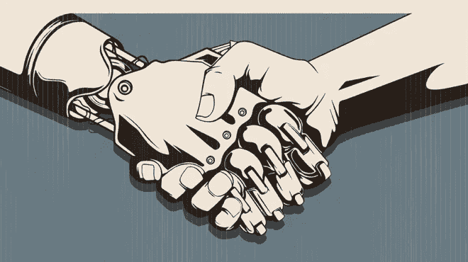
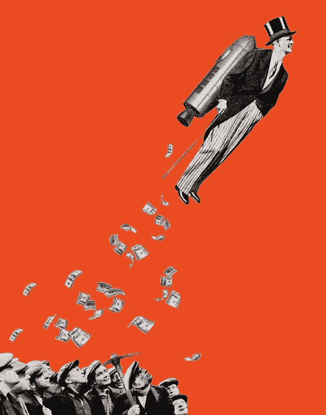
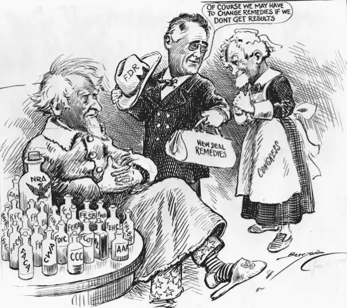
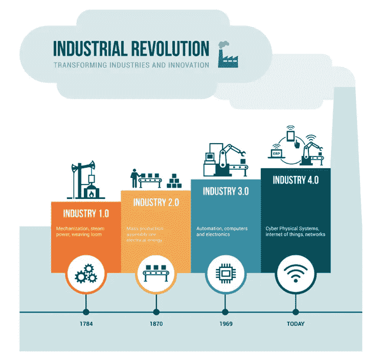
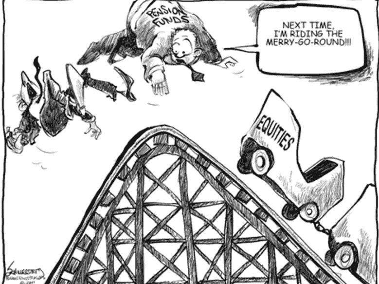
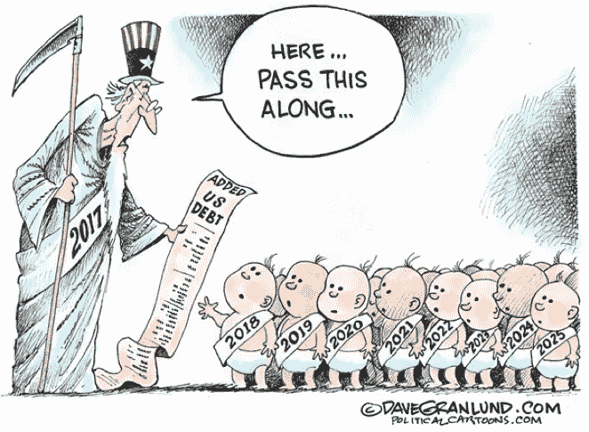
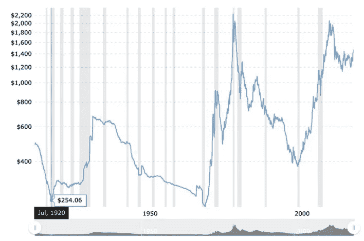
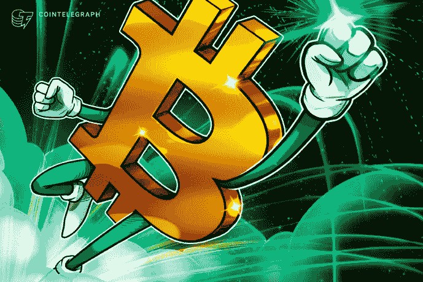

# 对密码周期的观察:你准备好迎接周期性拐点了吗？第二部分

> 原文：<https://medium.datadriveninvestor.com/an-observation-on-crypto-cycles-are-you-ready-for-the-periodic-inflection-point-part-2-d7a4745d5591?source=collection_archive---------7----------------------->

## 我们讨论全球周期中的不可逆因素及其驱动因素。然后我们讨论风险规避周期和对冲，以及比特币如何成为对冲资产的阿尔法。

*由创新研究机构 X-Order 的研究员陈巍撰写，该机构试图结合分布式计算、计算博弈论、人工智能和密码学等跨学科领域来发现未来的扩展订单。它的创始人是托尼·陶，他也是 NGC 风险投资公司的合伙人。*

在第一部分中，我们讨论了周期以及它们与钟摆和正反馈/负反馈的关系。我们还介绍了霍华德·马克斯的钟摆理论和索罗斯的反身性理论。最后，我们讨论了全球化和去全球化不可避免的历史循环。

# 全球循环中的不可逆因素

**【可逆性】**是周期性现象的根本特征。然而，世界的发展也受到另一种不可逆转的力量的稳步推动。

在这些不可逆的驱动因素中，最明显的是**技术创新**。新技术的出现真正改变了我们的生活，历史学家称之为“工业革命”。但是别忘了，人类需要时间来适应新技术。

Industrial Revolution, National Public Radio

## 第一次和第二次工业革命期间的适应过程

在 1850 年全球化浪潮开始之前，第一次工业革命刚刚结束，大规模工厂生产取代了手工生产。这是科学技术第一次对人们的生产和生活方式产生大规模的影响。纺织工业中的重要技术，蒸汽机，钢铁生产方法都得到了大规模的应用。

此后，生产关系发生了变化。生产的集中已经取代了大工厂的学徒车间的原始模式。标准化生产带来了廉价产品，剥夺了越来越多手工业者的收入。

> *生产的集中会有什么影响？*

其影响是资源集中在少数人手中，贫富差距大大扩大。**人也被分为资本家和工人阶级**，这也是 1850 年到 1914 年的核心冲突。

Rich getting richer, The New Yorker

这种冲突在工业革命之前并不存在。人们无法找到一种合适的方法来应对工业时代带来的生产方式的巨大变化。

> 于是，*极度的不适应累积放大。*

后来，**经过两次世界大战和全球金融萧条，人们逐渐适应了第一次和第二次工业革命的结果**。这次改编最大的特点是**中产阶级的崛起**。

在一篇纪念罗斯福的文章中，克林顿写道**“罗斯福新政真的允许中产阶级的建立”**。在很长一段时间里，美国的繁荣是建立在中产阶级的增长基础上的。

The New Deal, Johnston (1933)

中产阶级的特点与工人阶级不同。他们通常具有较高的教育背景和专业技能，职业如经理或技术员。同时，工会的兴起也保证了工人的权益，这**让更多的工人进入中产阶级**。也正是中产阶级的崛起使得库兹涅茨曲线出现。

First to Fourth Industrial Revolution, SpaceNews

客观地说，中产阶级的**扩大代表了人类对第一次和第二次工业革命的**完全适应。

## 我们如何应对第三次和第四次工业革命？

科技的发展是**自我强化**。随着基于现有技术的新技术的迅猛发展，第三次工业革命(数字革命)已经悄然发生并结束。从机械到数字电路，机械自动化水平不断提高。第四次工业革命，即工业 4.0，也在快速推进，其核心是实现工业智能。

当我们看到无人工厂、无人厨房、无人超市出现的时候，再次集中生产是必然的。与此同时，[大数据](https://www.datadriveninvestor.com/glossary/big-data/)资源落到少数科技巨头手中，导致**资源进一步集中。**

Fourth Industrial Revolution, Information Age

[人工智能](https://www.datadriveninvestor.com/glossary/artificial-intelligence/)带来的无人工厂，第一次让人觉得没用。在第一次和第二次工业革命中，虽然机器可以代替人完成大部分工作，但仍然需要专业人员来处理复杂的情况。机器只是笨重的工具，世界仍由聪明人主宰。

然而，在自动化和人工智能的背景下，我们一直引以为豪的人类的能力也开始面临前所未有的挑战。在《明日简史》中，以色列历史学家哈拉里指出**大量工作被智能机器取代是不可避免的，数十亿人将成为“无用阶层”。**

A Brief History of Tomorrow, Amazon

> *这些预测令人担忧，但并非不切实际。* *这一切是什么意思？*

机器已经开始取代人类，成为生产(劳动)的主体。它的直接结果是，拥有资源的人**可以通过这些“智能机器”**实现进一步的财富积累，而不是通过其他人。旧的生产关系会被取代，但新的生产关系在哪里？现在没有人能给出明确的答案。

**适应过程会很漫长，一切才刚刚开始。**

# **避险周期刚刚开始**

去全球化周期已经开始，人类对第三次和第四次工业革命的适应才刚刚开始。生产再次集中，**生产关系将再次发生变化。**

> 所有这些意味着什么？

在我们上一篇由 *Tony Tao* 、*撰写的文章《*[*Token*](https://www.datadriveninvestor.com/glossary/token/)*经济进入新周期后是否还有未来》中，我们提到“**繁荣和希望**是推动世界发展的主流因素，但也是周期性的。现在的趋势是**钟摆向保守对冲**移动，还没有结束。*

在情绪钟摆中，炒作和对冲处于极端。**希望和梦想**将炒作周期驱动到极致，而**对冲周期**则由安全感和对确定性的追求驱动。

Risk Aversion, Pi Online

在去全球化的趋势下，更多的人需要一种**全球通缩资产充当硬通货。与希望和梦想相比，人类对安全的需求更加本能和迫切。**

> *总有潮起潮落，潮起潮落。我们需要做好准备。*

## 对冲

讨论套期保值，首先需要了解资产和负债。

在一个经济体中，一个人的负债是另一个人的资产。随着经济的发展和贫富差距的扩大，一些人负债累累，无力偿还。这导致坏账，进而转化为更高的整体经济风险。

因此，需要外部力量来减少这一债务并使其平均化，以使经济更加稳定。但是平均出来的成本是需要清偿一部分债务，这会损害债权人的权益。

Bad Debts, Los Angeles Daily News

直接削减债务会损害信用体系本身。因此，一个合适的方法可能是使用雷伊·达里奥提到的方法:“**债务货币化**”——稀释一些债务。对冲就是避免这种被动的“减法”。**坦率地说，对冲是富人为了避免自己的资产被被动扣除而做出的一种努力。**

由于所有国家都面临资源集中的问题，所有国家的货币政策都大同小异。在这种情况下，拥有全球通缩资产作为硬通货是富人的最佳选择。

# 比特币:对冲资产的阿尔法

1920–2010 Gold Price Fluctuations

> *黄金是目前首选的避险资产*。

很多人有一个误区，认为黄金应该是“稳”的，认为多头长，空头短。事实上，黄金是这两种属性的对立面。不仅黄金具有高波动性，而且黄金波动的周期性趋势也相当明显。牛市持续时间短，熊市持续时间长。这也符合**人们的避险心态总是比较激进，相对不可持续。**

我们认为套期保值资产应该具有内在的确定性和较高的外在流动性(高接受度)。

## 高度内在确定性

对冲的动力来自市场和政治环境的不确定性。当这种不确定性被理解为可能的威胁和破坏的来源时，对确定性的追求就成了焦点

在繁荣时期，不确定性被理解为机遇；但在对冲中，更需要确定性(手头的资源)。因此，有确定性的资产将是富人的理想目标。

> *那么我们如何才能拥有这种内在的确定性呢？*

**清晰的衡量，一个完善的** [**确认**](https://www.datadriveninvestor.com/glossary/confirmation/) **权利的流程和可预见的供给是不可或缺的。**黄金的计算是基于金属本身的物理属性，而比特币使用分布式账本，使得计量完全透明、公开、准确。在清点黄金的时候，没有人知道有多少黄金，增加了不确定性，而比特币完美的解决了这样一个不确定性。

2019 年的一个重要事件是**新比特币网络散列率高(即计算能力)。**这大大增加了比特币网络的稳定性，也让比特币作为避险资产的优势更加凸显。

New Bitcoin Network Hash Rate High, Cointelegraph

# 外部接受度和流动性

2019 年**比特币最大的变化**是其**被广泛认可和接受。**虽然每个国家对各种代币和数字货币有不同的看法和法律定义，但有一个共识**比特币是一种资产。**

美国所有的法律工作都是为了**在操作层面上促进比特币和其他数字货币的使用**。既然是资产，就应该认真对待，合理分配。在流动性层面，比特币衍生品的增长和合法交易所的引入，尤其是 **Bakkt** 正在测试过程中，即将推出。

比特币市场整体发展良好，流动性充足。所有这些信号都指向该资产更加确定的未来。

# 结论

这是我们最近对整个市场的观察和思考。在这样的市场中，我们必然会经历一个又一个周期，这既带来了风险，也带来了机遇。

对每个人来说，更直接的问题是“我应该如何处理？”只有勇敢坚持战斗的人才能生存。循环一旦开始，就不会轻易停止。

> 你准备好了吗？

*原载于 2019 年 10 月 10 日*[*https://www.datadriveninvestor.com*](https://www.datadriveninvestor.com/2019/10/10/are-you-ready-for-the-periodic-inflection-point-part-2/)*。*

# 下一步是什么？

下一篇文章将是“对加密周期的观察”系列的一部分。

在 [Linkedin](http://linkedin.com/company/xorderglobal) 上与我们联系！

***由*** *(通过我们的微信账号)****:****Transladom*

***编辑:*** *谭*

 [## 加密货币档案|数据驱动的投资者

### 加密货币

档案|数据驱动的投资者 Cryptocurrencywww.datadriveninvestor.com](https://www.datadriveninvestor.com/category/technology/cryptocurrency/)