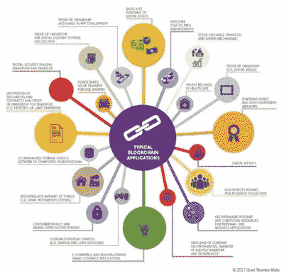
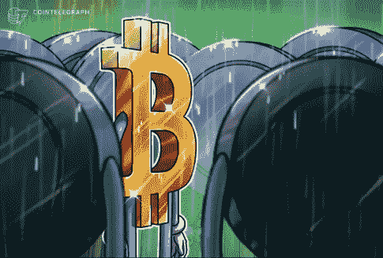
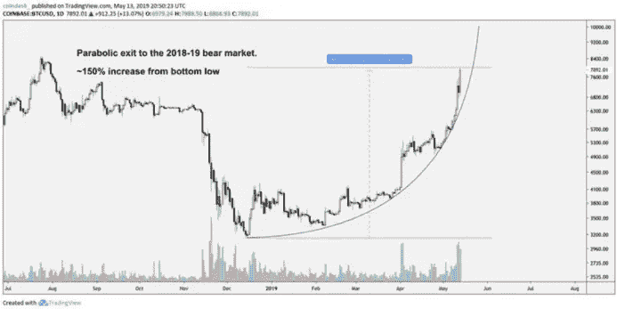
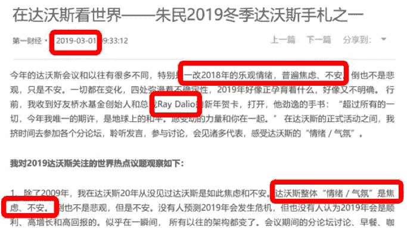
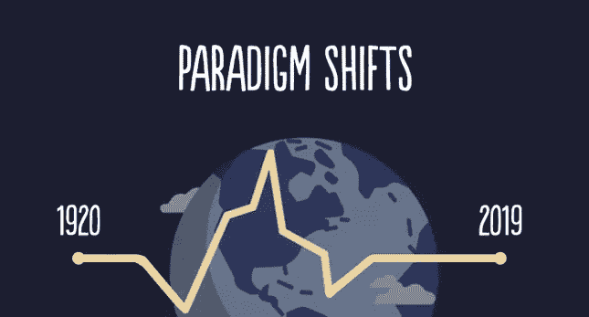

# 对加密周期的观察:进入新周期后，代币经济还有未来吗，第一部分

> 原文：<https://medium.datadriveninvestor.com/an-observation-on-crypto-cycles-is-there-still-a-future-for-the-token-economy-after-entering-the-2ef6d467d243?source=collection_archive---------2----------------------->

## 我们回顾了过去 6 个月的密码市场，通过比较最近两个周期，分析了市场情绪从乐观到焦虑的变化。

X-Order 的创始人和 NGC 风险投资公司的合伙人托尼·陶写的。X-Order 是一个创新的研究机构，试图结合分布式计算、计算博弈论、人工智能和密码学等跨学科领域来发现未来的扩展订单。

 [## ieo 在币安 Launchpad |数据驱动型投资者网站上获得 3 次代币销售，势头强劲

### 在无情的熊市之前，ICOs 在 2017-18 年期间为加密/区块链项目创造了第一次融资热潮…

www.datadriveninvestor.com](https://www.datadriveninvestor.com/2019/03/26/ieos-gather-momentum-with-3-token-sell-outs-on-binance-launchpad/) 

> *今天，我要告诉你我在 2019 年 H1 密码市场看到了什么，错过了什么，学到了什么。*

# 市场的最后一个周期

在[比特币](https://www.datadriveninvestor.com/glossary/bitcoin/)的前一个发展周期(2014 年至 2018 年)，加密市场出现了许多新事物和变革。在这个过程中，以下想法在我脑海中留下了深刻的印象:

1.  比特币价格的**上涨表明了** [**区块链**](https://www.datadriveninvestor.com/glossary/blockchain/) 的**发展。**
2.  [**令牌**](https://www.datadriveninvestor.com/glossary/token/) **经济比比特币**更重要，这在上一个周期中表现得尤为明显，这反映在市场主要由 [**以太坊**](https://www.datadriveninvestor.com/glossary/ethereum/) 而不是比特币引领的事实上。
3.  比特币仅仅是区块链革命的起点。许多人认为这是区块链技术的首次应用，未来还会有各种各样的应用。

Typical Blockchain Applications, Grant Thornton Malta

4. **BTC 优势指数将继续下降**。该值从上一个周期的 90%下降到 40%，并在 2018 年底继续下降。在这个周期中，它曾被预测会下降到 10%。

5.尽管市场仍然充斥着庞氏骗局和泡沫，但**的未来将会更加光明。**

> 尽管市场上有各种黑天鹅事件，但整个行业正在好转。进一步来说，我认为 2018 年的熊市还是比 2017 年的行情好。市场，总的来说，越来越理性了。

# 过去 6 个月的市场回顾

1.  与**前一个周期**相比，区块链的发展**缓慢而滞后。**
2.  从价格变化来看，**比特币比代币经济更受欢迎。**说到代币经济的讨论，比特币永远是主要话题之一。在过去的一年里，就价格上涨的百分比而言，市场上只有少数几个代币超过了比特币。
3.  除了比特币和交易所发行的代币，大部分代币的价值很少被大众认可。这也和之前的周期密切相关。长期来看，我们**更关注比特币或者其他有现金流**的物体，比如以 BNB 为代表的[交易所](https://www.datadriveninvestor.com/glossary/exchange/)代币。

然而，上半年代币市场的发展与我的预期仍相差甚远。

Binance Chain, BTCManager

4.**市场依然充斥着庞氏骗局**，越来越明目张胆。今天的一些骗局可以在几个月内轻松获得数十亿美元的资金。

5.BTC 优势指数不断上升，目前已经达到 65%。

Growing Bitcoin Dominance, CoinTelegraph

在上一个周期中，自从各种替代币出现后，BTC 优势指数迅速下滑，花了很长时间才回到原来的水平。然而，在这个周期中，BTC 优势指数轻松反弹至 60%，并继续攀升甚至更高。

> *代币的价值在哪里，会有未来吗？*

# 有什么问题？

这是一个严肃的话题，因为我相信你们所有人都对未来充满信心，并期待参加这次活动。

事实上，今年年初，大多数区块链从业者已经准备好经历 2019 年全年的熊市。然而，上半年过后，**比特币价格上涨发出了熊市即将结束的信号**；而其他代币还在继续挣扎。

Rising Bitcoin Prices, CoinDesk Markets

如此强烈的对比让我困惑，近几个月来我一直在思考这个问题。

> *市场出了什么问题？抑或是大多数区块链业内人士的错误预测？*

我们知道市场永远是对的，所以一定要怪我们这些行业从业者。

为了找出问题，我认为现在是时候重新了解这个市场，认识到与以前的做法有什么不同。

# 周期:经济的钟摆

上图是典型的钟摆理论。我们可以想象一下，市场上某个代币的价格像钟摆一样来回摆动，**很少停留在价值中枢。**此外，物理学告诉我们，钟摆在中心区域以最快的**速度摆动。**

很多人会用这张图来解释金融和经济，最终以**关键词【周期】**结束。虽然大家都知道这个周期，但我没有想到这个周期会给今年的密码市场带来如此明显的波动。但是，我今年最大的疑问来自于周期。

为了更合理地解释 2019 年上半年发生的事情，*让我们探索加密世界之外的世界，看看全球经济的钟摆如何摆动*。

# 2019:焦虑带来的范式转变

Comments of Min Zhu Who Participated in the 2019 Winter Davos

作为一名资深的达沃斯与会者，朱敏在他的著作中提到，与 2018 年的乐观气氛不同，这次几乎所有在场的人都很焦虑。此外，Bridgewater Associates 的创始人、全球金融行业最具影响力的 kol 之一雷伊·达里奥说，“让我们祈祷和平”，这也向观众发出了焦虑的信息。

达沃斯论坛是世界顶级的金融和经济论坛，然而，它在年初给经济学家、机构领导人甚至决策者带来了一种焦虑的气氛。

然而，这种**不安**将**导致比特币价格在接下来的**6 个月内**上涨。**

Ray Dalio’s Paradigm Shifts

> 雷伊·达里奥上个月再次警告说，黄金将是下一次范式转变的最佳投资选择。

如果总是根据技术分析来投资，在市场的范式转换过程中被淘汰的可能性很大。经典范式转变之一是比特币价格突破 6000 美元。几乎所有人都认为 6000 美元是一个强阻力位。然而，范式的转变导致了突破性的进展。

在今年的范式转变中，我们发现**比特币是一种巨大的资产，许多人会持有**，这一点很明显，因为一些大机构甚至国家今年已经开始购买比特币。

Wall Street, Bitcoin Exchange Guide

这意味着机构投资者可能会选择从股票和证券中撤出资金。

> 在钟摆摆动期间，人们经常在经济好的时候投资股票或房地产等商品。然而，当市场变坏时，他们可能会选择先持有现金。一旦经济恶化到一定程度，比如出现经济或政治危机，他们会选择直接储存黄金，而不是持有现金。

所以，雷伊·达里奥想告诉我们的是，**黄金**在**被大家忽视甚至惧怕**的状态下，向**右侧**移动，而**其他资产**向左侧**移动。**

> 毫无疑问，钟摆会摆回来，但问题是这需要多长时间？目前，整个市场明显向右移动，这意味着避险情绪仍在上升。

# 下一步是什么？

*在* [*第二部分*](https://medium.com/@xorder/an-observation-on-crypto-cycles-is-there-still-a-future-for-the-token-economy-after-entering-the-6c30c98082e8) *中，我们将着眼于在这个周期中幸存或繁荣，比特币和替代币的采用，以及黄金将如何成为下一次范式转变的最佳投资选择。最后，我们对代币经济的未来进行了思考。*

*在我们的*[*Linkedin*](http://linkedin.com/company/xorderglobal)*上与我们连线！*

***由*** *(通过我们的微信账号)****:****Transladom*

***编辑:*** *谭*

*原载于 2019 年 9 月 22 日*[*https://www.datadriveninvestor.com*](https://www.datadriveninvestor.com/2019/09/22/an-observation-on-crypto-cycles-is-there-still-a-future-for-the-token-economy-after-entering-the-new-cycle-part-1/)*。*