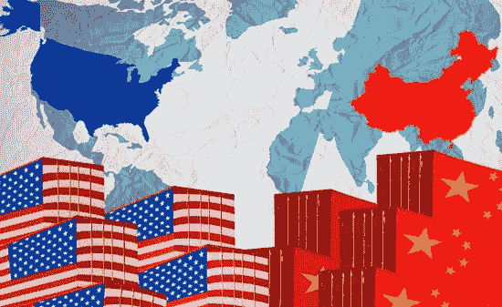
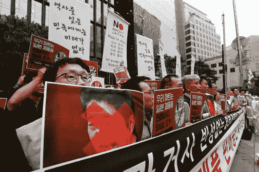
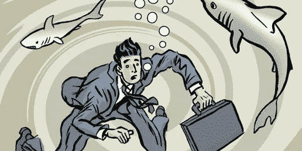
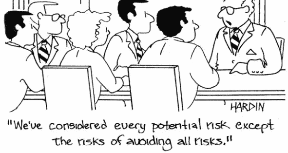
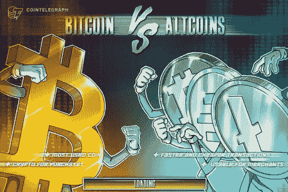
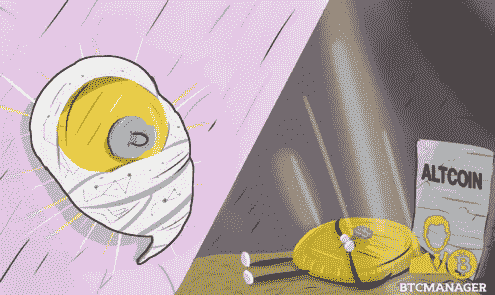
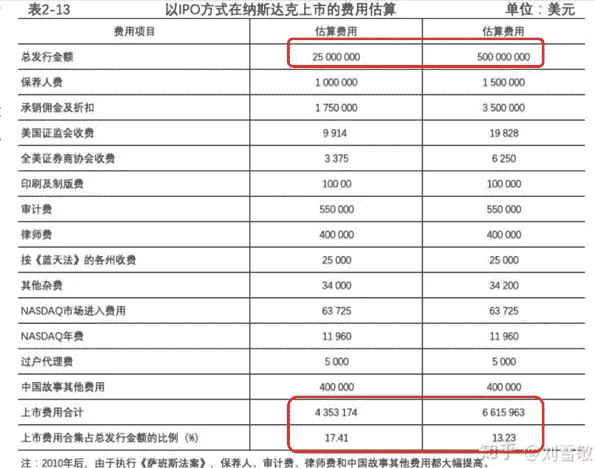
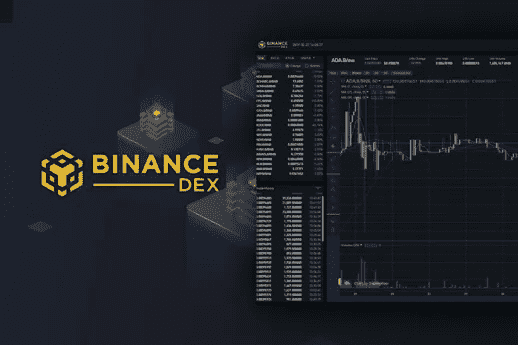
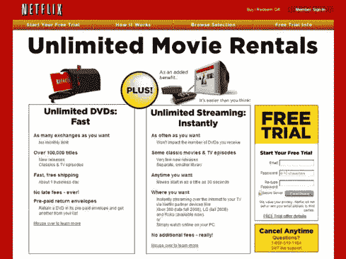

# 对加密周期的观察:进入新周期后，代币经济还有未来吗，第二部分

> 原文：<https://medium.datadriveninvestor.com/an-observation-on-crypto-cycles-is-there-still-a-future-for-the-token-economy-after-entering-the-6c30c98082e8?source=collection_archive---------5----------------------->

## 我们着眼于在这个周期中生存或繁荣，比特币和替代硬币的采用，以及黄金将如何成为下一次范式转变的最佳投资选择。最后，我们对代币经济的未来进行了思考。

X-Order 的创始人和 NGC 风险投资公司的合伙人托尼·陶写的。X-Order 是一个创新的研究机构，试图结合分布式计算、计算博弈论、人工智能和密码学等跨学科领域来发现未来的扩展订单。

在[第一部分](https://medium.com/@xorder/an-observation-on-crypto-cycles-is-there-still-a-future-for-the-token-economy-after-entering-the-2ef6d467d243)中，我们回顾了过去 6 个月的密码市场，通过对比最近两个周期，分析了市场情绪从乐观到焦虑的变化。然后，我们用钟摆理论来解释“周期”,并以雷伊·达里奥的范式转变作为结论。

 [## Azbit 旨在连接传统金融和加密货币|数据驱动的投资者

### Azbit 是下一个提供交易平台的加密项目，该平台提供保证金和算法交易。一样多…

www.datadriveninvestor.com](https://www.datadriveninvestor.com/2019/03/20/azbit-aims-to-connect-traditional-finance-and-cryptocurrency/) 

# **一个煽动的情况**

最近，有很多新闻可以支持我们对全球经济和政治局势的**预测，比如华为事件和中美贸易战。看目前的情况，我们发现房地产和股市基本已经触底。还有 2%通过房产投资从租金收入中赚取；而投资者却不敢买股票，尤其是美股。**

China-US Trade War, IT Pro

此外，大多数主要国家的经济都不好，政治紧张局势也在升级。美国的现状都不乐观，欧洲就更不用说了。

这两天，**日本限制对韩国出口**。这些出口产品是用于制造半导体的材料。一旦这些限制生效，韩国半导体产业崩溃的可能性很大，这将引发另一场贸易战。

Japan-Korea Trade War, World Politics Review

最后，民粹主义**兴起**，主张自我保护和新仇外心理**拒绝外部合作**。英国退出欧盟已经被讨论了很多年了；中东、伊朗和伊拉克的情况也是如此，尽管对这些国家来说，除了上述因素之外，还有其他因素。凭直觉，我们觉得政治形势正朝着保守的民粹主义的**方向发展。**

# 生存还是发展？

在这个循环中，人们会**本能地回避风险**，因为如果情况继续这样下去，冲突将会加剧。

当然，这是最糟糕的情况之一，但是我们都知道**想象力是人类最强的能力之一。一旦你想象到不好的事情很快就会发生，你就会选择在事情真正发生之前保护自己。**

Quote from Albert Einstein, Inspiring Thinkn

当我们目睹现实生活中的各种事件，这些事件向我们发出保护自己的信号时，我们往往会变得**厌恶风险**。这个时候，因为我们想要拯救自己，我们大多数人都变得自私，抓住任何**保证我们生存**的东西不放。

你不会想到外面去和其他人合作，为未来创造一些新的东西，或者弄清楚技术在未来会给我们带来什么样的变化？不，你不会。

> 这个时候你唯一想的就是活下来。

Survival, Entrepreneur

*如何规避风险？*雷伊·达里奥只提到黄金，没有提到[比特币](https://www.datadriveninvestor.com/glossary/bitcoin/)，看来他之前并不看好比特币。但不可否认的是**比特币是另一种形式的数字黄金**，这已经成为越来越多人的**共识**。

> *那为什么 altcoins 的增长会停滞在这个周期？我们能从这种情况中学到什么？*

在上一个周期，已经有[以太坊](https://www.datadriveninvestor.com/glossary/ethereum/)、DeFi 等[区块链](https://www.datadriveninvestor.com/glossary/blockchain/)技术为我们勾勒出未来。它让人们对未来抱有积极的期望。

的确，繁荣和希望是推动世界发展的主流因素，但也有周期。现在的趋势是，钟摆正在向保守和规避风险的方向摆动，而且看起来不会很快改变。

Risk-Aversion, Branding Strategy Source

# **比特币还是山寨币？**

如果我们把[加密货币](https://www.datadriveninvestor.com/glossary/cryptocurrency/)世界分成两部分，事情就更清楚了。在当前的周期中，**比特币的采用是由人们对避险资产的需求**驱动的，而不是为了炒作。

虽然比特币是区块链技术的第一个应用，但它现在与技术无关。目前，人们简单地将**比特币视为“数字黄金”**——一种保守的东西，当你面临麻烦时，它可能会拯救你。另一方面，**山寨币满足了炒作需求。**人们希望通过押注 altcoins 来致富，但很少有人会押注比特币，因为我们认为比特币收益可能不够。

Bitcoin vs Altcoins, CoinTelegraph

> *现实往往反映了大多数人的意愿——钟摆向规避风险，而不是炒作。*

根据雷伊·达里奥的说法，黄金正在为牛市逆转做准备，而其他资产可能会贬值。在过去的 6 个月里，加密货币市场有比特币出现牛市，而 altcoins 则显示出熊市信号。

> *Altcoins 代表未来和炒作，比特币代表保守和避险。*

Birth & Death of Altcoins, BTCManager

# **代币经济的未来**

> 代币经济还有前途吗？

在给出答案之前，我们先思考以下几个问题:*什么是健康的代币市场？是一个充满炒作的市场吗？还是一个价格膨胀的市场？虽然两者都是投资者喜欢的，但是这种市场真的健康吗？*

答案很简单。充满炒作和价格膨胀的市场是不健康的。然而，我仍然相信代币经济是有前途的，其关键是成本(T21)。

Nasdaq Listing Requirements & Costs, zhihu.com

下面是两次 IPO 的目标:一次筹集 2500 万美元，另一次筹集 5 亿美元。**倒数第二行**显示了在纳斯达克上市的 IPO 的*成本，分别为 430 万美元和 600 多万美元。**最后一行**显示*成本占*募集金额的百分比，分别为 17%和 13%。*

至于科技创新板，门槛是 10 亿至 100 亿美元，这样的公司上市的最低价值是 10 亿美元。那费用呢？大概是 3000 万到 1 亿美元。

> 换句话说，即使公司上市后可以获得巨额资金，它也必须先支付一大笔预付款。

密码市场怎么样？以**币安 DEX** 为例。令牌上市的成本约为 100，000 美元。这是行业内的一个标杆。与科技创新板相比，**的特点是成本大大降低。**

Binance Dex, Blockonomi

当我们看**科技创新板**的介绍时，它说与纳斯达克和其他交易所相比，它以更低的成本为**提供了更高的效率。**

> 然而，即使科技创新板想降低门槛，不考虑收入和市值的要求，*也无法将其收入或上市成本降低到密码市场的程度。基于这一事实，我们完全可以相信代币经济的低成本。每一项经济活动都有成本，因为这是一项市场活动，我们可以比较不同活动的成本。*

显然，列出一个令牌花费**更少。虽然现在可用的项目质量相对较差，但我们仍可能在未来看到更多质量更好的项目。**

以**网飞**为例。当网飞刚推出的时候，我们曾经因为视频质量差而不看好它，这与人们的需求背道而驰。但是现在，网飞做得非常好。早期广受批评的低质量视频不再讨论。

Netflix Website at the Early Beginning, Business Insider

> *因此，对于处于起步阶段的项目来说，最重要的是成本。只有低门槛，你才能在互联网时代生存。*

# 下一步是什么？

下一篇文章将是“对加密周期的观察”系列的一部分。

在我们的 [Linkedin](http://linkedin.com/company/xorderglobal) 上与我们联系！

***由*** *(通过我们的微信账号)****:****Transladom*

***编辑:*** *谭*

*原载于 2019 年 9 月 26 日*[*https://www.datadriveninvestor.com*](https://www.datadriveninvestor.com/2019/09/26/an-observation-on-crypto-cycles-is-there-still-a-future-for-the-token-economy-after-entering-the-new-cycle-part-2/)*。*