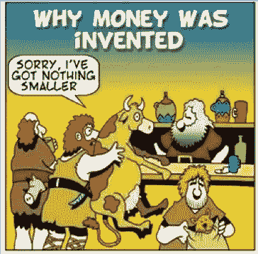
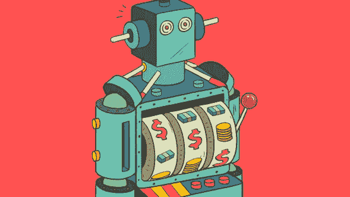
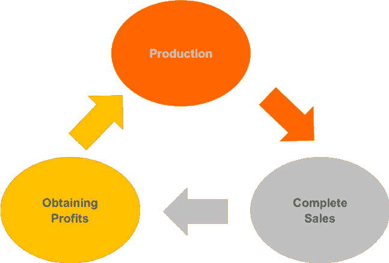
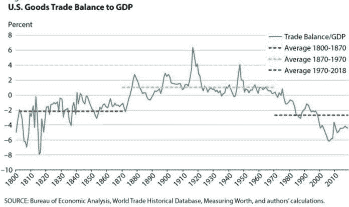
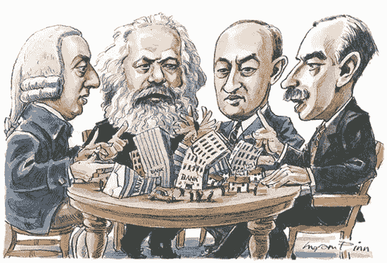

# 对加密周期的观察:市场、经济和周期，第一部分

> 原文：<https://medium.datadriveninvestor.com/an-observation-on-crypto-cycles-market-economy-and-cycles-part-1-5d5c6260c521?source=collection_archive---------14----------------------->

## *在这次分享中，我们*将利用雷伊·达里奥对经济体系的分析来研究应对周期的策略。我们还将结合我们迄今为止所学到的知识以及我们对当前宏观环境的理解，来评估比特币和数字货币市场的价值。

*由 X-Order 首席技术官 Finn Zhang 撰写，X-Order 是一家投资和研究机构，致力于研究开放金融中的价值捕捉。我们努力成为新金融和与科学和研究相关的跨学科领域之间的桥梁。它的创始人是托尼·陶，他也是 NGC 风险投资公司的合伙人。*

 [## 为什么包容性财富指数比 GDP 更能衡量社会进步？|数据驱动…

### 你不需要成为一个经济奇才或金融大师就能知道 GDP 的定义。即使你从未拿过 ECON 奖…

www.datadriveninvestor.com](https://www.datadriveninvestor.com/2019/03/08/why-inclusive-wealth-index-is-a-better-measure-of-societal-progress-than-gdp/) 

这是我们公司在最近的市场事后分析中内部分享的第一部分。在讨论具体问题之前，我们先讨论一下**研究事物的正确方法**。

一般先分析问题，找出主要矛盾，然后尽可能去除非关键因素，把事情还原到最概括的状态。

> *从研究最基本的事物开始，逐步由简单走向复杂，由具体走向抽象，不断提高我们对事物的认识。*

在研究事物的过程中，发现新的规律并不一定意味着我们应该放弃以前一直使用的规律。实际上，新法律只是对旧法律的进一步理解。

旧定律是我们在以前的理解状态下对事物的近似。即使我们有了新的理解，这种近似有时仍然有用。比如我们现在有了量子力学和相对论，但是研究汽车的运动不需要相对论，也不需要量子力学。可以使用简单的牛顿力学，因为在这样简单的情况下它是足够的。

# 1.市场经济

今天的话题焦点是**经济周期**。为了研究它，我们需要首先了解经济本身。

我们现在所说的“经济”，基本上是建立在市场经济基础上的经济模式。因此，我们必须首先研究市场经济。市场经济有很多种，如垄断市场、自由市场经济和中国特有的社会主义市场经济。

这些市场经济有各自的特点，但本质上，它源于自由交换。**研究市场经济，必须研究最简单的自由交换形式。**

## 交换

> *最简单的自由交换形式是什么？它是原始的自由市场。*

简单来说，双方一开始都是为了自己的消费而生产。然而，由于双方的产品不同，但双方都可以使用，因此他们可以**交换他们多余的商品。**

双方之间的交换不需要任何货币。事实上，我们可以在农村地区观察到类似的易货贸易。双方可能只是把鸡蛋作为购买自己需要的东西的一个衡量标准。

## 社会分工

为了研究市场经济，我们必须追溯市场的起源。

市场起源于人类生产模式的进化。人类之所以是所有生物中最聪明的，具有高度的自主性，是因为人类能够**积极地生产超过他们需要的东西。虽然这是每一种生物都能够做到的，但没有这种能力就不会有进步，只有人类有意识地生产超过需要的东西。**

甚至早于原始社会，人类很可能是独自作战。由于每个人只生产他或她需要的东西，他们几乎无法生存，因为自然环境非常恶劣。

> *这就产生了一个问题:* ***一个人永远无法独自保证自己的生存。***

所以原始人组成小的社会群体，整体提高抵御风险的能力。这就导致了原始部落的形成，从而产生了普遍的社会合作关系。从此，**人类有了社会特征，成为社会人。**

此后，人类发现一般的合作是没有效率的。如果每个人都能专攻某一方面，只专注于他/她擅长的领域，整体效率将会大大提高。这就形成了**社会分工:**每个人只执行自己擅长的部分，然后大家一起组装产品。此类合作将优化最终产品的生产效率。

Division of Labour, Cartoon Stock

然而，社会分工导致了**新问题**:为了满足每个人的需求，每个人的产品都必须与他人交换。这慢慢地使交换成为生产的主要目的，甚至是唯一目的。

此时，人类已经进入以交换为唯一社会生产目标的商品社会。

# 货币的诞生

The Invention of Money, Quora

由于商品社会生产的主要目的是交换，所以人们想出了一个**通用等价物来提高交换效率。** *通用等价物是可以直接用来兑换任何其他商品的商品。*

我们把可以用来交换任何商品的商品叫做**货币**。贝壳曾经是一种货币形式，因为它们对于内陆地区的人们来说非常罕见。

在贝壳时代之后，人类使用了各种不同的货币，最终确定为黄金和白银。这是因为**金银具有稳定的化学性质，随着时间的推移，提炼的成本基本不变。**

纵观历史，生产黄金的成本几乎保持不变。直到现在，欧洲和美国的金矿以 1300 美元/盎司的估计成本生产。事实上，在 7 月份金价飙升之前，所有这些矿的产量都接近净亏损。

货币出现后，生产模式进一步改变。**最初的生产目的从交换转向获取货币。**在这种模式中，生产通过销售转化为货币，然后购买新的生产资料，再次用于生产。生产者通过这一过程获利。

> 从这个角度看，资本主义和西方经济体的出发点是一样的。最初的讨论是关于完全竞争下的平衡而有效的自由市场:完全竞争、市场有效性和自由市场。市场本身不能说好或坏。

# 2.资本主义

> *从此，我们进入了资本主义社会，获得资本增值是一切生产关系的核心。*

## 资本循环

在资本主义市场中，资本有自己的**固定流通方式:**

**第一步:**用资金购买生产资料和劳动力商品；

**第二步:**销售生产出来的产品赚取利润。这一步被称为“危险的跳跃”，从某种意义上说，资本家必须承担生产过程中产品卖不出去的风险；

**第三步:**资本家通过出售来获得资本，不断迭代这个过程来增加价值。

## 银行:社会的核心

银行的形成是为了满足金融借贷的需要。它是出纳和结算的中心。工厂里所有的钱都需要通过银行流通，这自然让银行成为了资金“水龙头”。因此，**银行有权选择资本的流向。**

Banks as “Taps”, Crunchbase News

资本主义的生产模式存在**风险，尤其是当单个企业面对整个市场的时候。在供应链的各个环节都面临着**【危险跳跃】****等风险。**另一方面，银行不一样，因为银行主要持有现金(为了简化讨论，我们不区分货币和信用货币)，这就把风险降到了最低。因此，银行可以为其他企业提供资金支持。只要社会生产存在，资本就能赚取利益。**

由于银行处于出纳和余额结算的中心，以及资本主义生产模式中固有的风险，有生息资本的银行风险承受能力更高。这构成了控制所有生产活动的基础。现代财团的核心是银行。所有的经济活动都始于银行，止于银行，这就是现代社会的金融体系。

> *银行是整个社会的核心，对社会负有责任。*

# 危机的出现

如果我们回头看看市场，我们会发现整个生产过程是一个循环:

在这个循环中，产品必须卖出去，货款必须收到，生产者才有资本投入下一轮生产。只有这样，剩余价值才能转化为利润。

为了更好地说明这一点，让我们假设在一个简单的市场中，工人生产的商品帮助资本家赚取了 100 元的利润。但是资本家只付给工人 30 元，剩下的 70 元就归资本家了。

**这就产生了一个问题:**商品是社会所有群体消费的，因此，工人需要购买。如果工人没有足够的钱购买这些商品，整个社会的总产出将大于可用于消费的总收入。

> *然而，由于资本家的钱大部分是用来获得价值的，它不会完全花在消费上。*

所以总会有一些商品无法转化为利润。这导致资本家无法为下一轮生产收回资本。按照一般生产效率和资本主义利润率计算，所有行业的平均增长率在 20%左右。

在这种情况下，扣除成本后，一年中未售出的商品为 10%。累积 10 年的未售出商品将使其接近 100%，这意味着几乎所有商品都无法售出。

> 这就是为什么从 19 世纪中期到 20 世纪 30 年代，经济危机基本上每十年发生一次。

这是一个**动态积累**的过程。一旦积累到一定程度，经济危机就会暴露出来。在危机之前，每个人都会认为产品会被卖出去。经济危机之后，有必要对其进行研究并提出解决方案，这将主要交给经济学家。

# 3.应对经济危机的措施

历史上，经济学家提出了以下措施:

Smith; Marx; Schumpeter; Keynes, Prospect Magazine

## 新古典经济学

他们曾经认为市场经济中发生的一切都是对的。约瑟夫·熊彼特曾经宣称*“萧条不能简单地被认为是坏事”，而是“必须要做的事情的一种表现”。*他们认为市场可以通过自发的调整恢复到有效状态。

他们不承认经济危机的存在，并且**认为经济“危机”可以自然痊愈。**

# 凯恩斯理论

凯恩斯主张使用积极的政府干预——印刷更多的货币，并在必要时大量投资公共项目，以应对衰退期间的失业问题。简单地说，政府扩大信贷，释放流动性，这被伪装成通货膨胀，以缓解经济危机。

# 马克思主义经济学

把资本家的剩余返还给社会，从而让大家一起消费。一旦发现某一领域的生产剩余价值过多，就会将剩余投入到新的方向。

> *事实上，自 1940 年以来，所有国家都采用凯恩斯主义的方法来抵御经济危机。*

Keynesian, GreekShares

当经济周期到来时，政府扩大信贷以释放流动性，然后建设大规模基础设施项目，吸收通过通胀伪装的债务。

*原载于 2019 年 10 月 17 日*[*https://www.datadriveninvestor.com*](https://www.datadriveninvestor.com/2019/10/17/market-economy-and-cycles-part-1/)*。*

# 下一步是什么？

*在* [*第二部分*](https://medium.com/datadriveninvestor/an-observation-on-crypto-cycles-market-economy-and-cycles-part-2-6ad926a3f1e4?source=your_stories_page---------------------------) *中，我们将利用雷伊·达里奥对经济系统的分析来看应对周期的策略。我们还将结合我们迄今为止所学到的知识以及我们对当前宏观环境的理解，来评估比特币和数字货币市场的价值。*

在 Linkedin 上与我们联系！

***译自*** *(通过我们的微信账号)* ***:*** *心悦*

***编辑:*** *谭*