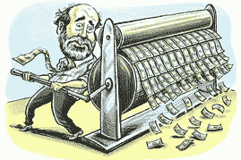
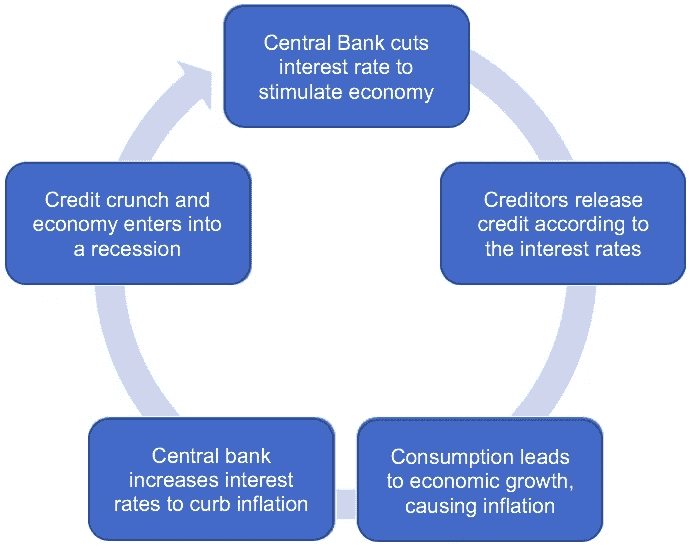
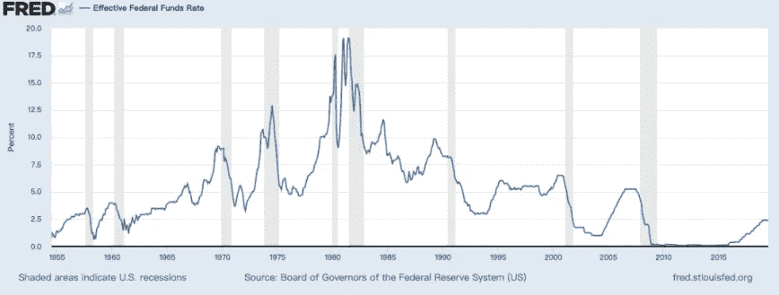
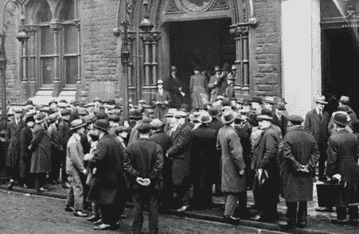
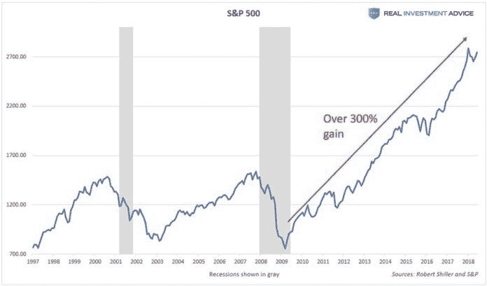
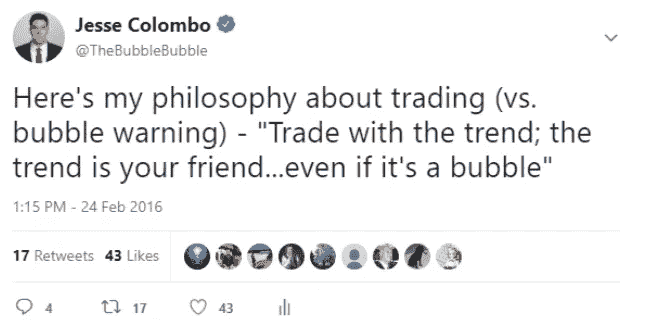
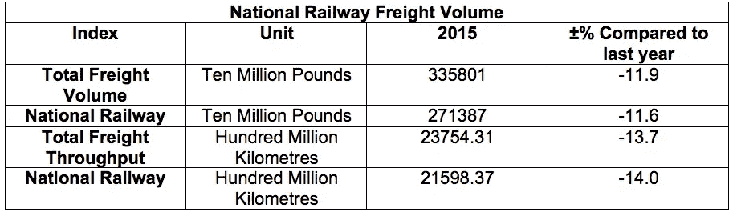
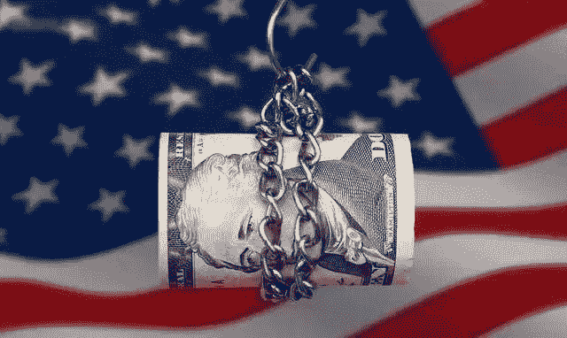
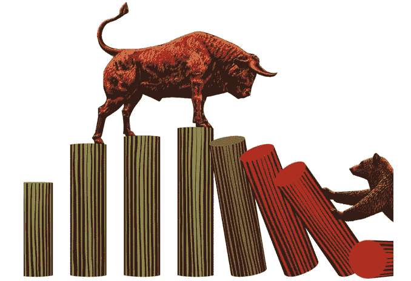

# 对加密周期的观察:市场、经济和周期，第 2 部分

> 原文：<https://medium.datadriveninvestor.com/an-observation-on-crypto-cycles-market-economy-and-cycles-part-2-6ad926a3f1e4?source=collection_archive---------9----------------------->

## 在这次分享中，我们希望从市场互动的更基本观点出发，更好地理解自由市场经济的本质。我们也希望从不同于西方经济学的角度来理解经济的循环模式。

*由 X-Order 首席技术官 Finn Zhang 撰写，X-Order 是一家投资和研究机构，致力于研究开放金融中的价值捕捉。我们努力成为新金融和与科学和研究相关的跨学科领域之间的桥梁。它的创始人是托尼·陶，他也是 NGC 风险投资公司的合伙人。*

 [## Azbit 旨在连接传统金融和加密货币|数据驱动的投资者

### Azbit 是下一个提供交易平台的加密项目，该平台提供保证金和算法交易。一样多…

www.datadriveninvestor.com](https://www.datadriveninvestor.com/2019/03/20/azbit-aims-to-connect-traditional-finance-and-cryptocurrency/) 

在[的上一篇文章](https://www.datadriveninvestor.com/2019/10/17/market-economy-and-cycles-part-1/)中，我们概述了危机的出现。接下来，我们将根据雷伊·达里奥对经济系统的分析进一步说明如何处理周期，从而从更全面的角度评估 BTC 的价值。

# 雷伊·达里奥对经济体系的分析

在《经济机器如何运转》一书中，雷伊·达里奥简单而深刻地从凯恩斯主义的角度分析了经济的运行。

他的分析实际上是对美国国情的观察——也就是说，美联储本质上是通过改变利率来调节整个经济的流动性。

Ray Dalio’s Analysis of the Economic System

在他的体系中，经济的运行由两部分组成，生产和消费。生产包括商品和服务，规模扩张相对困难，市场影响相对较小。消费包括货币和信贷。信用扩张相对容易，因为钱可以印，对市场影响很大。

> *雷伊·达里奥认为，消费导致的债务是一个* ***短期经济波动的重要驱动因素。***

由于人们可以通过借贷来消费超过产出的东西，因此在偿还债务时，他们不得不消费少于产出的东西。通过汇总每个人的交易和债务，我们可以计算出整个经济的周期。

从宏观经济的角度来看，美国经济周期似乎主要受央行货币政策的影响。然而，这不是原因，而仅仅是结果。真正的原因是**社会产能过剩。**

国家可以通过增加货币供应量(印钞票)来缓解这个问题。由于人们手头的货币会随着市场上可用货币数量的增加而贬值，他们倾向于购买以减少贬值导致的资产减记。随着社会消费的增加，短期的经济危机将得到“缓解”，但它实际上所做的只是将危机推回。

Money Printing, Quora

## 01 凯恩斯经济周期

**第一步:**央行降息刺激经济，释放流动性。换句话说，美联储正在降息。

**第二步:**银行通过相应降低银行贷款利率来鼓励借贷。因此，更多的人将贷款建立工厂和公司，从而推动经济增长。

**第三步:**货币供给超过社会生产力，导致通货膨胀。

**第四步:**如果经济增长过程中出现通货膨胀，央行会提高利率来抑制通货膨胀。

第五步:紧缩的货币政策(高利率)将导致资金回流到银行。因此，信贷也会收紧，经济进入衰退。

Economic Cycle of Keynesian Economics

经过一段时间的经济衰退后，中央银行将开始刺激经济。这导致经济周期回到第一步。

> *那么，我们现在处于哪一步呢？*

2017 年，雷伊·达里奥认为美股会跌；并且在 2016 年，索罗斯开始在美国股市开仓做空。这些市场操作反映了他们对美国经济的判断——经济周期并不顺利。然而，央行拥有足够的利率调整空间是完成周期的先决条件。1980 年左右，美联储历史上最高利率接近 20%。在这种情况下，降低利率的宏观调控策略将是有效的。

Federal Reserve Rate: 1950–2019

然而，自 2009 年以来，美国利率连续 10 年在 2%左右，没有降息刺激经济增长的空间。同样，日本和欧洲为了刺激经济增长，也实行了负利率货币政策。然而，这些国家的经济不仅没有复苏，反而陷入了滞胀。

此后，美国进入长期债务周期，即去杠杆化周期，经济逐渐走向萧条。

## 02 如何抵御经济萧条？

雷伊·达里奥认为，以下措施可以相对较好地解决抑郁症:

> 1.个人、公司和政府都减少开支
> 
> 2.通过违约和重组减少债务
> 
> 3.将财富从富人手中重新分配给穷人
> 
> 4.中央银行通过量化宽松增加货币供应

通过一系列刺激经济和生产的措施，经济将进入一个漫长的恢复期。就美国历史而言，上一次大萧条持续了大约十年，从 1927 年到 1937 年。

Overwhelming Unemployment Rate During the Great Depression

> 雷伊·达里奥建议的措施有效吗？我们将在以后的文章中讨论这一点。

## 为什么雷伊·达里奥做空美国股票？

我们需要首先了解美国股票市场的一些运作方式。自 2009 年以来，标准普尔 500(标准普尔 500 指数)已经上涨了两倍。迄今为止，美国股市已经达到了一个非常高的水平。

**美国股票通常会派发股息，向投资者分配利润。**但实际上，这些分红中只有 25%是真正的利润，也就是公司的营业收益。其余 75%的利润来自股票回购。用公司的钱买公司的股票，市场上的股票就少了，导致其股价上涨。

企业之所以有充足的资金做股票回购，是因为央行为其提供零利率。因此，股票主要由债务支撑。美国经济学家杰西·科伦坡(Jesse Colombo)在其 2018 年 9 月的文章“*美国股市泡沫破裂时灾难不可避免”*中指出了这一点。

Jesse Colombo’s Twitter

美国上市公司的管理层薪酬与股价挂钩。通过股份回购，公司的股价会上涨，同时管理层的收入也会增加。由于激励机制，公司的决策者也会更倾向于**进行股票回购以提高价格，而不是实际优化企业的效率。**

> 这是雷伊·达里奥做空美国股票的真正原因。

# 宏观经济政策和比特币

## 01 比特币的属性

在这样一个宏观层面的周期中，[比特币](https://www.datadriveninvestor.com/glossary/bitcoin/)处于一个怎样的市场中？

Bitcoin Users, Bitcoin.org

在我们看来，它实际上揭开了世界范围风险资本投资的序幕，它具有以下特点:

> **1。技术特点:**比特币作为一种互联网技术，具有被利用的潜力。
> 
> **2。网络效应:**目前全球比特币持有者总数大概有几千万，因此，其生存是有保障的。
> 
> **3。进入门槛低:**传统金融市场对投资高科技公司有很多限制，比如资金量、关系等。相比之下，比特币市场是完全开放的。

由于这些特点，比特币市场逐渐受到资本的关注，发展速度也越来越快。

## **02 2016–2017 年数字货币暴涨的原因**

根据 Cryptocompare 的数据，2017 年第一天，超过 500 万个比特币以人民币交易，相当于 38 亿美元。5 天后，中国市场的比特币价格达到人民币 8600 元，而当天的外币价格只有 7700 元左右。差价高达 1000 元。

> *中国市场呈现上升趋势，随后波及全球。*

Bitcoin Trading Across the World, BitDegree

回过头来看，我们会发现这是一个热钱驱动的金融市场。

> *研究热钱的来源是研究比特币繁荣的关键。*

**2015 年中国投机资本流入**

2015 Railway Statistical Bulletin

根据 2015 年铁路统计公报，同期中国铁路货运量下降 11.9%。实体经济大幅下滑，2009 年的基建和房地产投资热潮到 2015 年逐渐降温。同一时期，政府的货币宽松政策导致大量现金无处可用。

> 由于资本在真实市场中无利可图，它不得不转向高度投机的债务市场。

这也是中国 [P2P](https://www.datadriveninvestor.com/glossary/peer-to-peer/) 借贷行业开始崛起的机会。根据王贾的行业数据，到 2019 年，中国有超过 6000 家互联网贷款公司。

Increasing P2P Companies, Caixin Global

与此同时，很多投机资本也将目光投向了比特币。由于国内的热钱，比特币价格飙升。这进一步刺激了日本和韩国的资金进入，相反，晚出手的是欧美的资金。

**2017 年中美收紧货币政策**

2017 年，中国和美国相继收紧货币政策，以应对可能出现的系统性金融危机。美联储采取加息手段，中国推进金融去杠杆化。

宏观经济收缩将导致热钱从高风险市场迅速撤出。数字货币作为风险最大的流动资产，肯定会先卖出去。

> *虽然比特币市场持续上涨到年底，但崩盘的伏笔在 2017 年年中就已经存在。*

## 03 我们对比特币的片面判断

1.  **比特币是数字黄金的一种形式吗？**

为什么人们会把比特币当成避险资产？目前，与“黄金”不同，比特币还远未被视为避险资产。

*对冲资产永远是一个相对的概念，对冲资产永远是更稳定的资产。*在数字货币行业中，比特币是最稳定的，这也是它成为避险资产的原因。对于实体经济，需要进一步的市场反馈才能得出结论。

**2。比特币会合法化吗？**

作为一个国家最重要的权力之一，任何政府都不会放弃自己的造币权。

人类社会的发展从来都是[集权](https://www.datadriveninvestor.com/glossary/centralized/)，而不是分权。即使在所谓的民主美国，学者们也感叹现在的联邦政府远比 100 年前的联邦政府强大。

事实上，近期中国政府对数字货币交易的新一轮打击已经开始。大量频繁参与线下数字货币交易的支付宝、微信和银联账户被封禁。

> 这导致资本流入逐渐停止。

**3。比特币有实际价值吗？**

价值存在于非法的地方。

**黑市交易**

2013 年，《暗网丝路》一夜成名。

它使用 Tor(洋葱路由器)来确保匿名，并使用比特币进行交易。它主要处理毒品、枪支弹药、假钞和其他物品，如网飞和亚马逊特洛伊木马、盗版内容和伪造的驾驶执照、护照、社会保障卡、公用事业账单、信用卡账单、汽车保险记录和其他形式的身份证明文件。

> *丝路在不到两年的时间里，交易额就达到了 12 亿美元。*

Silk Road, ExtremeTech

**暗网洗钱**

根据安全公司 Bromium 的一份独立学术研究报告(*进入利润之网*)显示，网络罪犯的年非法收入约为 800-2000 亿美元。这占全球所有非法收入的 8-10%。最常用的洗钱工具是虚拟货币。虽然许多犯罪分子已经转向更秘密、匿名和加密的货币，但其中相当比例的人仍然使用比特币。2000 亿美元的贸易额已经足够支撑一个小国的 GDP 了。

**4。比特币的周期**

我们认为，经过 2006–2017 年比特币的热潮，比特币市场还有两年多的投资期。未来充满不确定性，尤其是政府干预市场之后。

对于投资者来说，比特币是一个高风险高回报的股票市场。2016 年至今，标准普尔 500 指数虽然上涨了 1800–2800 点左右(整体涨幅约 40%)；就股市的小周期而言，处于牛市阶段。然而，随着整个宏观市场进入长期债务周期，美国股市的表现实际上反映了牛市的结束。

Ending Bull Market, Benzinga

然而，比特币市场周期与传统股市周期并不完全一致。这是因为，在传统金融市场中，少量资金流入比特币，就足以带动价格大幅上涨。

> *那么这波牛市的钱是从哪里来的呢？*

在我们看来，有三种可能性:

> **1。金字塔资本:**追求短期投机利润，一旦有收益就一走了之。
> 
> [2**。加密货币**](https://www.datadriveninvestor.com/glossary/cryptocurrency/) **资本:**在更小的非主流加密货币的炒作和泡沫破灭之后，人们会找到更稳定的数字货币来避险。
> 
> **3。传统资本:**资产配置。从传统市场流向比特币市场的少量资本可以推动价格的大幅上涨。

# 结论

事实上，你越钻研市场，你就会发现越多未知的市场因素。

我们希望通过分享我们最近对市场的一些观察，可以让您更好地了解市场的本质，我们也希望听到更多关于市场的意见。

我们欢迎所有讨论！

Finn Zhang 拥有物理学硕士学位(哲学博士 ABD)。他研究过粒子、统计、数学和计算物理。多年来，他一直致力于使用数学和统计学对物理和社会科学问题进行建模。此外，他应用了非线性动力学方法，并在市场分析和价格预测方面取得了进展。他的主要兴趣是非正统的金融模型构建和数据驱动的金融建模。

*原载于 2019 年 11 月 19 日*[*https://www.datadriveninvestor.com*](https://www.datadriveninvestor.com/2019/11/19/market-economy-and-cycles-part-2/)*。*

## 在 Linkedin 上与我们联系！

***译自*** *(通过我们的微信账号)* ***:*** *心悦*

***编辑:*** *谭*