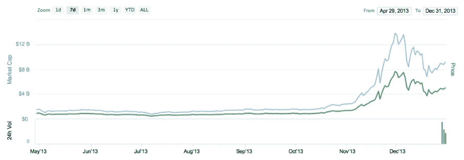
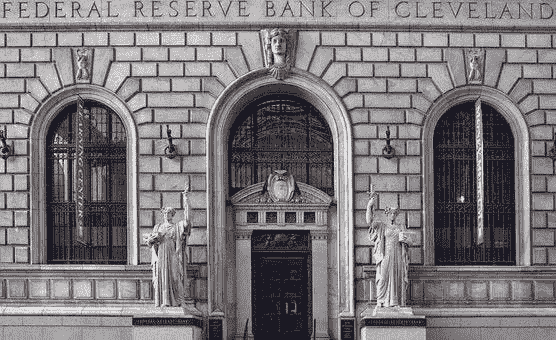
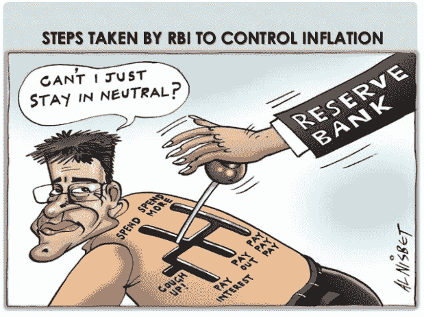
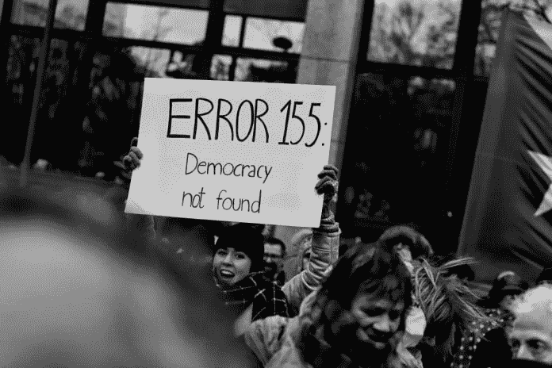
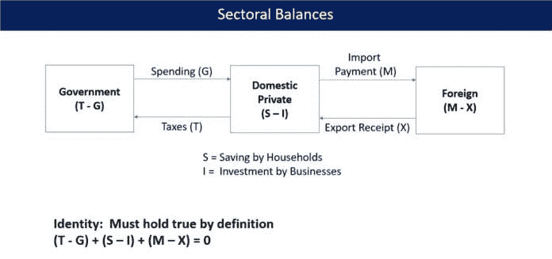
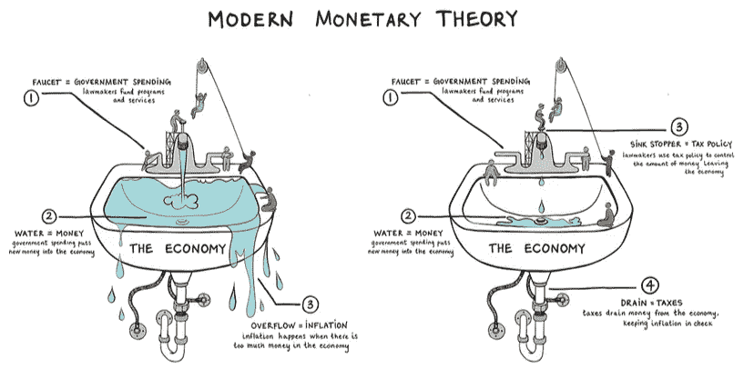

# 对密码循环的观察:新循环？比特币的四种未来可能性，第一部分

> 原文：<https://medium.datadriveninvestor.com/an-observation-on-crypto-cycles-new-cycle-four-future-possibilities-of-bitcoin-part-1-d517c688cf8f?source=collection_archive---------18----------------------->

## 在第一部分中，我们将全球宏观经济的关键因素与比特币的未来联系起来。通过观察公开信息，我们能够得出四种可能的未来情景(第一部分将只解释一种情景)，其中我们将分析其对比特币价格的影响。

*由创新研究机构 X-Order 的金融分析师王润宇撰写，该机构试图结合分布式计算、计算博弈论、人工智能和密码学等跨学科领域来发现未来的扩展订单。它的创始人是托尼·陶，他也是 NGC 风险投资公司的合伙人。*

> *历史总是会重演。*

今年的比特币市场与全球宏观经济呈负相关，就像 2013 年一样。当时，比特币非常受公众关注，迎来了第一轮牛市。

Bitcoin Price Chart, CoinMarketCap

今年的比特币市场会是 2013 年的翻版吗？

为了回答这个问题，我们将**用宏观经济的关键因素来预测全球宏观经济的未来。**这是为了推断市场和场外资金的投资偏好，以及比特币的未来在哪里。

# 全球宏观经济的关键因素:美元经济

作为世界霸主，美元霸权是影响全球宏观经济的关键因素。可以说，全球宏观经济的变化很大程度上是基于美元的变化。

 [## 为什么包容性财富指数比 GDP 更能衡量社会进步？|数据驱动…

### 你不需要成为一个经济奇才或金融大师就能知道 GDP 的定义。即使你从未拿过 ECON 奖…

www.datadriveninvestor.com](https://www.datadriveninvestor.com/2019/03/08/why-inclusive-wealth-index-is-a-better-measure-of-societal-progress-than-gdp/) 

我们假设未来比特币仍将与美元经济高度相关；决定美元的美联储(Fed)也将决定美元经济的走向。

然而，号称独立机构的美联储，作为美元供给的总闸门，正面临着三大问题:

## 货币政策工具的失效

美联储和其他发达经济体央行的主要货币工具是**利率调整和购买/出售金融资产。**

2000 年和 2008 年金融危机发生时，美联储的利率约为 5%至 6%。通过降低利率刺激经济复苏的空间仍然存在。但自今年 7 月重启降息以来，目前利率仅为 2.25%，导致进一步降息的空间不大。因此，无论未来降息的频率和幅度如何，经济刺激和复苏都将是微弱的。

> *其他长期处于或接近零利率的发达经济体，如欧洲和日本，基本没有利率管制的空间。*

# 缺乏经济增长

它指的是未来缺乏预期的增长。自 2008 年金融危机以来，只有中国和美国保持了实际增长，但在 GDP 增长的背后是这两个国家债务的**快速增长。**

对美国来说，承担债务的主要是政府。再加上中美贸易日益紧张，**市场对美国未来的经济增长持悲观态度。**

这也推高了美国股市的波动性，逆转了美国收益率曲线，导致市场资金更愿意购买长期、更安全的美国国债。

> *也就是说，市场对短期美国经济没有信心。*

## 通货膨胀继续保持在低水平

在一个经济体中，通货膨胀与就业直接相关。根据菲利普斯曲线，就业率高则通胀上升，失业率上升则通胀下降。

为了平滑经济波动对社会的影响，保持经济处于平稳上升状态，**央行一般会将通胀控制在一个稳定的水平。**

Controlling Inflation, SlideShare

因此，当经济过热时，通货膨胀会上升，央行会考虑提高利率来降低经济增长。反之亦然；当经济下行时，通胀会下降，央行会考虑降低利率来刺激经济发展。

尽管如此，也有例外，比如美国 70 年代的高通胀高失业，90 年代和最近四年的低通胀低失业。这似乎是美国经济蓬勃发展的一个好迹象。

事实上，目前的低通胀向市场发出了更多悲观和危机的信号。一个原因可能是，逐渐增加的面临真正失业的人数没有包括在统计数据中(*失业超过四周的人，以及不积极找工作的人*)。其次，大多数人的劳动收入增长缓慢，贫富差距扩大。

> 这些不会导致严重的经济问题，但很可能引发政治问题。

总而言之，单看数据，**美联储似乎已经实现了自己的业绩目标**，即维持经济增长、通胀和失业之间的平衡。最近，杰罗姆·鲍威尔主席和内部报告都频繁使用诸如**【史上最强经济扩张】****【前所未有的就业市场】**等词汇。

另一方面，美联储的举动更多地向我们展示的是:
**“我们已经尽力了。仅靠货币政策，我们无法完成这些任务。”**

# 四种未来可能性

通过观察发达国家央行、政府、政党的公开信息，可以得出四种可能的未来情景。进一步，我们将分析每种可能的情景对比特币价格的影响(按概率降序排列):

## 1.新的“直升机撒钱”

“直升机撒钱”的概念源于货币主义之父米尔顿·弗里德曼。该政策是指**央行以纳税申报等形式直接向家庭或消费者送钱。，从而刺激消费，减少失业，克服通货紧缩。**金融危机后，时任美联储主席本·伯南克采取的量化宽松的思路也来源于此。

2019 年上半年讨论的“新直升机撒钱”(“现代货币理论(MMT)”)则更进一步。简而言之，政府的收入就是企业的支出，反之亦然。

> *因此，当中央银行无法通过货币政策实现其目标时，它必须依靠财政政策。*

在萧条时期，央行需要与财政部合作，采取更激进的政策，比如直接将利率降至 0，增加赤字，通过政府项目创造更多的就业保障。经济复苏过热时；提高税收，减少赤字，将过去政府项目创造的就业机会放回私营部门。

这不同于以往央行在二级市场购买资产**。MMT 要求央行直接在资产负债表上完成操作。**过去，钱只集中在垄断性的大型科技企业。MMT 带来的新问题将在下一节详细讨论。

> (注:海外学术、金融、政治、科技行业都有关于 MMT 的详细讨论。对于学术行业，可以参考 Wray 的*《现代货币理论》*，对于金融行业，可以参考 McCulley 和 Pozsar 的*《直升机撒钱:或者说我是如何不再担忧并爱上财政—货币合作的》*。更多外行人称为讨论和解释包括*“现代货币理论是异端吗？”*和*“现代货币理论:解药还是毒药？”*)。

关于 MMT 的利弊已经有了广泛的讨论，所以我们在这里不做结论。然而，我们需要关注的是，如果美联储采取有利于 MMT 的措施，具体会是什么？

Modern Monetary Theory, MarketPlace

> *截至目前，可以预期两个观察结果:利率下降速度和新国债发行速度。*

如果美联储顺应总统的压力，实施超出市场预期的降息，前者就会得到体现。后者可能反映在中央银行重新展开资产负债表，或者新的国债品种上市，即 50 年期、100 年期和其他类似欧洲国家的超长债券。

# 下一步是什么？

> 在*第二部分，我们继续观察公开信息得出四种可能的未来情景(第二部分将解释三种情景)，其中我们将分析其对比特币价格的影响。然后，我们进一步讨论它将如何影响加密货币的整体。*

*王润宇毕业于上海交通大学，会计专业。在加入 X-Order 之前，他在证券公司和对冲基金有两年的研究经验，专注于消费品和技术行业。他目前是 X-Order 的金融分析师，专门从事加密货币市场分析和优质项目投资。*

*原载于 2019 年 12 月 3 日*[*https://www.datadriveninvestor.com*](https://www.datadriveninvestor.com/2019/12/03/new-cycle-four-future-possibilities-of-bitcoin-part-1/)*。*

## 在 Linkedin 上与我们联系！

翻译:心悦

***编辑:*** *谭*