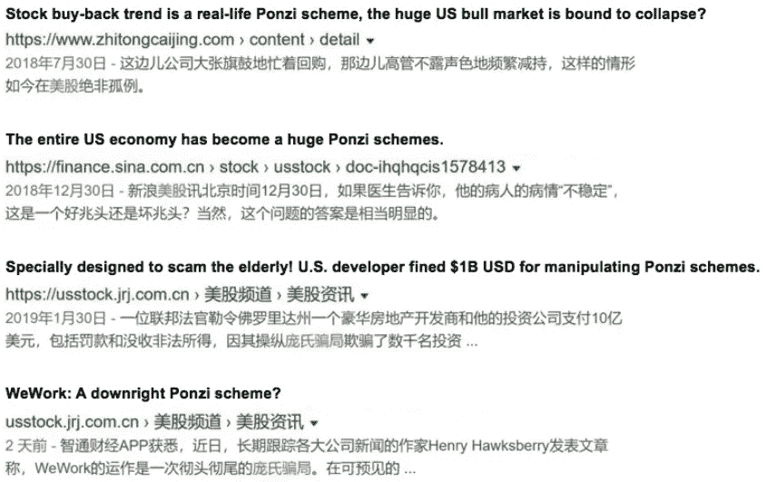
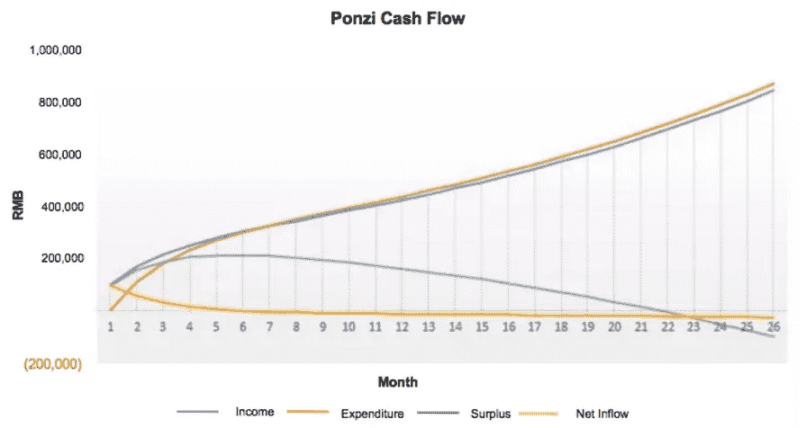
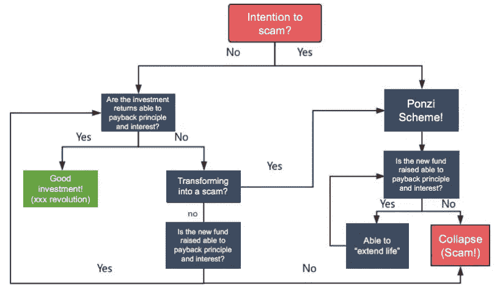
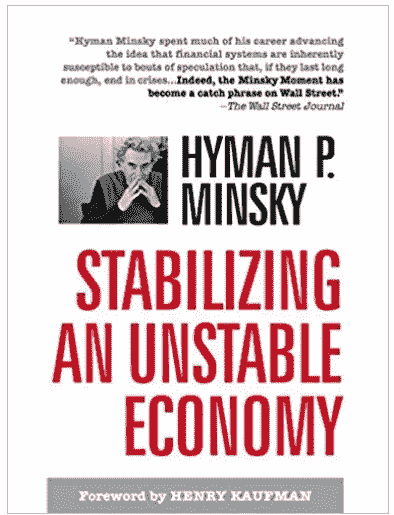

# 对加密周期的观察:庞氏融资、负利率和比特币，第 1 部分

> 原文：<https://medium.datadriveninvestor.com/an-observation-on-crypto-cycles-ponzi-financing-negative-interest-rates-and-bitcoin-part-1-22da5c4a48f0?source=collection_archive---------6----------------------->

投资和研究机构 X-Order 的金融分析师 Alan Zhang 撰文，该机构致力于研究开放金融中的价值捕捉。我们努力成为新金融和与科学和研究相关的跨学科领域之间的桥梁。 *由托尼·陶(Tony Tao)创立，他也是 NGC 风险投资公司的合伙人。*

在我们的[庞氏分析](https://www.datadriveninvestor.com/2019/08/29/the-ponzi-scheme-101-a-ponzis-life-cycle-and-ways-to-survive-part-3/)的前一系列中，我们已经建立了一个简单的模型——老派庞氏模型。在这个模型中，我们得出了几个直观的结论:

> 1.庞氏本质上是一个现金流管理的过程；
> 
> 2.利息和复利的存在实际上是现金流入和流出之差的幂律函数；
> 
> 3.庞氏存在的市场天花板是限制其生命周期的核心因素。

今天继续分析庞氏融资模式，**进一步研究三种融资模式的范式转换。**

# **1。三类融资模式:庞氏融资、对冲融资&投机融资**

最近庞氏骗局越来越多，经典的 e 租宝庞氏骗局，最近上市的 WeWork，美股回购风潮，甚至美债和养老金，都被称为庞氏骗局。

> *这给人一种“庞氏骗局是万能钥匙，哪里需要就用哪里”的感觉。*

Search results related to Ponzi Scams

本质上，庞氏骗局是一个期限错配的游戏，用新投资的钱来回报老投资者。

> *关键是现金流管理。*

当计划无法充分获得新的资金时，生命周期就无法持续，如下图所示:

然而，WeWork、美国股票回购和庞氏骗局之间存在一些差异:

## 1.意图的差异

庞氏骗局绝对是欺诈。最终目的是**通过控制现金流的方式非法获取大量资金**。而其他项目主要关心的是维护或扩展项目的开发。

## 2.还款来源的差异

庞氏骗局的还款来源是新增资金，而上述项目至少会将募集资金投入到特定活动中。这些活动产生的利息或增值收入随后被用来偿还投资者。庞氏骗局的隐含条件是资产需要持有一段时间，这自然会导致期限的转移，推而广之还有错配的可能。

## 3.投资获利能力的差异

由于**庞氏骗局不做真实投资，**投资的收益能力必然是 0 甚至是负的。而对于普通的资金池业务来说，虽然他们确实使用募集的资金进行投资，但是所有的投资都伴随着风险。所以有可能无法实现预期收益，无法偿还本金。

> *辨别一个项目是不是庞氏骗局的关键就在于此。*

当期限错配现金池的**投资收益能够按期偿还约定的本金和利息**时就没有问题——整个系统可以继续运行。然而，一旦存在项目可能无法全额支付、必须依赖新资金来“延长寿命”的风险，它将不可避免地逐渐转变为庞氏骗局。

 [## 为什么包容性财富指数比 GDP 更能衡量社会进步？|数据驱动…

### 你不需要成为一个经济奇才或金融大师就能知道 GDP 的定义。即使你从未拿过 ECON 奖…

www.datadriveninvestor.com](https://www.datadriveninvestor.com/2019/03/08/why-inclusive-wealth-index-is-a-better-measure-of-societal-progress-than-gdp/) 

当然，如果该项目能够聪明地推迟付款，当收益恢复时，它就可以避免成为一个庞氏骗局。

> *总之，这些项目与庞氏骗局的主要区别在于从现金流量表到资产负债表的管理。*

在美国经济学家海曼·明斯基的著作《稳定一个不稳定的经济*】中，根据收入-债务关系将上述融资行为分为三种模式:*

**(1)** **对冲融资**，即债务人期望融资合同的现金流能够覆盖利息和本金——这是最安全的融资行为。

与上面流程图中的“良好投资”相对应，外汇[中常见的套息交易](https://www.datadriveninvestor.com/glossary/exchange/)和对信用记录良好者的贷款都可以归入此列。

**(2)投机性融资**，即债务人预期融资合同产生的现金流只能覆盖利息——这是一种利用短期资金为长期头寸融资的行为。

与上面的流程图相对应，新的资金被用来为本金和利息融资，直到资产回报能够为它们融资。一般可以理解为过桥贷款，**近期美债增长也有发展为投机金融的嫌疑。**

(3) **庞氏融资**，即债务人的现金流既不能覆盖本金，也不能覆盖利息。债务人只能通过出售资产或重新获得新的融资来履行其[支付](https://www.datadriveninvestor.com/glossary/payment/)承诺，这必然会带来较高的财务风险。一旦资金链断裂，债务无法偿还，从而可能引发金融动荡和危机。

明斯基进一步定义了庞氏金融:它是*通常与边缘和欺诈性的融资活动联系在一起，尽管它的本意不一定是诈骗*。

这对应于上面流程图中的“崩溃”——由于有些项目的意图在初期难以确认，只能从结果(即是否崩溃)来判断。

> *值得注意的是，上述三种融资模式经常会转化成另一种。*

Amazon.com

# 2.三种融资方式的互换

三种融资模式没有明显的优劣，总会发生变化。我们在日常投资生活中也可以发现这些变化，一般可以分为三条路径:

## 1.对冲融资→投机融资→庞氏融资

> [*P2P*](https://www.datadriveninvestor.com/glossary/peer-to-peer/) *公司是这种转型的典型*

一般情况下，P2P 公司从用户那里投资一笔钱给一个供应链企业，这个供应链企业用特定的现金流或者抵押物作为还款来源。

然而，当经济下滑等风险因素发生时，供应链企业将面临现金流问题。此时 **P2P 公司需要筹集新的资金偿还前期融资的本息，防止违约**。在这里，他们将从对冲融资转向投机融资。

当供应链企业确定无法收到下游的现金流时，就会告诉 P2P 公司“我们确实没有钱，也许我们可以债转股，你可以通过卖股获得收益。”此时的融资将再次从投机金融转变为庞氏金融(投资)。

TheAsset.com

## 2.对冲融资→投机融资→对冲融资

典型的案例是各种类型的银行——期限错配会被美化为银行语境下的期限转移。这是因为在“投机性融资”中，银行一般通过同业拆借等方式补充流动性，有效地为银行“延长了寿命”，从而将其转化回对冲融资。

## 3.庞氏融资→投机融资→对冲融资

典型的案例是各种互联网初创企业——从一开始以“会为梦想而死”的理念筹集投资，投资者都知道一个平台的商业模式导致严重的烧钱。但只要“烧钱”能扩大项目规模，他们就不会担心找不到人继续融资。

这个过程是庞氏和投机性融资的结合，比如常见的 **ABCDEFG 系列融资和上市，以及私募。**如果收益模型最终被实际数据验证，且经济记录能够得到适当的核算，那么它将转换为对冲融资。否则，它必须继续庞氏模式，直到它最终找到最大的庞氏市场受众或自毁。

比如在共享经济中，共享电力银行被认为是最不靠谱的项目。这是因为电力银行价格便宜，每个人家里或多或少都有。此外，由于其相对较小的尺寸，它可以方便地随身携带。为什么人们会花更高的价格给他们的设备充电？

在这样一个看似不解的情况下，整个行业在 2017 年仍然筹集了$2B 人民币。亲身经历过，这个行业有三个特点:**消费者不随身携带一个电力银行+充电需求无弹性+消费者对价格不敏感**。这导致电力银行共享成为经济学会计(成本回收期)方面最成功的业务，从而从庞氏骗局转变为对冲融资。

相反，最初理论成本回收期只有三个月的 Ofo，可观的经济学核算，宏大的叙事——众多资本提供者为这种“社会福利”买单，8 轮融资共计 150 亿美元人民币。在最后一轮融资中，E2–1 筹集了 8.66 亿美元。E2-1 在名称上比任何一轮融资都更有创意，然而，这样一个有创意的命名仍然无法阻止不健全的经济核算的结果。一直到最后都是庞氏融资。

还有很多其他的负面案例，比如乐视网、暴风影音(暴风)、2015 年各上市公司的 M&A 等等。

> *在一个融资工具多样化的成熟资本市场中，三种融资模式的互换越来越频繁。良好的市值管理需要三种融资模式的适当结合。*

# 下一步是什么？

*第二部分，我们讨论对冲和庞氏骗局的投资逻辑，以及负利率对比特币等数字货币的影响。*

Alan Zhang, Financial Analyst at X-Order

Alan Zhang 是一名投资者和市场观察者，他在决策中充分利用了数据技术。他熟悉中国不同的金融市场，包括股票、期货和加密货币市场。此外，他从 2014 年开始参与建立类似红茶的另类投资市场，并在 2015 年负责黄山旅游股份(600054.sh)的私募。

*原载于 2019 年 12 月 22 日*[*【https://www.datadriveninvestor.com】*](https://www.datadriveninvestor.com/2019/12/22/ponzi-financing-negative-interest-rates-and-bitcoin/)*。*

## 在 Linkedin[上与我们联系](http://linkedin.com/company/xorderglobal)！

**翻译**(通过我们的微信账号):心悦

***编辑:*** *谭*