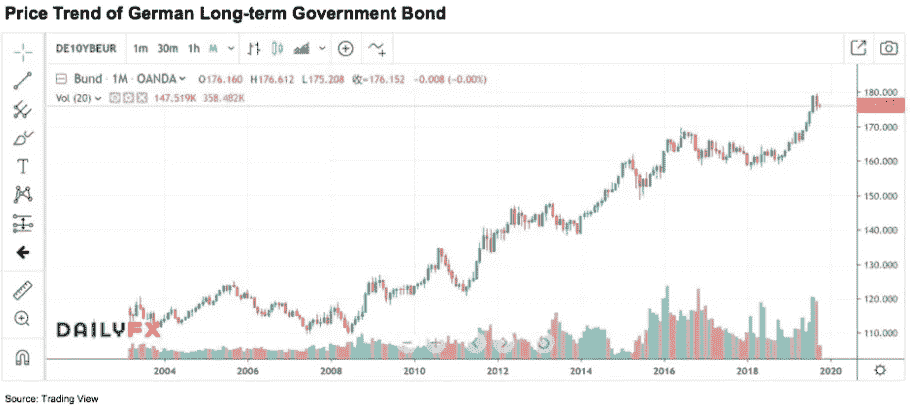
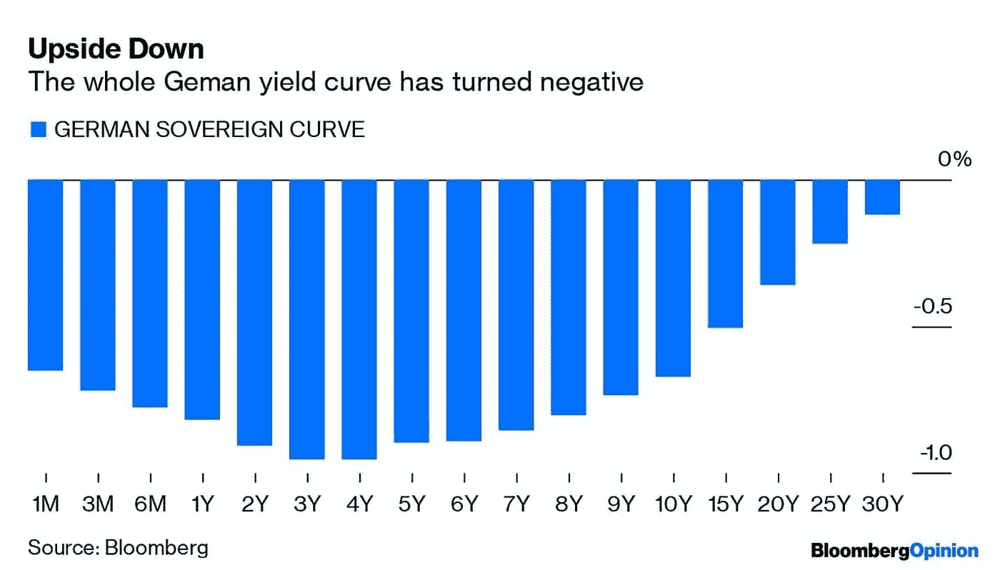
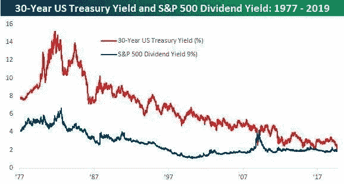
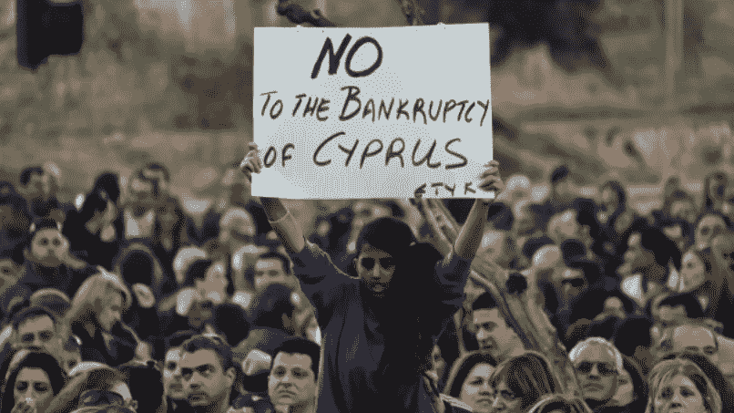
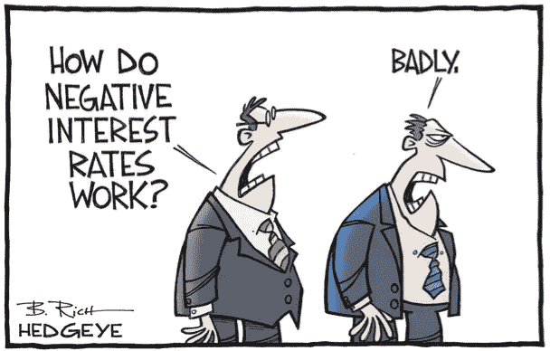
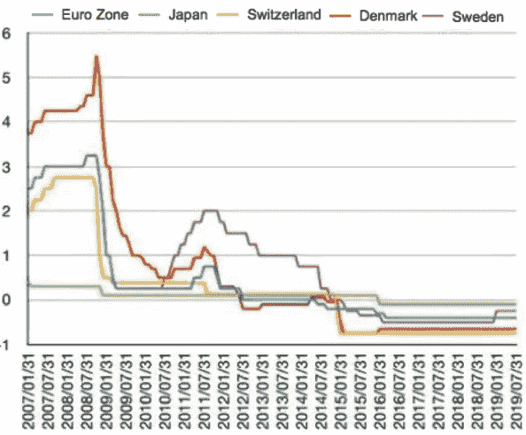

# 对加密周期的观察:庞氏融资、负利率和比特币，第二部分

> 原文：<https://medium.datadriveninvestor.com/an-observation-on-crypto-cycles-ponzi-financing-negative-interest-rates-and-bitcoin-part-2-d387af3c2164?source=collection_archive---------18----------------------->

投资和研究机构 X-Order 的金融分析师 Alan Zhang 撰文，该机构致力于研究开放金融中的价值捕捉。我们努力成为新金融和与科学和研究相关的跨学科领域之间的桥梁。 *由托尼·陶(Tony Tao)创立，他也是 NGC 风险投资公司的合伙人。*

在第一部分中，我们分析了[庞氏融资模式](https://www.datadriveninvestor.com/2019/12/22/ponzi-financing-negative-interest-rates-and-bitcoin/)，并进一步研究了三种融资模式的范式转换。今天讨论对冲和庞氏骗局的投资逻辑，以及负利率对[比特币](https://www.datadriveninvestor.com/glossary/bitcoin/)等数字货币的影响。

# **3。对冲和庞氏骗局的投资逻辑**

如果进一步推导，会发现这三种融资模式分别对应了两种投资逻辑:对冲逻辑和庞氏逻辑。

前者追求的是一种**更有形更稳定的收入，这种收入来源于现金流或者利息。**而后者则来自于**期望后来者以更高的价格接手来“买单”的逻辑。**

前者听起来更有价值，后者听起来更投机，但实际上，**价值和投机往往是可以互换的。**以近期各国央行释放流动性、推动负利率下大类资产的动作为例。

 [## 为什么包容性财富指数比 GDP 更能衡量社会进步？|数据驱动…

### 你不需要成为一个经济奇才或金融大师就能知道 GDP 的定义。即使你从未拿过 ECON 奖…

www.datadriveninvestor.com](https://www.datadriveninvestor.com/2019/03/08/why-inclusive-wealth-index-is-a-better-measure-of-societal-progress-than-gdp/) 

债券资产的投资本身包括两个方面:获取利息收入和债券价格上涨。在利率宏观环境稳定的情况下，由于无风险利率保持相对稳定，主要收入来自利息[支付](https://www.datadriveninvestor.com/glossary/payment/)。只要利息收益大于无风险利率，就会有盈利，相当于套期保值的投资逻辑。

在债券的定价公式下，**不断降低的无风险利率会推高债券价格。**在这种情况下，如果预期无风险利率继续下调，长期债券价格将继续上涨。即使没有利息收入，也可以从债券价格上涨中获得收入。例如，10 多年来，德国长期债券的价格一直在上涨。

Trading View

同时，由于对衰退的预期，投资者对对冲资产越来越感兴趣——他们都将转向对冲美国和欧洲债务等证券，这将进一步推高价格，反映了一种庞氏投资逻辑。

在负利率下，**国债、黄金等低息或零息资产可以通过对冲和庞氏逻辑得到资金的真实需求。**

8 月份，价值 2B 欧元的德国 30 年期零息债券被抢购一空，吸引了大量媒体关注。而黄金这种传统的零利率资产也多次得到了 Dalio 的公开支持，并被解释为一种范式转变。

Washington Post

> *反过来，庞氏投资逻辑可能会转化为一种对冲逻辑。*

今年，在经济衰退的预期下，**资产的估值和定价将受到抑制。**如果资产红利的绝对值没有显著变化，当资产价格大幅下降时，红利利率将大大增加，超过无风险利率的水平，成为良好的生息资产。这使得传统的二级市场也吸引了对冲投资，从而在这两者之间产生了一种转变，在传统的二级市场中，最初的主要逻辑在于庞氏投资(即收购者预期因收购而抬高资产价格)。

熊市的高分红策略和今年 a 股火热的“核心资产”就是这种逻辑的产物。

在所有人(机构)都承认高股息率并大量买入后，投资逻辑将再次从对冲转向庞氏。因此，我们需要仔细分析风险。

# **4。负利率下比特币投资的三个阶段**

之前很多人提到，比特币和黄金一样，是负利率环境下的零利率资产，会吸引更多的资金:

首先，**为了避免被收取负利率**，资金会以黄金或者比特币的形式，导致更多人购买，即对冲投资逻辑；

其次是**资产重估**。和债券一样，当市场预期持续降息时，会导致比特币价格上涨的预期。

第三，**当上述两个发酵**时，比特币价格的上涨导致市场遵循庞氏逻辑。

尽管这听起来很合理，但市场对比特币最近的表现并不买账。为什么会这样呢？**这是因为对冲的逻辑暂时无法形成真正的需求。**

我们先来看看比特币负利率的故事。

如果实行负利率，储户存在银行里的钱被收取利息而不是赚取利息，是否合理？不，买比特币！当然，这不是我们编的。塞浦路斯有真实的案例:

> 2013 年 4 月 17 日，塞浦路斯总统尼科斯·阿纳斯塔夏季斯发表电视讲话。为了从欧盟获得 100 亿欧元的紧急援助贷款，塞浦路斯政府将向当地银行储户征收存款税。10 万欧元以上的存款税率为 9.9%，10 万欧元以下的存款税率为 6.75%。
> 
> 消息一发布，塞浦路斯市民纷纷涌向银行，导致自动取款机前排起了长队。局势失去了控制。“政府在抢劫我们，这是我一生中最糟糕的时刻，这让我想起了 1974 年土耳其入侵塞浦路斯，”一名塞浦路斯人表示。
> 
> 为防止情况恶化，塞浦路斯多家银行 19 日当天发布通告，宣布 19 日和 20 日临时放假，同时暂停[网上银行](https://www.datadriveninvestor.com/glossary/online-banking/)和国际转账服务。唯一可以提取现金的 ATM 机早已被储户清空。为了缓解塞浦路斯的现金压力，英国空军派出一架飞机紧急向塞浦路斯运送 100 万欧元。
> 
> 受塞浦路斯事件影响，欧元区其他国家也出现了民众套现的现象。由于人们担心存款，比特币成为了一个有吸引力的替代品。比特币在短短几天内从 30 多美元飙升至 265 美元。

Pravmir.com

然而现实中并非如此。**目前负利率的对象是银行放在央行的超额存款准备金。这是央行为防止商业银行对其账户收取利息而采取的措施，并非针对散户投资者。**

> 因此，受负利率影响的是银行，而不是散户投资者。但是，银行仅仅因为负利率而购买比特币也是不现实的。

从这个角度来看，**比特币作为零息资产的避险逻辑，在目前还没有真正需求和强烈共识的情况下，只能停留在逻辑层面**。这是我们目前所处的第一阶段。

如何形成更强的共识？我们需要真实的案例，就是需要把负利率的影响从商业银行扩大到散户。

在 2013 年塞浦路斯这样具有标志性事件的更具代表性的地区，它会让人们感到被负利率主导的恐惧，这将导致人们对比特币产生**真正的对冲需求，**达成更深层次的共识。这是第二个阶段，对冲逻辑真正发挥潜力的阶段。在这个阶段，由于标志性事件带来的**恐慌效应，也将导致从对冲到庞氏骗局的**转变，类似于泡沫的形成。****

Hedgeye

第三阶段是套期保值逻辑正常化阶段。在第二阶段的发酵下，比特币作为零利息资产的共识不断加深。如果技术没有重大突破，经济继续下滑，实施负利率的地区数量扩大；**越来越多的人会对比特币产生真实需求，导致更多的共识，**和对冲逻辑正常化。

根据研究，负利率实施的理论下限为— 2% [“负利率”政策的理论基础、传导机制和宏观经济效应”)。除了欧洲和日本，还有很多国家还没有实行负利率，给负利率的发酵留下了大量的时间，也给第二、第三阶段留下了充足的时间。

Five Largest Economies’ Interest Rates, Source: Each Economy’s Central Banks, Bloomberg

> *前提是，负利率会转嫁到老百姓身上吗？*

暂时来说，有点难。如果银行要向储户收取利息，储户会倾向于提取现金来留存，这是银行不愿意看到的。因此，目前实行负利率的国家仍然对零售储户收取 0%的利率。

在负利率条件下，这也是一个难啃的骨头:**把负利率转嫁给别人。**

这个有解决办法吗？没错，而且是巧合**被数字货币**解决了。一旦储户将钱从银行取出，并以现金形式保存，由于其匿名性，央行很难从现金中收取利息。

但是，如果现金以数字货币的形式保存呢？那么**只要央行改变一些参数**，就可以很容易地向储户收取利息，负利率也因此可以更有效地传递。

熊启岳的《*“负利率”政策的理论基础、传导机制和宏观经济效应》* (2017)和孙国峰的《*存款利率零下限和负利率政策传导机制*(2018)做了定量和定性的研究，说明了**做好负利率传导的重要性和央行在数字货币传导中的重要作用。**

目前，**中国央行的数字货币已经明确表达了取代 M0(现金)的立场。如果负利率继续不可避免，我们相信各国将有足够的动力发展自己的数字货币。**

Bitcoin Magazine

综上，**负利率下，比特币投资可分为三个阶段:**

第一阶段是**当前使用的对冲逻辑**，不靠谱；

在第二阶段，需要发生一个真实的事件来带来对冲融资的一小部分**无弹性需求，这导致了**庞氏逻辑的出现，进而向市场注入资金**；**

第二、第三阶段，可能需要**央行数字货币率先推动负利率的传导效应。**

换句话说，为了让比特币更好地帮助用户对冲资产，我们需要推广合法的数字货币，以增强负利率的传导效应。

**世界往往就是这么有趣。**

# 下一步是什么？

*下面这篇文章将是我们对区块链行业目前困境的思考和可能的解决方案的讨论。*

Alan Zhang, Financial Analyst at X-Order

Alan Zhang 是一名投资者和市场观察者，他在决策中充分利用了数据技术。他熟悉中国不同的金融市场，包括股票、期货和加密货币市场。此外，他从 2014 年开始参与建立类似红茶的另类投资市场，并在 2015 年负责黄山旅游股份(600054.sh)的私募。

*原载于 2019 年 12 月 26 日*[*https://www.datadriveninvestor.com*](https://www.datadriveninvestor.com/2019/12/26/negative-interest-rates-and-bitcoin-part-2/)*。*

## 在 Linkedin 上与我们联系！

**翻译**(通过我们的微信账号):心悦

***编辑:*** *谭*