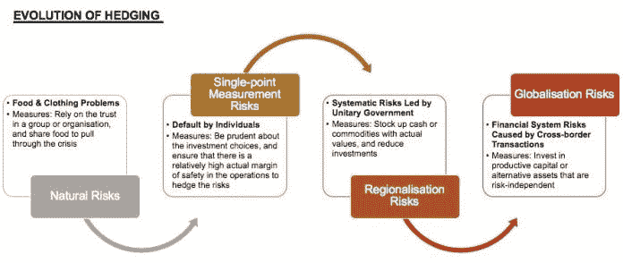
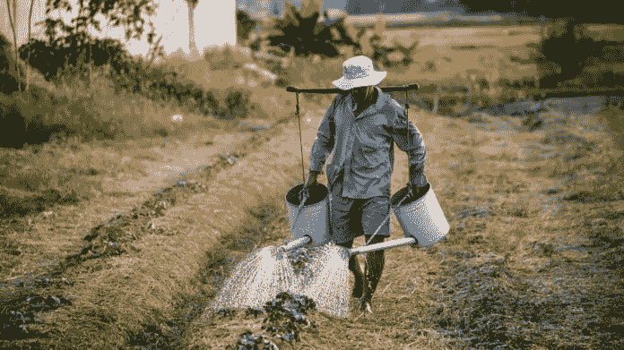
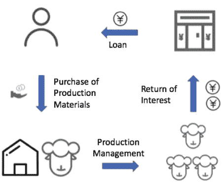
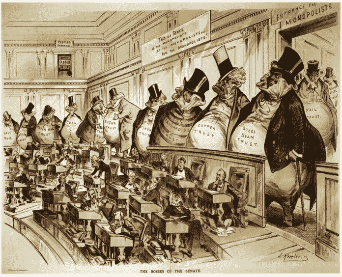

# 对加密周期的观察:千年对冲历史，第一部分

> 原文：<https://medium.datadriveninvestor.com/an-observation-on-crypto-cycles-thousand-years-of-hedging-history-part-1-150585ac1138?source=collection_archive---------11----------------------->

## *本文将带您了解套期保值的演变，从自然风险到单点计量风险，以及区域化风险。接下来，还将讨论区域化套期保值和黄金套期保值的出现。*

由创新研究机构 X-Order 的研究员 Robin Gu 撰写，该机构试图结合分布式计算、计算博弈论、人工智能和密码学等跨学科领域来发现未来的扩展订单。它的创始人是托尼·陶，他也是 NGC 风险投资公司的合伙人。

> **“……(高利贷)，它从货币本身而不是从它的自然对象中获利。因为钱本来是用来在** [**兑换**](https://www.datadriveninvestor.com/glossary/exchange/) **的，而不是用来增加利息的。”—亚里士多德**

在上一篇文章《*对秘密周期的观察:你准备好迎接周期性拐点了吗》、*中，我们强调了当**金融危机发生时，人们倾向于通过调整资产配置来对冲风险。**

BTC 作为一种“**数字黄金**”，被越来越多的人视为一种新的避险手段。然而，这是真的吗？也许我们应该从**规避风险的本质**本身来分析这个问题。

 [## 为什么包容性财富指数比 GDP 更能衡量社会进步？|数据驱动…

### 你不需要成为一个经济奇才或金融大师就能知道 GDP 的定义。即使你从未拿过 ECON 奖…

www.datadriveninvestor.com](https://www.datadriveninvestor.com/2019/03/08/why-inclusive-wealth-index-is-a-better-measure-of-societal-progress-than-gdp/) 

在探讨风险厌恶的概念之前，首先要明确风险的概念:这个词来源于古意大利语，意思是害怕或者害怕。追求利润和避免损失是人的本性，因此我们会想尽可能地避免风险。

# 金融诞生之前:自然风险

很多人把经济危机的现象归咎于金融的诞生，把各类金融工具都视为祸根。事实上，这种风险甚至在金融诞生之前就已经存在。

当时风险主要是因为各种自然事件的不确定性。从更高的角度来看，风险最基本的元素来自于时间只单向流动这一事实。因此，风险的本质是时间带来的一系列不确定性。

在大规模有组织的工业合作出现之前，人们依靠狩猎或农业为生。当时人们面临的最大风险是当年收成的不确定性。当庄稼长势良好时，一切都会好的。然而，如果人们遇到一个坏年景，我们如何解决个人或家庭的温饱问题？

在一个组织或团体中，人们通常通过分享食物来度过困难时期。然而，由于他们没有精确的计算作为基础，人们都依靠亲属关系或信任来延续这个系统。

> **在金融诞生之前，人们依靠对组织群体的信任来应对不确定的自然风险。**

# 金融出现后:单点计量风险

由于人类追求利润的天性，以及资本家对金钱和资本增值的热切追求；它导致了生息资本的出现，并逐渐形成了金融体系。

金融体系**的出现重新定义了风险**和横向时间，从而让**的现在和未来得以沟通，以应对未来的不确定性。**

换句话说，财务部门发现了依赖集团信托系统进行近似衡量所产生的机会。甚至可以说，整个金融体系本身就是为了解决这种天然的不确定性而诞生的。

在[加密货币](https://www.datadriveninvestor.com/glossary/cryptocurrency/)行业，人们一直在讨论什么样的稳定货币机制才能成功。

Stable Currency, CoinStaker

> *然而，一个稳定的货币要取得成功，不是一个单一机制就能解决的问题，而是一个像金融一样大的系统，或者某种生态系统。*

当前的金融体系还没有完全解决整个周期所带来的不确定性，因此，依靠一个单一的项目来实现积极的结果可能过于乐观。

回顾历史发展，我们看到伴随着金融系统化而来的是利息、契约、计量系统、货币等等。自然风险的多样化带来了一个副产品——计量风险。

我们甚至可以夸张地说，**所有的风险都已经转化为度量风险。**

什么是度量风险？如果我们看看兴趣的本质，就会更清楚。

Origin of Interest

从上图我们可以看出**利息本质上是经济活动利润的一部分**。如果未来利润的计量出现偏差(即没有足够的利润)，企业将无法支付利息。

金融体系出现后，风险的属性发生了变化。**时间变化导致的风险已经转化为计量风险**，套期工具的选择也随之变化。与此同时，套期保值开始显示出投资特征。

为了有效避免单点计量风险，我们需要谨慎选择投资，以确保存在实际安全边际更高的业务操作。

# **从单点计量风险到区域性风险**

在三国时期著名的赤壁之战中，曹操的所有船只都由铁索连接，这导致了他们最终被火攻击败。**在某种程度上，金融系统也有类似多米诺骨牌效应的情况。**

Battle of Red Cliff, kknews

单点失效的风险不会在小规模的借贷环境中造成太大的动荡。然而，一旦金融体系成熟，关键节点的**单点失效就会引发巨大的负反馈循环**，延伸到整个体系。

> **因此，随着金融体系的发展，对单点计量风险的套期保值逐渐转化为应对区域性系统性风险。**

让我们参考一些历史上发生过的金融危机:

> **公元前 1788 年，巴比伦时期**
> 
> 乌尔城的君主 Rim-sin 颁布大赦令，宣布所有贷款无效。这对债权人来说是一场灾难。统治者主动破坏金融体系也导致了当地经济的崩溃。
> 
> **公元 33 年，雅典**
> 
> *金融危机是由抵押贷款和违约引起的。*由于信贷紧缩和资产贬值，论坛公司将利率下调至 5%。此外，允许以不动产偿还债务，同时要求贷款人以不动产形式持有其部分财富。这对参议院的成员是一个很大的打击，因为他们中的大多数人都是通过贷款谋生的。后来，危机解决方案是由财政部向市场注入流动性，这逐渐吸引了贷款人回来。
> 
> **12 世纪，威尼斯**
> 
> 1164 年，政府通过向富人贷款来解决金融危机。1172 年，又发生了一次严重的经济和政治危机，导致政府被迫发行债券。不同的是，前者的债券是针对特定投资者发行的，而后者是针对散户强行发行的。这是历史上第一次政府发行义务债券。

Lessons from History, Medium

在这些区域性金融危机中，我们可以看到，许多风险的来源已经从金融体系发展初期的单点测量失败风险，转变为由财政或政治问题引发的系统性风险。我们关注的只是经济和金融体系所展现的一面。

对于想要规避风险，但受制于可用工具数量的投资者来说，只能通过减少投资、囤积现金或购买具有真实价值的商品(即盐等食品)来对冲这类系统性风险。

> **这样一来，由于人们兑换意愿的急剧降低，经济中的流动性将长期下降。**

# 区域化套期保值:黄金套期保值的出现

自公元前 2000 年自由市场国家发展起来后，**贵金属成为国家直接交换各种物资的硬通货。**

即使在广泛阅读之后，也没有关于它为什么能够获得货币地位的详细讨论。但是，我们可以给出一个合理的猜测。

在国家内部，一些食物甚至劳动力可以作为等价物进行交换和计量，因为国家遵循相同的供求体系。交流双方，都没有信息优势。因此，就信息和对同等物的操纵而言，双方处于同一水平(除了主权者)。

而在跨国交换中，如果用劳动力或食物作为货币，就会出现信息不对称。而且，对于交易对手来说，等价物太容易被别人操纵了。

所以，要保证交换的公平合理，双方都需要一个更独立的等价品，贵金属恰恰满足了这种需求。

Barter Trade to Precious Metals as Currency, Medium

> **贵金属代表定价权的公平。**

在人类数千年的历史中，全球经济是相互隔离的。全球化只是在上个世纪才出现。从危机的角度来看，这意味着大多数经历过的危机仍然是地区性的。即使在全球化的现代世界，区域危机的数量仍然远远大于真正的全球危机的数量。

地区性危机的特点是，一个经济体的危机不会影响另一个经济体。从地域上看，最多会波及到一些周边经济体，但影响微乎其微。

既然风险很可能局限于某个特定地区，那么对于该地区的投资者来说，除了**囤积现金；贵金属也是交易的必需品**，自然成为对冲的另一个选择。虽然，地区性危机通常伴随着国内经济的崩溃、货币贬值和物价上涨，但周边国家的经济仍然保持稳定。因此，**贵金属体现了一种跨区域的稳定性属性。**

> **正是不同经济体之间的这种稳定性，使得贵金属在早期成为避险资产的重要组成部分。**

黄金的出现导致了风险属性的变化。开始时，由于缺乏适当的数学工具，很难精确测量。然而，对于黄金等硬通货，人们面临着另一个问题——基于黄金绝对或相对市场价值的估值，这通常被称为货币贬值的**风险。**

# 下一步是什么？

在[第二部分](https://medium.com/datadriveninvestor/an-observation-on-crypto-cycles-thousand-years-of-hedging-history-part-2-804d22332251?source=your_stories_page---------------------------)，将带你经历从区域化风险到全球化风险的转变，黄金作为避风港的弱化，以及全球经济危机新阶段的开始。它将总结比特币作为对冲资产的想法。

罗宾毕业于复旦大学，主修数学。在加入 X-Order 担任研究员之前，他在四大和私募股权基金拥有超过 10 年的金融建模经验(理论和执行方面)。他于 2017 年加入区块链行业，目前专注于使用复杂性经济学来发现指数级增长机会。

*原载于 2019 年 11 月 25 日*[*https://www.datadriveninvestor.com*](https://www.datadriveninvestor.com/2019/11/25/thousand-years-of-hedging-history-part-1/)*。*

## 在 [Linkedin](http://linkedin.com/company/xorderglobal) 上联系我们！

***译自*** *(通过我们的微信账号)* ***:*** *心悦*

***编辑:*** *谭*