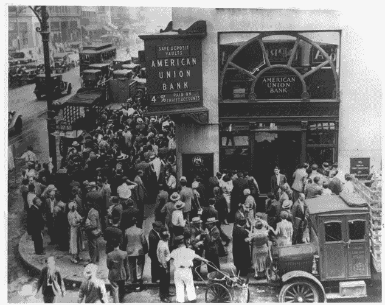
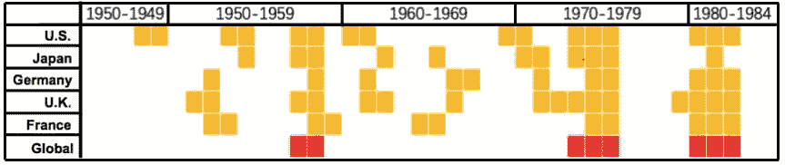
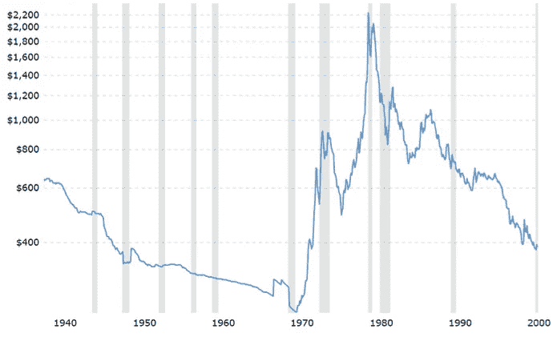
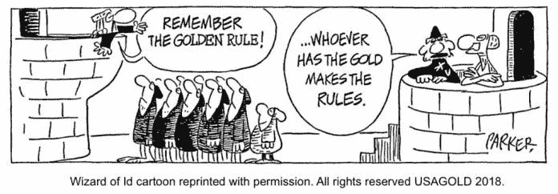
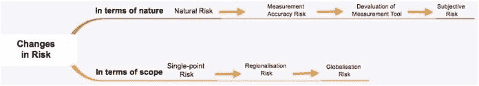
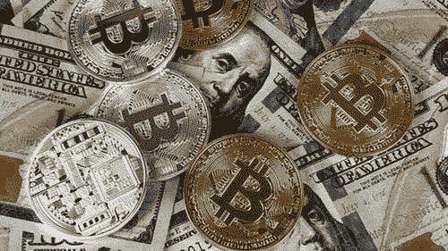

# 对加密周期的观察:千年对冲历史，第二部分

> 原文：<https://medium.datadriveninvestor.com/an-observation-on-crypto-cycles-thousand-years-of-hedging-history-part-2-804d22332251?source=collection_archive---------5----------------------->

## *本文将带你经历从区域化风险到全球化风险的转变，黄金作为避风港的弱化，以及全球经济危机新阶段的开始。它将总结关于作为对冲资产的* [*比特币*](https://www.datadriveninvestor.com/glossary/bitcoin/) *的想法。*

**此处阅读**[**Part 1**](https://medium.com/datadriveninvestor/an-observation-on-crypto-cycles-thousand-years-of-hedging-history-part-1-150585ac1138)**。**

# 全球风险对冲的开始

自 1993 年以来，全球化的概念已经形成并在全世界广泛传播。然而，从历史上看，行为和认知全球化甚至在概念形成之前就已经在物理上被创造出来了。事实上，这种转变是建立在 19 世纪技术进步的基础上的。

美国社会学家罗伯特·帕克(Robert Park)提出: ***“铁路、蒸汽机和电报迅速地将这个世界上的人类动员起来。各国不再孤立。”***

19 世纪初蒸汽机火车、铁路和电报的发明让人们进一步突破了空间的限制。

> 这也导致经济危机呈现出全球性特征。

第一次全球经济危机发生在 1857 年之后的美国(有人会说是 1847 年之后)。当时，美国对铁路建设的需求急剧增加，10 年间完成了 33，000 公里的铁路——超过了所有其他国家铁路的总和。

随着铁路建设的扩大，机会主义企业家精神也在兴起，物价飞涨，对再生产的需求旺盛。随着工业生产，银行也增加了贷款额，这导致企业和个人有足够的资金；股票市场也异常繁荣。

 [## 总部位于瑞士的 ETP 进入加密交易市场|数据驱动的投资者

### 虽然金融市场几乎没有沉闷的时刻，特别是在引入…

www.datadriveninvestor.com](https://www.datadriveninvestor.com/2019/03/10/swiss-based-etp-enters-the-crypto-trading-market/) 

然而好景不长。随着时间的推移，英国的大量出口给美国当地工业带来了压力。铁路建设需求下降后，这些工业企业的产品变得滞销。

此外，此前刺激美国出口的克里米亚战争和欧洲农业萧条也逐渐结束。随着需求萎缩，导致资金逐渐撤出。因此，股票市场崩溃了。当时有 5000 多家工业企业破产。银行系统瘫痪，股市下跌 20% — 50%，铁路公司的股票跌幅高达 80%。

Run-on the United Commercial Bank, 1932, New York

美国的经济危机通过自由市场机制蔓延到欧洲，导致了世界性的金融危机。

美国也发生了银行挤兑。由于金本位制度，黄金就像纸币一样代表现金。因此，在纽约，人们疯狂地涌入银行兑现黄金和美元。

虽然经济危机第一次在全球范围内发生，但从每个人的避险行为来看，**从历史性的区域化避险至今没有改变。“现金为王”的策略仍然有效——人们仍然选择持有大量的法定货币和黄金来对冲风险。**

然而，全球化带来的风险并不像区域经济危机蔓延那样简单。**金融联系导致共振，放大效应**，一个经济体的崩溃影响到另一个经济体。

# 黄金作为安全避风港的弱化

对第二次世界大战后几个国家的经济危机进行了统计研究。下图显示了从 1945 年到 1985 年主要经济实体的经济危机时期。黄色区域代表每个国家的经济危机时期，而红色区域代表**重叠**时期。

这意味着只有三场真正的全球经济危机在主要经济体中同时发生。即 1957 年至 1958 年、1973 年至 1975 年和 1980 年至 1982 年；只有这三个实例表现出**明显的全局同步。**

Statistics of the Economic Crisis Situation in Various Countries after WW2

接下来让我们来看看黄金的价格走势:

Gold’s Price Chart from 1940 to 2000

从走势可以看出，黄金在关键危机时刻并没有体现出很强的避险属性，而**更多的体现了投资属性。**

人们现在仍然自然而然地将黄金视为避风港，并倾向于在乱世购买黄金。然而，要将其用作对冲工具，需要遵守非常严格的条件。黄金之所以能起到避险作用，是由于其定价的**公平性，但正在逐渐失去这种优势或者被取代**。有两个主要原因:

> 1.有很多法定货币可以用来衡量——其中大多数也可以自由兑换。在金融危机时期，某些法定货币会压制黄金作为稳定的衡量工具。参考 21 世纪不断上升的避险资产——日元和瑞士法郎，这两种货币都因其低利率、稳定性而成为避险货币。
> 
> 2.随着全球经济的发展，黄金已经成为央行外汇储备的重要组成部分。与几千年甚至几百年前不同，黄金价格并不独立于政府的操纵。相反，黄金价格的剧烈波动受到各国央行类市场行为的影响。

> 这意味着黄金失去了作为公平的交换定价媒介的作用，成为政府经济调控工具的重要组成部分。

现在让我们来看看一些数据:

> 从 1980 年到 1988 年，黄金价格下降了 52%，而同期美国的通货膨胀率上升了 90%。即使是低通胀的国家，如日本，也经历了约 20%的通胀率。
> 
> 1981 年，美国通货膨胀率上升了 8.9%，而黄金价格下降了 32%。
> 
> 1986 年，美国通货膨胀率降至 1.1%。然而，黄金价格却上涨了 19%。

这些数据表明:**与法币贬值相比，黄金价格波动更重要的因素是央行的调控措施。**换句话说，当央行预期法定货币贬值时，它会提前购买黄金，但当法定货币实际贬值时，它会卖出黄金以获取更多资本。

黄金对冲的概念其实起源于几千年的历史。它已经形成了一种深深铭刻在人们心中的文化。然而，现实是，散户投资者继续使用黄金作为对冲工具已经变得越来越困难，因为黄金已经成为政府层面的一种战略和政策工具。

此外，这也揭示了一个新层次的风险转化动态。由于金融的自反性，风险从独立客观的存在变成了主观的存在。

由于人们对独立和客观风险的预测具有很强的一致性，这将导致风险对冲行为的趋同，而**这种趋同反而会导致对冲目标的进一步风险。**

# 全球经济危机新阶段的开始；应该如何对冲风险？

近年来，世界经济进入了又一轮衰退，贸易摩擦不断，而且越来越严重。世界各国 GDP 增长不断下滑，局部政治动荡或地缘政治冲突加剧。随着全球经济寒冬的临近，我们如何更好地对冲风险？

在提供新的思路之前，我们先回过头来梳理一下我们的观点。随着经济和贸易的不断发展，风险属性也在发生变化。

从本质上讲，风险已经从最初的**自然风险转变为不准确计量的风险，再转变为相对计量的风险**，最后转变为行为趋同导致的主观风险。从范围来看，风险已经从最初的单点风险转变为区域化风险，再到全球化风险。

> 更重要的是，这些不同性质和范围的风险同时共振。

当世界某个地方发生单点债务违约时，另一个国家正在同时经历一场区域性金融危机；当一个国家的货币贬值时，所有人都在同时将另一个国家的货币推至前所未有的高位。**这种全面的共振导致资产的有效可持续性非常短。**

我们该如何处理这种情况？目前有两种方式:

## 1.生产资产

> 这是沃伦·巴菲特在 2012 年致股东信中提出的观点。

“我自己的偏好——你也知道这一点——是我们的第三类:对生产性资产的投资，无论是企业、农场还是房地产。理想情况下， ***这些资产应该有能力在通胀时期提供产出*** *，这将* ***保持其购买力价值，同时要求最低限度的新资本投资*** *。”*

利息——金融最基本的要素，需要利润来支撑——巴菲特提出的是**追根溯源。**

面对金融危机，我们需要比金融利益更稳定的东西。即使发生了金融危机，人类最基本的需求也需要得到满足，人类社会运转和维持的基本要素仍然需要发挥作用。所以这类资产表现在金融危机中会更稳定。

其实这种做法就是**追溯风险的源头，了解各类风险的共性，寻找稳定性**。能够提供稳定性的资产必然能够应对多样化的风险。

## 2.风险独立的替代资产

我们可以追溯到黄金刚刚开发出来的时候。它承担了维护定价权公平性的角色，是一个相对独立的衡量工具。

如今，政府和央行拥有足够的黄金储备，相反，它们却失去了独立性。用[加密货币](https://www.datadriveninvestor.com/glossary/cryptocurrency/)行业的话说，就是**过度集中**。黄金储备较少的国家逐渐失去定价权的谈判。

History of the Medium of Exchange, Medium

> *因此，我们需要寻找其他类似风险的独立替代资产作为对冲资产。*

# 比特币是避险资产吗？

在当今时代，相对于几千年前黄金的独立、公平的特性，比特币目前的发展还不足以成为各国政府调控经济的工具，也不会出现央行持有比特币储备作为外汇储备的情况。

在 Dovey Wan 最近的一篇文章中，她还指出，至少在目前，比特币不是一种避险资产。

有人可能会问，未来比特币在政府外汇储备中还会有一席之地吗？其实这也不是不可能，但是如果真的到了那一天，恐怕我们就**需要另一种独立的替代资产来承担公平公正计量的角色了。**

> *更重要的是，反身性告诉我们，当比特币被广泛认可为避险资产时，它也失去了避险资产的地位。*

# 下一步是什么？

下面的文章将是“对加密周期的观察”系列的一部分。敬请期待！

罗宾毕业于复旦大学，主修数学。在加入 X-Order 担任研究员之前，他在四大和私募股权基金拥有超过 10 年的金融建模经验(理论和执行方面)。他于 2017 年加入区块链行业，目前专注于使用复杂性经济学来发现指数级增长机会。

*原载于 2019 年 11 月 28 日*[*https://www.datadriveninvestor.com*](https://www.datadriveninvestor.com/2019/11/28/thousand-years-of-hedging-history-part-2/)*。*

## 在 [Linkedin](http://linkedin.com/company/xorderglobal) 上联系我们！

***译自*** *(通过我们的微信账号)* ***:*** *心悦*

***编辑:*** *谭*