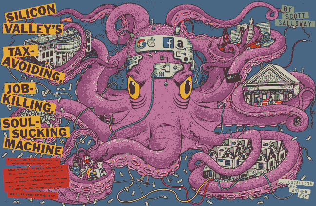
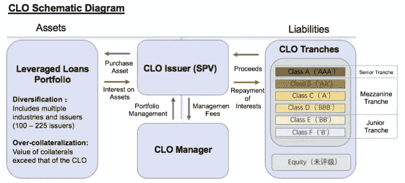
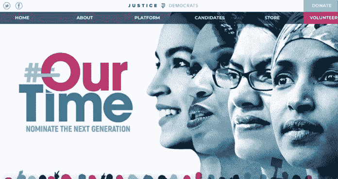
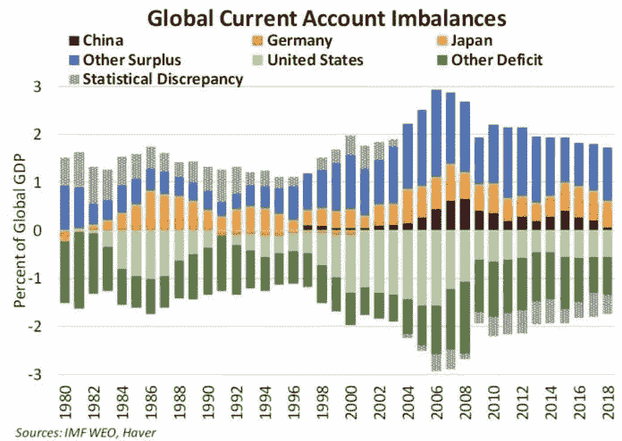
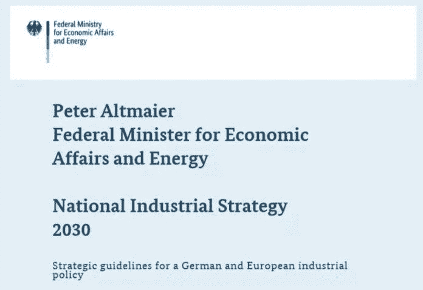
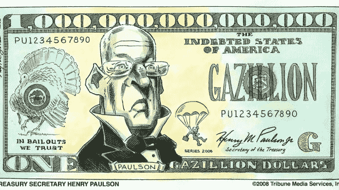

# 一个关于密码的观察:新周期？比特币的四种未来可能性，第二部分

> 原文：<https://medium.datadriveninvestor.com/an-observation-on-cryptonew-cycle-four-future-possibilities-of-bitcoin-part-2-b46be7df73cd?source=collection_archive---------5----------------------->

## 在第二部分，我们继续观察公开信息得出四种可能的未来情景(第二部分将解释三种情景)，其中我们将分析其对[比特币](https://www.datadriveninvestor.com/glossary/bitcoin/)价格的影响。然后，我们进一步讨论它将如何从整体上影响加密货币。

*由创新研究机构 X-Order 的金融分析师王润宇撰写，该机构试图结合分布式计算、计算博弈论、人工智能和密码学等跨学科领域来发现未来的扩展订单。它的创始人是托尼·陶，他也是 NGC 风险投资公司的合伙人。*

# 四种未来可能性

在《T4》第一部中，我们探索了第一个可能的场景:**“新直升机钱”。**

*按概率降序继续:*

## 2.美国经济的内部再平衡

美国内部的不平衡主要表现在**大型科技集团**。他们相应的义务与他们赚的钱数并不一致。

纽约大学教授 Scott Galloway 的文章*《硅谷避税、扼杀工作、吸魂的机器》*指出，在特朗普减税之前(即 2007 年至 2015 年)，S & P 500 公司的平均税率为 27%；而四大科技公司的份额分别是:苹果 17%，谷歌 16%，亚马逊 13%，脸书 4%。

Article Image by Andrew Rae, Classic Esquire

与同行相比，亚马逊自 2008 年以来支付了 14 亿美元的所得税，而沃尔玛——亚马逊的颠覆性竞争对手——支付了 640 亿美元。

据统计，过去十年美国科技公司和跨国企业避税的盈余有一半被用于业务扩张，如研发支出和收购，这些都是政府支持的。

剩下的钱用于市值管理和资本套利，体现为一套复杂的金融魔术，步骤如下:

> 1.跨国公司通过经营获得海外免税现金；
> 
> 2.由于资产负债表状况良好，公司在美国发行低息债券；
> 
> 3.债券发行后，公司在美国获得在岸现金；
> 
> 4.该公司发行部分现金作为股息或回购股票。随着以美元计价的股价上涨，高级管理人员获得数千万美元，因为他们的工资与股价挂钩；
> 
> 5.公司不使用境外免税现金。而是选择投资其他国家的国债来获取息差。

> *整个过程的受益者是参与整个过程的公司股东、高管和金融中介。*

除了政府税收的损失，公司的普通员工也受到损失。他们不持有股票，因此无法从股价上涨中获利。员工的工资也会降低，以提高公司的业绩，从而提高股价。

 [## Azbit 旨在连接传统金融和加密货币|数据驱动的投资者

### Azbit 是下一个提供交易平台的加密项目，该平台提供保证金和算法交易。一样多…

www.datadriveninvestor.com](https://www.datadriveninvestor.com/2019/03/20/azbit-aims-to-connect-traditional-finance-and-cryptocurrency/) 

中小型企业的利益和竞争力也会受到负面影响，因为它们只能通过发行更高利息的债券来吸引客户。

因此，为了使中小企业的融资过程更加顺利，华尔街开发了一种新的工具——抵押贷款债券(CLOs)，这是一种类似于 2008 年金融危机中的抵押债务债券(CDO)的融资工具。它把中小企业债券和优质科技公司的债券打包在一起。

Wisburg Research Institute, rated using Standard & Poor’s standards

当然，目前来看，CLO 不会马上暴露在风险中。一方面，CLO 的主要新买家是日本银行和资产管理公司，它们不足以冲击美国的银行体系。另一方面，随着美联储降息，人们仍然可以在未来借新还旧。但总体来看，中小企业的竞争力仍然受到冲击。

> *为此，共和党人和激进的民主党人正在考虑采取反垄断措施压制和分拆大型科技企业。*

传统上，硅谷的大型科技企业和跨国公司是民主党的根据地和金融家。因此，共和党人在政治上愿意从科技公司赚取保护费，以便补贴制造业和能源公司。

Taming the Tech Titans, The Economist

因此，无论是过去两年备受争议的脸书隐私问题，还是彼得·泰尔(*硅谷第一位支持川普*的著名投资人)公开宣称谷歌叛国；特朗普瞄准半导体产业链发动中美贸易紧张，是**打压大型科技企业的信号。**

自 2016 年民主党大选以来，国会两院和最高法院都有所退缩。为了重新掌权，一些内部激进势力已经开始采取行动，取得了成果，从而导致局势逐步改善。

类似的事件也发生在共和党内部，即 2009 年民主党执政时发起的激进团体“茶党”。终于在 2016 年加入特朗普，帮助共和党重新上台。

目前民主党的激进势力叫做*“正义民主党/ JD】，*以桑德斯和沃伦为代表，活跃势力是亚历山大·奥卡西奥·科尔特斯 *(AOC)* ，互联网明星。

桑德斯主要建议对富人和大公司征收重税，而沃伦则主张以反垄断的名义拆分科技巨头。沃伦专门撰写了文章 [*【下面是我们如何拆分大科技】*](https://medium.com/@teamwarren/heres-how-we-can-break-up-big-tech-9ad9e0da324c) *。*

## **3。国际支出债务转移**

讨论这个话题，首先需要了解两个概念:**特里芬困境和经常账户。**

> **特里芬困境:**如果美元是核心国际货币，那么由于贸易和结算，美元必须在海外大量流通，导致美国长期处于赤字状态。
> 
> **经常项目:**各国国际收支中的一个项目，反映一国的进出口、服务贸易等相关数据。

因此，这两者结合起来表明，美国的经常账户应该会长期处于赤字状态，事实也是如此。

世界上哪些国家有盈余，哪些国家有赤字(即类似于美国)？请看下图:

从图中我们可以看到，中国、德国、日本，以及一些欧洲发达国家长期处于顺差状态。除了美国，其他赤字国家还包括中东富油国和新兴市场国家。

特朗普希望重振美国制造业，并减少美国的贸易逆差。这意味着中国、德国和日本在未来将不得不承担更多的进口和支出责任。

日本是最没有希望的，因为它的国家债务是巨大的——是该国 GDP 的两倍多。中国的中央政府债务非常低，并且正在逐步实施“一带一路”倡议，进一步开放其经济。但这个过程不会很快，因为地方债、未来养老和医疗保险等隐形债务的压力很大。

> *最大的希望在于德国和一些欧洲发达国家。*

看看欧洲国家的公共政策也可以找到证据:

> 1.欧盟将设立 1000 亿欧元的“欧洲未来基金”，对“具有战略重要性的欧洲企业”进行股权投资。
> 
> 2.“硬”英国退出欧盟的可能性正在逐渐增加。同时，德国今年经济数据持续低迷，需要通过财政刺激扭转预期，与欧洲其他国家更加紧密团结；
> 
> 3.2019 年初，德国联邦经济事务和能源部长推出了一项*【national e Industri Strategie 2030】*，被媒体形容为“经济民族主义”。该计划基本包括允许政府购买股票，广泛支持具有重大经济意义的行业，将德国企业确立为“国家龙头企业”等。

然而，上述转移国际支出责任的设想并未达成一致，也不会很快完成。这是因为它动摇了美元在世界上的绝对主导地位，未来会有大量的战略互动。

## **4。上述设想都不成功**

三大设想的失败是指:

*   美联储继续保持“独立性”，对降息和与财政部合作犹豫不决；
*   无论是共和党的大规模减税，还是民主党提出的反垄断，美国两大政党继续进行内部斗争而不是执行政策；
*   国际支出义务转移面临障碍，欧盟行动缓慢；

预计结果会有两个方向:**地缘政治冲突加剧和金融危机重现。**如果是类似 2008 年的金融危机，美债会再次受到追捧。

Bailing out of 2008, Miami Herald

# 会对加密货币产生怎样的影响？

> *当这四种情况发生并进展时，会对比特币等加密货币的价格造成什么影响？*

需要注意的是，上述假设情况**并不互斥**。它们可以同时或交替进行。

我们认为未来市场有以下可能性:

你有什么看法？

# **接下来是什么？**

*下面这篇文章将由 X-Order 团队来展开关于加密货币行业生死存亡的辩论。敬请期待！*

王润宇毕业于上海交通大学，会计专业。在加入 X-Order 之前，他在证券公司和对冲基金有两年的研究经验，专注于消费品和技术行业。他目前是 X-Order 的金融分析师，专门从事加密货币市场分析和优质项目投资。

*原载于 2019 年 12 月 8 日*[*【https://www.datadriveninvestor.com】*](https://www.datadriveninvestor.com/2019/12/08/new-cycle-four-future-possibilities-of-bitcoin-part-2/)*。*

## 在 Linkedin[上与我们联系](http://linkedin.com/company/xorderglobal)！

**翻译**(通过我们的微信账号) **:** 心悦

***编辑:*** *谭*