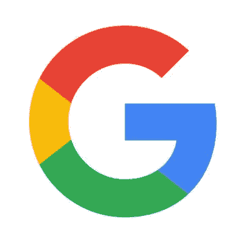
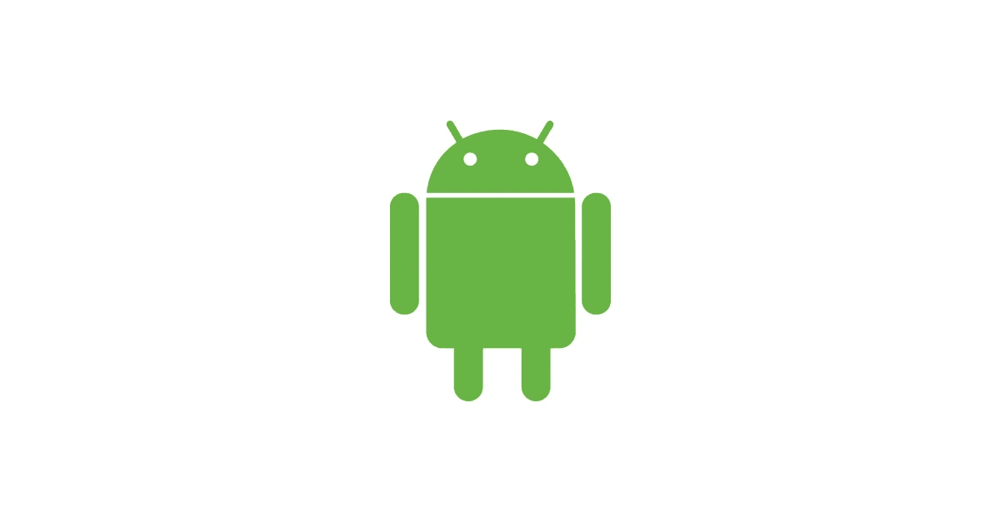
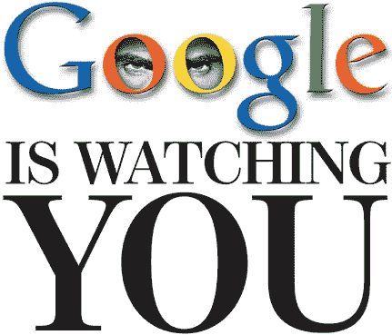

# 谷歌颂歌

> 原文：<https://medium.datadriveninvestor.com/an-ode-to-google-6341c95e7a0b?source=collection_archive---------8----------------------->

世界正以快速、不减的步伐前进。以至于我们看到很多东西都觉得理所当然。许多人只有在日常生活中出现重大干扰时(比如分手、失业或失去亲人)，才会意识到他们长期以来认为理所当然的事情的重要性。对我来说，我只是有一个想法，一个你可能已经想到，或者没有。不管是哪种情况，令人难以置信的是，一个简单到可以有效搜索网页的研究项目，怎么会变成谷歌这样强大的巨头。

想想看:我认识的大多数人都使用 **Gmail** 收件箱查看他们的电子邮件，从重要邮件到垃圾邮件。许多人通过智能手机或个人电脑使用**谷歌 Chrome、**浏览器浏览网页，尽管 ie 浏览器在广泛使用 Windows 操作系统的情况下拥有巨大的先发优势。每个人现在都想在 YouTube 上观看他们最喜欢的视觉内容创作者(从 PewDiePie 的游戏到 Casey Neistat 令人敬畏的视频博客，甚至是 T 系列的音乐)。

当你考虑到谷歌刚刚开始解决找出哪些网页链接到给定页面的问题时，考虑到这种反向链接的数量和性质是关于该页面的有价值的信息，考虑到谷歌已经接管了生活(至少是我的生活)，这是令人惊讶的。使用的概念，网页链接到，并由同等声誉的网站链接，使该网页更重要，这在运动的想法，搜索引擎提供了最受欢迎的搜索结果给定的关键字第一。

但仅凭这一点并不能解释谷歌成长为今天这个庞然大物的原因。为此，你需要进入谷歌两位创始人的简历: ***拉里·佩奇和谢尔盖·布林。***

> “你无法理解谷歌，”谷歌早期员工玛丽莎·梅耶尔坚持说，“除非你知道拉里和谢尔盖都是蒙特梭利的孩子。这在他们的个性中根深蒂固。去问自己的问题，做自己的事。做某事是因为它有意义，而不是因为某个权威人物告诉你。在蒙特梭利学校，你去画画是因为你有事情要表达或者你只是想在那天下午去做，而不是因为老师这么说。这是拉里和谢尔盖处理问题的方式。他们总是问，为什么会这样？这是他们的大脑在早期被编程的方式。”[*【1】*](http://www.internethistorypodcast.com/2017/04/the-history-of-google/)

这使他们能够跳出他们的网络搜索产品大获成功的框框，将自己扩展到他们自己都没有预见到的领域。最好的例子是创建一个名为 **Google Drive 的免费云存储供人们使用。**我发现自己一直在用这个来存储使用**谷歌文档**创建的文档(由于能够实时共享和编辑文档，我甚至已经停止使用微软 Office)，或者使用**谷歌表格**制作高质量的表格来快速评估人们的意见，使用**谷歌表格**存储和分析这些数据，并使用**谷歌幻灯片在演示中展示结果。谁会想到谷歌会挑战像 MS Office 这样的王者？**

这些天来，我觉得没有必要在去我以前从未去过的地方的前一天问别人或绘制路线——仅仅是因为谷歌地图的存在。我一点也不担心，因为它本身已经充分更新了实时路线、交通状况，并为我绘制了最快的路线！我经常使用 **Google Hangouts** 召开电话会议，事实证明这对很多人来说都很方便。我甚至没有提到这样一个事实，即许多手机运行的是 Android 操作系统，这对那些使用运行该系统的手机的人来说是一个很好的体验，更不用说 Play Store 上的大量应用程序了！

我可以继续说下去，但我会尽量涵盖谷歌给市场带来的各种用途:我可以与我的**谷歌助手**交谈并获得查询或结果，或者使用**谷歌翻译用外语与人交谈。**我可以使用**谷歌照片分享我的照片和其他难忘的时刻，**使用**谷歌保持**做笔记，获得一部令人惊叹的**谷歌像素**手机，或者像**谷歌白日梦那样的虚拟耳机。他们甚至帮助开源项目，像谷歌代码之夏帮助学生为开源社区创造，以及为那些值得的人提供各种奖学金！**

为了简洁起见，我不打算列出清单，尽管我很确定我已经错过了他们字母表旗下的许多产品(谷歌实际上控制着这些产品)。我的观点是钦佩他们对创新的渴望，这种渴望让他们在过去几年里收购了许多初创公司，涉及各种可穿戴技术、移动操作系统、无人驾驶汽车和可再生能源等领域。金钱不再是谷歌的首要考虑因素，因为相比之下，它有足够的资金投入来创造一个测试版本。公司文化首先关注创新，其次是获得真实的用户数据，然后才是如何赚钱。[【2】](https://www.investopedia.com/articles/personal-finance/042415/story-behind-googles-success.asp)

我是在说谷歌是完美的吗？大概不会。事实上，许多人批评他们的搜索算法不透明，这帮助他们积累了数十亿美元，从用户那里收集数据，这显然有利于他们，但牺牲了用户隐私，以及谷歌实际上可以影响全球思维的看法，通过这种方式，他们可以推广哪种内容。但最终，谷歌是一个完美的例子，说明如何跳出框框思考，并在新的市场中保持扩张和竞争，甚至不需要这样做。赢家继续赢，人们继续搜索！

谷歌最初并没有因为拥有市场上最好的搜索页面而赚很多钱。成立三年后，谷歌通过引入谷歌 Adwords 向其在搜索领域的地位迈出了第一步。凭借谷歌通过 Adwords 创收的能力，只要有足够多的人想使用，产品的货币化就相当简单。这是谷歌成为今天的导火索。事实上，人们不会说‘搜索网页’，他们只会说谷歌。到目前为止，许多人使用谷歌的次数超过了它的任何替代品，无论是 DuckDuckGo 还是 Bing。是的，也许有一天会有比谷歌更好的搜索引擎出现。但这并不能确保像许多人预期的那样下跌。因为谷歌已经超越了自己，凭借自身实力成为了一个重要的世界玩家。