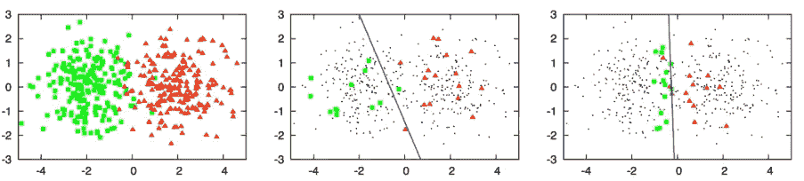

# 使用主动学习和众包的开源方法来翻译非洲语言

> 原文：<https://medium.datadriveninvestor.com/an-open-source-approach-using-active-learning-and-crowd-sourcing-to-translate-african-languages-3f5982527819?source=collection_archive---------9----------------------->

# 摘要

几十年后，由于采用互联网成为无处不在的主流；非洲见证了互联网的巨大渗透和使用。一小部分熟练使用主要语言开发内容的用户参与程度更高，受到的影响也非常大。他们目睹了世界变成了一个地球村。他们参与商业，联系和互动，欣赏不同的文化，学习新技能，并通过互联网获得娱乐。然而，有更大一部分人口和潜在用户的参与度受限于他们对用于开发内容的语言的流利程度。近年来，在自然语言处理的语言到语言的机器翻译领域有了很大的发展。这使得组织更容易进行国际和跨文化商业交易，以不同的当地语言托管网站版本，并向用户提供将内容翻译成当地语言的选项。这一重点主要是西方和一些亚洲方言。在一个以互联网为主导的现代社会，非常需要准确、通用和广泛采用的非洲语言翻译模型。

对于建立以非洲语言为重点的机器翻译模型，关注和努力都很少。对于少数尝试过机器翻译的语言来说，其准确性水平不如西方同行。像斯瓦希里语和阿姆哈拉语这样的语言在全世界都有超过 1 亿人使用。

在本文中，我建议采用经过验证的概念，并提出一种开源方法来解决这个问题。由于只有很少的 NLP 数据集侧重于非洲语言，因此使用主动学习和众包将有助于通过优先考虑最具信息量的标注数据来降低标签获取成本。众包将有助于利用群众的力量来弥补昂贵的语言专家的缺乏(Ambati，2010)。

**简介**

世界银行估计，互联网上至少 80%的内容是 10 种语言之一:英语、中文、西班牙语、日语、葡萄牙语、德语、阿拉伯语、法语、俄语和韩语(世界银行，2014 年)。非洲大约有 1500 到 2000 种语言。这种语言多样性巩固了非洲遗产，加强了我们的文化和传统。在一些非洲国家，如加蓬，日常交流仍然主要使用当地语言。他们是全球人口的一部分，有可能错过通过互联网以有影响力的方式参与的机会。如前所述，大部分高影响力的内容不是用他们的语言开发的，而且他们的许多语言的翻译模型也不存在。虽然传统的基于语料库的方法和翻译模型对匹配已经奏效，但是如果要依赖这些技术，则需要大规模的并行数据生成。为新的语言对做这件事需要大量的人力，并且需要流利的双语者或专业翻译(Ambati，2010)。

基于语料库的机器翻译方法是基于统计方法，利用语料库文本之间等价的概率计算(Guidère，2002)。他们主要使用非常大量的匹配数据，这些数据主要是由人类创建的，以训练自动语言翻译的模型(Koehn，Josef Och，& Marcu，2003)。匹配语料库的使用在军事机器翻译的早期就已经开始了。同样的方法在 1984 年被广泛应用于主流实践(Guidère，2002)。从那以后，分析不同语言文本之间的关系以及随后的翻译的其他方法也发展起来了。这种方法的缺点是，为了不断提高模型的准确性，需要越来越多的标记数据。这可能是一个非常昂贵和资源密集型的过程。在非洲，大约有 2000 到 6000 种语言，这个任务几乎不可能完成。很难找到非常了解当地方言、精通英语或法语等其他主要语言并能做翻译工作的人。

**主动学习的运用**

主动学习是半监督学习的一种强大形式，可以在缺少匹配数据时使用。主动学习背后的想法是，学习算法或模型可以自由选择用于训练目的的数据。与传统的学习范例相比，这种灵活性可以用更少的训练数据提高效率和性能。主动学习者可以提出查询，通常是以由 oracle(例如，人类注释者)标记的未标记数据实例的形式。

主动学习与翻译非洲语言极其相关，特别是因为缺乏关于这些语言的标注数据和资源(Garrette & Baldridge，2013)。注释显然很难获得，并且访问数千种语言的注释预算是不实际的。显然，这种设置是主动学习的自然应用，但这方面的工作很少(方，李，科恩，2017)。

使用主动学习的目的是尽量减少翻译新句子的人力(Haffari，Roy 和 Sarkar，2009)。在加蓬的例子中，这种未标记的数据无处不在，很容易获得。开发匹配的标签是困难的，耗时的，或昂贵的(Settles & Craven，2008)。

没有应用主动学习而训练的模型将倾向于形成偏斜的决策边界，并且结果导致数据点的错误分类。当使用主动学习时，有一个显著的不同。观察到的结果(Settles，2010)是因为模型被允许选择高级数据点，因此分类器能够创建一个非常好的决策边界(Hosein，2018)。

Figure 1 : An illustrative example of pool-based active learning adopted from the survey by (Settles, 2010)

在非洲环境中使用主动学习将证明是有益的。在许多情况下，预期匹配的数据在开始时会很少。一旦将相同的数据拟合到模型中，训练过程将允许以递归方式更新标记的数据。每次迭代都允许模型适应更新的数据集，训练和评估其性能。如果数据集的特征不满足某个阈值，学习模型可以相应地调整输入特征。使用主动学习进行图像分类的实验表明，所提出的方法大大优于现有方法(Sener & Savarese，2018)。此外，它在自然语言处理任务中的应用使得标注数据的费用最小化(Thompson，Calif & Mooney，1999)。

所提出的使用主动学习的方法将实现多语言翻译模型的创建。这将涉及一个模型，可用于执行之间的主要语言，如英语，斯瓦希里语和基库尤翻译。多语言环境提供了新的机会，除了单一的语言学习。这种设置类似于多任务人工智能场景(Reichart，Tomanek，Hahn 和 Rappoport，2008)。多语言模型进一步提高了标注效率，因为不同的源语言可能能够提供比所选句子更好的翻译，从而减少标注工作(Haffari，Roy，& Sarkar，2009)。

**开源和众包**

我建议稍微改变一下，采用众包。收集未标记数据(单词、短语和句子)和翻译的任务都将外包给更广泛的受众，就像众包工作一样。不同的是，参与者将是志愿者，注释数据和训练模型的产品将免费提供给他们。一些贡献者还将执行审计和质量控制任务。如上所述的激励将是特定的个人或组织在达到某个贡献里程碑后将可以免费访问翻译模型。他们将由学生、研究人员和普通公众的自愿成员组成，他们将被帮助那些没有受过正规教育的人使用互联网的使命所说服。存储库将以未标记的数据集开始，在允许的情况下，可以从一些明显的来源生成已标记的数据集。有很好的语料库来源，如方言电台、电视和其他媒体机构、方言杂志、翻译成本国语言的圣经文本等。

我认为大多数了解互联网好处的非洲人，尤其是学生和研究人员将会做出贡献。方法将是与教授、讲师和指导者、信息技术俱乐部和语言系合作，他们在接受愿景后将动员他们学校的其他学生。这种方法将向更广泛和多样化的贡献者开放平台，这将增加参与的机会，从而提高翻译质量。我估计唯一需要的资源是存储数据和运行翻译模型的计算环境。许多贡献者的参与可能会增加采用的机会，并在某种程度上就最终产品的可靠性和质量达成共识。为了保持可信度和保持贡献者的积极性，将及时发布改进的模型和数据集供公众使用。基本目标是确保非洲语言的翻译模式将不断改进，并允许数百万人访问翻译后的高影响力内容，否则他们将无法获得这些内容。这一举措也将使任何想要推进研究的人有一个开始的地方。

我建议贡献者通过以下方式访问众包平台:

一个基于网络的应用程序，能够添加新的单词，短语，句子，图像和视频等。

主要平台(Android 和 iOS)上的移动应用程序也可用于实现上述功能

该平台的主要目标是实现以下目标:

1.确定单词、短语或句子的有效性

2.评估句子或短语的句法准确性

3.对单词、短语和句子的解释和翻译的贡献

4.开发一个意思相似的单词、短语和句子的马赛克

我们可以采用(Shwartz，2016)建议的一些方法来控制数据收集的质量；

1.使用如下指标描述贡献者:他们过去完成的任务数量、他们的批准率(他们被批准的任务的百分比)和位置等。

2.设计平台，使其能够验证响应的真实性，这需要由一个以上的贡献者执行。

3.提供一个投票机制，投票的重点是单词、短语或句子的真实性及其翻译的准确性。

4.采用控制机制，包括使用已知正确答案的问题。

5.一个内置的垃圾邮件检测机制，将阻止恶意行为者的访问

6.找出认可最积极的贡献者或任何达到某一贡献里程碑的贡献者的方法

**主动学习情景使用**

我建议采用以下场景作为主动学习模式:

**基于库的抽样**:学习模型可以从任何语言的大量未标记的单词、短语和句子中挑选。实例将根据一些信息度量从所述池中抽取。学习者将使用这种方法来选择信息最丰富的实例。该过程允许所有未标记的实例被排序，并且在等级被建立之后从 oracle 请求它们的标签。如前所述，主动学习是一个递归的过程。这本质上有助于学习者执行后续的查询任务。学习者将具有查询单词、短语或句子的“经验”,并且它将利用先前获得的查询结果来识别要排队并请求其标签的候选项。(Eck，Vogel，& Waibel，2005)使用了一种基于池的采样方法，他们引入了加权方案，以允许根据看不见的 n 元语法的频率对句子进行排序。他们指出，排序后，他们可以选择更小的训练语料库，并能够显示系统在更少的训练数据上训练，并与使用所有可用训练数据的基线系统相比，实现了非常有竞争力的性能。此外，在(Gangadharaiah，Brown，& Carbonell，2009)中，基于池的策略被用于最大化对预期未来改进的测量，以从大型平行语料库中抽取实例。此外，在(Contardo，Denoyer，& Artiere，2017)中，他们使用了一种基于池的策略，其中系统在单次拍摄中观察数据集的所有示例，并且实验证明了令人鼓舞的结果。

**结论**

很明显，必须做点什么。除非我们让数百万非洲人能够接触到技术并为技术进步做出有意义的贡献，否则互联网浪潮将是另一场与非洲擦肩而过的革命。随着更多的研究转向强化学习和主动学习的积极方法，这种翻译模型将进一步发展，以使非洲语言的机器翻译更容易。

**参考文献**

安巴蒂，V. (2010 年)。*主动学习为机器翻译服务。*匹兹堡:卡内基梅隆大学。

康塔多，g .，德诺耶，l .，和阿蒂埃，T. (2017 年)。一步主动学习的元学习方法。

埃克，m .，沃格尔，s .，，怀贝尔，A. (2005)。基于 N 元语法频率和 TF-IDF 的统计机器翻译的低成本可移植性。*陈群*。

方，男，李，杨，&科恩，T. (2017 年 8 月 8 日)。学习如何主动学习:深度强化学习方法。arXiv:1708.02383v1 [cs。CL] 。

Gangadharaiah，r .，Brown，r .，和 Carbonell，J. (2009 年)。基于实例的机器翻译中的主动学习。 *NODALIDA 2009 会议记录*，227–230。

Garrette 和 j . bald ridge(2013 年)。从两个小时的注释中学习词性标注。 *NAACL-HLT* ，138–147。

吉代尔，硕士(2002 年 1 月)。*翻译杂志。*2018 年 10 月检索，来自 translation journal . net:[https://translationjournal.net/journal/19mt.htm](https://translationjournal.net/journal/19mt.htm)

Haffari，g .，Roy，m .，和 Sarkar，A. (2009 年)。基于统计短语的机器翻译的主动学习。*2009 年 ACL 北美分会年会*(第 415–423 页)。博尔德:人类语言技术。

Hosein，S. (2018 年 2 月 9 日)。*主动学习:好奇的 AI 算法*。检索 2018 . 11 . 3，来自 data camp . com:[https://www . data camp . com/community/tutorials/active-learning](https://www.datacamp.com/community/tutorials/active-learning)

科恩，p .约瑟夫·奥奇，f .和马尔库，D. (2003 年)。基于统计短语的翻译。 *HLT-NAACL* ，48–54。

Reichart，r .，Tomanek，k .，Hahn，u .，，A. (2008 年)。语言标注的多任务主动学习。计算语言学协会。哥伦布。

Sener，o .，& Savarese，S. (2018 年)。卷积神经网络的主动学习:核心集方法。ICLR。

Settles，B. (2010 年)。*主动学习文献调查。麦迪逊:威斯康星大学。*

Settles，b .，& Craven，M. (2008)。序列标记任务的主动学习策略分析。*自然语言处理经验方法会议(EMNLP)* (第 1070-1079 页)。

施瓦茨，V. (2016 年 8 月 28 日)。*众包(针对 NLP)* 。检索 2018 年 10 月 08 日，来自 veredshwartz . blogspot . com:[http://veredshwartz . blogspot . com/2016/08/crowdsourcing-for-NLP . html](http://veredshwartz.blogspot.com/2016/08/crowdsourcing-for-nlp.html)

汤普森，加利福尼亚州，硕士和穆尼，R. (1999 年)。自然语言分析和信息抽取的主动学习。*机器学习国际会议(ICML)* ，(第 406–414 页)。

世界银行。(2014, 7 3).可以上网，但要用我的母语！检索 2018 年 10 月 3 日，来自[http://www . world bank . org:](http://www.worldbank.org:)[http://www . world bank . org/en/news/feature/2014/07/03/internet-access-yes-but-in-my-mother-language](http://www.worldbank.org/en/news/feature/2014/07/03/internet-access-yes-but-in-my-mother-language)