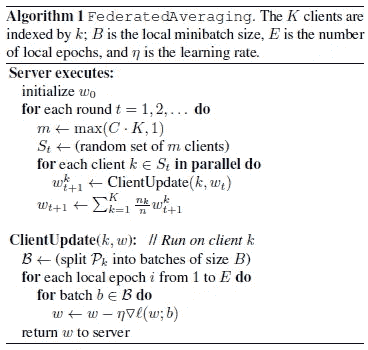

# 联邦学习概述

> 原文：<https://medium.datadriveninvestor.com/an-overview-of-federated-learning-8a1a62b0600d?source=collection_archive---------0----------------------->

## 看看它的历史、潜力、进展和挑战

几周前，我参加了由 [AI Singapore](https://www.aisingapore.org/) 组织的行业研讨会[将人工智能技术转化为医疗保健解决方案](https://www.aisingapore.org/translating-ai-tech/)(如下图)。在讨论的许多有趣的主题中，有一种被称为联邦学习的分散协作机器学习方法。这激起了我的兴趣，我决定多读一些。

Workshop panelists from left to right : Dr Stefan Winkler (moderator), Deputy Director, AI Singapore; Trent McConaghy, Founder, Ocean Protocol; Dr Ronald Ling, CEO, Connected Health; Lance Little, Managing Director for Asia Pacific, Roche Diagnostics; Dan Vahdat, Co-founder & CEO, Medopad; Dr Joydeep Sarkar, Chief Analytics Officer, Holmusk; Dr Yu Han, Assistant Professor, Nanyang Technological University; Dr Khung Keong Yeo, Senior Consultant of the Dept of Cardiology, National Heart Centre Singapore

# **历史**

术语*联合学习*是谷歌在 2016 年首次发表的[论文](https://arxiv.org/abs/1602.05629)中创造的。从那以后，它一直是一个活跃的研究领域，arXiv 上发表的[论文](https://arxiv.org/search/?searchtype=all&query=%22federated+learning%22&abstracts=show&size=200&order=-announced_date_first)就是证明。在最近的 TensorFlow Dev 峰会上，谷歌推出了[tensor flow Federated](https://www.tensorflow.org/federated)(TFF)，使其更容易被其流行的深度学习框架的用户使用。与此同时，对于 PyTorch 用户来说，开源社区 [OpenMined](https://www.openmined.org/) 已经从去年年底开始提供了 [PySyft](https://blog.openmined.org/upgrade-to-federated-learning-in-10-lines/) 库，目的类似([链接](https://arxiv.org/abs/1811.04017)、[链接](https://blog.openmined.org/upgrade-to-federated-learning-in-10-lines/))。

 [## 人工智能与创造力:梦想成真——数据驱动的投资者

### 人工智能总是让我着迷。不仅作为一套有用的工具，不断发展，而且作为一个…

www.datadriveninvestor.com](https://www.datadriveninvestor.com/2019/01/28/ai-creativity-deep-dream-comes-true/) 

# 什么是联合学习？

联合学习是对这个问题的一个回答:*一个模型可以在不需要移动和存储训练数据到一个中心位置的情况下被训练吗*？

在现有约束和其他并行发展的推动下，这是机器学习不断融入我们日常生活的合乎逻辑的下一步。

**数据孤岛**

今天，世界上的许多数据不是存放在中央数据中心，而是存放在收集和拥有这些数据的孤岛上。换句话说，如果能在现有的基础上加以利用，就有很大的潜力可以挖掘。

**数据隐私**

近年来，数据隐私问题越来越受到多个司法管辖区监管机构的关注([链接](https://www.insideprivacy.com/data-privacy/privacy-and-cybersecurity-a-global-year-end-review/))。由于数据可用性对任何机器学习模型都至关重要，因此必须设计创造性的方法来规避限制，并使模型训练能够在数据实际上不必离开收集和存储数据的地方的情况下进行。

**计算在边缘**

正如后面将要解释的，联合学习通常需要在边缘进行计算。对于收集和存储数据的边缘设备(主要是手机)，定制硬件的最新进展(例如，苹果的[神经引擎](https://techpinions.com/apples-neural-engine-pocket-machine-learning-platform/53651))使得在其上进行深度学习变得可行。自从三星 S9 和苹果 X 系列手机推出以来，情况就是如此。随着市场上这些所谓的“人工智能就绪”手机的数量增长([链接](https://medium.com/neuromation-blog/whats-the-deal-with-ai-chips-in-the-latest-smartphones-28eb16dc9f45))，联合学习的潜力也在增长。

# 联合学习承诺了什么

联合学习也有潜力成为行业未来变革的推动力。

**云计算**

云计算是当今由科技巨头谷歌、亚马逊和微软占据的空间中机器学习的主导计算范式。无需维护中央数据中心，新的提供商将更容易提供更多的人工智能服务。事实是，谷歌已经预见到了这种民主化的趋势，并在联合学习的发展中扮演了领导角色。

**共享经济**

谷歌利用联合学习在 GBoard 上开发了下一个单词预测器。这种在不损害用户隐私的情况下训练模型的能力，应该会鼓励其他服务的出现，这些服务以共享经济的形式，依赖于通过手机和其他物联网设备收集的数据。

**B2B 协作**

由于数据永远不会离开它的原始前提，联合学习为组织级别的不同数据所有者提供了协作和共享数据的可能性。在最近的一篇论文中，研究人员(杨强等人)设想了发生这种情况的不同配置。

Horizontal Federated Learning

Vertical Federated Learning

他们创造了术语*水平联合学习*和*垂直联合学习*。

以两家地区性银行为例。尽管它们有不重叠的客户群，但是它们的数据将有相似的特征空间，因为它们有非常相似的业务模型。在水平联合学习的例子中，他们可能会走到一起合作。

在垂直联合学习中，两家提供不同服务(如银行和电子商务)但拥有大量客户的公司可能会在他们拥有的不同特征空间上找到合作空间，从而为双方带来更好的结果。

在这两种情况下，数据所有者都能够协作，而不必牺牲各自客户的隐私。

除了金融，另一个可能受益的垂直行业是医疗保健行业(如引言中所述)。如果医院和其他医疗保健提供商能够以保护隐私的方式共享用于模型训练的患者数据，他们将从中受益。

# 联合学习是如何工作的

联合学习的核心是谷歌在他们最初的[论文](https://arxiv.org/abs/1602.05629)中引入的联合平均算法(伪代码如下所示)。

The Federated Averaging Algorithm

一轮典型的学习包括以下顺序。

*   联盟成员(称为客户端)的随机子集被选择来从服务器同步接收全局模型。
*   每个选定的客户端使用其本地数据计算更新的模型。
*   模型更新将从选定的客户端发送到服务器。
*   服务器聚集这些模型(通常通过平均)以构建改进的全局模型。

当然，子集选择步骤是谷歌最初应用联合学习的背景所必需的:通过其 Android 生态系统中数百万部手机收集的数据。

在后来的文献中出现的这种学习序列的变体涉及向服务器发送梯度更新，而不是实际的模型权重本身。通常的想法是，没有原始数据在各方之间传输，只有与模型相关的更新。现在也很清楚边缘计算在这里是如何发挥作用的。

# 联合学习的挑战

将联合学习从概念转移到部署并非没有挑战。研究人员，包括那些独立工作的联合学习倡导者，已经为更好地理解要考虑的问题做出了贡献。虽然在联邦学习的效率和准确性方面已经做了一些工作，但在我看来，更重要的挑战是下面提到的与安全性相关的挑战。

*推理攻击* ( [链接](https://arxiv.org/abs/1805.04049)、[链接](https://arxiv.org/abs/1805.05838)、[链接](https://arxiv.org/abs/1812.00910)、[链接](https://arxiv.org/abs/1812.00984)、[链接](https://arxiv.org/abs/1812.02274))。联合学习的动机是保护客户拥有的数据的隐私。即使没有公开实际数据，也可以利用重复的模型权重更新来揭示不是数据的全局属性，而是特定于单个贡献者的属性。这种推断既可以在服务器端执行，也可以在(其他)客户端执行。一个经常被引用的对策是使用[差分隐私](https://medium.com/georgian-impact-blog/a-brief-introduction-to-differential-privacy-eacf8722283b)来降低这种风险。

*模型中毒* ( [链接](https://arxiv.org/abs/1807.00459)、[链接](https://arxiv.org/abs/1808.04866)、[链接](https://arxiv.org/abs/1811.12470))。一些研究人员调查了行为不端的客户引入后门功能或安装 Sybil 攻击来毒害全球模型的可能性。

Targeted poisoning attack in stochastic gradient descent. The dotted red vectors are Sybil contributions that drive the model towards a poisoner objective. The solid green vectors are contributed by honest clients that drive towards the true objective.

为了有效应对这种攻击，必须考虑 Sybil 检测的额外开销。

# 展望未来

联合学习有望提供更多数据来改善生活。许多研究正在进行，许多挑战仍然存在。也许谷歌最新[论文](https://arxiv.org/abs/1902.01046)中的以下段落总结了今天的状况。

> 在这篇论文中，我们报告了一个在移动电话(Android)领域中用于这种算法的系统设计。这项工作仍处于早期阶段，我们没有解决所有问题，也不能对所有需要的组件进行全面讨论。相反，我们试图勾勒出系统的主要组成部分，描述挑战，并确定开放的问题，希望这将有助于激发进一步的系统研究。

如果你觉得这篇文章令人耳目一新，引人入胜，那就鼓掌吧！:)

Basil 是新加坡人工智能项目**的技术社区经理和编辑，这是一项政府计划，旨在引领新加坡的人工智能人才开发和采用计划。这里表达的观点是他自己的。**