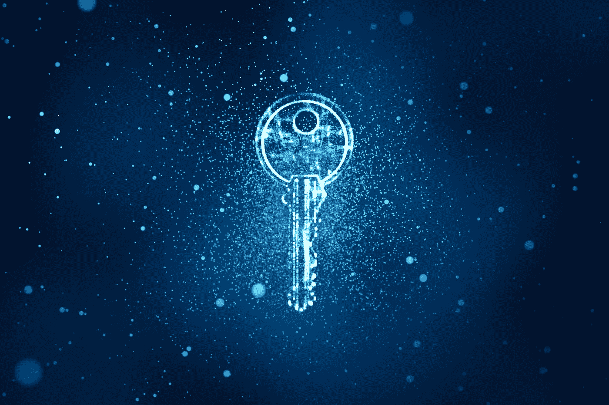
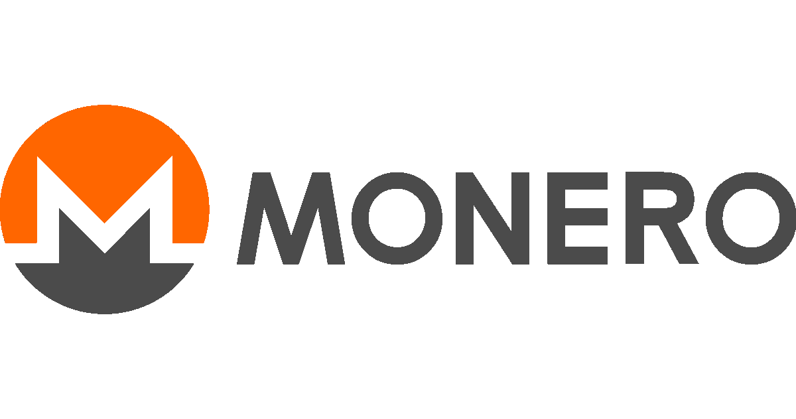
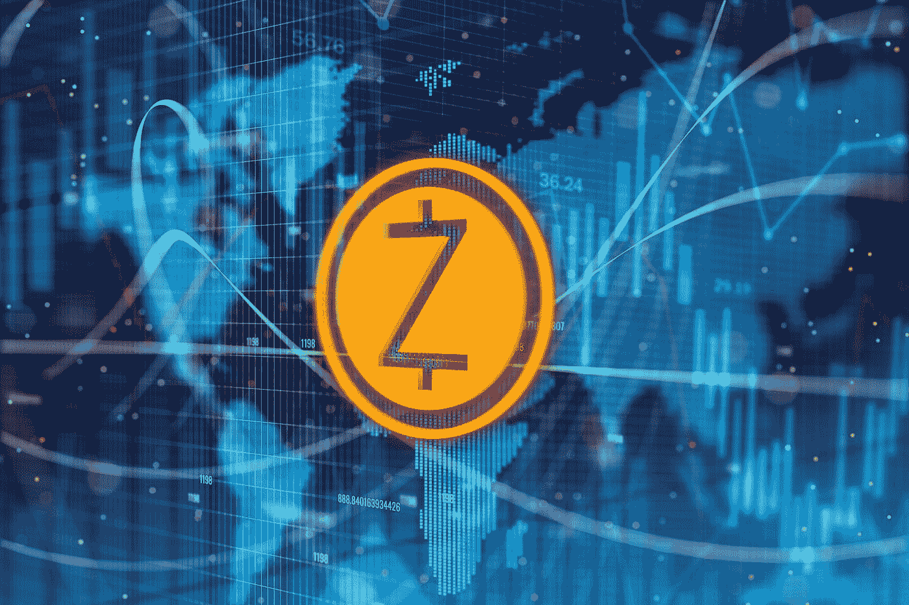
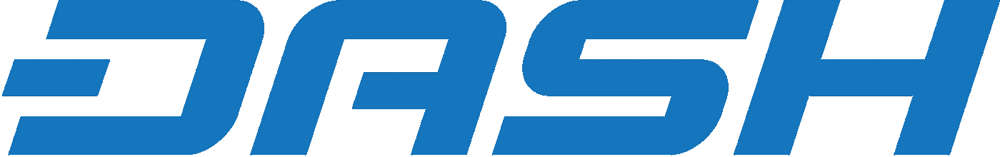

# 隐私币概述

> 原文：<https://medium.datadriveninvestor.com/an-overview-of-privacy-coins-d078175c4ecc?source=collection_archive---------3----------------------->

加密货币最受欢迎的功能之一是在发送和接收支付时可以相对匿名。例如，PayPal 要求每个发送者事先披露与真实身份相关的细节，如姓名和联系信息，但通常只有用户的钱包地址需要披露，以便发送和接收加密。

也就是说，对于大多数加密货币来说，从他/她的公共地址识别特定用户并不需要太多努力。

比特币等硬币通常被描述为“半匿名”或“假名”，这意味着尽管交易方的身份仍然未知，但每笔交易都被广播到一个公共区块链的事实使得人们有可能识别每个公共地址的交易活动。

这部分解释了隐私币的出现，在某些情况下，隐私币被证明是非常受欢迎的。通过保护发送者和接收者的地址，以及被发送的硬币的价值，隐私硬币比更透明的加密硬币更进了一步。

# 比特币 vs 隐私币

比特币使用[一种未用完的交易输出模型](https://bitcoin.org/en/developer-guide#block-chain-overview)，其中每笔交易都由输出和输入组成，代表一段时间内发送和接收的比特币数量。这些输出和输入可以追踪到区块链上发送者和接收者的各种公共地址，因此，追踪交易回到特定地址就成了一个相当简单的过程。

如果该地址最终兑现，其与银行账户的链接很可能导致特定用户的身份被泄露。

相比之下，保密硬币试图通过保护发送者和接收者的身份、保护发送的金额以及保护发送的输入和输出来降低这种透明度，从而防止特定地址的交易历史被追踪。

[Monero](https://coinmarketcap.com/currencies/monero/) 和 [Zcash](https://coinmarketcap.com/currencies/zcash/) 是目前最受欢迎的隐私币——两者都在市值最高的 25 种硬币之列。虽然两者都利用复杂的加密技术来实现隐私，但它们都使用不同的算法，我们将对此进行简要说明。

# 莫内罗

和比特币一样，Monero 也涉及公共地址。但与比特币不同的是，每一方拥有的 Monero 的价值是*而不是*连接到这个公共地址。因此，Monero 区块链的这种不透明性意味着它的输入和输出不能被追踪，或者追踪到特定的地址。

Monero 主要使用**隐形地址**和**环签名**来实现这一点。

*隐身地址*

为了接收比特币，你不得不将你的公共地址分享给网络，这反过来在一定程度上牺牲了你的隐私。但是，每当交易在 Monero 网络上发生时，发送方使用接收方的密钥来生成一个秘密地址，该地址提供了向网络上的一次性目的地发送输出的指令。

然后由发送方发送的输出以这样一种方式构造，即接收方可以扫描区块链，并使用他的私钥识别目的地为他的地址的输出。该过程防止发送的输出与接收者的钱包地址相关联。

因此，尽管每个人都可以在区块链上看到一次性公钥，但只有发送者和接收者知道交易的确切细节，而接收者的公共钱包地址在交易的任何阶段都不会公开链接。

但是，虽然秘密地址保护了接收者的身份，但它们并没有保护发送者的身份。这就是戒指签名的用武之地…

*戒指签名*

这是一个数字签名，其中一组潜在的签名者——包括参与签名的一方(发送者)和几个非签名者——聚在一起为 Monero 的发送创建一个唯一的授权。

签名者和非签名者的组合创建了一个“环”，其中非签名者是从区块链任意获取的过去的输出并充当诱饵，而实际的签名者是与从发送者的钱包发送的输出相对应的一次性密钥。

所有这些输出(来自签名者和非签名者)在外界看来同样可能是在交易中花费的看似合理的输出。这使得发送者能够“隐藏”在环中，并且在使用她的一次性密钥对交易进行签名的同时保持与其他人不可区分。通过这种方式，她的身份仍然是隐藏的。

最后，Monero 采用的**Ring Confidential Transactions(Ring CT)**增强功能是 ring signature 协议的最新改进版本，它还允许各方之间发送的金额保持私密，特别是通过隐藏区块链上的输出金额。

# Zcash

Zcash 最初于 2014 年作为 Zerocash 推出，通常被描述为带有隐私层的比特币；事实上，与比特币一样，Zcash 的固定总供应量为 2100 万枚硬币。除了应用其隐私功能，特别是构成“屏蔽交易”基础的支付信息加密，它还使用了比特币的大量源代码。

Zcash 最吸引人的是它对 zk-SNARKS 的使用，ZK-SNARKS 代表“零知识简洁的非交互式知识论证”。它是一种复杂的加密形式，保护交易方的身份以及发送的数量。

zk-SNARKS 使用“零知识证明”,使一方能够向另一方证明一个声明是真实的，而不必透露任何超出声明本身有效性的额外信息。因此，它允许一方证明自己知道某件事，而不必暴露它。

将 zk-SNARKS 应用于 Zcash 时，需要注意以下几点:

*   双方(证明者和验证者)不必实时交互(解释 zk-SNARKS 首字母缩写词的“非交互”部分)。
*   值由“票据”携带，它指定了金额和一个公钥。
*   每个支付地址使用两个公钥:
*   与发送到该地址的票据相关联的支付关键字
*   一种只能由相关私钥持有者使用的传输密钥。
*   发送者通过区块链向接收者发送加密的输出票据，接收者使用传输密钥扫描区块链并解密发给他们的票据。
*   输入票据的私人消费密钥在整个交易中被加密链接到签名，使得交易不能被不知道这些私人密钥的任何人修改。
*   在一个笔记被使用后，只能证明*某个*对它的承诺已经被揭示，而不能揭示是所有先前创建的笔记中的哪一个。这意味着失效票据不能链接到创建它的交易。
*   矿工在不知道谁发送或接收硬币的情况下核实交易。使用加密哈希，每一方都可以证明某个声明是真实的，而不必透露有关参与方身份的任何进一步的细节。

zk-SNARKS 当然是一种高度复杂的加密形式(更详细的信息可以在[这里](https://z.cash/technology/zksnarks.html)找到)，但是它已经在加密社区中证明了它的价值。事实上，它甚至被以太坊采用[。](https://blog.z.cash/ethereum-snarks/)

# 但是等等，Dash 不也是隐私币吗？

Dash 项目目前(2018 年 4 月)的市值与 Monero 大致相同[。](https://coinmarketcap.com/currencies/dash/)

Dash 为喜欢匿名的用户提供了 PrivateSend 选项。此功能将交易输入细分为特定面值，包括 0.01、0.1、1 和 10 分。如果发送者想私下发送 DASH，他的钱包将向 Dash 主节点(网络上拥有至少 1000 个 Dash 并负责各种重要决策的卓越软件节点)发送请求。

接收到请求(匿名的)，主节点混合来自包括发送者在内的至少三个人的*相同的*输入面额(意味着另外两个人发送消息，表示他们也想要混合相同的面额)。在混合输入后，主节点指示用户的钱包将转换后的输入支付回自己，这是通过不同的“更改”地址完成的。

这个过程会重复几次，这使得确定硬币的来源变得更加困难。

虽然 Dash 有时被归类为隐私硬币，但 PrivateSend 通常不像 Monero 和 Zcash 网络上实现的隐私协议那样受到重视。更重要的是，它仍然无法在移动钱包上使用，它因为不太用户友好而受到很多批评，并且该协议经常被报道包含错误/错误。还存在一种非常真实的威胁，即对网络的攻击可能通过主节点之间的充分整合而发生。

此外，首席执行官赖安·泰勒还表示，Dash 交易中只有一小部分是私下进行的，此前他还淡化了自己项目的隐私凭证。

因此，许多人认为 Dash 在功能上类似于具有透明区块链的比特币，但通过混合提供隐私。

— — — — — — — -

隐私硬币的含义既有正面的，也有负面的。能够执行不可追踪的交易为那些寻求更少披露的人提供了理想的解决方案。对许多人来说，这可能最终会被证明是对比特币协议的一次重要修改。

但与此同时，当局无疑希望确保这种隐私不会加剧已经越来越严重的洗钱和恐怖主义融资问题。的确，[报道](https://www.bloomberg.com/news/articles/2018-01-02/criminal-underworld-is-dropping-bitcoin-for-another-currency) [暗示](https://www.pymnts.com/news/blockchain-distributed-ledger/2018/bitcoin-privacy-coins-tokens-zcash-monero-ethereum/)像 Monero 这样的硬币已经成为犯罪活动的最爱。

最终，隐私硬币似乎不太可能在未来某个时候不被监管机构审查。但与此同时，如果在转移价值时，隐私对你来说特别重要，那么获得这种地位的手段现在已经真正到来了。

*原载于 2018 年 4 月 15 日*[*【www.datadriveninvestor.com】*](http://www.datadriveninvestor.com/2018/04/15/an-overview-of-privacy-coins)*。*