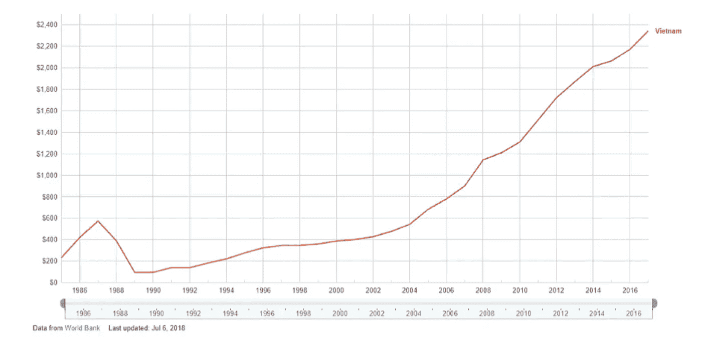
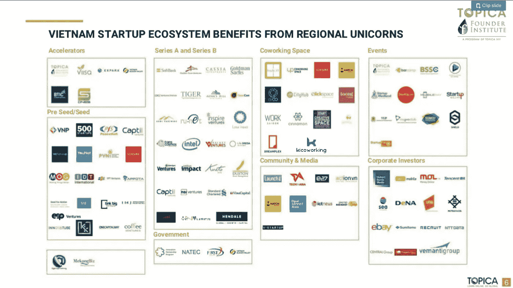
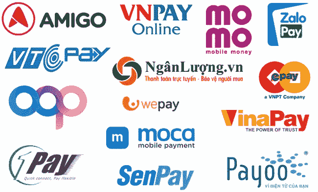

# 越南风险投资业概述

> 原文：<https://medium.datadriveninvestor.com/an-overview-of-the-venture-capital-industry-in-vietnam-1056a03a650?source=collection_archive---------3----------------------->

***注*** :已经有一段时间没有在我的介质页上写东西了。我经历了一次职业转换，通过我在 VIISA 的工作，从初创公司到风投公司。虽然这份工作很有挑战性，但它让我对越南创业生态系统建设之旅做出了重大贡献，结识了许多新朋友和志同道合的合作伙伴/导师，并在此过程中收获了许多宝贵的知识。因此，这篇文章将是我将继续发布的一系列总结和分享的第一篇。

***注 2*** :本文某版本发布于 e27:[https://e27 . co/overview-vietnams-venture-capital-industry-2018 10 22/](https://e27.co/overview-vietnams-venture-capital-industry-20181022/)。

> “风险资本是投资者向被认为具有长期增长潜力的初创公司和小企业提供的融资。风险资本一般来自富裕的投资者、投资银行和任何其他金融机构。然而，它并不总是仅仅采取货币形式；它可以以技术或管理专门知识的形式提供。”投资媒体

自从 20 世纪 90 年代初重新向全球市场开放以来，以政府发起的改革运动为开端，越南经历了稳定的经济增长。尽管由于全球经济萧条，越南经历了一段时间的经济挣扎，但越南还是享受到了世界经济论坛(WEF)最近所称的“经济奇迹”。

*Viet Nam’s per capita GDP has increased tenfold over the past 30 years (source: Google, World Bank)*

这种令人印象深刻的增长在迅速改变经济和社会的同时，也带来了可持续性。根据 WEF 的[包容性发展指数](https://www.weforum.org/reports/the-inclusive-development-index-2018)，越南在实现社会各阶层和人口更具包容性和可持续性的增长方面拥有最佳记录。女性企业主。政府还投入大量公共投资建设基础设施和人力资源。通过大力改善教育，尤其是小学教育，越南已经培养了无数代的 IT 和软件工程师，足以让英特尔、博世、三星等国际公司在越南建立研发中心，同时也促进了本土 IT 公司的发展，如 FPT、VNG、CMC 等。对当地基础设施的资本注入也取得了成功的回报，根据最近的 [WeAreSocial 报告](https://www.slideshare.net/truongbang/digital-in-2018-vietnam)，越南成为 APAC 对移动设备最友好的国家之一，越南 9600 万人口中有超过 70 名独立移动用户。

 [## 风险投资家在给创业公司播种时会考虑什么标准？数据驱动的投资者

### 2017 年，风险投资资金攀升至十年来的最高水平。你的创业公司目前吸引风险投资的机会是…

www.datadriveninvestor.com](https://www.datadriveninvestor.com/2018/04/20/what-criteria-do-venture-capitalists-consider-when-seeding-a-startup/) 

这些条件结合在一起，为创业公司的外包创造了有利的环境。根据 Dezan Shira & Associates 在[进行的研究，2010 年至 2017 年间，投资的初创公司数量从 10 家增加到 92 家，其中 61%的项目获得的投资不到 100 万美元。当地投资者也变得对风险投资更加友好:在 2017 年的 92 笔交易中，外国投资者仅参与了 28 笔交易，而当地投资者则占了令人惊讶的 64 笔交易。](http://www.vietnam-briefing.com/news/startup-ecosystem-vietnam.html/)

然后，本文将试图说明越南风险投资业多年来的发展，理解越南风险投资目前在资金和交易规模方面的蓬勃发展，并对近期的增长做出预测。

**早起的人**

按照定义，越南的风险投资行业从 2004 年开始发展，成立了由国际数据集团(IDG)创始人兼董事长麦戈文创立的[**IDG Ventures Vietnam**](http://idgvv.com.vn/en/)(IDGVV)。在 2004 年至 2013 年间，IDGVV [投资了 42 家投资组合公司](https://www.techinasia.com/idg-ventures-vietnam-42-startups)，这些公司遍布科技和非科技行业。IDGVV 进行的一些最值得注意的投资包括 VNG(越南排名第一的互联网/游戏企业，可以说是[越南的第一只独角兽](https://www.techinasia.com/a-deeper-look-at-southeast-asias-only-two-unicorns-vng-and-garena))、Webtretho (Project Lana)(最近由 LINE Ventures 投资[，以及 VietnamWorks (](https://english.vietnamnet.vn/fms/science-it/200093/line-app-to-return-to-vietnam-.html) [被 En-Japan](https://www.techinasia.com/vietnamworks-vietnams-top-online-recruitment-site-acquired-enjapan) 收购)。

这个行业的另一个早起者是 cyber agent Ventures(CAV)，这是一家总部位于日本的风险投资基金，于 2008 年进入越南。他们在越南投资了超过 25 家公司，包括一些越南最好的互联网和移动服务。他们最引人注目的三笔投资包括 Foody(据报道[被 SEA Group](https://www.dealstreetasia.com/stories/future-nyse-listed-sea-ltd-acquires-82-vietnams-foody-64m-83084/) 收购)、Tiki(排名第一的本地电商平台，由中国最大的电商平台 JD.com 投资[)和 Batdongsan.com(](https://techcrunch.com/2018/01/18/jd-com-tiki-indonesia/)[被亚洲最大的在线房产平台 PropertyGuru](https://www.dealstreetasia.com/stories/propertyguru-buys-vietnams-batdongsan-com-vn-cyberagent-ventures-exits-54560/) 收购)。

最后，你不能错过 [**DFJ VinaCapital**](http://www.dfj-vinacapital.com/) ，这是越南最大的私募股权基金之一 [VinaCapital](https://vinacapital.com/) 和专注于早期和成长期投资的美国风险投资公司 Draper Fisher Jurvetson(DFJ)的合资公司。DFJ VinaCapital 成立于 2006 年，在一系列业务中投资了近 5000 万美元，最成功的退出是 Yeah1 集团(YEG)，一家估值约为 4 亿美元的上市公司。

**当前状态**

*A map of Vietnam’s Startup Ecosystem 2017 (source:* Topica Founder Institute*)*

2017-2018 年对越南的风险投资者来说是一个激动人心的时刻。不仅是因为新法令 [№38/2018/ND-CP](http://www.mpi.gov.vn/Pages/tinbai.aspx?idTin=39313&idcm=188) ，其中监管机构明确规定了组建和运营风险投资基金的详细途径，还因为最近几个现有基金的成功筹资以及新基金的成立。

[**500 Startups 越南**](https://500startups.com.vn/) 就是这样一个现有资金成功募集的案例。他们成立于 2016 年，目标是成立一只专注于越南的 1000 万美元基金，最终在 2018 年年中完成了筹资，[超额完成了最初的目标](https://www.dealstreetasia.com/stories/500-startups-vietnam-vc-fund-106512/)。500 Startups Vietnam 目前投资组合中有超过 30 家公司，涵盖广泛的行业，如广告技术、电子商务和金融科技。他们的第一次成功退出也发生在 2018 年， [WifiChua 被 Appota](http://vneconomictimes.com/article/business/appota-acquires-wifi-chua) 收购。

然而，新来者不容小觑。 [**越南创新创业加速器(VIISA)**](https://www.viisa.vn/) ，由 FPT 和 Dragon Capital 共同创立的 600 万美元加速器和种子期基金[，于 2016 年 9 月首次亮相，不仅为创业公司提供成长所需的初始资本，还提供成功融资所需的专业知识和技能。经过两年的运营，VIISA 已经投资了 23 家公司，这些公司与 1500 个商业客户建立了联系，为 15000 个月活跃用户提供服务，并在 5 个不同的国家开展业务](http://ndh.vn/tiep-noi-ssi-fpt-va-dragon-capital-tim-start-up-de-trao-500-000-usd-20160921122728657p128c143.news)[，根据 VIISA 的统计](https://www.viisa.vn/blog/viisa-investment-day-3)。VIISA 还与其他投资者一起进行了三次种子投资: [WisePass](https://nhipcaudautu.vn/doanh-nghiep/expara-ventura-dau-tu-400000-usd-cho-wisepass-3320476/) 、 [WeFit](https://theleader.vn/ung-dung-wefit-ket-noi-phong-tap-gym-yoga-tang-toc-voi-vong-goi-von-moi-20180604155847164.htm) 和 [Base.vn](https://ictnews.vn/kinh-doanh/base-vn-nhan-dau-tu-tu-cac-quy-dau-tu-hang-dau-viet-nam-va-quoc-te-170562.ict) 。2018 年，VIISA 设定的目标是帮助其投资组合公司[从外部投资者那里再筹集 500 万美元](http://vietnamfinance.vn/viisa-dat-muc-tieu-ho-tro-startup-goi-von-5-trieu-usd-trong-nam-nay-20180504224209376.htm)，并成为越南的头号加速器。

另一位登场的新人是[**vina capital Ventures**](https://ventures.vinacapital.com/)。2018 年 8 月宣布，VinaCapital Ventures 期待[向越南科技公司](https://www.reuters.com/article/vinacapital-investment/vinacapital-unveils-100-mln-venture-firm-to-invest-in-tech-startups-idUSL3N1VL41O)投资 1 亿美元，从两笔交易开始:Logivan 和 FastGo。 [Logivan](https://baodautu.vn/start-up-logivan-duoc-3-quy-dau-tu-rot-them-175-trieu-usd-d87058.html) 提供 B2B 卡车叫车和物流网络解决方案，以解决该行业的低效率问题，而 [FastGo](https://startup.vnexpress.net/tin-tuc/xu-huong/fastgo-nhan-dau-tu-tu-vinacapital-ventures-3800922.html) 是一款越南制造的叫车移动应用程序，为司机和乘客提供优势。这只新基金表明，尽管 DFJ 和维纳资本的合作关系已经解散，但维纳资本对越南的科技企业仍有兴趣。

**未来前景**

越南的初创企业投资，尤其是在科技领域的投资，在过去几年里终于获得了动力，并在快速加速。然而，挑战依然存在。据 Dezan Shira and Associates 称，其中，越南创业社区面临的主要挑战是缺乏人才、资金、规模和缓慢的监管改革。资金尤其重要，因为初创公司仍然发现自己在接近投资者并从他们那里融资时遇到困难，尤其是外国基金。

幸运的是，已经有可喜的迹象表明，更多的资本正被投入到资助初创企业和教育当地劳动力，使其更加符合地区标准。该国最大的房地产开发商 VinGroup 宣布计划[成立其新的技术部门 VinTech](http://vingroup.net/vi-vn/tin-tuc-su-kien/tin-tuc-hoat-dong/vingroup-cong-bo-dinh-huong-tro-thanh-tap-doan-cong-nghe-3266.aspx) ，该部门将创建两个研究所，开发大数据和高科技应用。更不用说它对越南第一家国内汽车制造商 VinFast 已经成熟的投资，该公司刚刚在 2018 年巴黎车展上[首次亮相其两款最新车型](http://vietnamnet.vn/vn/thoi-su/tu-hao-viet-nam-truc-tiep-le-ra-mat-oto-vinfast-tai-paris-motor-show-2018-480873.html)，并成功[获得由瑞士瑞信银行和汇丰银行牵头的 9 . 5 亿美元信贷额度](https://news.zing.vn/vinfast-duoc-bao-lanh-khoan-vay-950-trieu-usd-de-nhap-khau-thiet-bi-post883278.html)，以开发其汽车制造设施和技术。

金融科技是另一个吸引区域投资者巨大兴趣的关键垂直领域。根据 Solidiance 的[研究，越南的金融科技市场在 2017 年达到 44 亿美元，到 2020 年将达到 78 亿美元。根据 Solidiance 的分析，这种变化最有可能发生，这要归功于政府的进步政策(推动非现金交易，在越南国家银行下建立金融科技指导委员会，以及通过大规模电信项目改善移动基础设施和覆盖范围)，以及个人和企业金融部门对金融科技解决方案不断增长的需求，到 2025 年，这种需求将分别增长 31.2%和 35.9%。](https://solidiance.com/insights/white-papers/unlocking-vietnams-fintech-growth-potential/download?token=oLeXoxYZA5&utm_source=whitepaperfile&utm_medium=pressrelease&utm_campaign=WP_Vietnam_fintech)

*Top fintech e-payment companies in Vietnam (source: Vietnamnet)*

最后，还有许多其他潜在领域需要认真的创新和创业精神来解决。B2B(企业对企业)技术领域就是这样一个案例。根据 FPT Ventures 的负责人兼 VIISA 的首席执行官 Tran Huu Duc 的说法，[随着 Salesforce、Atlassian、Palantir Technologies 等公司……在全球范围内推动下一次工业革命，B2B 技术的崛起在全球范围内即将到来](http://www.viisa.vn/blog/viisa-accelerator-batch-4)。然而，在越南和东南亚，B2B 公司和服务经常面临传统手工工作方式的用户行为障碍。因此，这些 B2B 创业公司将需要来自风险投资基金的大量投资，包括资本和专业知识，以帮助他们不仅教育市场，而且快速、大幅度地扩大规模。

**结论**

越南的风险投资业已经走过了 15 年的发展历程。在这个时期，随着市场的增长，风险投资基金也在增长。从仅有的几只基金，现在有比以往更多的新人，在全国各地积极投资和培育创业公司。尽管面临一定的挑战，越南风险投资业继续繁荣发展的前景依然光明。

*   *作者不保证本文引用的第三方来源的真实性。*