# U-net 体系结构综述

> 原文：<https://medium.datadriveninvestor.com/an-overview-on-u-net-architecture-d6caabf7caa4?source=collection_archive---------0----------------------->

U-Net 被认为是用于图像分类任务的标准 CNN 架构之一。它被认为是快速和精确分割图像的最佳网络。在深入 U-net 之前，我们将解释一些与之相关的概念。

## **语义分割**

语义分割的目标是将图像的每个像素标记为所表示的相应类别。也就是说，它指的是将图像中的每个像素链接到类别标签的过程。这些标签可以包括一个人、一辆车、一朵花、一件家具等。，仅举几例。

## **实例分割**

除了像素级分类，我们还希望计算机能够分别对每个类实例进行分类。这就是所谓的实例分割。也就是说，在实例分割中，同一类的不同实例被单独分割。

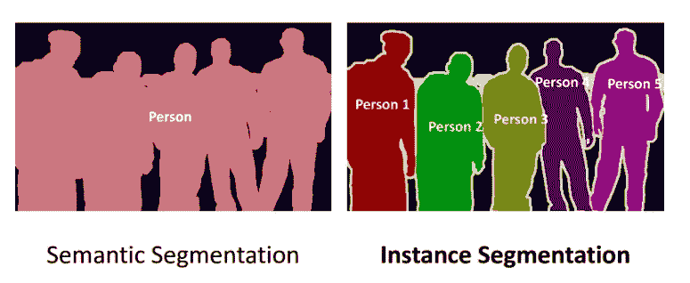

Difference in labels in semantic and instance segmentation

## **卷积**

让我们解释一下什么是卷积，以及如何用简单的术语把它表示成矩阵。

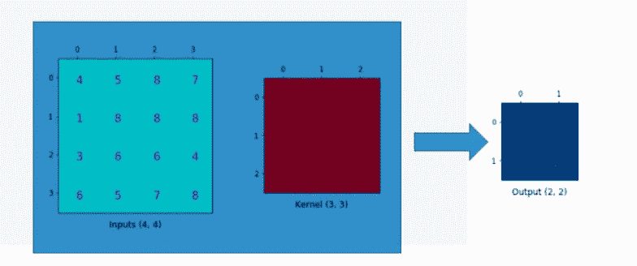

Convolution example

这里我们使用一个(3 x 3)内核和一个(4 x 4)输入来生成一个(2 x 2)输出。在这里，我们有零填充，我们使用跨度为 1。卷积的输出完全取决于核的大小、填充、步长和输入数。

[](https://www.datadriveninvestor.com/2020/02/19/cognitive-computing-a-skill-set-widely-considered-to-be-the-most-vital-manifestation-of-artificial-intelligence/) [## 认知计算——一套被广泛认为是……

### 作为它的用户，我们已经习惯了科技。这些天几乎没有什么是司空见惯的…

www.datadriveninvestor.com](https://www.datadriveninvestor.com/2020/02/19/cognitive-computing-a-skill-set-widely-considered-to-be-the-most-vital-manifestation-of-artificial-intelligence/) 

这里，卷积运算执行元素级乘法，并在输入矩阵和核矩阵之间找到它的和。由于我们没有填充和步幅 1，我们只能这样做 4 次。因此，输出矩阵是 2 x 2。

现在我们将使用卷积矩阵来解释它。

第一步:

假设我们使用的是一个 3 x 3 内核，如下所示:

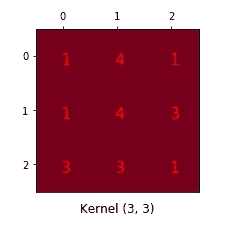

我们将 3×3 核排列成 4×16 卷积矩阵，如下所示:

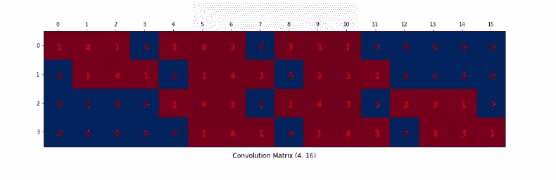

第二步:

将我们的输入矩阵表示为列向量，如下所示:

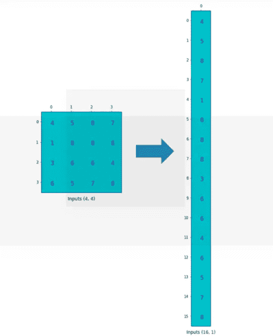

4 x 4 input matrix represented as 16 x 1 column matrix.

第三步:

最后一步，我们将把 16×4 的内核矩阵乘以展平的输入矩阵，得到展平类型的输出矩阵。我们重新排列它，给出如下实际输出矩阵。

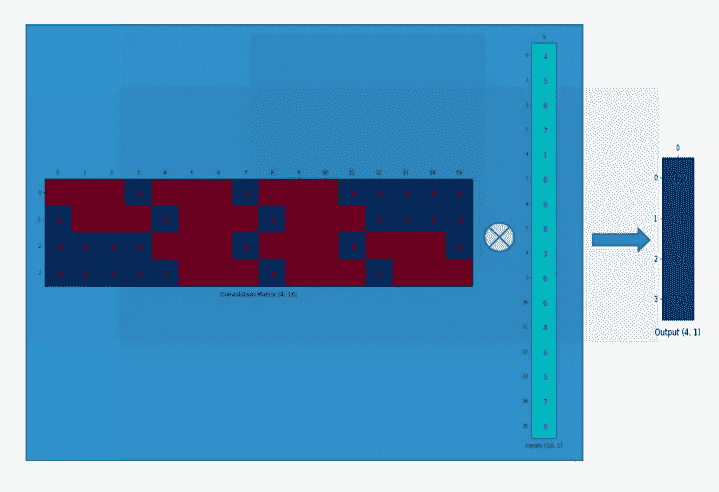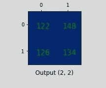

## 转置卷积

我们想从 2 x 2 矩阵到 4 x 4 矩阵。在这种情况下，我们可以使用转置卷积。它类似于我们之前做的卷积矩阵运算。唯一的区别是，这里我们将转置的核矩阵与平坦化的输入相乘。转置卷积(有时也称为去卷积或分数步长卷积)是一种使用可学习参数对图像进行上采样的技术。

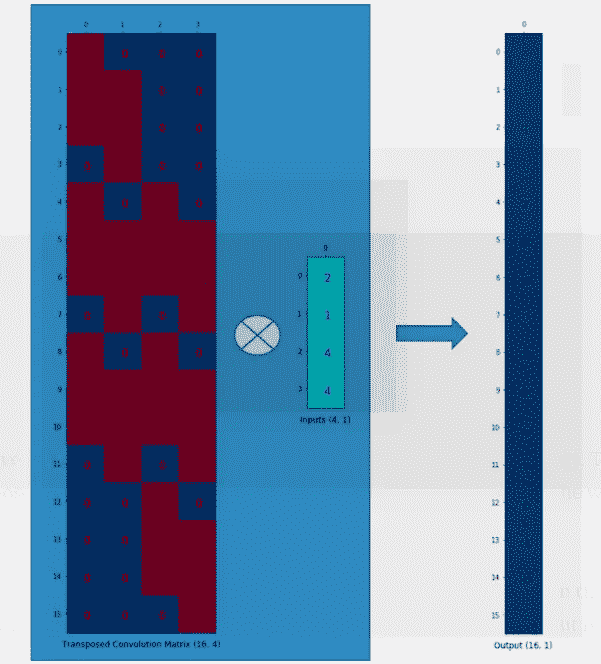

输出可以被整形为 4 x 4 矩阵。

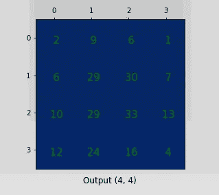

我们刚刚将一个较小的矩阵(2 x 2)上采样为一个较大的矩阵(4 x 4)。简而言之，我们可以说转置卷积是与正常卷积完全相反的过程，即输入体积是低分辨率图像，而输出体积是高分辨率图像。

# **U-net 架构**

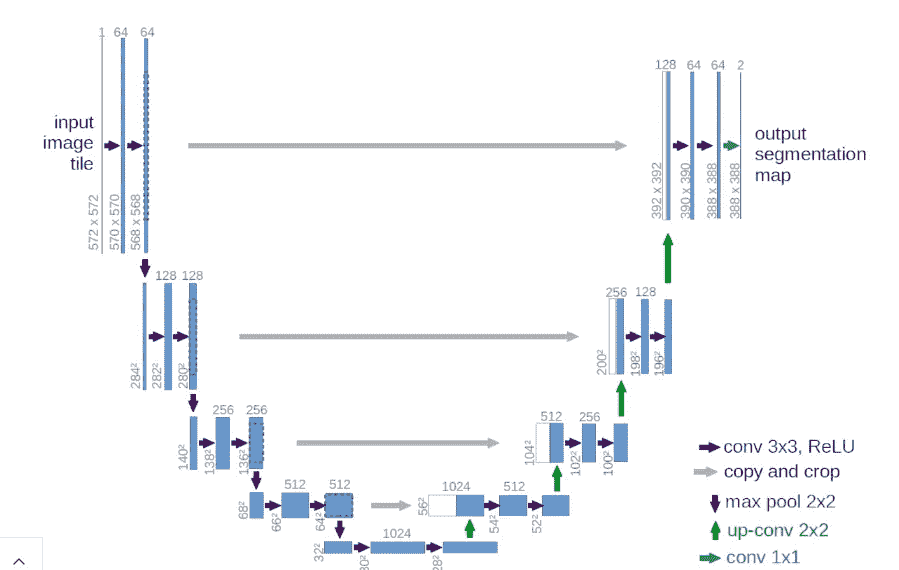

[*【UNET】*](https://arxiv.org/abs/1505.04597)*是**由 Olaf Ronneberger 等人开发的用于生物医学图像分割的架构。它主要由两条路径组成。一个是编码器路径，另一个是解码器路径。编码器路径捕获图像的上下文，产生特征图。编码器路径只是卷积和最大池层的堆栈。使用转置卷积实现精确定位的解码器路径。U-net 只包含卷积层，不包含任何密集层，因为它可以接受任何大小的图像。*

## *收缩/下采样路径(编码器路径):*

*   *编码路径由 4 个块组成。*
*   *每个块包括*

1.  *两个 3 x 3 卷积层+ ReLU 激活函数(带批量归一化)*
2.  *一个 2 x 2 最大池层。*

*   *注意，在原稿中，输入图像的尺寸是 572×572×3。使用 64(3×3)个核，进行卷积并产生 570×570×64 的特征图。现在，它再次乘以 64(3×3)个内核，并产生 568×568×64 的特征图。现在，使用 2 x 2 内核完成了最大池，以产生 284 x 284 x 64 的功能图。*
*   *我们必须注意到，在每个池中，特征映射的数量会翻倍，第一个块有 64 个特征映射，第二个块有 128 个，依此类推。该收缩路径的目的是捕获输入图像的上下文，以便能够进行分割。*

## ***扩展/上采样路径(解码器路径)***

*   *扩展路径由 4 个块组成。每个模块包括:*

1.  *步长为 2 的反褶积层。*
2.  *与收缩路径中相应的裁剪要素地图串联。即，为了获得更精确的位置，在解码器的每一步，我们通过将转置卷积层的输出与来自同一级别的编码器的特征映射相连接来使用跳过连接。*
3.  *两个 3 x 3 卷积层+ ReLU 激活函数(带批量归一化)。*

## *优势*

*   *U-Net 将来自下采样路径的位置信息与上采样路径中的上下文信息相结合，以最终获得结合位置和上下文的一般信息，这是预测良好分割图所必需的。*
*   *没有密集层，因此可以使用不同大小的图像作为输入(因为在卷积层上学习的唯一参数是核，并且核的大小与输入图像大小无关)。*
*   *在生物医学分割等领域，使用大规模数据扩充非常重要，因为标注样本的数量通常是有限的。*

# *用 Keras 实现 U-net 的细节*

*以下是联合国教育网在 keras 的详细实施情况:*

```
*def get_unet(IMG_WIDTH=256,IMG_HEIGHT=256,IMG_CHANNELS=3):
    inputs = Input((IMG_HEIGHT, IMG_WIDTH, IMG_CHANNELS))
    s = Lambda(lambda x: x / 255) (inputs)

    c1 = Conv2D(16, (3, 3), activation='elu', kernel_initializer='he_normal', padding='same') (s)
    c1 = Dropout(0.1) (c1)
    c1 = Conv2D(16, (3, 3), activation='elu', kernel_initializer='he_normal', padding='same') (c1)
    p1 = MaxPooling2D((2, 2)) (c1) c2 = Conv2D(32, (3, 3), activation='elu', kernel_initializer='he_normal', padding='same') (p1)
    c2 = Dropout(0.1) (c2)
    c2 = Conv2D(32, (3, 3), activation='elu', kernel_initializer='he_normal', padding='same') (c2)
    p2 = MaxPooling2D((2, 2)) (c2) c3 = Conv2D(64, (3, 3), activation='elu', kernel_initializer='he_normal', padding='same') (p2)
    c3 = Dropout(0.2) (c3)
    c3 = Conv2D(64, (3, 3), activation='elu', kernel_initializer='he_normal', padding='same') (c3)
    p3 = MaxPooling2D((2, 2)) (c3) c4 = Conv2D(128, (3, 3), activation='elu', kernel_initializer='he_normal', padding='same') (p3)
    c4 = Dropout(0.2) (c4)
    c4 = Conv2D(128, (3, 3), activation='elu', kernel_initializer='he_normal', padding='same') (c4)
    p4 = MaxPooling2D(pool_size=(2, 2)) (c4) c5 = Conv2D(256, (3, 3), activation='elu', kernel_initializer='he_normal', padding='same') (p4)
    c5 = Dropout(0.3) (c5)
    c5 = Conv2D(256, (3, 3), activation='elu', kernel_initializer='he_normal', padding='same') (c5) u6 = Conv2DTranspose(128, (2, 2), strides=(2, 2), padding='same') (c5)
    u6 = concatenate([u6, c4])
    c6 = Conv2D(128, (3, 3), activation='elu', kernel_initializer='he_normal', padding='same')(u6)
    c6 = Dropout(0.2) (c6)
    c6 = Conv2D(128, (3, 3), activation='elu', kernel_initializer='he_normal', padding='same') (c6)u7 = Conv2DTranspose(64, (2, 2), strides=(2, 2), padding='same') (c6)
    u7 = concatenate([u7, c3])
    c7 = Conv2D(64, (3, 3), activation='elu', kernel_initializer='he_normal', padding='same') (u7)
    c7 = Dropout(0.2) (c7)
    c7 = Conv2D(64, (3, 3), activation='elu', kernel_initializer='he_normal', padding='same') (c7)u8 = Conv2DTranspose(32, (2, 2), strides=(2, 2), padding='same') (c7)
    u8 = concatenate([u8, c2])
    c8 = Conv2D(32, (3, 3), activation='elu', kernel_initializer='he_normal', padding='same') (u8)
    c8 = Dropout(0.1) (c8)
    c8 = Conv2D(32, (3, 3), activation='elu', kernel_initializer='he_normal', padding='same') (c8)u9 = Conv2DTranspose(16, (2, 2), strides=(2, 2), padding='same') (c8)
    u9 = concatenate([u9, c1], axis=3)
    c9 = Conv2D(16, (3, 3), activation='elu', kernel_initializer='he_normal', padding='same') (u9)
    c9 = Dropout(0.1) (c9)
    c9 = Conv2D(16, (3, 3), activation='elu', kernel_initializer='he_normal', padding='same') (c9)outputs = Conv2D(1, (1, 1), activation='sigmoid') (c9)model = Model(inputs=[inputs], outputs=[outputs])
    model.compile(optimizer='adam',loss='binary_crossentropy', metrics=[dice_coef,mean_iou])
    return model*
```

*现在我们将一部分一部分地检查代码。U-net 的收缩路径的结构如下:*

```
*conv layer1 -> conv layer2 -> max pooling -> dropout(optional)*
```

*我们代码的第一部分是:*

```
*c1 = Conv2D(16,(3,3),activation='elu',
kernel_initializer='he_normal', padding='same') (s)
c1 = Dropout(0.1) (c1)
c1 = Conv2D(16, (3, 3), activation='elu', kernel_initializer='he_normal', padding='same') (c1)
p1 = MaxPooling2D((2, 2)) (c1)* 
```

*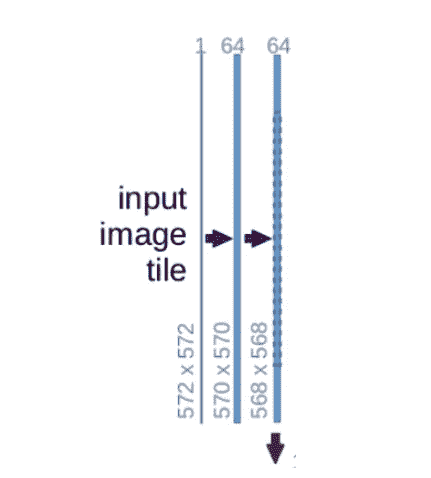*

*注意，每个块包括三个卷积层。在这篇研究论文中，输入是 572×572×1 的维数，它通过两次卷积得到 64 个通道。随着卷积过程的进行，通道数将从 1 → 64 变化。底部的红色箭头表示 2 x 2 最大池层，图像尺寸减半(568 x 568 到 284 x 284)。*

*这些类型的块重复三次，如下所示:*

*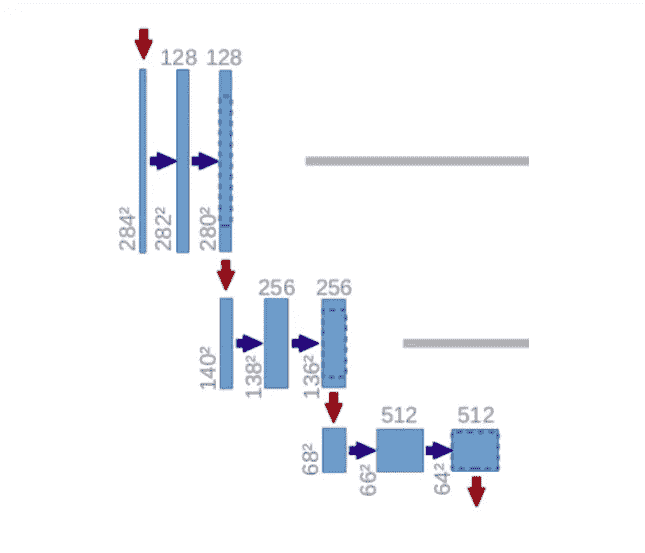*

*同样的代码是:*

```
*c2 = Conv2D(32, (3, 3), activation='elu', kernel_initializer='he_normal', padding='same') (p1)
c2 = Dropout(0.1) (c2)
c2 = Conv2D(32, (3, 3), activation='elu', kernel_initializer='he_normal', padding='same') (c2)
p2 = MaxPooling2D((2, 2)) (c2)c3 = Conv2D(64, (3, 3), activation='elu', kernel_initializer='he_normal', padding='same') (p2)
c3 = Dropout(0.2) (c3)
c3 = Conv2D(64, (3, 3), activation='elu', kernel_initializer='he_normal', padding='same') (c3)
p3 = MaxPooling2D((2, 2)) (c3)c4 = Conv2D(128, (3, 3), activation='elu', kernel_initializer='he_normal', padding='same') (p3)
c4 = Dropout(0.2) (c4)
c4 = Conv2D(128, (3, 3), activation='elu', kernel_initializer='he_normal', padding='same') (c4)
p4 = MaxPooling2D(pool_size=(2, 2)) (c4)*
```

*现在我们到达了没有最大池的底层。它也由两个卷积层组成。*

*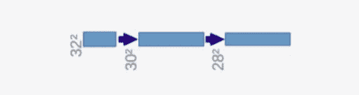*

```
*c5 = Conv2D(256, (3, 3), activation='elu', kernel_initializer='he_normal', padding='same') (p4)
c5 = Dropout(0.3) (c5)
c5 = Conv2D(256, (3, 3), activation='elu', kernel_initializer='he_normal', padding='same') (c5)*
```

*此时的图像尺寸已经调整为 28 x 28 x 1024。现在我们将走过广阔的道路。*

*U-net 的扩展路径的结构如下:*

*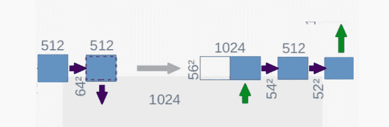*

```
*conv 2d_transpose -> concatenate -> conv layer1 -> conv layer2*
```

*扩展路径的第一部分是:*

```
*u6 = Conv2DTranspose(128, (2, 2), strides=(2, 2), padding='same') (c5)
u6 = concatenate([u6, c4])
c6 = Conv2D(128, (3, 3), activation='elu', kernel_initializer='he_normal', padding='same')(u6)
c6 = Dropout(0.2) (c6)
c6 = Conv2D(128, (3, 3), activation='elu', kernel_initializer='he_normal', padding='same') (c6)*
```

*如前所述，转置卷积是一种上采样技术。在转置卷积之后，图像从 28×28×1024→56×56×512 被放大，然后，该图像与来自收缩路径的相应图像连接在一起，并且一起形成大小为 56×56×1024 的图像。包含先前信息的原因是为了提高精确度。现在，它通过多次 4×4 的卷积。*

*这一部分再重复 3 次，如下所示:*

```
*u7 = Conv2DTranspose(64, (2, 2), strides=(2, 2), padding='same') (c6)
u7 = concatenate([u7, c3])
c7 = Conv2D(64, (3, 3), activation='elu', kernel_initializer='he_normal', padding='same') (u7)
c7 = Dropout(0.2) (c7)
c7 = Conv2D(64, (3, 3), activation='elu', kernel_initializer='he_normal', padding='same') (c7)u8 = Conv2DTranspose(32, (2, 2), strides=(2, 2), padding='same') (c7)
u8 = concatenate([u8, c2])
c8 = Conv2D(32, (3, 3), activation='elu', kernel_initializer='he_normal', padding='same') (u8)
c8 = Dropout(0.1) (c8)
c8 = Conv2D(32, (3, 3), activation='elu', kernel_initializer='he_normal', padding='same') (c8)u9 = Conv2DTranspose(16, (2, 2), strides=(2, 2), padding='same') (c8)
u9 = concatenate([u9, c1], axis=3)
c9 = Conv2D(16, (3, 3), activation='elu', kernel_initializer='he_normal', padding='same') (u9)
c9 = Dropout(0.1) (c9)
c9 = Conv2D(16, (3, 3), activation='elu', kernel_initializer='he_normal', padding='same') (c9)*
```

*现在，最后一步是重塑图像，以满足我们的预测要求。*

*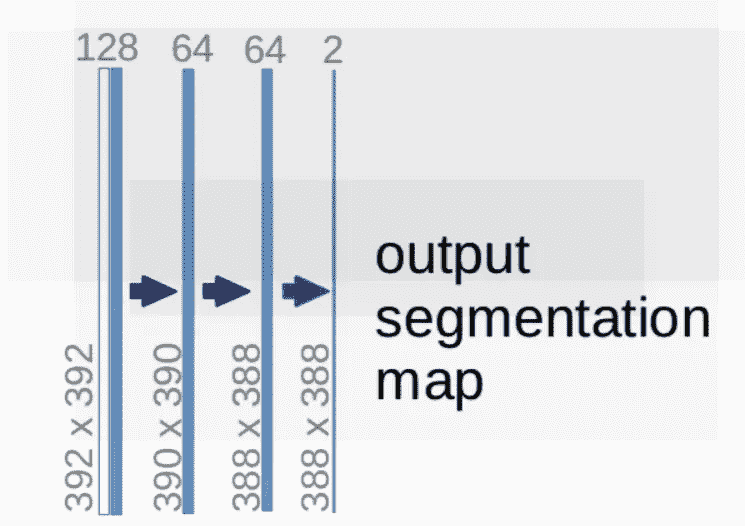*

```
*outputs = Conv2D(1, (1, 1), activation='sigmoid') (c9)*
```

*最后一层是卷积层，有 1 个大小为 1 x 1 的过滤器。剩下的神经网络训练也一样。*