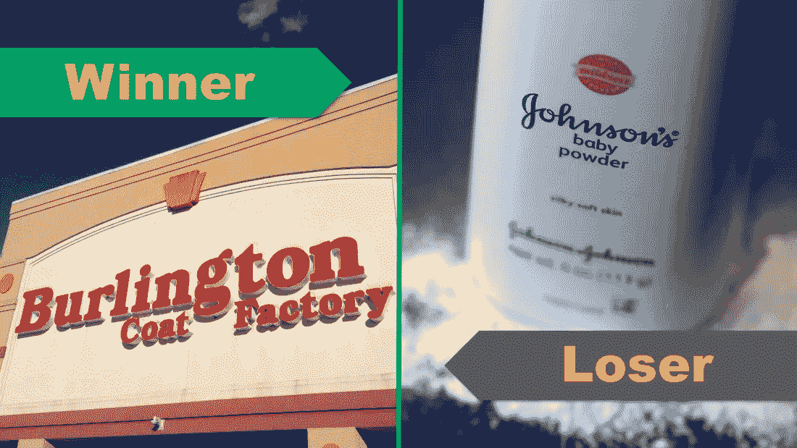

# 一个不太可能的赢家和一个真正的股市输家！

> 原文：<https://medium.datadriveninvestor.com/an-unlikely-winner-and-a-true-loser-of-the-stock-market-3a0b414fb7d1?source=collection_archive---------24----------------------->

上周，股市造就了太多的输家。从运营角度来看没有多少亏损的公司，从股价角度来看只是亏损的股票。连败如此突出，以至于很难找到赢家。但是，别担心，我们已经为你找到了一个赢家:

**伯灵顿百货公司(股票代码:BURL)**

伯灵顿！是的，你可能知道它叫伯灵顿大衣厂。让我告诉你一件事！把你手中的咖啡放在桌子上。准备好了吗？在过去的 5 年里，Burlington 的股票表现好于亚马逊和网飞。Burlington 商店每天的 5 年总回报率上升了 492%。同期，亚马逊上涨了 331.9%，网飞上涨了 423.7%。想想吧！当大多数投资者都在追逐科技股和杂草股时，Burlington 的人们却做得很好。虽然收入没有显著增长，但该公司的每股收益有所提高(部分原因是减税)。而且，如果你是一家不太被人谈论的小公司，算法会根据你的收入增长来挑选你。这就是这位成功赢家的故事。感谢来自[的市场愚弄播客](https://www.fool.com/podcasts/marketfoolery/2018-11-28-the-golden-equation/?utm_source=Weekly+Updates+by+Stock+Card&utm_campaign=2f7a5591f1-Stock_Card_Weekly_12_16_2018&utm_medium=email&utm_term=0_95923bd703-2f7a5591f1-&ct=t(Stock_Card_Weekly_12_16_2018))的克里斯·希尔，他让我们注意到了这位获奖者。

[请求 Burlington 商店的库存卡](https://stockcard.io/request)

**失败者:强生&强生(股票代码:JNJ)**

谁没看过[路透社](https://www.reuters.com/investigates/special-report/johnsonandjohnson-cancer/?utm_source=Weekly+Updates+by+Stock+Card&utm_campaign=2f7a5591f1-Stock_Card_Weekly_12_16_2018&utm_medium=email&utm_term=0_95923bd703-2f7a5591f1-&ct=t(Stock_Card_Weekly_12_16_2018))提到强生&的报道强生几十年前就知道它的婴儿爽身粉里含有石棉！哦不！婴儿爽身粉里没有！这是对公司品牌的重大打击。股价下跌了约 10%，公司市值损失了 400 亿美元。公司断然否认，我们现在正等着看真相是什么。如果事实证明这是正确的，公司将要失去的品牌价值可能不会很快恢复。就问[大众](https://stockcard.io/VLKAF?utm_source=Weekly+Updates+by+Stock+Card&utm_campaign=2f7a5591f1-Stock_Card_Weekly_12_16_2018&utm_medium=email&utm_term=0_95923bd703-2f7a5591f1-&ct=t(Stock_Card_Weekly_12_16_2018))或者 [BP](https://stockcard.io/BP?utm_source=Weekly+Updates+by+Stock+Card&utm_campaign=2f7a5591f1-Stock_Card_Weekly_12_16_2018&utm_medium=email&utm_term=0_95923bd703-2f7a5591f1-&ct=t(Stock_Card_Weekly_12_16_2018)) ！

[拜访约翰逊&现在约翰逊的股票卡](https://stockcard.io/JNJ)

你试过肉以外的东西吗？该公司计划很快上市，大多数股市投资者都想知道是否值得投资 IPO！我们深入挖掘了替代肉类市场，回顾了 Beyond Meat 的 S1 文件，并在最新一期的 Renegade Investors 播客中总结了所有信息。无论您在哪里收听播客，都可以收听:

 [## 当 Beyond Meat 即将上市时，你应该投资它吗？

### Beyond Meat 于 2018 年 11 月完成了其 S1 文件，这意味着该公司正准备上市…

renegadeinvestors.podbean.com](https://renegadeinvestors.podbean.com/e/ep-8-should-you-invest-in-beyond-meat-when-it-goes-public-soon/)