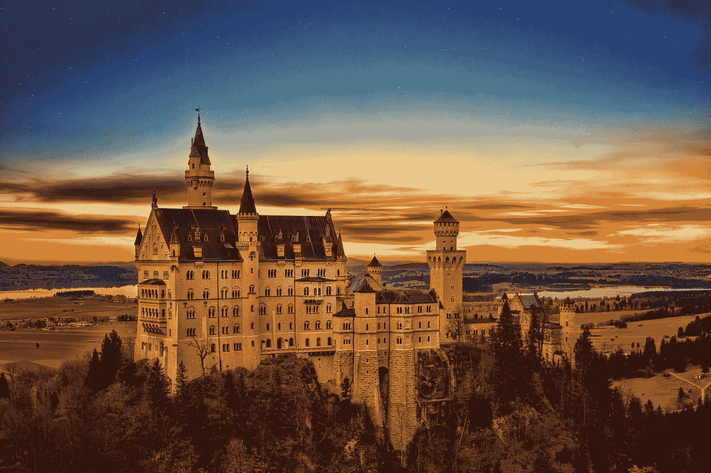

# 一场硬仗:投资文化在德国找到了对手

> 原文：<https://medium.datadriveninvestor.com/an-uphill-battle-investment-culture-finds-its-match-in-germany-b01cb6e0cdee?source=collection_archive---------27----------------------->

Photo by [Johannes Plenio](https://unsplash.com/@jplenio?utm_source=medium&utm_medium=referral) on [Unsplash](https://unsplash.com?utm_source=medium&utm_medium=referral)

***由克劳迪奥·布罗卡多和安东尼·克劳迪奥·布罗卡多***

这是我与朋友和家人合作的新方法的第二部分，以补充我自己的(诚然仍然相对贫乏的)知识库。继伟大的杰夫·丹尼斯之后，这一次是我的儿子安东尼作出了备受赞赏的嘉宾贡献。

安东尼全职工作，但业余时间热衷于地缘政治事务。在继续学习国际商业管理之前，他主修刑事司法，并且总是喜欢所有与政治有关的课程。他对政治发展的敏锐洞察力一再让我自惭形秽。

正如我之前所写的，很长一段时间以来，我决定远离政治，因为这个领域显然不在我的核心能力范围之内。在我看来，这是安东尼的。因此，我会不时向他寻求政治分析。与我截然相反的是，他认为英国退出欧盟公投和 2016 年 11 月的美国大选都按照它们最终的方式进行。在把它交给 Anthony 之前，我想分享一些关于最近德国新闻报道贝莱德(BLK)的想法。

最近几周，贝莱德比以往任何时候都更频繁地出现在德国媒体的头条……为什么？对于那些不熟悉德国政治的人来说，答案可能会相当令人惊讶。这并不是说 ETF 突然在大西洋彼岸风靡一时。通常情况下，当有坏消息(或坏消息的可能性，或可能被负面看待的事情)时，当一个国家或一家公司似乎成为另一个国家的头条新闻时。

不，这并不是说 BLK 有什么特别坏的消息。全球最大的资产管理公司登上头条的原因是，贝莱德(BlackRock)德国子公司董事长弗里德利希·默茨正在竞选 CDU(该党此前由德国总理安格拉·默克尔担任主席)的最高职位。

默克尔最近决定不在即将到来的 12 月 7 日 CDU 党代会上竞选连任*党*领袖(主席)。澄清一下，默克尔*是否打算完成她的德国总理任期，直到目前计划于 2021 年 10 月 24 日举行的下一次全国大选。*

取代默克尔成为 CDU 官方首脑的三个主要候选人是安妮特·克拉普-卡伦鲍尔(我知道她名字有点拗口，所以人们只知道她的首字母 AKK)、延斯·斯潘和弗里德利希·默茨。后者在 2009 年大选后离开了党的领导层，但安东尼对他有更多的了解。

历史上，我显然没有贬低交易所交易基金(ETF)的名声。我在 LinkedIn 上写过文章，既赞扬了他们，也强调了一些负面影响。我的 NPS(净正面得分)过程的一部分是注意到大多数问题总是有正面和负面，关键是评估*净*正面(或负面，视情况而定)。

*总的来说，我认为 ETF(BLK 业务的很大一部分)对金融市场是一个净利好，促进了大部分相关人群以低成本进入市场。*

贝莱德绝不是一家缺乏透明度的公司。尽管德国媒体称拉里·芬克(BLK 董事长兼首席执行官)“羞于抛头露面”，但他每年都会给首席执行官们写一封非常公开的信，在信中他呼吁改善企业责任、公司治理和长期思维，以及其他可能在德国受到赞赏的目标。此外，BLK 本身在纽约证券交易所上市，这也可以说是全球股票交易最透明的交易所之一。

我们看到德国媒体甚至称贝莱德为对冲基金。不幸的是，德国金融业的名声可能比美国还要差。特别是投资银行，一般的资本市场，特别是股票市场，并不一定是人们非常自豪地吹嘘的东西。

此外，最常与投资德国股市的*联系在一起的术语*相当于*投机，这一直让我恼火。这种颇有争议的文化特征使得默茨的候选资格在许多德国人眼中有些污点。目前领先的竞争者是 AKK。关于所有政治角度的更多信息，让我们转向安东尼。*

***安东尼·克罗迪奥·布罗卡多《弗里德利希·默茨小传》***

弗里德利希·默茨于 1955 年 11 月 11 日出生于北莱茵-威斯特伐利亚州的布里隆，在德国政坛崭露头角，于 2000 年至 2002 年担任德国联邦议院基民盟/基社盟议会党团的领导人，此前于 1994 年至 2009 年担任 CDU 联邦议院议员，代表北莱茵-威斯特伐利亚州东部的 Hochsauerlandkreis。默茨还涉足欧洲政治，在 1989 年至 1994 年间担任德国的欧洲议会议员。

默茨在波恩大学学习法律，1985 年完成学业后，成为德国萨尔州萨尔布吕肯市的一名法官。1986 年辞去这个职位后，默茨继续成为一名律师。默茨嫁给了同为法官的夏洛特，并与她育有三个孩子。默茨一家住在北莱茵-威斯特法伦州霍赫索尔兰区的阿恩斯堡，该镇靠近波鸿和多特蒙德市。

1989 年当选欧洲议会议员后，默茨在经济和货币事务委员会以及议会与马耳他关系代表团任职。在 1994 年的德国联邦选举中，默茨当选为联邦议院 Hochsauerland 的代表，并担任财政委员会成员。四年后，即 1998 年，默茨当选为副主席，两年后，即 2000 年，接替默克尔的亲密盟友、前财政部长、现任联邦议院议长沃尔夫冈·朔伊布勒(Wolfgang Schä uble)成为基民盟/基社盟议会党团主席。

在德国社会民主党(SPD)总理格哈德·施罗德(Gerhard Schrö der)的领导下，默茨担任了议会中的反对党领袖。从 2002 年到 2004 年，默茨被安格拉·默克尔取代为上述议会小组的领导人。因此，默茨将再次担任副主席，直到 2004 年。在此期间，默茨还在 CDU 执行委员会任职。2005 年至 2009 年，默茨在法律事务委员会任职。然而，在 2007 年，默茨决定宣布退出活跃的政治舞台，宣布他不会在 2009 年大选中竞选连任。

在他离开期间，弗里德利希·默茨担任了无数公司董事会的职位，包括科隆波恩机场、德国贝莱德、博世、德国汇丰银行、安盛、IVG Immobilien、斯塔德勒铁路、安永、温特图尔集团、多特蒙德足球俱乐部和德意志交易所等。

*2017 年 11 月，北莱茵-威斯特法伦州的部长主席，同样来自 CDU 的阿明·拉谢为默茨重新打开了积极政治的大门，选择任命他为英国退出欧盟和跨大西洋关系专员。*

德国总理安格拉·默克尔最近宣布她不再打算竞选基督教民主党(Christian Democrats)领导人的职位，这一德国最受欢迎的政党的最高职位之争迅速发展成为上述弗里德利希·默茨(他在总理宣布后几分钟就表示了他的竞选意图)与默克尔盟友 Annegret Kramp-Karrenbauer(俗称默克尔 2.0 或迷你默克尔)和现任卫生部长延斯·斯潘(Jens Spahn)之间事实上的三方竞争。 她传统上被视为默克尔在自己政党内的最大竞争对手之一，主要是因为他们在移民等核心问题上存在分歧。

随着三人组开始竞选，Kramp-Karrenbauer 迅速将自己定位为该职位的热门人选，而 Merz 和 Spahn 根据民意调查在第二和第三位置之间轮换。默茨经常受到攻击，因为在过去 9 年里，他很大程度上没有出现在政治前线，因此他不为大部分选民所知。此外，德国媒体已经瞄准了默茨与大企业的关系，这被用来反对他，他通常被描绘成一个富裕的精英，他试图以众所周知的“小人物”的潜在代价来进一步解放德国。人们尤其关注默茨与贝莱德的关系，德国主流媒体将贝莱德称为肆无忌惮、没有灵魂的资本主义的缩影。

随着贝莱德德国慕尼黑办事处在 11 月初作为税务欺诈调查的一部分被突击搜查，以及默茨最近关于他考虑在庇护问题上改变德国宪法的声明，默茨的机会似乎越来越渺茫，而不是更好；诚然，这是不幸的，因为随着欧洲政治变得越来越极端和两极化，欧盟可以说是站在悬崖边上，德国经济开始放缓，而关税威胁在大西洋彼岸隐约可见，德国非常需要一个真正的保守派来掌舵。