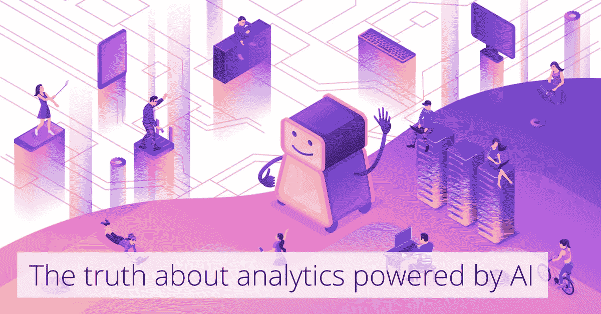

# “由人工智能驱动的分析”:这只是一个时髦短语吗？

> 原文：<https://medium.datadriveninvestor.com/analytics-powered-by-ai-is-it-just-a-buzz-phrase-6aa3d5889c0d?source=collection_archive---------5----------------------->

如今，人工智能一词被频繁使用，似乎市场上的每一个新平台和数字产品都拥有人工智能功能。

这种情况已经升级到某些宣传人工智能的[公司已经开始使用人类](https://www.theguardian.com/technology/2018/jul/06/artificial-intelligence-ai-humans-bots-tech-companies)(也被称为“复古智能”)来完成他们所谓的人工智能技术的工作。

在这种数字气候下，人们可能很难相信“人工智能”提供的价值，即使这是真实的交易，公司也往往对其工作方式含糊其辞。

那么，你真的需要人工智能来驱动你的分析平台吗？我决定写这篇文章来分解人工智能是如何被用来推动数字采用平台(DAP)和改善用户体验的。

[***了解数字采用平台如何促进您的业务发展。***](https://www.walkme.com/pages/adoption-corporate-2-software-simplify/?t=19&eco=ux&adin=powered-by-ai-buzz-phrase-ll01&land=adoption-corporate-2-software-simplify&pitch=Adoption-Promotion)

**分析为基于网络的平台的性能提供了难以置信的可见性**

如果你拥有一个数字平台或网站域名，你对分析平台很熟悉。分析可以为我们的网络平台提供有价值的见解，例如:用户来自哪里，最常访问的页面，最常使用的功能，被忽略的功能，它们甚至可以帮助绘制客户旅程。

但是，唉，分析平台是不够的。

为了理解人工智能在当今商业平台中扮演的角色，让我们来看看这些平台之间的差距。

**分析系统帮助我们定位问题领域，但无助于解决根本问题**

我们举一个常见的例子:作为平台所有者，你使用分析平台来监控和优化你的用户行为。您登录系统，注意到平台上的一个重要特性显示使用率很低。

为了解决这个问题，你可以通过操作页面的用户界面来增加这个特性的曝光率——比如移动按钮或者改变它的颜色来吸引用户的注意。

几周后检查我们的分析系统，您可能会遇到一些事情:

1.  增加了该功能的流量
2.  另一个重要功能的使用减少了

现在怎么办？重复这一过程需要对平台进行进一步的更改，但不能保证效果是积极的。操作一个网络平台是一个非常昂贵的过程，需要一个技术专家团队。

但最重要的是，你不希望通过调整平台的各个方面来扰乱用户流。这可能会导致[用户困惑和流失](https://blog.walkme.com/customer-experience-mistakes/?t=20&para1=SMM)。

**我们需要的不仅仅是洞察力，而是*可操作的*洞察力**

我想介绍一个重要的概念——我们称之为*可操作的见解*，意思是提供明确的行动建议的见解。

**洞察#1:查看用户的地理分布，您会发现在某个区域存在差距。**

你可以检查营销策略——也许没有足够的资源分配给开展活动的团队，或者你针对这个国家或地区的方式没有与目标受众沟通。

通过增加预算和解决该地区的具体问题，你可以努力增加该地区的交通问题。这种洞察力天生具有可操作性。

**洞察 2:您的平台已经检测到，大多数流失的用户都是在第三次访问时流失的。**

这是一个强大的洞察力。不是每个分析系统都能给出这种反馈。但是这是可行的吗？让我们稍后回到这一点。

**数字采用平台，将可行的见解付诸行动的工具**

数字采用平台(DAP)是一个工具箱，可以增强您的网络平台。如果你不熟悉这一类的数字辅助工具，这篇星座研究摘要将帮助你快速上手。

我在这篇文章的开头谈到了你可以对你的平台做出的改变。一个好的 DAP 应该提供在不接触平台代码的情况下执行这些调整的能力。如果你的目标是把更多的注意力吸引到一个表现不佳的功能上，你有一系列的选择来满足我们的目的，而不会扰乱页面的流动。

使用 DAP，您还可以按用户进行细分，只为特定用户添加更改，而不会干扰其他人的体验。但最重要的是，**数字采用平台拥有将我们自己的网络平台上的几乎任何见解转化为可操作的见解的所有能力。**

**人工智能如何提升平台性能**

还有一种类型的洞察力我们还没有讨论:基于人工智能的洞察力。通过将机器学习应用到您的平台，您可以收获更深入、更有意义的见解。

还记得**洞察#2** ，关于用户第三次访问时流失的例子吗？

这种类型的洞察力通常是高级分析和技术能力的产物，如人工智能。现在让我们尝试使用 DAP 工具的可操作性来解决它。

# 借助 DAP 功能减少用户困惑和流失

你有什么选择？

1.  当你的用户第三次来到我们的平台时，你可以给他们一些帮助或指导。然而，如果指导过于基础，没有解决问题的根源，它将无法阻止他们翻腾。
2.  您可以创建一个弹出窗口，为用户提供我们产品的折扣。然而，对于每三个客户来说，这样做可能会让我们付出很高的代价。

这不是一个容易解决的问题，即使有 DAP 的强大功能。

但是如果你从一个完全不同的角度看问题，你可能会意识到洞察力本身正在限制我们。不止一个参数可能影响用户是否可能流失。

在真实的使用案例中，数十个甚至数百个其他参数可能会影响用户的体验:访问次数、每次访问的时间长度、他使用的不同功能的数量、功能误用、错误甚至花在支持上的时间。

了解每个参数可能有助于产品负责人了解用户在使用平台时的真实想法，但最终，它们都只是指标。我们真正想要的是用户的具体反馈。

**人工智能的真正含义是一个监控*所有这些参数*并使用总和来预测我们用户行为的系统**。*他们会流失吗？他们会买吗？他们需要一些指导吗？*

归根结底，这些才是你作为网络平台所有者真正关心的问题。如果你知道很多用户对你的产品总体上很满意，你可能不在乎他们不使用我们的功能。

如果你没有整合基于人工智能的洞察力，你就没有利用人工智能的真正潜力

当你把 AI 集成到你的 DAP 中会发生什么？所有这些问题都可能变得微不足道。如果 DAP 系统本身给了我们提问的权力，比如，*这个用户有可能流失吗？用户是否需要此功能的帮助？然后你可以决定在这些特定的时刻采取行动，只针对那些特定的用户。*

如果手动你只能通过几个参数细分，人工智能通过一次点击几十个不同的参数来细分你的用户。不仅如此，每个参数都是动态的——随着时间的推移学习用户的行为。

**当你的 DAP 由 AI 驱动时，你可以让你的用户觉得你的平台真正*理解*他们。他们甚至不再需要问问题，因为无论何时何地，他们都会得到正确的答案。**

**闭环**

我发现“闭环”这个词是对人工智能如何驱动 DAP 的最好描述。

**第一步。**通过 AI 洞察发现相关问题

**第二步。**使用 DAP 工具处理和解决问题

**第三步。**通过人工智能引擎提供实时解决方案

**回到步骤 1:** 随着我们的用户和平台的发展，发现其他问题

我相信，由人工智能驱动的 DAP 是网络行业的未来，可以处理和解决网络平台可能存在的几乎所有问题。毫无疑问，它将很快成为每个平台所有者的必备工具。

[***使用人工智能和机器学习在任何软件上为您的用户赋能。***](https://www.walkme.com/pages/software-corporate-3-simplify-enterprise-software/?t=19&eco=ux&adin=powered-by-ai-buzz-phrase-ll02&land=software-corporate-3-simplify-enterprise-software&pitch=Adoption-Promotion)

*原载于 2018 年 7 月 31 日*[*blog.walkme.com*](https://blog.walkme.com/analytics-powered-by-ai-is-it-just-a-buzz-phrase/?t=20&para1=SMM)*。*