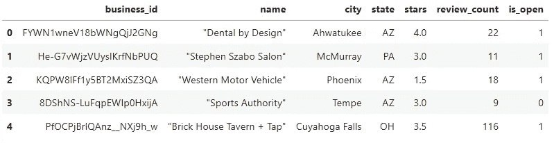
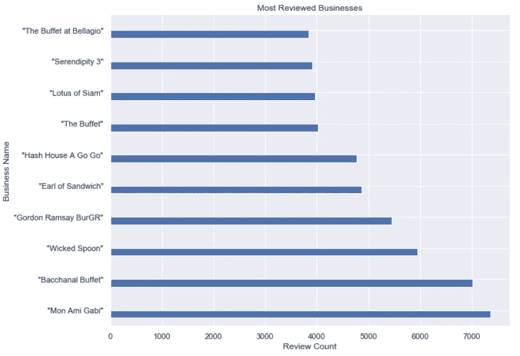
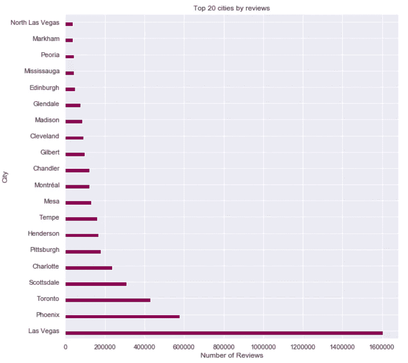
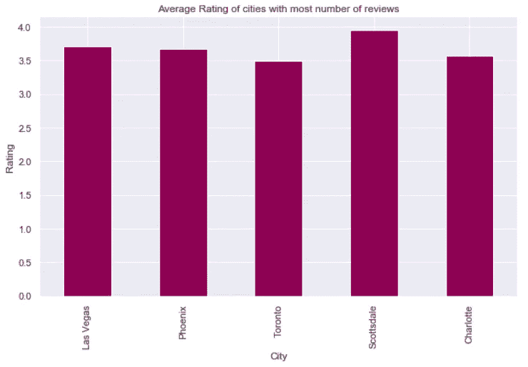
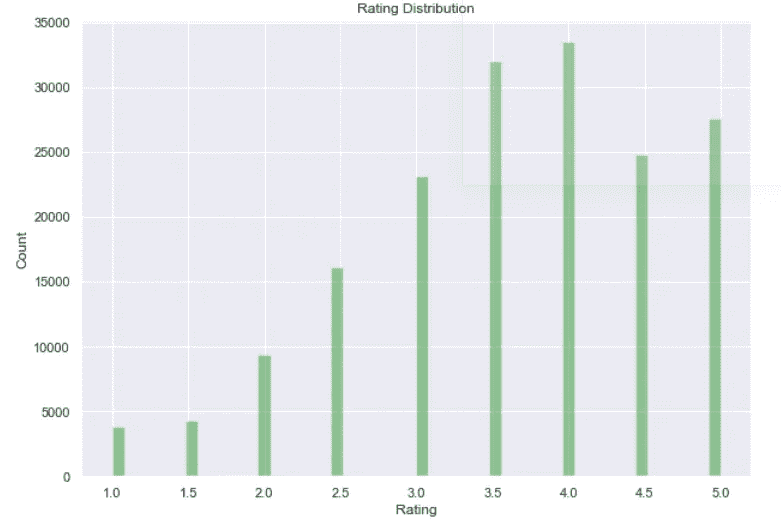

# 使用 Dask 分析大数据

> 原文：<https://medium.datadriveninvestor.com/analyzing-big-data-with-dask-a05a8798da8c?source=collection_archive---------1----------------------->


“Time moves in one direction, memory in another” — **William Gibson**

# 介绍

数据科学家经常用熊猫来处理数据框。虽然 Pandas 非常适合中小型数据集，但大型数据集就有点问题了。在本地机器上处理大型数据集可能会导致最简单的机器学习任务的机器发热。虽然 Pandas 和 Numpy 是很棒的库，但它们并不总是计算高效，尤其是当有数 TB 的数据要处理时。那么你能做些什么来绕过这个障碍呢？

## 达斯克来救援了。

Dask 是一个开源框架，为 Numpy 数组、Pandas 数据帧和常规列表提供高级抽象，允许我们部署并行操作，以完全利用我们的多核机器的能力。Dask 是一个用于延迟任务计算的库，在其核心使用有向非循环图来利用并行计算的能力。


Dask’s DAG (Directed Acyclic Graph) in execution

> **Dask 本机扩展 Python…** *它提供高级数据结构，如 Dask Array、Bag 和 dataframes 集合，可扩展 NumPy 和 Pandas 工作流，使它们能够在不适合主内存的大型数据集上并行操作*

## Dask 数据帧

Dask 数据帧协调许多 Pandas 数据帧，沿着索引进行分区。它扩展了 pandas 工作流，使其能够应用于时间序列预测、商业智能和大数据上的一般数据管理。Dask dataframe 与 pandas dataframe 具有相同的 API，除了聚合和*应用操作*被延迟评估，并且需要通过调用 *compute* 方法来计算。建议将数据帧划分为与您的计算机拥有的内核数量一样多的内核，或者是该数量的几倍，这样每个分区将在不同的线程上运行，并且线程之间的通信可以很容易地进行。


Dask Dataframe incorporating many Pandas Dataframes

## 变脏——动手吧！

在本文中，我们将分析 Yelp 在 [Kaggle](https://www.kaggle.com/shikhar42/yelps-dataset) 上提供的商业评论数据集。数据集大小为 4 GB，不可能使用 pandas dataframe 来分析此数据，因为 pandas dataframe 将所有数据存储在主内存中，这将导致系统崩溃。因此，我们将使用 Dask dataframe，它虚拟地将数据集分成小块，使得在本地机器上分析数据变得可行。

[](https://www.datadriveninvestor.com/2019/01/25/why-data-will-transform-investment-management/) [## 为什么数据将改变投资管理|数据驱动的投资者

### 有人称之为“新石油”虽然它与黑金没有什么相似之处，但它的不断商品化…

www.datadriveninvestor.com](https://www.datadriveninvestor.com/2019/01/25/why-data-will-transform-investment-management/) 

## 准备数据集

让我们获取数据进行分析:

```
import dask.dataframe as dd
df = dd.read_csv('yelp_business.csv',blocksize=64000000)
df = df.iloc[:,[0,1,4,5,9,10,11]]
```

注意，`read_csv`函数与 Pandas 函数非常相似，除了这里我们指定了每个块的字节大小。我们的数据将看起来像:



现在，我们有了 dask delayed dataframe 对象，它将在执行 groupby、aggregation 等操作时创建有向非循环图。它将通过`.compute`命令执行。注意，用 Dask 对列值进行排序并不容易(毕竟，数据是一次读取一个块)，所以我们不能像在 Pandas 示例中那样使用`sort_values()`方法。相反，我们需要使用`nlargest()` Dask 方法并指定我们想要确定的最高值的数量。

## 评论最多的企业

在这一步中，我们根据评论数计算出排名靠前的企业，并以条形图的形式显示出来。找出评论最多的企业会给我们一个特定企业的在线存在及其受欢迎程度的指示。这也表明了坚实的业务拓展和营销战略。

```
##Selecting top 10 businesses based on review count
most_reviewed_business_dask = df[['name', 'review_count', 'city',\ 'stars']].nlargest(10, "review_count")
##Visualizing most reviewed businesses through Barplot
most_reviewed_business_dask.set_index('name',sorted=True).compute()\.plot(kind='barh',stacked=False, figsize=[10,8], legend=False)
#######
plt.title('Most Reviewed Businesses')
plt.xlabel('Review Count')
plt.ylabel('Business Name')
plt.show()
```



## 拥有最多企业的城市

在这一步中，我们找出了容纳最多企业的城市。它标志着稳定的地方政府的存在，其政策有利于在城市内做生意。它还表明了城市为企业成长和繁荣提供的基础设施和商业生态系统的存在。

```
###Arranging cities with decreasing business counts
city_business_counts_dask = df[['city', 'business_id']].groupby(['city'])['business_id'].agg('count')
##Visualizing top 20 cites by businesses listed
city_business_counts_dask.nlargest(20).compute().\
plot(kind='barh', stacked=False, figsize=[10,10], colormap='hsv')
######
plt.title('Top 20 cities by businesses listed')
plt.ylabel('City')
plt.xlabel('Number of Businesses')
plt.show()
```


## 评论最多的城市

在这一步中，我们继续了上述分析，我们找到了拥有最多企业的城市，此外，我们还根据点评数找到了排名靠前的城市。这一分析表明了该城市的识字率、其人民的上网情况以及支持互联网通信的基础设施的可用性。

```
##Selecting Cities with most reviews
city_business_reviews_dask = df[['city', 'review_count', 'stars']].groupby(['city']).\
agg({'review_count': 'sum', 'stars': 'mean'})
##Visualizing top cities based on reviews
city_business_reviews_dask.nlargest(20,'review_count').compute()\
.plot(kind='barh',stacked=False,figsize=[10,10],colormap='PiYG', legend=False)
#######
plt.title('Top 20 cities by reviews')
plt.ylabel('City')
plt.xlabel('Number of Reviews')
plt.show()
```



## **大多数受评城市的平均评分**

在上述分析的基础上，我们发现了基于商业评论的前五大城市的平均评级，这可以作为确定特定城市内做生意难易程度的标准衡量标准。

```
city_business_reviews_dask.nlargest(5,'review_count')['stars'].compute()\
.plot(kind='bar',stacked=False,figsize=[10,6],colormap='PiYG', legend=False)
plt.title('Average Rating of cities with most number of reviews')
plt.xlabel('Rating')
plt.ylabel('City')
plt.show()
```



## 收视率分布

在这一步中，我们已经计算出了 Yelp 商业评论数据集中的评分分布，并以柱状图的形式绘制出来。

```
import seaborn as sns
plt.figure(figsize=(10,7))
sns.distplot(df['stars'].compute(),kde=False,color='green',\
vertical=False)
plt.xlabel('Rating')
plt.ylabel('Count')
plt.title('Rating Distribution')
plt.show()
```



这是关于如何使用熟悉的 pandas 语法在 dask 中分析大数据以及通过部署并行计算来利用多核机器的能力的小介绍。当**熊猫**说**TL；博士→去找达斯克！！**

如果你想了解更多，或者想让我写更多关于这个主题的东西，请随时联系…

我的社交链接:[LinkedIn](https://www.linkedin.com/in/shubhamsaboo/)|[Twitter](https://twitter.com/Saboo_Shubham_)|[Github](https://github.com/Shubhamsaboo)

如果你喜欢这篇文章或觉得它有帮助，请花一分钟按一下拍手按钮，它增加了这篇文章对其他媒体用户的可见性。

## 参考

1.  https://docs.dask.org/en/latest/
2.  [https://towards data science . com/trying-out-dask-data frames-in-python-for-fast-data-analysis-in-parallel-aa 960 c 18 a 915](https://towardsdatascience.com/trying-out-dask-dataframes-in-python-for-fast-data-analysis-in-parallel-aa960c18a915)
3.  [https://pythondata.com/dask-large-csv-python/](https://pythondata.com/dask-large-csv-python/)
4.  [https://towards data science . com/how-to-hand-large-datasets-in-python-pandas-dask-34f 43 a 897d 55](https://towardsdatascience.com/how-to-handle-large-datasets-in-python-with-pandas-and-dask-34f43a897d55)