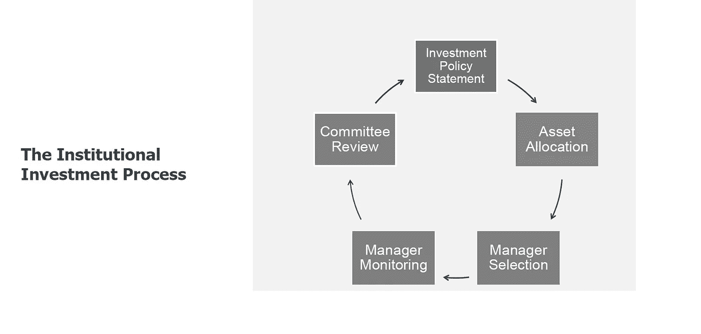

# 透过金融集团的玻璃透镜分析基金管理行业

> 原文：<https://medium.datadriveninvestor.com/analyzing-the-fund-management-industry-through-the-glass-lens-of-fintuple-dbfdda7c248?source=collection_archive---------9----------------------->

Photo by [Paul Skorupskas](https://unsplash.com/@pawelskor?utm_source=medium&utm_medium=referral) on [Unsplash](https://unsplash.com?utm_source=medium&utm_medium=referral)

截至 2018 年底，印度基金管理行业(包括公共和私人市场)的 AUM 已超过 750 亿美元，这还不包括 20 倍于此的共同基金行业。

然而，该行业在其发展过程中具有非常独特的动力，关于该行业、管理人员、定性和定量措施的信息一直保持孤立状态，信息不对称程度很高。从历史背景来看，该行业与 90 年代末的美国市场非常相似。

AIF(另类投资基金)市场以及 PMS 市场(由积极管理的私人和公共市场组成，涵盖各种资产类别)继续以每年 25%以上的健康速度增长，换句话说，我们正在谈论 10 年内 1 万亿美元的 AUM。尽管绝对数字可能令人望而生畏，但我个人认为，这是市场的自然进程，同时也是财富创造的过程。

 [## 投资区块链前要问的三个简单问题(也是一个困难的问题)|数据…

### 现在是了解区块链的最佳时机。不同货币之间的增长率，比如…

www.datadriveninvestor.com](https://www.datadriveninvestor.com/2020/03/12/three-simple-questions-and-one-difficult-one-to-ask-before-investing-in-a-blockchain/) 

虽然该行业正以新的兴趣增长，但该行业中存在的数据很少。例如，很少有人知道投资基金的基金经理、他们过去的表现、关于基金和基金经理历史的定性信息、其在不同时期的表现，以及产生回报的风险的定量度量。虽然作为一个行业，我们需要新的资金池进入印度，但在资本进入之前，理解透明度和数据是必要的第一步，这很重要。

(例如:如果 Standord endowment 必须有一个专门的印度战略，支持这一战略的数据应该让情况变得明显——不幸的是，我们今天离这一目标还很远)。

A typical Institutional Investment Process

考虑到我们希望解决的问题和我们面前的机遇，我们一直在努力将 Fintuple(一个基金平台生态系统)投入使用，目标是 2019 年 1Q。

# *谁或什么是*的最终目标

通过 Fintuple，我们的目标是在技术的帮助下，为投资带来一种数据驱动的方法。我们本质上永远是一家技术公司，承担着为资产管理行业带来数据和透明度的受托责任。最核心的是我们将代表的基金经理、基金公司和资产管理公司，以确保行业做到以下几点:

1.  使监测定期、一致和频繁。
2.  不要只看回报
3.  评估定性因素
4.  比较经理和基准与他们的分配

在投资者方面，我们希望通过家族理财室、基金的基金、单一家族理财室、私人银行和财富管理公司来实现这些数据。通过我们的平台，我们旨在确保最终投资者围绕其投资进行无缝数据集成，从而使行业拥有更高质量的长期管理资产。

Fintuple 的创始人在金融和技术领域拥有超过 35 年的经验，并得到了美国最大的资产管理公司的支持。我们的团队在不断壮大，我们对自己的工作空间感到兴奋。

我是 Fintuple Technologies 的联合创始人，也是独立资产管理公司 Itus Capital 的创始人，该公司负责管理印度股票市场的资金。