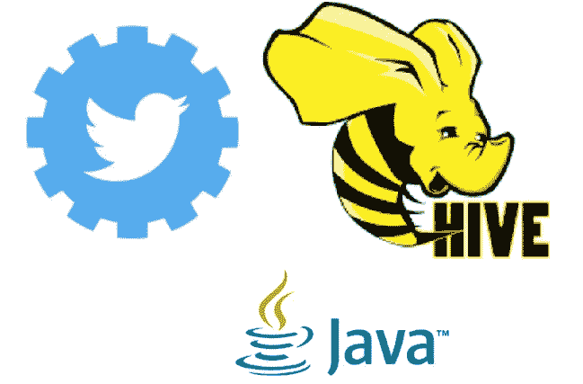
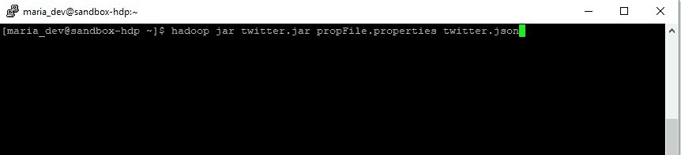
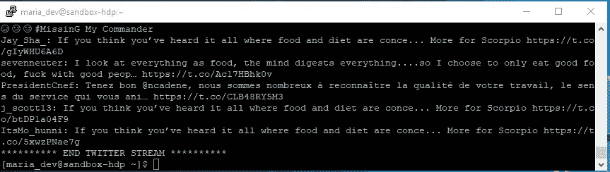
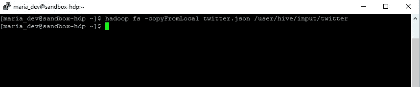
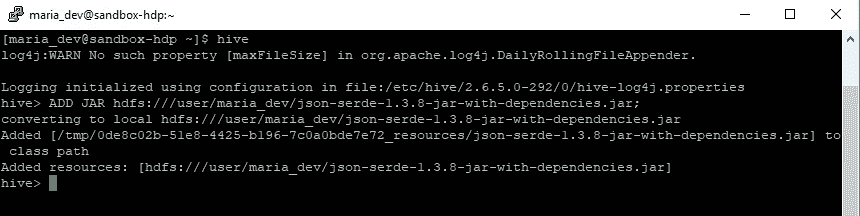
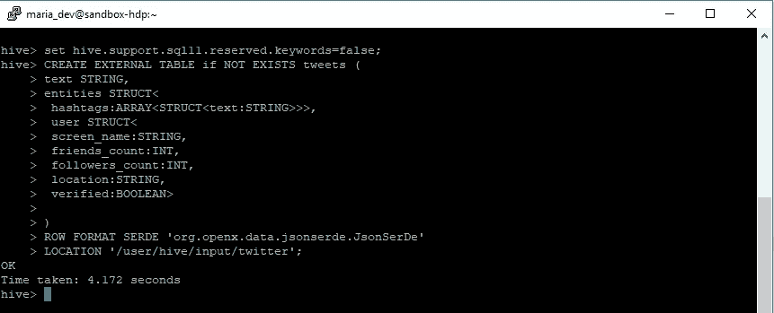
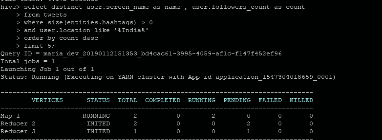
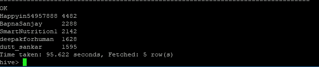

# 使用 Hive 分析 Twitter 订阅源

> 原文：<https://medium.datadriveninvestor.com/analyzing-twitter-feeds-using-hive-7e074025f295?source=collection_archive---------2----------------------->

在这篇文章中，我们将分析 twitter feeds，找出在我们地区与食物相关的话题上有影响的人。

“有趣的结局！!"

我们将使用以下组件
- Java 应用程序访问 twitter API 并下载用于 JSON 格式分析的 tweets
-Apache Hive 使用自定义 SerDe 读取用于分析的 JSON 数据

这篇文章的重点是第二点，即使用 Hive 来读取 JSON，源代码击中 twitter 的 API 是可用的。

**Technology Stack**

如今生成的数据并不总是结构化的，即以简单的逗号分隔的平面文件形式存在，我们会生成非结构化和半结构化的数据。
社交网站每天产生大量数据，在这个用例中，我们将分析可以 JSON 格式下载的 twitter 数据

JSON 是一种广泛使用的存储和传输数据的格式，它属于半结构化数据的范畴。

Twitter 每天生成超过 5 亿条推文，这些数据可用于提取有用的见解并获得竞争优势。

**先决条件:**
——一个 Twitter 开发者账户(说明[此处](https://docs.inboundnow.com/guide/create-twitter-application/))
——访问一个 Hadoop 集群

**注意:**本文假设您了解 Hadoop、Hive，并对调用 twitter API 有非常基本的了解。

# **第一部分:下载推文**

下载 tweets 的 Java 代码可以在下面的 Git 资源库中找到

Twitter.jar 接受两个参数，第一个是包含 ConsumerKey、ConsumerSecret、AccessToken、AccessTokenSecret 和 **TwitterKeywords 的属性文件(这是一些与食物相关的关键字，我们希望根据这些关键字过滤我们的推文)，第二个是输出 JSON 文件**

 [## cdamak/Twitter-Hive

### 使用 twitter API 下载 tweets 的 Java 应用程序，将 JSON 结构映射到 Hive 列

github.com](https://github.com/cdamak/Twitter-Hive) 

**注意:** Twitter.jar 和属性文件应该出现在您的 Hadoop 集群的本地文件系统上，而不是 HDFS 文件系统上。

**步骤 1:**
通过运行 twitter.jar 下载 Twitter 数据

hadoop jar twitter.jar propFile.properties twitter.json

这段代码将下载食物相关的推文 5 分钟，然后自动关闭

**第二步:**将 Twitter.json 文件从本地复制到 HDFS

hadoop fs -copyFromLocal twitter.json /user/hive/input/twitter

# 第 2 部分:分析 Twitter 数据

为了将 JSON 文档映射到 Hive 列，我们将使用 SerDe(序列化器/反序列化器)

SerDe 允许 Hive 从一个表中读入数据，并以任何定制格式写回 HDFS。简单来说，SerDe 是定制的 Java 代码，它帮助我们将 JSON 文档中的键映射到相应的 Hive 列。

**注意:**不同的 Hadoop 发行版都有自己的自定义 SerDe，可用于解析与其版本兼容的 JSON 输入。

我在这个演示中使用了一个 HortonWorks 虚拟映像，并且我已经下载了兼容的 SerDe 用于我的安装，它位于我的 [Git 存储库中。](https://github.com/cdamak/Twitter-Hive)

**第一步:**添加罐子

ADD JAR hdfs:///user/maria_dev/json-serde-1.3.8-jar-with-dependencies.jar;

**步骤 2 :** 关闭将 Hive 关键字用作列名的限制

*设置 hive . support . SQL 11 . reserved . keywords = false；*

**步骤 3 :** 使用自定义 SerDe 创建配置单元表

**第四步:**查询 tweets 数据，寻找你所在地区的美食主题的影响者！

输出:

耶！！我们发现了一个与食物相关的影响者推文，当然需要定期收集和分析数据以获得更好的结果！

**配置单元命令**

我希望你喜欢这篇文章，请在下面的评论中告诉我你的想法。

领英:[https://www.linkedin.com/in/karan-dama](https://www.linkedin.com/in/karan-dama-46234957/)