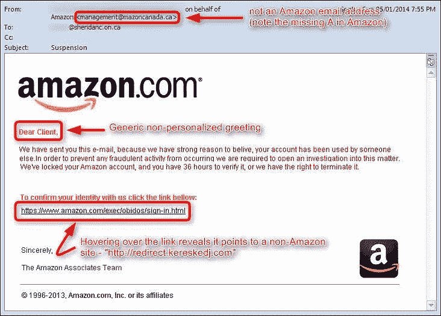
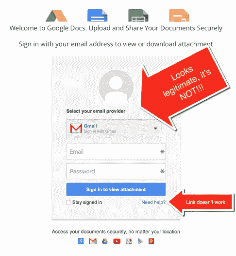
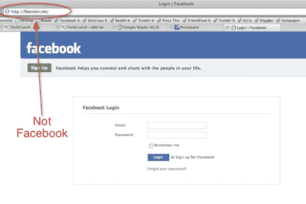
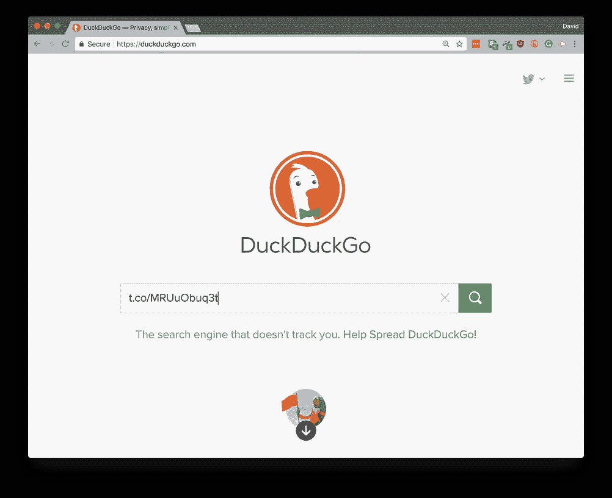
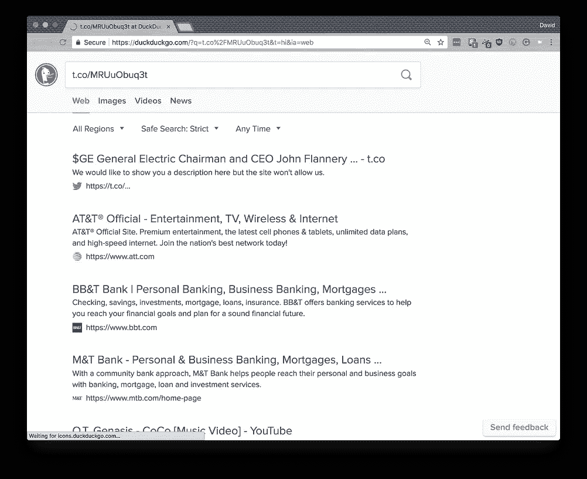
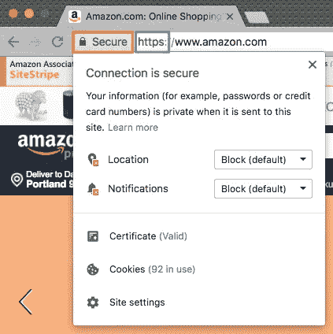

# 剖析网络钓鱼骗局

> 原文：<https://medium.datadriveninvestor.com/anatomy-of-a-phishing-scam-388fb0377f4a?source=collection_archive---------0----------------------->

## 如何避免被自动化的黑客大军所欺骗

THIS GUY just clicked on an email he shouldn’t have… Photo: [Ayo Ogunseinde](https://unsplash.com/@armedshutter?utm_source=medium&utm_medium=referral) on [Unsplash](https://unsplash.com?utm_source=medium&utm_medium=referral)

## 第一部分:识别问题

“网络钓鱼”是欺骗不知情的人自愿放弃他们最敏感的数据——用户名、密码、社会安全号码、出生日期等等——通过[伪装他们的通信请求看起来是真实的](http://www.phishing.org/what-is-phishing)。鉴于数字化复制一家公司的官方沟通模板是多么容易，这个问题实际上比你想象的要糟糕得多。黑客或“黑帽”黑客利用计算机的能力自动发送网络钓鱼诈骗。*每天都有数以亿计的网络钓鱼邮件被发送，而只有一小部分人需要为系统工作才能获得回报。并且得到了回报。*

*   2016 年，[85%的组织遭受过网络钓鱼攻击，30%的网络钓鱼邮件被打开](https://blog.barkly.com/phishing-statistics-2016)。
*   2017 年，[假发票电子邮件飙升，首席执行官欺诈电子邮件总计损失 50 亿美元，针对填写 W-2 表格的人的钓鱼电子邮件增加了 870%。](https://blog.barkly.com/phishing-statistics-2017)
*   2018 年，[假发票成为分发恶意软件的头号伪装，Dropbox 钓鱼诈骗激增，DocuSign 引诱最有效。](https://blog.barkly.com/phishing-statistics-2018)

不够？以下统计数据会让你大吃一惊:

> 截至 2017 年底，平均每个用户每月收到 16 封恶意邮件。
> 
> —赛门铁克，来自该公司的 [2018 年互联网安全威胁报告](https://www.symantec.com/security-center/threat-report)

鉴于现在的数字世界如此糟糕，我认为是时候让人们知道如何最好地保护自己免受这种黑客攻击了。

## 第二部分:电子邮件中的网络钓鱼

Just because something looks familiar, doesn’t mean that it is.

大多数钓鱼攻击都是为了非常好地做一件事:*忽悠你。*具体来说，它们旨在欺骗你，让你以为你在上网做你平常会做的事情，比如登录脸书、亚马逊、谷歌或苹果。狡猾的设计是为了让你相信你正在登录你的银行或信用卡网站。

当然，问题是你并没有*真正做这些事情:相反，你登录的只是*看起来像*你最喜欢的社交媒体或金融网站，并且在没有意识到的情况下，向黑客运营的“前台”网站提供你的用户名和密码，这些黑客收集你的数据并利用它来利用你和其他人。*

上图是典型网络钓鱼攻击的三个例子。但这些只是网络上的例子:让我给你看一些我自己邮箱里的东西，好吗？这是我昨天刚得到的幸运的东西:我中奖了！来自谷歌，不多不少！我把图像放大了，所以你可以看到一些明显的迹象，表明这是一次网络钓鱼攻击。你会注意到我使用了 Gmail 中的按钮——在左上角的红框中——它允许你“显示”你收到的任何邮件的详细信息。

*   **Strike 1:** 在顶部的绿色框中，您会注意到实际的电子邮件地址看起来不可识别，也不像是有效的谷歌电子邮件地址。红旗！
*   **Strike 2:** 在中间的粉色方框中，你会注意到这个网址看起来不标准，不可识别，也不为人所知。红旗！
*   **第三击:**在橙色框中，你会注意到无论是谁发送了这封邮件，都没有正确的语法证明。企业邮件很少出现这种情况。红旗！
*   **Strike 4:** 在蓝框中，你会注意到发送这封邮件的网站上有单词“bounces”。
*   **Strike 5:** 当我将网站复制粘贴到 DuckDuckGo 中查看它是否是有效的谷歌网站时，我清楚地看到(下图)它不是。

**最终分析:**我没有点击*这封邮件提供的任何东西*。

## 第三部分:使用“最佳实践”防止通过电子邮件进行网络钓鱼

以下是您应该实施的规则(或最佳实践),以帮助防止网络钓鱼攻击:

1.  **始终确认*每封*电子邮件都来自一个有效的、已知的或可识别的电子邮件地址。**电子邮件上显示的姓名并不能准确反映真实的发件人:*一定要反复检查实际的电子邮件地址是否正确。*网络钓鱼攻击有时会包含我们认识的人的名字，因为他们(或我们)的地址簿已经受损。然后，这些真实姓名与伪造的电子邮件地址配对，试图欺骗我们。如果任何电子邮件地址是未知的或奇怪的，发送到垃圾邮件。不要担心丢弃重要的东西:你生命中重要的人知道如何通过其他方式联系你。
2.  **在没有首先确认 URL 是有效的、已知的、标准的或可识别的网站之前，不要点击*任何*电子邮件中的*任何*链接。**右键点击任意链接，弹出上下文菜单进行复制；然后将其粘贴到文本编辑器中。如果链接看起来无效、不为人知、不标准或不可识别:扔掉电子邮件或将其发送给垃圾邮件。如需更多信息，请在 [DuckDuckGo](https://duckduckgo.com/) 上搜索网址，确认它已被有效的搜索引擎编入索引并为其所知。
3.  **不要打开*任何*发自*任何*人的电子邮件附件，如果你没有预料到的话。**你的同事告诉你，她将把你参与创作的新软件应用程序的代码发送过来。太好了！你知道它要来了，并且有理由期待它出现在你的收件箱里。有人给你发了一个微软 Word 文档，说“看看这个！”？不要打开那个附件。相反，给对方发短信或打电话，确认他们已经给你发了那个特定的附件。
4.  **务必确认*您从*任何*在线服务收到的任何*电子邮件都是有效的。**收到 Dropbox、亚马逊或苹果的邮件，要求你登录账户？没问题:首先证明邮件是有效的。检查 URL、发件人电子邮件地址和主题行是否有任何可疑之处。如果您仍然不确定，请通过他们已知的有效网站登录该服务。
5.  **仅点击任何包含“https://”中的“s”的电子邮件链接。**s 表示您与该网站的通信是安全的，并且有安全证书作为支持。这些证书本身可能是伪造的，但这表明该网站可能是有效的。点击大多数浏览器中的“安全”指示器(这里显示的是 Chrome ),就会显示这个证书。

An example of a secure site with a valid Certificate.

上面的一些建议会让你烦恼——有些轻微，有些更严重——因为它们会让电子邮件变得不那么方便。我不会为此道歉:没有安全保障的便利等于危险，这是我们都应该记住的。也就是说，如果你觉得上面的列表对你来说太难了，有一些方法可以帮助你自动化这个过程:

*   **使用多元认证。** [我在之前的一篇文章](https://medium.com/s/the-firewall/episode-3-multifactor-authentication-b25e9e1d2c18)中讨论过这个问题，怎么推荐都不为过。如果启用多因素身份验证，即使攻击者获得了您的用户名和密码，他们仍然需要一个旋转的六位数代码才能继续，该代码只会出现在您的手机上。
*   **用******代替邮件。有些人知道 Slack，有些人可能不知道。这是一个集电子邮件、聊天和讨论板于一体的交流工具。个人和公司都使用 slack。付费使用它的公司要求所有用户使用有效凭证登录。这意味着——一般来说——在 Slack 上打开来自同事的文档比通过电子邮件更安全。****
*   **仅在虚拟机中查看电子邮件。这种方法很费事，但比其他方法安全得多。我在电脑上放了几个易于打开的虚拟机。有时，如果我对某封邮件有所顾虑，我可能会在虚拟机中打开它。然后，如果对操作系统或其他软件应用程序造成任何损害，我可以删除或重置虚拟机，而不会对我的实际计算机造成损害。使用[虚拟盒子](https://www.virtualbox.org/wiki/Downloads)和 [Ubuntu 操作系统](https://www.ubuntu.com/download/desktop)可以建立一个 100%免费的虚拟机，该操作系统建立在开源的 Linux 平台上。**
*   **虚拟机中发生的事情，留在虚拟机中。我的读者 Maurizio Spadari 给了我一个很好的提醒，他提醒我和我们所有人:永远不要将一个下载的文件从一个虚拟机移动到你的桌面上。该文件可能会感染病毒或恶意软件，所以最好将你的电子邮件世界和日常桌面世界分开。谢谢你的提醒，莫里吉奥！**

**另外，你在点击前检查了最后两个链接的有效性和安全性了吗？嗯？记住:不要相信任何人，即使是我，我的朋友们。**

**学习如何识别网络钓鱼攻击只需要几分钟。日常练习会让你更快更有知识。然后，一旦你自己成为大师:与他人分享你的知识。确保你的朋友、家人和同事了解这些最佳实践。你将为谁知道有多少人节省金钱，尴尬和损失的时间。**

**当然，如果你有更好的工具或技巧，社区的其他人应该知道，请在评论部分告诉我。**

**在那之前，朋友们…**

**安全冲浪！**

***原载于 2018 年 8 月 20 日*[*www.datadriveninvestor.com*](http://www.datadriveninvestor.com/2018/08/20/anatomy-of-a-phishing-scam/)*。***