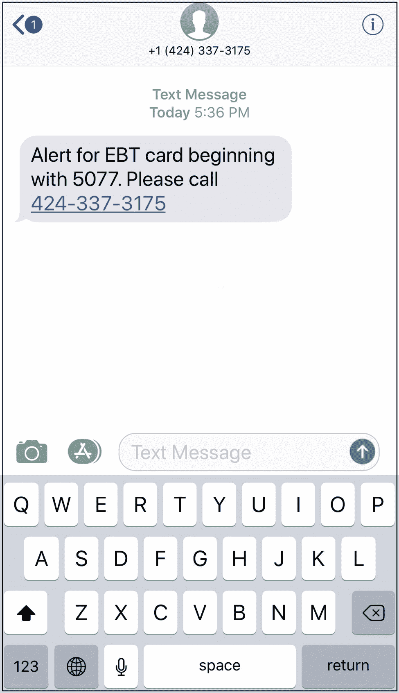

# 剖析网络钓鱼骗局，第二部分

> 原文：<https://medium.datadriveninvestor.com/anatomy-of-a-phishing-scam-part-ii-bb928affa829?source=collection_archive---------11----------------------->

## 通过短信进行网络钓鱼

Photo by [rawpixel](https://unsplash.com/@rawpixel?utm_source=medium&utm_medium=referral) on [Unsplash](https://unsplash.com?utm_source=medium&utm_medium=referral)

[在本主题](http://www.datadriveninvestor.com/2018/08/20/anatomy-of-a-phishing-scam/)的第一部分，我探讨了电子邮件网络钓鱼骗局的运作过程，以及您可以用来保护自己的流程和工具。在本系列的第二部分也是最后一部分中，我想重点介绍一种不同的攻击，一旦您知道如何识别，这种攻击也很容易识别。

通过 SMS 或文本消息进行的网络钓鱼被称为“微笑”。我知道:愚蠢的名字，但它是一个东西。我最近收到了你在这里看到的短信。老实说，我对此毫不在意:当我的账户上有安全标志时，我的银行和信贷机构偶尔会联系我。结果，这条短信一开始看起来并不异常，我毫不犹豫地拨打了这个号码。然而，当我拨通电话并听到这条消息时，我立即挂断了电话，意识到自己刚刚被一次相当普通的网络钓鱼攻击所欺骗。

Seems pretty real right? WRONG. This is a phishing attack.

我的第一个错误是:我没有真正注意短信，我应该注意的。结果差点被抓。当然，当我回头再看一遍这篇文章时，我注意到了三个我应该立即注意到的明显漏洞:

1.  短信提醒中没有任何银行、机构或信用卡提供商的名字。
2.  我被要求拨打的电话号码不是免费电话。
3.  最尴尬的是，*我没有以 5077 开头的信用卡。*

这种网络钓鱼攻击的创造者有一种特殊的方法:他们希望像他们这样发送给大量人的普通文本能够说服足够多像我这样不知情的受害者按下链接拨打该号码。

如果你是一个习惯于从银行或信用卡公司收到合法提醒的人，那么你可能——就像我之前做的那样——不会更仔细地查看你收到的短信。但是你应该。这是实际播放给我的录音，所以你可以自己听:

## 微笑的工作原理:

微笑诈骗通过看起来或听起来尽可能官方的方式进行。然而，质量较低的骗局被设计成通过撒下尽可能大的网来起作用。在这种情况下，这意味着向成千上万的人发送相同的短信。或者更多。[由于群发短信的成本低至每条 0.01 美元](https://fitsmallbusiness.com/how-sms-marketing-works/)，给 10 万人发短信的成本仅为 1000 美元，给 100 万人发短信的成本仅为 1 万美元。即使只有 1%的成功率能够获取人们的信用卡信息，也能产生巨大的潜在经济收益。

如果你认为这听起来很牵强，请重新考虑:每天，人们看到一条伪造的短信，认为它是真的，然后*心甘情愿地给出*他们的信用卡号、电子邮件地址/密码、亚马逊账户凭证或更糟的信息。

## 如何察觉一个微笑的骗局:

真正的银行和信用卡在联系你诈骗时总是使用专业的协议。由于知道这些协议是什么，您可以使用它来帮助识别欺诈。当有疑问时，假设这是一个欺诈电话。如果不是，举证责任就在你的银行或贷款人身上，他们会提供一些你在这里看到的东西:

1.  真正的银行和信用卡公司通常会给你打电话，而不是发短信，提醒你潜在的欺诈。电话号码可以是可识别的号码，也可以是您所在国家/地区可识别的电话号码*格式*。如果你看到一个来自 101-000-100 的电话或短信，立即怀疑。
2.  当一家银行或信用卡打电话给你时，人工呼叫总是会在前面识别银行或信用卡的名称。例如，“我是美国运通欺诈预警小组的 Joseph”，远比电脑语音“欢迎致电加州 EBT 客户服务热线”可信得多
3.  有时，欺诈警报电话可能是自动的。即使那样，也要遵循一个协议。您可能会被要求在特定日期、特定金额和特定零售商处用您的卡确认购买。*他们会先给你信息。*然后你可以简单地确认/否认你是否支付了这些费用。
4.  银行和信用卡公司*已经*拥有你的银行/信用卡信息，所以他们永远不会要求你提供这些信息。相反，他们会要求你验证你的身份，以便他们可以确认他们正在与正确的人交谈，以提醒一些重要的事情。

如果你打了一个自动号码，像我一样，意识到这是一个骗局，挂断电话，不要提供任何进一步的信息。阻止该号码再次联系您，然后向您的银行或信用卡举报该骗局。

## 如何阻止未来的诈骗:

没有完美的方法可以阻止所有的诈骗，但这里有一些帮助最小化或消除损害的最佳方法:

1.  不要回复你不认识的号码发来的短信。只是没那么重要！任何和你已经很亲近的人都已经在你的通讯录里了，如果有重要的事情发生，他们知道如何联系你。
2.  **屏蔽任何与诈骗有关的号码。**如果你收到一个号码发来的微笑诈骗，屏蔽它！如果您使用 iOS 设备，[请使用本指南](https://support.apple.com/en-us/HT201229)。如果你使用的是 Android 设备，[请使用本指南](https://www.wikihow.com/Block-Android-Text-Messages)。
3.  仅向朋友和家人提供您的手机号码。每当我被要求提供任何服务、网站或个人的电话号码时，我都会提供第二个谷歌语音号码，而不是我的实际手机。我建议你也这样做。这很简单，100%免费，我在这里[详细讨论了一下](https://medium.com/s/the-firewall/classified-the-art-of-restricting-personal-data-4aca5b3ffee)。

## 如何举报诈骗:

而该国大多数最受欢迎的银行和机构都提供帮助您防范或避免网络钓鱼攻击的指南(参见[富国银行](https://www.wellsfargo.com/privacy-security/fraud/report/phish)、[美国运通](https://www.americanexpress.com/us/security-center/types-of-fraud/)、[美国银行](https://www.bankofamerica.com/privacy/report-suspicious-communications.go)、[大通银行&信用卡、](https://www.chase.com/digital/resources/privacy-security/questions/fraud)[花旗银行](https://online.citi.com/US/JRS/pands/detail.do?ID=ProtectYourSelf&section=email_mobile_fraud)、[道明银行](https://www.tdbank.com/bank/security_phishing.html)、 [PNC 银行](https://www.pnc.com/en/security-privacy.html)、 [Capital One](https://www.capitalone.com/identity-protection/commitment/) 、&、[汇丰银行)](https://www.us.hsbc.com/security/report-fraud/)

将你的遭遇提交给[互联网犯罪投诉中心(IC3)](http://www.ic3.gov/default.aspx) ，这样他们就可以追踪任何其他线索。唯一的问题是:他们真的希望听到受害者的声音:那些因为数字骗局而损失金钱的人。希望使用上面的提示和技巧，联系 IC3 将是最后的手段。

*原载于 2018 年 9 月 27 日*[*www.datadriveninvestor.com*](http://www.datadriveninvestor.com/2018/09/27/anatomy-of-a-phishing-scam-part-ii-phishing-via-text-messages/)*。*