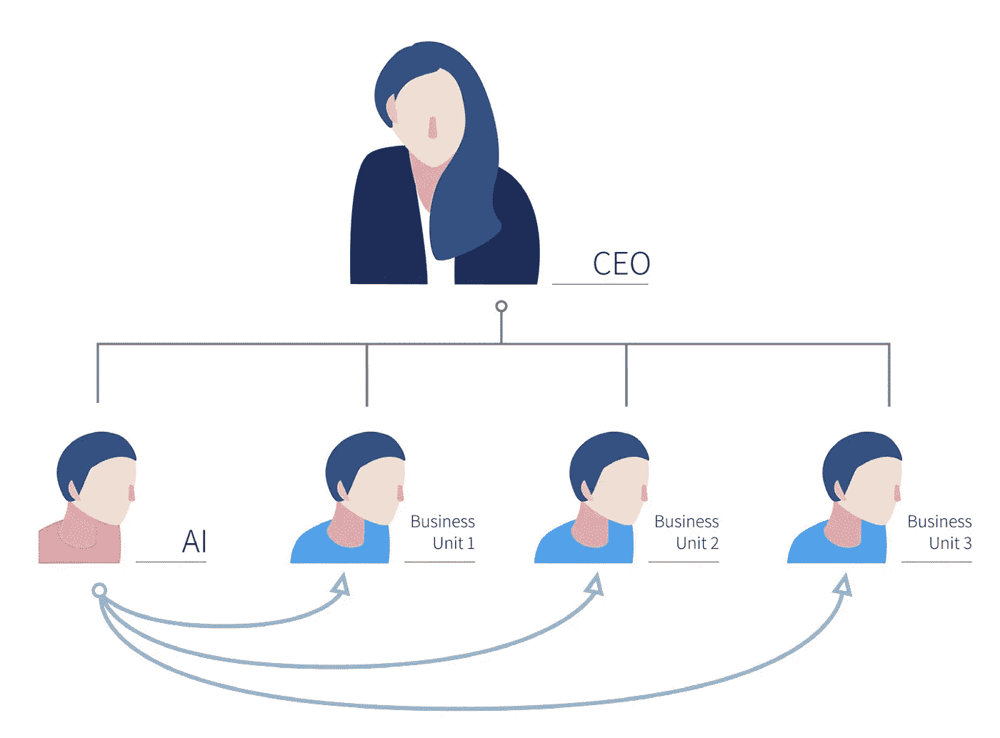
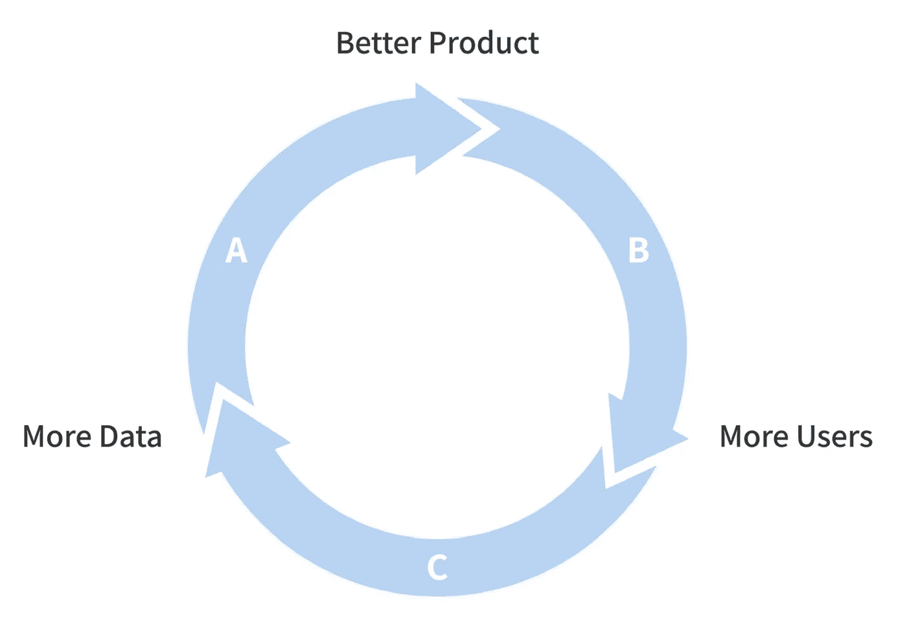

# 吴恩达谈打造今天的人工智能公司和产品

> 原文：<https://medium.datadriveninvestor.com/andrew-ng-on-building-todays-ai-company-product-a11e5a703d7f?source=collection_archive---------15----------------------->

# 谢谢:

感谢[吴恩达](https://www.linkedin.com/in/andrewyng/)从领导谷歌和百度的人工智能努力中汲取经验教训。原写《AI 转型剧本》链接[此处](https://d6hi0znd7umn4.cloudfront.net/content/uploads/2018/12/AI-Transformation-Playbook.pdf)

# 灵感:

## 向公司灌输人工智能 DNA 的五个步骤:

**1、试点项目胜出**

*   在 6-12 个月内，将一个内部团队(具有深厚的领域专业知识)和一个外部团队(具有强大的人工智能能力)结合起来，以交付有意义的任务
*   从数量和质量上定义能够带来业务、客户和战略价值的成功。
*   技术上可行

例如，吴恩达首先将人工智能应用于谷歌语音识别以获得动力，而不是影响底线的谷歌广告，以获得谷歌大脑团队的信任。然后以另一个内部客户的身份把 AI 应用到谷歌地图上。最后，Andrew 开始了与广告团队的对话，这影响到公司的底线。

**2、打造内部 AI 团队——首席 AI 官的崛起**

*   建立人工智能能力以支持整个公司:执行跨职能项目的初始序列。在完成这些初始项目后，建立重复的过程来持续交付一系列有价值的 AI 项目。
*   开发对多个部门/业务单位有用且不太可能由单个部门开发的全公司平台。例如:与首席技术官/首席信息官/CDO 合作开发统一的数据仓库标准。

source: [https://d6hi0znd7umn4.cloudfront.net/content/uploads/2018/12/AI-Transformation-Playbook.pdf](https://d6hi0znd7umn4.cloudfront.net/content/uploads/2018/12/AI-Transformation-Playbook.pdf)

**3、提供广泛的 AI 培训**

首席学习官认识到他/她的工作性质是策划而不是创造内容。

**1、高管和高级业务领导:(≥ 4 小时培训)**

目标:使高管能够理解人工智能可以为您的企业做什么，开始制定人工智能战略，做出适当的资源分配决策，并与支持有价值的人工智能项目的人工智能团队顺利合作。

课程:

*   对人工智能的基本业务理解，包括基础技术、数据以及人工智能能做什么和不能做什么。
*   理解人工智能对公司战略的影响。
*   人工智能应用于邻近行业或你的特定行业的案例研究

**2。AI 项目实施部门负责人:(≥12 小时培训)**

目标:部门领导应该能够为人工智能项目设定方向，分配资源，监控和跟踪进度，并根据需要进行纠正，以确保项目的成功交付。

课程:

*   对人工智能的基本业务理解，包括基础技术、数据以及人工智能能做什么和不能做什么。
*   对人工智能的基本技术理解，包括算法的主要类别及其要求。
*   基本了解人工智能项目的工作流程和过程，人工智能团队的角色和职责，以及人工智能团队的管理。

**3、AI 工程师见习(≥ 100 小时)**

目标:新培训的人工智能工程师应该能够收集数据，训练人工智能模型，并交付特定的人工智能项目。

课程:

*   对机器学习和深度学习的深度技术理解；基本了解其他 AI 工具。
*   了解用于构建人工智能和数据系统的可用(开源和其他第三方)工具。
*   能够实施人工智能团队的工作流程和过程。
*   此外:持续教育以跟上不断发展的人工智能技术

**4、开发 AI 战略**

*   建立几个困难的人工智能资产，这些资产与一个连贯的策略大体一致
*   利用人工智能创造一个特定于你所在行业的优势
*   与“人工智能的良性循环”正反馈循环一致的设计策略

谷歌、百度、必应和 Yandex 等领先的网络搜索引擎拥有庞大的数据资产，可以显示用户在不同的搜索查询后点击了哪些链接。

**战略数据获取:**有用的人工智能系统可以用 100 个数据点(“小数据”)到 100，000，000 个数据点(“大数据”)构建。

**统一的数据仓库:**由 50 个不同的副总裁或部门控制的 50 个不同的数据库将几乎不可能让工程师或人工智能软件访问这些数据并“将它们联系起来”考虑将您的数据集中到一个或最多少量的数据仓库中。

**认识到哪些数据是有价值的，哪些是没有价值的:**在数据采集过程的早期引入一个人工智能团队，让他们帮助你优先考虑采集和保存哪些类型的数据。例如，可悲的是，首席执行官过度投资于收集低价值数据，甚至收购一家公司的数据，却发现目标公司的大量数据毫无用处。

**5、发展内外沟通**

**人才/招聘:**

*   对外:雇主品牌化有助于吸引稀缺的 AI 人才。人工智能工程师希望从事令人兴奋和有意义的项目。适度的努力展示你最初的成功会有很大的帮助。
*   对内:AI 被过度炒作了，有恐惧，有不确定，有怀疑。员工也担心他们的工作被自动化。解释人工智能并解决此类员工担忧的清晰内部沟通将减少任何内部不愿采用人工智能的情况。

**客户关系:**确保传播正确的产品路线图和信息

**投资者与政府关系:**

*   财务:为你公司的人工智能解释一个清晰的价值创造论题，描述你不断增长的人工智能能力。
*   法律:开发一个可信的，令人信服的人工智能故事，解释你的项目能给行业或社会带来的价值和利益，是建立信任和善意的重要一步。