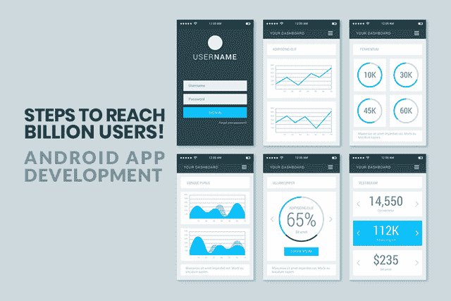
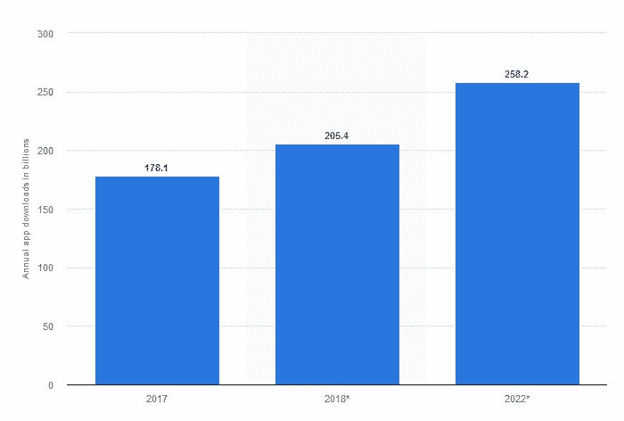
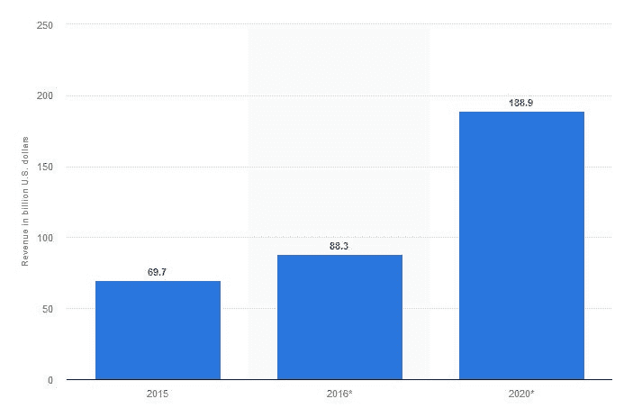
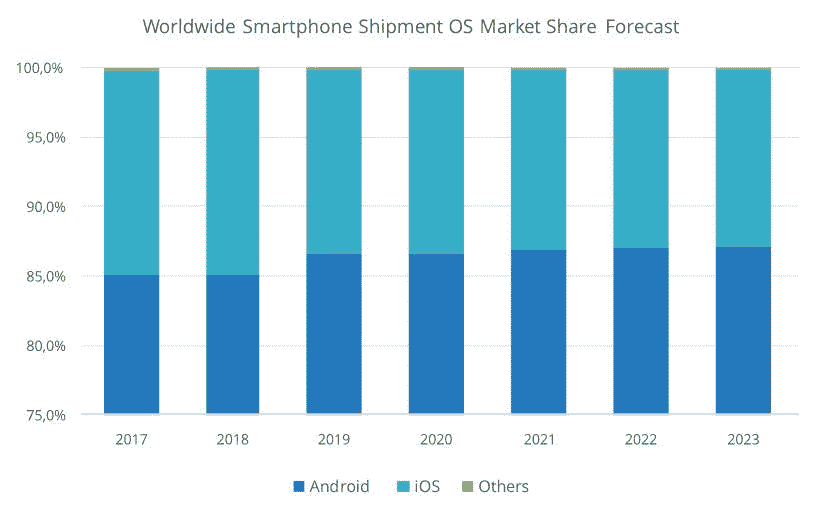

# Android 应用程序开发——接近十亿用户的一步！

> 原文：<https://medium.datadriveninvestor.com/android-app-development-a-step-to-reach-billion-users-31e230b21890?source=collection_archive---------4----------------------->

***你知道吗？根据***[***Statista***](https://www.statista.com/statistics/269025/worldwide-mobile-app-revenue-forecast/)***的数据，预计到 2020 年，移动应用的收入将达到 1.889 亿美元。***

虽然这是一个大新闻，但聪明的企业已经着眼于从这场运动中赚取一部分收入。

 [## 2019 年移动应用开发之路——数据驱动投资者

### 任何在移动应用程序开发行业工作的人，无论他们是专注于在伦敦开发 iOS 应用程序还是…

www.datadriveninvestor.com](https://www.datadriveninvestor.com/2019/01/15/the-path-of-mobile-app-development-in-2019/) 

如今，企业将移动应用作为自我延伸，以接触更多的客户。为什么？因为消费者更倾向于移动应用。根据 Statista 发布的另一份报告，2017 年的下载次数即 1781 亿次在 2018 年增加到 2054 亿次，预计到 2022 年将上升到 2582 亿次。

> 两个最常见和最受欢迎的移动应用平台在市场上都有自己的份额。是的，我们在谈论 Android & iOS。虽然 iOS 有自己的客户群，但 Android 以 86.8%的份额赢得了市场和用户群。

不仅用户热衷于 Android 应用程序，公司也热衷于在 Android 上开发应用程序，因为他们可以瞄准巨大的市场。

定制 [**安卓应用开发服务**](https://www.xicom.biz/offerings/android-development/?utm_source=SM03) 为商家提供了巨大的利益和优势。

> 在这里，我将展示 android 应用程序开发对企业的优势，请继续阅读！

## **1。以最少的投资获得更高的回报:**

你不必投资英镑来制作一个应用程序！偷偷揣进口袋，拿出一点预算，用 android 开发的美好未来拓展业务。

Android 已经提供的 Android SDK(软件开发工具包)可以帮助开发人员以低成本为您的企业构建交互式应用。

作为一家企业，你可以在谷歌一次性付费注册后，在谷歌的市场上设置应用程序。

> **为所有智能手机构建、测试和运行您的应用，投资低，交互性提高 100 倍。从而获得更高的回报。**

## **2。更快的开发&更容易的集成**

关于千禧一代的一个观点是——他们不喜欢等待。虽然这有它自己的利弊。但是，企业必须适应最大的需求。

Android 应用程序开发比任何其他平台都要快。此外，它集成和采用谷歌的审批政策更快。

雇用 android 应用程序开发人员/ [**android 应用程序开发公司**](https://www.xicom.biz/offerings/android-development/?utm_source=SM03) 利用现有的 SDK，确保更快地按需定制流程，为您的客户扩展一个完全交互式的平台。

## **3。大于生活的用户体验**

到处都能看到满意的顾客，这难道不令人着迷吗？毕竟，我们要多努力才能让我们的企业获得一些好评，从而壮大更高的客户群呢？

你为客户创造的经验告诉你你的企业将如何发展。

由于 Android 界面，这些应用程序完全适应和用户友好。Android 平台的不断修正和升级 Android 开发的未来是光明的，给你的企业带来比预期更好的结果。

## **4。由于 Android 拥有最高的用户基数，因此接触到更多受众:**

当今世界智能手机用户总数达到 51.12 亿，普及率为 67%。

> 为了让您更好地理解，我进一步划分了市场:

> **安卓:75.27%**
> 
> **iOS: 22.74%**
> 
> **视窗:0.24%**
> 
> 三星:0.22%
> 
> 其他:1.07%

正如数据所显示的，Android 拥有最大的市场份额，让你比其他任何平台接触到更多的受众。

## **1。降低平均部署成本:**

苹果应用商店和谷歌 Play 商店都对他们的政策非常严格。但是，play store 仍然给开发者一些自由。

> 苹果收取 99 美元的年费，而谷歌只收取 25 美元的一次性费用。

对于 android 应用程序开发公司来说，即使是应用程序审批流程也比谷歌更简单。iOS 需要几天时间来批准一个应用程序，而谷歌在几个小时内就能快速批准，与 iOS 相比失败的几率更低。因此，越来越倾向于定制 android 应用程序开发服务。

## **2。定制的力量**

由于 android 是开源的，它为设计您的应用程序的 Android 应用程序开发公司提供了一个完整的平台，可以根据您的需求定制和设计您的应用程序。

此外，android 应用程序的多功能性使其能够集成多媒体工具和数据管理功能，使您的业务活动在执行后更加顺畅。

现在你已经完全认同 android- [**移动应用开发**](https://www.xicom.biz/offerings/mobile-app-development/?utm_source=SM03) 的优势和未来。

> 这里还包括你在雇佣 android 应用开发者之前应该遵循的一些重要提示:

*   **调查&列出一份你认为适合你工作的开发人员名单。** 开发一款应用对你的业务至关重要，也是至关重要的一部分。你不能简单地相信任何一个社区开发商。创建研究来雇佣全球性的 android 应用程序开发人员。这样你就能在最好的中找到最好的。随着研究的深入，列出你认为最适合你的所有开发者或安卓应用开发公司。
*   永远要确定你到底在寻找什么。
    模糊的想法永远不会把你引向任何目的地。确定你在寻找什么，确切地说，你希望从你的 android 应用程序中得到什么。会以销量为目标吗？或者，客户支持？或者，传递知识？创建一个完整的蓝图，描述您希望您的应用如何为您的企业服务。这样，在与开发人员一起工作时，您将能够更好地交流您的想法，并获得想要的结果。
*   **在无可挑剔的体验基础上筛选安卓 App 开发公司。**

> ***优中选优！***

在招聘定制 android 应用开发服务时，你必须寻找最好的。显然，你不想与应用程序妥协。毕竟，它是你业务的延伸，也是你业务的纯粹反映。

根据工作经验和设施来筛选公司。这不是一天的关系，而是多年的关系。完整的过一遍点评，工作经验，后期开发服务等。

*   **沟通是关键！**

一旦你列出了你想雇佣的定制 android 应用开发服务的开发人员名单，就和他们见个面。当面或打电话，试着向他们详细解释你到底在找什么。向他们简要介绍你的想法，你希望该应用程序如何为你服务，以及你希望该应用程序与你的客户沟通的具体内容。

详细的项目概述将有助于开发人员更好地理解您的需求，从而更好地执行这些需求。

*   **公司技术效率研究**

开发一个网站和开发一个 android 应用是完全不同的两件事。它们在功能的核心本质上都有所不同。因此，仔细检查你的开发人员对最新技术的精通程度。

# **总结:**

做一个聪明的企业！将上面的提示列表加入书签，以确保你能够从你计划构建的新应用中获得最大收益。我已经试着根据我们的研究和专业知识为你整理了过去几年来在****Android 应用程序开发领域的最佳技巧。****

****在下面的评论区告诉我们你希望我们写的下一篇文章。另外，不要忘记分享你对最近阅读的看法。****