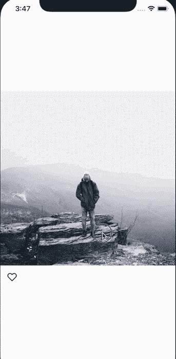
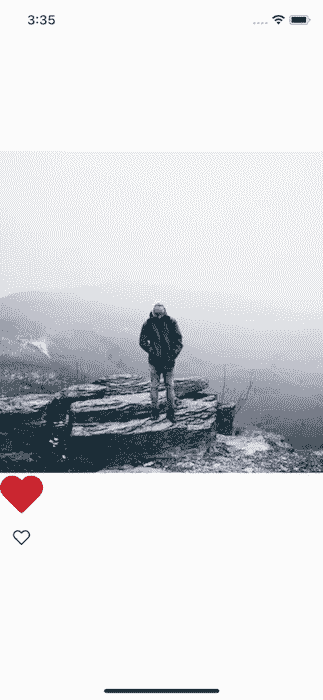
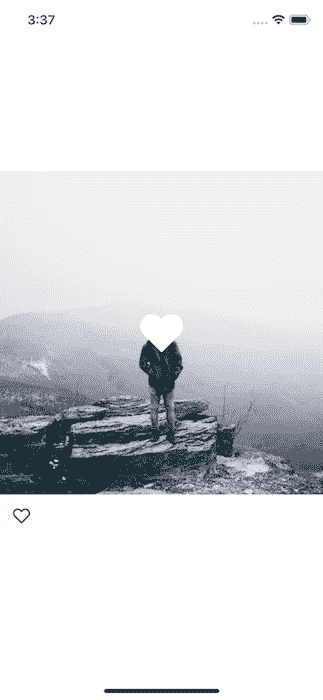

# React Native 中的动画图像覆盖

> 原文：<https://medium.datadriveninvestor.com/animated-image-overlay-in-react-native-9b8dd22a9c6e?source=collection_archive---------0----------------------->

## 喜欢一张图片的时候建立一个 Instagram 风格的动画心脏

当你喜欢 Instagram 上的一张图片时，一颗心会迅速缩放并淡入你喜欢的图片——我们如何在 React Native 中实现同样的效果？在这个快速教程中，我们将详细介绍这一点。



# 入门指南

本教程建立在上一个教程的基础上，在该教程中我们实现了一个双击组件。

首先，使用 Create React Native App 创建一个新项目。

```
create-react-native-app AnimatedImageOverlay
cd AnimatedImageOverlay
```

接下来，下载下面的 zip 文件，将其解压缩，并将其放在新的 React 原生项目中。确保将目录命名为`src`。

[启动拉链](https://github.com/HandlebarLabs/react-native-examples-and-tutorials/blob/master/tutorials/instagram-style-animated-image-overlay/tutorial-assets/src.zip)

然后将`App.js`更新为

```
import App from './src';export default App;
```

# 叠加图像

我们将从添加必要的样式来成功地将一个图像叠加到另一个图像开始。

首先，我们将创建一个新的方法来渲染叠加图像。

```
export default class App extends React.Component {
  // ... renderOverlay = () => {
    return (
      <View style={styles.overlay}>
        <Image
          source={require('./images/heart.png')}
          style={styles.overlayHeart}
        />
      </View>
    );
  } // ...
}
```

然后我们将渲染覆盖。`DoubleTap`组件只接受一个子组件，所以我们需要将`Image`组件包装在一个`View`中。幸运的是，这也有助于布局。

```
export default class App extends React.Component {
  // ... render() {
    return (
      <View style={styles.container}>
        <DoubleTap onDoubleTap={this.toggleLike}>
          <View>
            <Image
              source={{ uri: `https://images.pexels.com/photos/671557/pexels-photo-671557.jpeg?auto=compress&cs=tinysrgb&dpr=2&w=${w.width}` }}
              style={{ width: w.width, height: w.width }}
              resizeMode="cover"
            />
            {this.renderOverlay()}
          </View>
        </DoubleTap>
        {/* ... */}
      </View>
    );
  }
}
```

留给我们的是:



为了解决这个问题，我们将为包含视图设置一些绝对位置，以占据整个区域并使其内容居中。我们还将图像的`tintColor`设置为白色。

```
const styles = StyleSheet.create({
  // ...
  overlay: {
    position: 'absolute',
    alignItems: 'center',
    justifyContent: 'center',
    left: 0,
    right: 0,
    top: 0,
    bottom: 0,
  },
  overlayHeart: {
    tintColor: '#fff',
  },
});
```



# 制作图像动画

我们需要做的第一件事是动画图像:从 React Native 导入`Animated`。

然后我们将在组件上设置一个新的动画值。由于我们能够在 React Native 中插入动画值，这将驱动不透明度的变化和缩放。

```
export default class App extends React.Component {
  // ... animatedValue = new Animated.Value(0); // ...
}
```

接下来，我们将修改`animatedValue`当我们喜欢的图片。为此，我们将修改`toggleLike`方法。如果图像是喜欢的，我们将开始一个动画序列，使`this.animatedValue`的值为 1，并立即使其回到 0。我将使用`Animated.spring`，因为我喜欢它在这里的样子。

```
export default class App extends React.Component {
  // ... toggleLike = () => {
    this.setState((state) => {
      const newLiked = !state.liked; if (newLiked) {
        Animated.sequence([
          Animated.spring(this.animatedValue, { toValue: 1, useNativeDriver: true }),
          Animated.spring(this.animatedValue, { toValue: 0, userNativeDriver: true }),
        ]).start();
      } return { liked: newLiked };
    });
  } // ...
}
```

我们要做的最后一件事是修改`renderOverlay`方法，使用我们的动画值来修改样式。首先，用一个`Animated.Image`替换`Image`组件，这样我们可以使用动画值，并且组件知道如何处理它们。

然后，我们将设置一系列新的图像样式。首先将是我们现有的`styles.overlayHeart`，下一个将是我们的动态样式的对象。

不透明度是一个从 0 到 1 的值，所以我们可以直接将其传递给`opacity`。然后，我们将使用`scale`属性开始稍微缩小和放大图像。我们可以通过使用`this.animatedValue.interpolate`来指定确切的值。这是代码。

```
export default class App extends React.Component {
  // ... renderOverlay = () => {
    const imageStyles = [
      styles.overlayHeart,
      {
        opacity: this.animatedValue,
        transform: [
          {
            scale: this.animatedValue.interpolate({
              inputRange: [0, 1],
              outputRange: [0.7, 1.5],
            }),
          },
        ],
      },
    ]; return (
      <View style={styles.overlay}>
        <Animated.Image
          source={require('./images/heart.png')}
          style={imageStyles}
        />
      </View>
    );
  } // ...
}
```

这就给我们留下了以下问题。


最终代码可以在 [Github](https://github.com/HandlebarLabs/react-native-examples-and-tutorials/tree/master/tutorials/instagram-style-animated-image-overlay) 上找到

> 你喜欢这个教程吗？查看一些我的 [*其他 React 原生教程*](https://github.com/HandlebarLabs/react-native-examples-and-tutorials) *！*