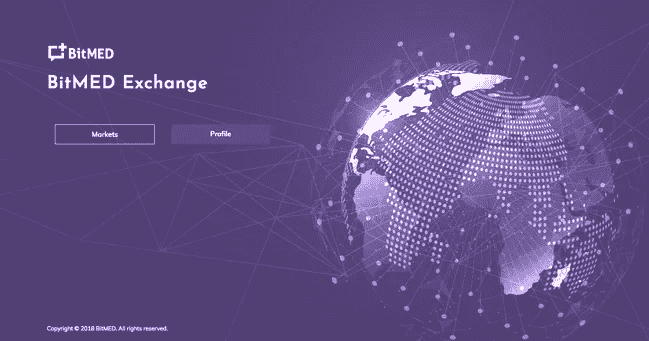

# 宣布 BitMED 交易所

> 原文：<https://medium.datadriveninvestor.com/announcing-the-bitmed-exchange-779984b60eac?source=collection_archive---------28----------------------->

# 这个世界需要另一次交流吗？

如今，任何加密货币玩家似乎都有一个交易所。几乎所有的公司都专注于提供广泛的加密“菜单”，从瑞士联邦理工学院和 BTC 到一些最近的新来者。很少有人着眼于以硬币为中心的合作伙伴关系，硬币可以作为积分系统和游戏系统的货币。甚至是手机通话时间。很少有人像 ATM 一样提供资金存取。

这些解决方案的一个问题是，从消费者的角度来看(我！)，它们看起来都或多或少有点像老牌时尚银行。密码纯粹主义者不会同意这种说法(很可能他们会把我钉死在十字架上！)，但最终对于像我这样的消费者来说，我为什么要关心 ATM 机上的名称或我用来购买今晚电影票的面额呢？我当然过于简单化了，然而这只是从 50，000 英尺的高度看上去的样子！

换句话说，所有这些交易所保证了快速获得资金，然而它们并没有帮助我在今晚的《波西米亚狂想曲》私人放映中获得更好的座位！正如我在[之前的一篇文章](https://medium.com/datadriveninvestor/bitmeds-digital-wallet-33e03bf2eb3e)中提到的，正是在这种情况下，我希望事情“顺利进行”，而不是让自己想出今晚看电影的下一步。

# 比特梅德溶液

在 BitMED，我们致力于无摩擦的医疗保健服务。通过我们构建的一切，平台、令牌、钱包以及现在的交易所，我们希望确保用户能够自由地专注于他们自己的需求，而不是必须找出在流程的特定点应该使用哪个服务或哪个网站。

通过将核心组件(平台、交换、数据、协议、钱包)之间的强大集成置于前端和中心，BitMED 生态系统能够提供业界首个以人为核心的免费医疗服务解决方案。为了让它发挥作用，每个核心组件都发挥着关键作用。协议是基础的桥梁。该平台是最终的服务协调器。令牌是整个生态系统的血脉。接下来是交换…

# 什么是 BitMED 交易所？

尽管从它的登陆页面(如下图所示)来看可能不明显，BitMED 交换位于协议和服务交付的交叉点。该交易所使 BitMED 生态系统中的参与者能够通过获得 BXM 币来获得服务，这些 BXM 币可用于“支付”此类服务。

交易所支持的交易对是 BTC ↔ BXM 和 ETH ↔ BXM。

一旦成员获得 BXM 硬币，他们可以使用它们获得医疗援助，访问数据(如果是数据科学家)，或奖励其他人。除了通过使用交易所筹集 BXM 硬币之外，成员还通过积极参与生态系统来赚取硬币，例如，通过发表评论、对文章评级、匿名化和共享他们的数据等。

# 总之…

这个世界确实需要另一个交换…然而，它必须不仅仅是一个交换！它必须能够交付端到端的服务，而不仅仅是处理金融交易。

通过自身的追求，BitMED 交易所与生态系统的其他组成部分合作，迎合了实际、现实的人类需求，而不是仅仅成为另一台将人类埋葬在大量无用的复杂性之下的无脑机器。

随时欢迎您的评论。

下次见，一切顺利！