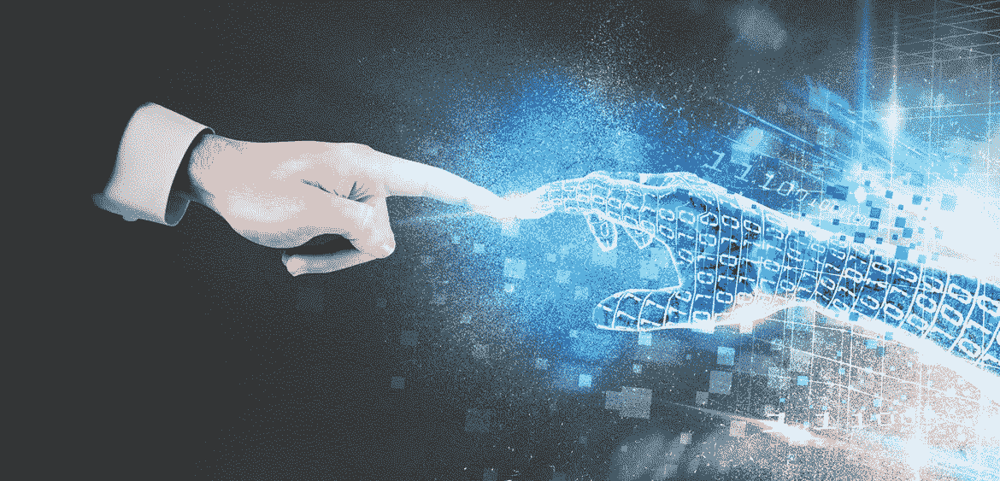
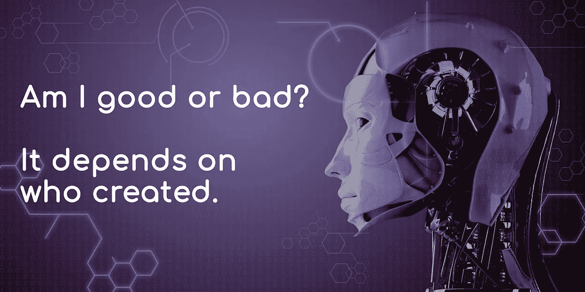

# 又烦又怕 A.I。

> 原文：<https://medium.datadriveninvestor.com/annoyed-and-afraid-of-a-i-d0981697fa06?source=collection_archive---------8----------------------->

Artificial Intelligence

# 你好。

祝你今天一切顺利！

这些是几十年后你每天一醒来就会收到的问候。由于不需要旅行或通勤，你的手机可能会成为你观察世界的唯一方式。你的邮件会被自动回复，你的游戏会让你感受到失去主角的悲伤和痛苦，你的健康可以在你表现出疾病迹象之前，通过一滴血来检查，看你是否患有多种难以想象的疾病。

Artificial Intelligence

# **我们已经进入人工智能时代多远了？**

**人工智能**，根据智能程度分为**三种**:

 [## 今年值得关注的 5 大人工智能趋势|数据驱动的投资者

### 预计 2019 年人工智能将取得广泛的重大进展。从谷歌搜索到处理复杂的工作，如…

www.datadriveninvestor.com](https://www.datadriveninvestor.com/2019/02/19/artificial-intelligence-trends-to-watch-this-year/) 

**弱人工智能或人工狭义智能:**

它能像人类一样或比人类更好地完成特定的任务。时至今日，它随处可见。如果你在 2050 年**后的任何时候读到这篇文章，那么你可能从未见过，因为科技已经超越了它自身的规模。**

**人工通用智能:**
这是一个 **A.I.** 可以思考、行动、表现得和人类一样好，仿佛不比人类更好。这种**人工智能**的智商将高于人类，它可以从头到尾使用机器人身体完成驾驶或烹饪等日常任务，而不受人类的任何干扰。

**强人工智能或人工超级智能:**
如果你看过类似“ ***终结者*** ”这样的电影，你就已经知道一个运行在量子计算机上的超级强大的**人工智能能做什么了。机器制造机器，并如此贪婪地扩张，以至于人类要么被毁灭，要么在另一个场景中，我们被用作机器的动力来源，就像在“ ***《黑客帝国》*** ”的后启示录世界中一样。但是这种人工智能现在还远远不能成为现实，除非你在 2050 年后读到这篇文章。**

****

**Artificial Intelligence meeting human intellect**

# **这对我们意味着什么？**

**到今天为止， **A.I.** 只是通过对信息进行冗长的处理，帮助我们通过分析我们以前的购买来购买正确的产品，从而使我们的生活在精神上更加方便，这样我们就不必搜索了。*比如*，当我想买一本关于 **A.I.** 的书时，如果我去图书馆，我必须搜索一本符合我口味和必要性的书，然后排队付款。在网站上，它会学习并简化我搜索合适的书的过程，根据我的口味推荐最好的书，从而节省我的时间。**

**但是，有些人(*这是给你的，如果你看到昨晚梦见的产品广告而感到害怕的话*)会认为这是一个可怕的迹象，表明**人工智能**正在监视他们，并将继续这样做，因此盖住了他们的相机和麦克风。让我们把这看作是一个我们每天交谈的朋友，我们告诉他们我们喜欢什么或谁，我们在寻找什么和我们不喜欢什么。你的私人最好的朋友，你的手机从你的对话中听"*关键词*"，像你或一个真正的朋友一样思考，以便它可以更好地与你交流，它通过从你那里获取输入和响应来学习。这种软弱或狭隘的人工智能还面临着理解你为什么不买你非常想要的东西的困难，因为突然缺乏兴趣或资金。但是总有一天**人工智能**会帮助你组织你的预算和开支，以最适合你的整体生活体验，这样你就能在你想要的时候买你想要的东西。**

**事实上，有一天**人工智能**将能够告诉我们我们的宝宝长什么样，他们的性格特征会是什么样，他们的脸、外貌、体重和身高会是什么样，甚至在你计划要一个之前，它可能不是 100%准确，但这是它将基于从你和你配偶的生活中获得的数据、你的饮食、习惯、判断、兴趣、表现、偏见、智力、情商和惯例而产生的结果。**

****说到这个**，如果**人工智能**可以被输入数据来增加它的数字 ***智商*** ( **智商**)那么我们是否也可以以某种形式在它的记忆中建立并增加一个 ***情商*** ( **智商**)。**

**机器可以根据它们从你的神经末梢和面部线索接收到的信号，分析你的情绪，并就食物、音乐、尝试做的事情和避免做的事情提出建议，以保持你的健康并让你变得更好。但是这能被定义为对情感的理解或者仅仅是对基本刺激的反应吗？ ***情感* A.I *。*T5 是 **A.I.** 的子集，对人类的情绪做出反应、理解、测量和模拟。****

# ****这将我们引向两种结果之一:****

****

**A.I. Good or Bad?**

**人工智能将成为治疗师、私人助理、向导、导师和助手，让我们的生活变得尽可能美好。**

*****或*****

**人工智能将利用我们的信息，让我们做它认为最符合任何人或任何事物利益的事情。**

**如果你从上面的一切中理解了这一点，那就没什么可怕的了，那就是**人工智能**是*智人*创造的另一种工具，以缓解他们的生活，就像*尼安德特人*在进化的高峰期到来时开发工具一样。我们正处于进化史的一个阶段，在这个阶段，人和机器携手合作，作为彼此的工具，为一个单一的目的服务。**

**在好人手中，工具可以创造奇迹，在坏人手中，工具可以杀人。**

**如果有一个**坏机器人** *或* **人工智能**，那么第一个**将必须是一个**不太好的*机器人*** ，并且没有人在使这种情况发生的过程中。因此，只要没有一个疯子试图制造一个**人工智能**来毁灭一半的人类，通过杀死每一个可能导致遗传或性传播疾病的人类来拯救其余的人类，为了一个更美好的世界，你就不必害怕**人工智能**，但你完全有权利被**人工智能**惹恼，因为它正处于这种婴儿阶段。****

**感谢你阅读并花费宝贵的时间在这个博客上来理解**人工智能**真正的能力。**

**这是一个教育性的博客，让人们知道如何利用身边的信息。请支持我的工作，与你认为可以从中学习的人分享。如果 ***时间旅行*** 存在于你读这篇文章的时候，给我一个信号*请带我一起去未来*。**

**你可以关注我，通过下面提到的细节讨论更多。**

**Prajwalshukla997@gmail.com**

** [## 登录* Instagram

### 欢迎回到 Instagram。登录查看您的朋友、家人和兴趣爱好捕捉和分享了什么…

www.instagram.com](https://www.instagram.com/prajwal_shukla/)**