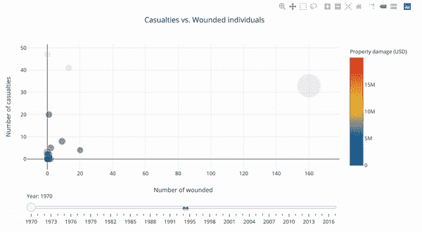
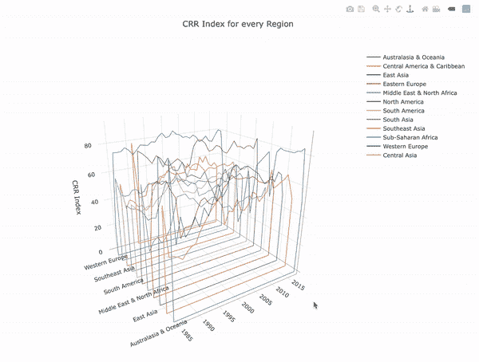
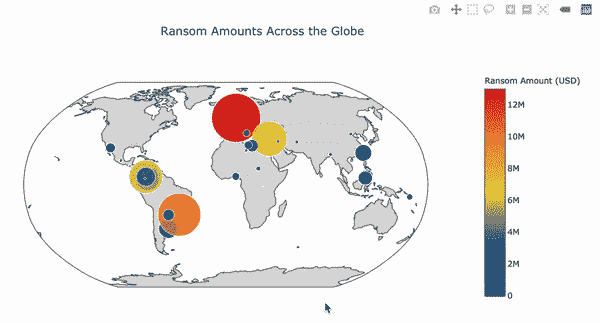

# Python 中可视化数据的另一个维度

> 原文：<https://medium.datadriveninvestor.com/another-dimension-to-visualize-data-in-python-4eb719673a38?source=collection_archive---------14----------------------->

[](http://www.track.datadriveninvestor.com/1B9E)

如何用 Plotly 制作互动的、真实的剧情？


在过去的几年里，我一直使用 **matplotlib** 作为我的数据分析项目最重要的可视化工具。现在回过头来看，它让我花了无数的时间在 StackOverflow 上浏览文档和帖子，因为我弄乱了日期格式，或者因为很难获得正确的三维图形而不得不添加另一个轴。

几个月前，我被神秘地介绍给了[](https://plot.ly/python/)**。这让我对视觉化有了全新的认识。最精彩的部分是什么？制作图表要容易得多，我说的不仅仅是条形图和折线图。只用几行 Python 代码制作交互式三维图表变得如此方便。文档更容易阅读，给出的例子也非常清晰。**

# **入门指南**

**Plotly 图表可以在 Jupyter 笔记本中制作，然后可视化本身可以导出到 plotly。要安装 plotly，只需输入以下命令`pip install plotly`。要在 Jupyter 中运行它，请使用下面的代码片段。**

```
import plotly.plotly as py
import plotly.graph_objs as go
import plotly.offline as off
```

**如果你希望可视化显示在笔记本上，而不是重定向到你的 plotly 帐户，那么“离线”库是必要的。**

# **时间序列**

**我们都知道时间序列图在数据分析中非常有用，因为我们想知道数据在一段时间内的趋势。在单个可视化视图中显示时间序列的一个简洁方法是使用滑块。滑块充当时间轴，可以向我们显示任何时间段的数据趋势(基于数据集)。我们可以通过使用“slider”参数来做到这一点。代码片段如下所示。**

```
#Defining the layout of the plot
slider = [dict(
    active = 0,
    currentvalue = {"prefix": "Year: "},
    pad = {"t": 50},
    steps = steps
)]layout = dict(
    title = 'Casualties vs. Wounded individuals',
    xaxis = dict(title = 'Number of wounded'),
    yaxis = dict(title = 'Number of casualties'),
    sliders = slider,
    hovermode = 'closest',
)#Plotting the figure
py.offline.iplot(
    dict(
        data = data,
        layout = layout
    )
)
```

**如上所示，我们可以设置滑块的时间轴以及每个刻度之间的步数(年)。这使得可视化非常具有交互性。滑块向我们展示了多年来的模式，我们还可以通过将鼠标悬停在每个圆圈上来识别它们。该可视化在一个图中显示了 4 个不同的维度。在 matplotlib 中，这将是一项非常乏味的任务。**

****

**Time Series Plot**

# **杂项图**

**plotly 的主要优势之一是我们不必局限于通常的条形图、线图和散点图。根据我们掌握的数据，有各种各样的图可以利用。这里有几个例子:**

**下图是国家风险评级(CRR)指数及其在全球所有地区的趋势的三维图。将时间维度添加到图中，以显示 30 多年来的 CRR 趋势。**

```
#Defining the layout of the plot
layout = dict(
    title='CRR Index for every Region',
    showlegend=True,
    width=1000,
    scene=dict(
        xaxis=dict(title='', autorange =True),
        yaxis=dict(title=''),
        zaxis=dict(title='CRR Index'),
        camera=dict(
            eye=dict(x=-1.7, y=-1.7, z=0.5)
        ),
        aspectratio=go.layout.scene.Aspectratio(
        x=1, y=1, z=1
    )
    )
)fig = dict(data=data, layout=layout)
off.plot(fig)
```

****

**3-D model showing trend of an attribute over the years**

**对于地理空间数据，Plotly 提供了使用地图甚至地球仪来获得三维效果的选项。这可以通过使用“geo”标签来定义所需地图的类型来实现。下面的代码片段显示了数据集中赎金最高的一个地球仪。我们可以再次看到，在一个单独的图中，我们可以轻松地显示 3 个以上的维度。**

```
layout = dict(
        title = 'Ransom Amounts Across the Globe<br>',
        showlegend = False,
        geo = dict(
            scope='world',
            projection=dict( type='robinson' ),
            showland = True,
            landcolor = 'rgb(217, 217, 217)',
            subunitwidth=1,
            countrywidth=1,
            subunitcolor="rgb(255, 255, 255)",
            countrycolor="rgb(255, 255, 255)"
        ),
    )fig = dict(data=cities, layout=layout)
off.iplot(fig)
```

****

**Global view of ransom amounts**

# **最后的想法**

**这只是冰山一角。还有很多其他可能的可视化方式。我意识到我在 matplotlib 上花了很多时间，而我本可以在很短的时间内做出更好、更具交互性的图形。这不仅有助于我们成为更好的数据科学家，还能在演示过程中产生更大的影响。当向不了解数据领域知识的客户或受众解释您的发现时，这是一个关键因素。**

**这些可视化的全部代码都在我的 Github [库](https://github.com/AmitNaik07/Visualizations)里。**

****鼓掌！分享！跟着走！****

## **来自 DDI 的相关故事:**

**[](https://www.datadriveninvestor.com/2019/01/23/deep-learning-explained-in-7-steps/) [## 用 7 个步骤解释深度学习——数据驱动投资者

### 在深度学习的帮助下，自动驾驶汽车、Alexa、医学成像-小工具正在我们周围变得超级智能…

www.datadriveninvestor.com](https://www.datadriveninvestor.com/2019/01/23/deep-learning-explained-in-7-steps/) [](https://www.datadriveninvestor.com/2019/02/07/8-skills-you-need-to-become-a-data-scientist/) [## 成为数据科学家所需的 8 项技能——数据驱动型投资者

### 数字吓不倒你？没有什么比一张漂亮的 excel 表更令人满意的了？你会说几种语言…

www.datadriveninvestor.com](https://www.datadriveninvestor.com/2019/02/07/8-skills-you-need-to-become-a-data-scientist/)**