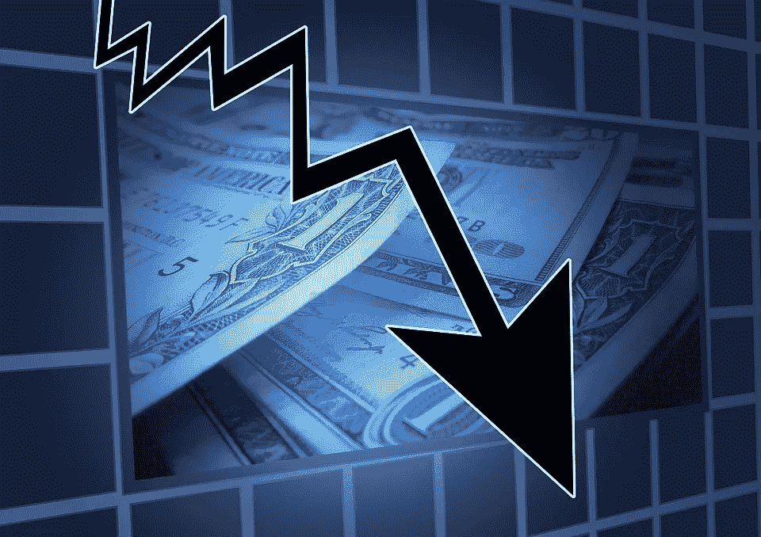
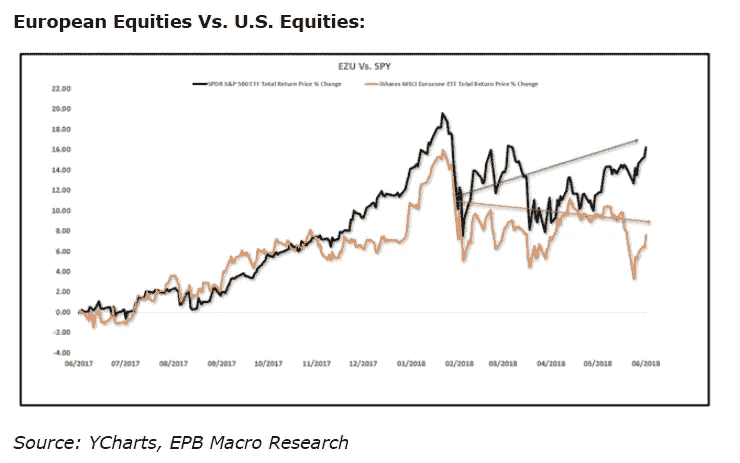
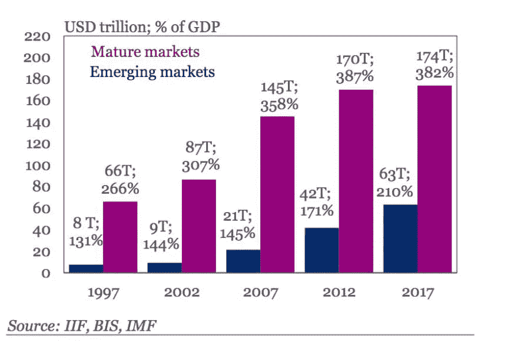

# 又一场金融风暴正在酝酿？

> 原文：<https://medium.datadriveninvestor.com/another-financial-storm-brewing-c96b2db543b8?source=collection_archive---------4----------------------->

美国股市周一平淡无奇，即使流动性更高的外汇市场也出现波动。展望未来，充满风险事件的一周，包括 3 次央行利率决策、关键数据发布和地缘政治风险事件——这是暴风雨前的平静吗？当美国市场在 2018 年 2 月 9 日触及最近的低点时，许多人认为，经过 9 年牛市后的长期市场调整终于到来了。对于那些寻求大幅调整的人来说，接下来的事情变成了空头陷阱。

但是对乐观主义者来说，好消息到此为止。因为几乎所有的全球市场都显示出呆滞、紧张和脆弱的经济基本面的迹象。在我被贴上悲观主义者的标签之前，以下是国际货币基金组织总裁克里斯蒂娜·拉加德今天在柏林就当前全球经济环境所说的话。

> “我们在大约六个月前发出信号的地平线上的云一天比一天暗——我想说的是，到周末，”

这是紧接着上周末动荡的七国集团会议之后发生的，传统盟友之间的摩擦非常明显，因为他们在经济政策问题上截然不同。征收美国金属关税一直是一个棘手的问题，随着山姆大叔在这个问题上采取积极的立场，它似乎不会朝着解决的方向发展。

随着美国新政府将其提升到一个全新的水平，2016 年英国退出欧盟开始吹的保护主义之风已经有了很大的发展。然而，问题不是全球经济衰退，在这一点上看起来几乎是肯定的，因为欧洲增长乏力，加上政治不稳定，新兴经济体货币困境，美中贸易战担忧，加上表现不佳的全球股市和国债升至创纪录水平。看看美国和欧洲股票的不同表现(上图)，然后是债务数据(下图)。更不用说阿根廷、土耳其、巴西和南非等新兴经济体的货币对美元汇率大幅下跌，给它们带来了严重的经济压力。阿根廷获得了 500 亿美元的救助计划来应对这一问题。

然而，真正的问题是整个金融体系的崩溃，自第二次世界大战以来，美国及其西方盟友一直是这个体系的火炬手。在这个不断变化的金融环境中，对贸易、资本和劳动力的流动没有限制的全球化原则正在迅速成为一个有争议的问题，关税、补贴和配额正在取代它们。

正如世界在 2008 年金融危机中发现的那样，全球衰退的代价是巨大的&需要数年时间才能恢复。如果这个问题不能以友好的方式解决，这在这一点上看起来有点牵强，接下来的全球衰退可能会是一个漫长而痛苦的过程&我们将有一个更大的问题要处理……一个摇摇欲坠的金融体系！

对加密货币、金融科技行业、突破性技术感兴趣或正在寻找加密货币、外汇或股票交易想法的人—关注我[**Twitter**](https://twitter.com/trade_nut)&[**StockTwits**](https://stocktwits.com/trade_nut)。外汇&股票实时信号，关注我的[**trade alike**](http://www.tradealike.com)App(@ Fakd)

