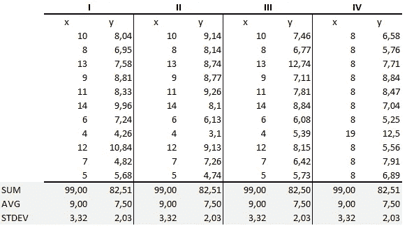

# 安斯康贝的四重奏

> 原文：<https://medium.datadriveninvestor.com/anscombes-quartet-12649db7eac0?source=collection_archive---------0----------------------->

我一直相信“数值计算是精确的，但图形是粗糙的”。作为一个刚刚开始学习数据分析的人，我很难理解数据可视化和汇总统计的重要性。但是在参加了这个数据可视化聚会之后，这一切都改变了，那时我被介绍给了 *Anscombe 的四重奏。*

安斯科姆的四重奏是由统计学家弗朗西斯·安斯科姆创作的。它包括四个数据集，每个数据集包含十一个(x，y)对。关于这些数据集，需要注意的重要一点是，它们共享相同的描述性统计数据。但是事情完全变了，我必须完全强调**，**当它们被绘制出来的时候。每个图表讲述了一个不同的故事，而不管它们相似的汇总统计数据。

Quartet’s Summary Stats

汇总统计数据显示，各组中 x 和 y 的均值和方差是相同的:

*   每个数据集的 x 平均值为 9，y 平均值为 7.50。
*   类似地，对于每个数据集，x 的方差为 11，y 的方差为 4.13
*   对于每个数据集，x 和 y 之间的相关系数(两个变量之间的关系有多强)是 0.816

当我们在 x/y 坐标平面上绘制这四个数据集时，我们可以观察到它们也显示了相同的回归线，但每个数据集都讲述了不同的故事:

*   数据集 I 似乎具有干净且拟合良好的线性模型。
*   数据集 II 不是正态分布的。
*   在数据集 III 中，分布是线性的，但是计算的回归被异常值丢弃。
*   数据集 IV 显示一个异常值足以产生高相关系数。

这个四重奏强调了可视化在数据分析中的重要性。查看数据可以发现数据集的许多结构和清晰的图像。

> 计算机应该既能计算又能绘图。两种产出都应该研究；每个都有助于理解。