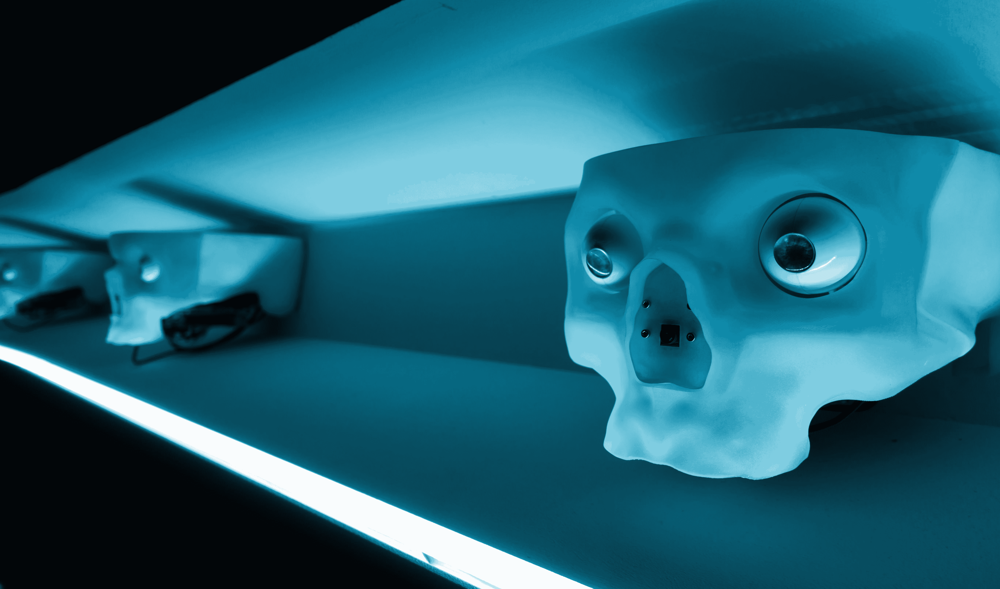
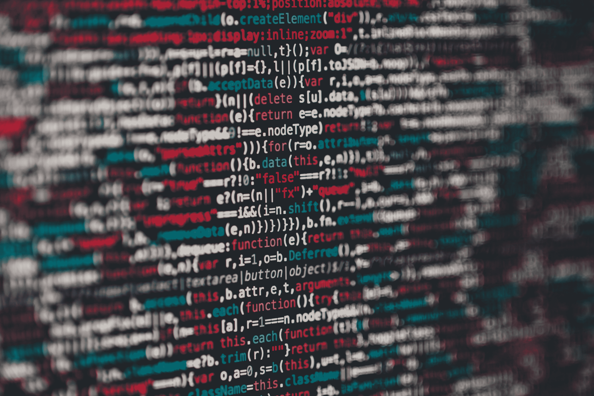

# 反欺诈、垃圾邮件过滤和反病毒系统永远不会像面部识别那样准确——这应该引起一些关注

> 原文：<https://medium.datadriveninvestor.com/anti-fraud-spam-filters-anti-virus-systems-will-never-be-as-accurate-as-facial-recognition-eb1c3f838724?source=collection_archive---------20----------------------->

Photo by [Alessio Ferretti](https://unsplash.com/@ilferrets?utm_source=medium&utm_medium=referral) on [Unsplash](https://unsplash.com/?utm_source=medium&utm_medium=referral)

自从武器出现以来，防御系统就一直在同时发展。剑造成了盾牌，核武器造成了掩体，最近病毒开始了迈克菲。

对于那些不熟悉网络安全术语的人来说，入侵检测系统(I.D.S .)负责监听特定网络上的黑客活动迹象。这些系统依赖历史数据，也就是已知攻击的证据。

这些系统最初是不可战胜的。犯罪分子和国家支持的黑客使用新的被称为 0-days(零天，因为制造商已经意识到该缺陷)的新漏洞来侵入软件。黑客们找到了伪装踪迹的新方法，比如入侵打印机等物联网设备，以利用它们进入网络。

作为过去十年这种数字猫捉老鼠游戏的结果，世界上反病毒和反欺诈领域的白帽子拥有大量多维度描述的数据。

有组织的中央集权的好人终于拥有了大多数孤立的坏人没有的武器——大数据。

Photo by [Markus Spiske](https://unsplash.com/@markusspiske?utm_source=medium&utm_medium=referral) on [Unsplash](https://unsplash.com/?utm_source=medium&utm_medium=referral)

机器学习和人工智能是成熟发达的防御者用来识别恶意意图的最新方法。

谈到反欺诈系统，机器学习可以用来通过模式识别来发现可疑的交易。通过从历史欺诈交易中构建“决策树”，数据科学家可以挖掘向模型描述坏人行为的“特征”。

有了足够的数据和足够好的特征，机器学习模型可以成功地即时预测洗钱、盗窃和账户劫持。银行和信用卡公司不是等你报告信用卡被盗，而是冻结信用卡并及时提醒客户。

这确实是一个非凡的壮举。然而，这并不意味着这些系统不会出错，没有弱点。

关于机器学习，首先要了解的是，它只能从历史数据中学习。如果你把召回汽车与可靠汽车的特征信息输入它，它可能会预测新车型是否会像过去的汽车一样出现故障。

继续汽车的例子，随着汽车随着更复杂的计算机化系统的改进和发展，它们无疑会偶尔以新的和新颖的方式出现故障。机器学习算法能够预测这些新情况吗？很可能不是。

Photo by [Pritesh Sudra](https://unsplash.com/@pritesh557?utm_source=medium&utm_medium=referral) on [Unsplash](https://unsplash.com/?utm_source=medium&utm_medium=referral)

**方差——人工智能最大的噩梦**

这个概念或“变化的数据”被称为方差。不幸的是，对于我们这边的好人来说，犯罪是一个高度变化的行业。

犯罪分子和黑客不断变化，以保持领先地位。网络内部的环境也会发生变化。垃圾邮件发送者总是找到新的方法来击败检测，因为有太多的方法来传达信息。

方差会给模型增加异常值。意外的模式或实例会破坏现有的范例，并导致模型不正确，即使它已经在大量的过去数据上进行了训练。

这就是为什么迈克菲、卡巴斯基、微软 Defender 及其公司从未成功“解决”病毒的原因。只要人们继续使用电脑，这个游戏就会继续下去。可用的排列和攻击向量是无限的，因为软件是不断变化和发展的。

每天都有新的未打补丁的虫子被释放到野外。单一模型不可能预测所有新出现的黑洞。它可能会以惊人的速度过滤许多情况以得出结论，但游戏会发生变化，如果没有更新，模型将会过时。

但是有些数据并不像数字签名那样多变。它根植于我们的 DNA。

你的脸肯定是独一无二的。没有人有完全相同的肤色、眼睛位置、下巴结构或鼻子形状。然而，这些特征的范围仅限于人类基因组。

由于这种相对较低的差异水平，数据科学家更容易创建精确到令人震惊的面部识别软件。

多年来，我们一直在张贴自己和朋友的照片，并通过“标记”为脸书这样的公司标记数据，这很有帮助。这些大规模的数据仓库现在有足够的弹药来创建人类已知的最精确的面部识别系统。

这些系统基于保持在特定定义的特征集内的数据，而不像您的反病毒软件需要不断更新新规则。

与实时可塑的代码不同，基因库的变化依赖于自然选择和突变。一旦你的脸被识别出来，就需要物理遮盖或整形手术来欺骗人工智能从图像中识别你。

虽然从表面上看，围绕交易和用户活动建立一个天生数字化的模型*应该比建立一个图像模型更容易，但从长远来看，情况并非如此。*

我们正处于一个非常有趣的时代，我们仍在学习人工智能的局限性和能力。尽管未来肯定是光明的，但我们需要尽快做出一些严肃的道德决定。