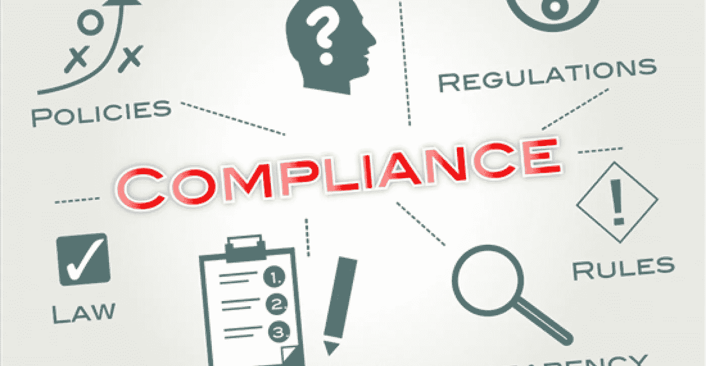

# 反洗钱法规—您的加密业务安全且合规吗？

> 原文：<https://medium.datadriveninvestor.com/anti-money-laundering-regulations-is-your-crypto-business-safe-and-compliant-dd515acde978?source=collection_archive---------6----------------------->

## ***加密货币为犯罪分子提供了一种新的洗钱方式，因此保护您的业务并保持合规非常重要。这是你需要知道的一切。***

区块链技术和加密货币的诞生为企业带来了大量机会——从加快支付流程到安全共享数据以实现更简化的流程。

然而，尽管有积极的影响，它也为实体洗钱提供了一个新的平台。事实上，欧洲政策机构负责人透露，欧洲的**犯罪分子使用加密货币来清洗大约 40 亿美元的非法资金** [**。**](http://uk.businessinsider.com/europol-criminals-using-cryptocurrency-to-launder-55-billion-2018-2)

加密货币领域最常见的洗钱案例是掩盖从毒品交易、武器交易、人口贩运和有组织犯罪等非法活动中获得的利润。

有鉴于此，世界各国政府实施了更加严格的反洗钱法规。虽然这可能会让人觉得不方便或侵犯了财务隐私，但它们对于保护您企业的未来和加密货币的使用是必要的**。**

以下是当前反洗钱法规的简要概述，以及在监管机构看来，为了保持合规，您需要做些什么。

# **反洗钱四大支柱**

根据客户群、规模、地理位置和提供的产品来决定哪种反洗钱法规适用于某个企业。但是，每个企业，无论规模大小，都必须遵守四个主要的反洗钱支柱，包括:

## *1。* ***确保持续合规的内部控制体系***

这将**识别高风险运营，让所有董事了解合规性的最新情况，并遵循客户尽职调查或 KYC 政策和流程**。内部控制系统还应使企业能够识别交易、监控可疑行为并填写所有必要的报告，包括可疑活动报告(sar)和货币交易报告(CTR)。

值得注意的是，所有受金融科技监管的比特币业务**都必须有一个交易监控计划，以成功识别可报告的交易，并有一种提交报告的方法**。不这样做是严重的违法行为，可能会被起诉。

## **2。** **独立测试您的合规程序**

**任何反洗钱合规性测试都应由独立的专业人员进行**并遵循这四大支柱作为评级方法。通过正确完成合规性测试，这将向监管者和其他利益相关者展示企业的可信度。

## **3。** **管理合规的指定人员或团队**

当指定一个人或一组专业人员来管理公司的合规性时，企业应该选择**一名在该领域知识丰富、没有任何利益冲突的合规官**。外包给专业公司或熟练的专业人员总是最好的解决方案。

## **4。** **对所有适用人员的培训**

当谈到取悦监管者时，他们希望看到在洗钱问题上对员工进行教育和培训的企业。这表明了对重要数据的应有关注和保护意愿。

监管机构将调查你开展培训的频率、出勤记录、培训材料以及针对违规者的任何内部处罚。

# **什么是了解你的客户(KYC) /客户识别计划？**

在进行任何交易之前，企业应确保他们已经检查了客户或实体是否是他们所说的那样。

被确认为**了解你的客户(KYC)** 或**客户身份识别方案(CIP)** ，这包括核实身份和保存记录、进行政府名单比较以及向客户发出通知。

这包括检查用户或公司是否被列入黑名单或受到制裁。在欧洲，它以冻结名单的形式出现，在英格兰，它以英格兰银行制裁或英国财政部名单的形式出现。

# **最终想法**

如前所述，反洗钱法规和业务持续时间取决于其性质和规模。然而，作为一家企业，**保持合规和保护自己是很重要的。这将向监管机构和有关当局表明，你是可信的，能够安全、可靠和合法地处理比特币和其他加密货币。**