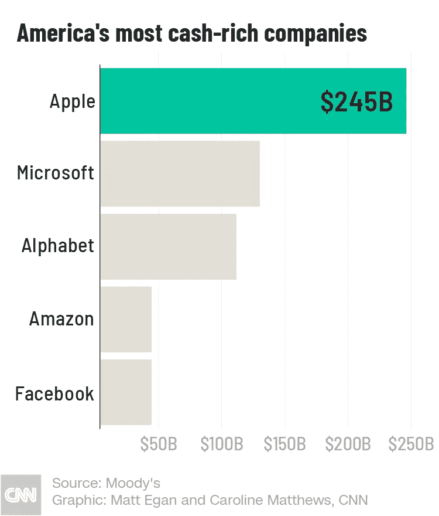
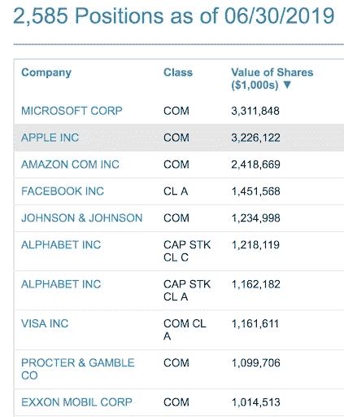

# 有没有来自拥有数十亿美元基金业务的大型科技公司的黑天鹅？

> 原文：<https://medium.datadriveninvestor.com/any-black-swans-from-big-tech-companies-with-billion-dollar-fund-businesses-7463c6382db2?source=collection_archive---------7----------------------->

Braeburn 是一种坚硬的苹果，在黄色/绿色背景上有红色/橙色的垂直条纹，原产于新西兰。但它也是苹果公司 13 年历史的全资子公司的名字。

Braeburn Capital 成立于 2005 年，旨在更好地管理苹果公司 80 多亿美元的现金储备。据报道，截至 2012 年，Braeburn Capital 是全球最大的对冲基金，管理着 1172 亿美元的资产。快进到 2018 年底，Braeburn Capital 现在管理着 2440 亿美元的金融投资组合——占苹果账面总资产的 70%！

 [## 分散金融的出现|数据驱动的投资者

### 当前的全球金融体系为拥有资源、知识和财富的人创造了巨大的财富

www.datadriveninvestor.com](https://www.datadriveninvestor.com/2019/03/14/the-emergence-of-decentralized-finance/) 

你们大多数人都知道苹果拥有巨额现金储备(尽管你们可能不知道它的子公司“对冲基金”)。苹果确实从其他西方大型科技公司中脱颖而出，尽管他们的 AUM 比去年低了 17%。

这五大现金充裕的公司管理着超过 6000 亿美元的 AUM，这难道不令人吃惊吗？作为该数据来源的[穆迪报告](https://edition.cnn.com/2019/06/10/investing/corporate-cash-buybacks-tax-cuts/index.html)显示，美国非金融公司的现金总量为 1.69 万亿美元(2018 年底)。*【1】*

这让我不禁质疑，为什么如此集中的大量企业现金也以类似对冲基金的方式进行管理，却没有被视为潜在的系统性风险因素。毕竟，历史的确提醒我们，企业金融部门是高风险的业务。

为什么不在这些问题上增加一个有争议的预期 LIBRA 储备基金呢？脸书目前的现金储备不足 500 亿美元，在当前的货币环境下，这当然是微不足道的威胁。

LIBRA reserve fund 能让脸书在子公司管理的企业现金储备排行榜上名列前茅吗？大概不会。

分享大型科技公司与基金管理业务的一些具体实现:

投资苹果股票意味着拥有一家价值 1 万亿美元的科技公司的一部分，也意味着拥有世界上最大的投资公司之一——Braeburn Capital 的股份。

投资脸书股票意味着拥有一家价值 0.5 万亿美元的技术公司的一部分，并可能通过 LIBRA investment tokens 持有初创公司 LIBRA reserve 基金的一小部分。

瑞士国家银行持有苹果和脸书的股票。与其他央行相比，SNB 的股票储备比例要高得多。

超过 10 亿英镑的 SNB 最大持股

Source: [https://www.nasdaq.com/quotes/institutional-portfolio/swiss-national-bank-913041](https://www.nasdaq.com/quotes/institutional-portfolio/swiss-national-bank-913041)

SNB 拥有的苹果数量是脸书的两倍。

如果 LIBRA 成功了，美国非金融公司管理的现金储备会从 1.69 万亿美元增长到 3 万亿美元吗？

这些由不受监管的非金融企业管理的相当隐蔽的集中现金储备会带来系统性风险吗？

来源:

[1]然而，这比 2017 年底创纪录的 1.99 万亿美元下降了 15%。

*   [美国有线电视新闻网，苹果公司的现金储备去年缩水了 17%](https://edition.cnn.com/business/live-news/stock-market-news-today-061019/h_1072b2a3ae1b3afce50987ee60e96138)
*   [Braeburn Capital，维基百科](https://ipfs.io/ipfs/QmXoypizjW3WknFiJnKLwHCnL72vedxjQkDDP1mXWo6uco/wiki/Braeburn_Capital.html)
*   《经济学家》称，苹果应该在变疯之前收缩其金融部门

