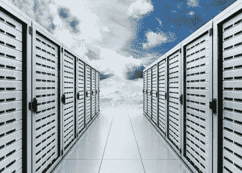

# AP/AR 数据:云数据存储 2.0 =区块链

> 原文：<https://medium.datadriveninvestor.com/ap-ar-data-cloud-data-storage-2-0-blockchain-7e32af6e34a4?source=collection_archive---------47----------------------->

***全球营销总监尼克·洛克福特-维伦纽夫—*** [***阿玛托科技***](https://www.amalto.com/)

云包括将服务器转移到异地(或转移到云中)。通过将其数据从堆积在其设施内的物理服务器迁移到云中，企业已经能够超越硬件固有的限制来扩展其运营。云存储数据确实可以在线访问，这有助于劳动力的分散。因此，多亏了云，远程工作现在变得非常方便。

区块链创造了安全、不可改变和参与性的系统网络。与云计算不同，去中心化的区块链不需要在服务器机房内。云应用程序通常在少数节点上进行冗余，但远不及以太坊这样的网络上的数千个节点。

云将服务器移出企业园区，并将处理能力集中到其他地方。区块链正在分割处理能力，并将其分散到全球各地。

# **基于云的数据存储**

正如你们现在所知，云作为一个计算系统并不在天上。在云解决方案推向市场之前，它确实与我们习惯的物理存储有些不同。我相信您还记得这样一段时间，当时您的物理服务器位于公司设施的气候控制地下室中，您需要使用一个良好的旧 ODBC 连接来连接数据库以提取数据。由于有了云，您的数据现在由(公共、私有或混合)云提供商托管，您只需通过网络浏览器点击几下鼠标即可访问。这些数据会自动填充到仪表盘和其他报告中，并立即显示在浏览器、Firefox 或 Chrome 的性感用户界面上。

此外，与运行在底层自动售货机下的物理服务器相比，云提供了更大的存储容量和灵活性，而你的素食主义同事从未涉足过底层自动售货机。如果您的组织扩张，必须存储更多数据，则可以无缝升级到更大的云空间。您实际上提前很好地知道额外的 1tb 云存储将为您的组织带来多少成本。那些拼命压低服务器公司销售代表额外硬件成本的噩梦已经过去了。

# **基于区块链的数据存储**

区块链是一个分布式账本，不需要第三方来保护或验证交易。交易记录通过技术验证，并存储在独立计算机的巨大网络中(分布式分类账)。数据一旦写入区块链，就无法更改。此外，由于一个事务有如此多的副本(每个节点或数据库一个)，这意味着至少有 51%的计算机需要以同样的方式被黑客攻击，以破坏存储在区块链上的信息。这是一个重要的安全功能，目前使区块链网络免受黑客攻击。除了数据，区块链网络还存储智能合同，一旦特定数据发送到网络，这些合同就会立即执行。合同的所有元素(数据)一旦经过验证或确认，就会存储在区块链中，供所有利益相关者(每个节点或数据库一个)随时查看，这就创造了透明度和信任。

为什么区块链技术被认为是云技术 2.0？首先，区块链网络在云端。网络中的每个节点实际上都是自己的云系统。因此，区块链在结构上没有太大的不同，只是所有的节点(云)都是相互连接的。将它视为一个云(集中式系统),有多少利益相关者就复制多少次，成为一个分散式架构。

主要区别在于以下事实:

*   存储在区块链网络内的数据不能被删除和更改
*   区块链网络几乎不可能被攻破
*   区块链网络是去中心化的系统，这意味着没有一个实体拥有整个网络的权力
*   要写入区块链，数据和交易必须通过一个称为挖掘的过程进行验证
*   智能合同自动执行交易，并存储这些交易固有的数据
*   由于数据不能被删除，区块链网络建立了一个不变的数据历史
*   区块链增强了网络参与者之间的透明度和信任，因为每个节点在网络上存储相同的数据

# **总结:2.0 秒肯定比 1.0 秒好**

是的，逻辑必胜。在区块链内存储数据的唯一而且肯定是显著的缺点是与操作相关的成本。请记住，写入区块链的数据是不可更改的，因此不能删除。因此，完整的数据历史将一直存在。同样，区块链并不适合所有人，因为会产生重要的费用。话虽如此，BaaS 提供了更便宜的选择，但正如我们现在所知，BaaS 只是有点闭塞。