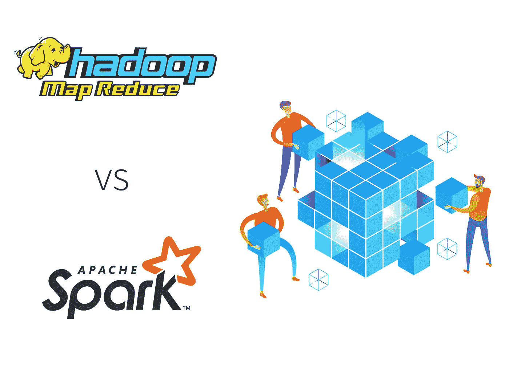

# Apache Spark vs Hadoop MapReduce

> 原文：<https://medium.datadriveninvestor.com/apache-spark-vs-hadoop-mapreduce-5c42be2a42ac?source=collection_archive---------6----------------------->

分析大数据已经成为所有行业成功的关键。企业总是试图从他们积累的一切中获得更多的洞察力，这导致了对能够给我们提供最多信息的框架的需求。为了解决这些问题，许多人转向 Apache Spark 和 Hadoop，然而，选择一个适合你的可能是一个挑战。为了帮助您做出这样的决定，我们创建了 Hadoop 与 Spark 的对比，向您展示两者的优势。

# 定义两个大数据框架

在我们开始回答更详细的问题之前，比如 Apache Spark 比 Hadoop MapReduce 快多少，先了解一下每个问题的定义会很有用。Apache Spark 是一个允许您立即分析数据的框架，主要执行内存计算。光是其惊人的速度就吸引了许多专家。此外，您将能够单独使用它作为一个工具，或者与 Hadoop YARN 结合使用。这些因素导致许多人宣布 Hadoop 的衰落，并欢呼 Sparks 的崛起是其永久的替代品。

 [## 为什么数据将改变投资管理——数据驱动的投资者

### 有人称之为“新石油”虽然它与黑金没有什么相似之处，但它的不断商品化…

www.datadriveninvestor.com](https://www.datadriveninvestor.com/2019/01/25/why-data-will-transform-investment-management/) 

就 Hadoop 而言，在 MapReduce 的帮助下，它首先存储所有信息，然后再进行处理。虽然它在速度竞赛中失败了，但它仍然非常有用，因为它可以用少量的内存处理大量的数据。

# Spark 与 MapReduce 性能对比

虽然看到 Spark 的速度并立即宣布它是赢家是很诱人的，但当我们进一步挖掘时，事情就不那么容易了。正如我们上面提到的，Spark 使用内存数据处理。然而，这意味着它将占用大量内存，因为在处理完成之前，它需要大量的数据缓存。因此，在选择 Spark 之前，请确保您有足够的内存来使用它。

如果速度不是你最优先考虑的，那么用 MapReduce 吧，因为它可以处理大量的数据而不会消耗太多的内存。Hadoop 首先存储数据，然后处理数据。它的预期目的是处理从许多不同来源收集的数据。

# Apache Spark vs Hadoop MapReduce 语言

除了处理数据的方式不同之外，这两者使用的语言也不相同。Hadoop 是用 Java 写的，但是你也会发现使用 Python 的情况。相反，Spark 是用 Scala 编写的，但也将包含 Java and 和一大堆更容易编程的其他语言。语言的选择在语言方面给了开发者更多的灵活性，也使得学习更容易。

# Apache Spark 与 Hadoop MapReduce 成本

由于两者都是开源的，您可能会完全避免安装费。然而，就发展而言，代价可能是全方位的。如果您预算紧张，Hadoop 会是一个更好的选择，因为它不需要太多的 RAM，并且可以在商用软件上运行。然而，尽管 Spark 可能需要更昂贵的系统，但它将需要更少的计算单元，这可能使您能够找到一些节省资金的领域。

如果您想知道是否需要 Apache Spark [软件开发](https://skywell.software/)，它最适合以下用例:

*   实时分析
*   分析的即时结果
*   重复性操作
*   机器学习算法

Hadoop 更适合用于:

*   分析存档数据
*   商用硬件运营
*   不急数据分析
*   线性数据处理

# 结论

虽然我们提供了一些关于 Hadoop 和 Spark 之间的区别以及为什么 Spark 比 Hadoop 更快的信息，但这在很大程度上取决于您的项目需求和您在员工方面的专业知识。乍一看，Spark 似乎是比 Hadoop 更新更好的版本，但事实并非如此，最好对大数据和 Hadoop 进行更深入的研究，看看它是否适合您。就专业知识而言，如果您的团队不习惯使用 Hadoop 或者没有任何经验，考虑到它大量使用 Java，很难用 Java 编程，学习起来可能会很有挑战性。如果是这种情况，那么使用 Spark 会更好，因为它是更容易的代码，并且带有一个交互模式，允许您在运行命令后接收即时反馈。

此外，值得注意的是，尽管我们对 Hadoop 和 Spark 进行了比较和对比，但一个好的情况是当您不必选择并且可以使用两者时。你可能已经注意到了这些框架之间的共生关系。Spark 与 Hadoop 完全兼容，并且与分布式文件系统配合良好。因此，如果你决定使用其中一个，考虑使用另一个来实现全面的分析。通过结合使用这两个框架，您将能够获得更快的分析，优化成本并避免重复。许多知名公司，如雅虎、亚马逊和易贝，已经在使用这两种组合，从他们经历的增长水平来看，这似乎对他们很有效。

*原载于*[*https://sky well . software*](https://skywell.software/blog/apache-spark-vs-hadoop-map-reduce/)*。*