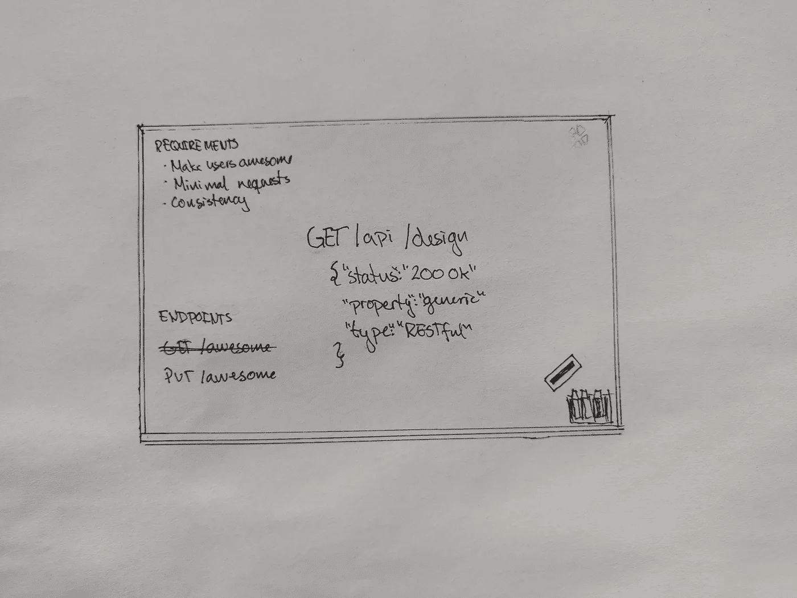

# API 101:设计一流的 REST APIs

> 原文：<https://medium.datadriveninvestor.com/api-101-designing-kick-ass-rest-apis-39e0027e1d3a?source=collection_archive---------6----------------------->

在我们深入研究如何设计 REST API 之前，让我们先简单了解一下什么是 REST API。



# 休息？

REST API 是由 Roy Fielding 在 2000 年提出的一种架构风格。由于 REST 是一种架构，所以对于如何设计一个“REST API”并没有固定的标准。Fielding 指定了 REST API 应该遵循的一组约束，这些是我们应该遵守的唯一约束。

在我的[上一篇文章](https://medium.com/datadriveninvestor/api-101-what-even-is-an-api-bd4bba29b47e)中，我已经提到了 REST API 的主要约束之一，统一接口。这意味着客户端和服务器应该能够独立发展，因为接口不会改变。

[](https://www.datadriveninvestor.com/2019/02/25/6-alternatives-to-the-yahoo-finance-api/) [## 雅虎财经 API |数据驱动投资者的 6 种替代方案

### 长期以来，雅虎金融 API 一直是许多数据驱动型投资者的可靠工具。许多人依赖于他们的…

www.datadriveninvestor.com](https://www.datadriveninvestor.com/2019/02/25/6-alternatives-to-the-yahoo-finance-api/) 

REST 中的另一个重要约束是接口必须是无状态的，因此每个请求必须包含理解请求所需的所有信息。

缓存在 REST 中也很重要，正如 Fielding 在他的论文中所说:“对于基于网络的应用程序来说，最有效的架构风格是能够有效地最小化网络的使用”

此外，界面交互也有一些限制:

*   接口的识别
*   通过表示操纵资源
*   自我描述方法
*   作为应用状态引擎的超媒体(HATEOAS)。[这种方法通常被忽略，因为它很难维护，而且在实践中经常没有用。](https://medium.com/@andreasreiser94/why-hateoas-is-useless-and-what-that-means-for-rest-a65194471bc8)

REST 的目标是将行为隐藏在实体之后，因此服务器可以自由地实现它想要的任何行为，而不用担心客户端。

关于 REST APIs，还有很多内容要介绍，但是对于更理论化的内容，还有很多令人惊奇的资源。我将在这篇文章的底部链接一些，然后我们将继续讨论如何在考虑上述约束的情况下设计一个 REST API。

由于 REST 更多的是一套原则，而不是构建 API 的实际方法，术语 RESTful APIs 被创造出来，用来表示使用 REST 原则的 API，但也在此基础上使用了更多的技术。

# 设计 API

> API 的工作就是让应用开发者尽可能的成功 *— API 设计:缺失的环节，Apigee。*

在构建 API 时，要考虑的最重要的事情是用户。这个用户很可能是一个开发伙伴，所以在构建 API 时应该考虑到这一点。

假设我们有 Alice，她是一名前端开发人员，想要构建一个漂亮的 UI 来显示您的数据。当 Alices 构建她的应用程序时，什么会使她的生活更容易？她希望自己的数据采用什么格式，她希望如何发送请求，如果您更新到新版本，对她来说什么最简单？

这些都是你在设计 API 之前应该考虑的事情。因此，使用一些晦涩的数据格式来传递数据可能不是最好的主意，即使您很乐意实现它。

在[之前的文章](https://medium.com/datadriveninvestor/api-101-what-even-is-an-api-bd4bba29b47e)中，我介绍了待办事项列表的例子。现在是扩展它的时候了。假设我们想为教程中创建的众多待办事项应用程序中的一些创建一个 API。

以下是对 API 的要求:

*   用户可以有待办事项列表
*   用户可以对他们的待办事项列表和待办事项进行 CRUD 操作
*   用户可以彼此共享待办事项列表

因为我们的 API 用户很可能是新开发人员，所以这个 API 应该简单易用。这就是为什么 REST API 是一个很好的起点。没有要跟踪的状态和统一的接口。

因此，我们的目标是构建一个简单、一致、易于理解和使用的 API。

# REST 约定

REST 是在 HTTP 之上设计的，所以如果我们坚持 HTTP 协议，我们已经很好地构建了 REST API。所以对于请求，我们应该使用 GET、POST、PUT/PATCH 和 DELETE 消息，而不是使用`/get-todo-item`、`/create-todo-item`、`/update-todo-item`和`/remove-todo-item`。

# 端点

REST 将行为隐藏在资源之后，所以我们不想创建指定行为的端点。相反，我们向同一个端点发送不同的 HTTP 请求:

```
GET /todo-lists
POST /todo-lists
PUT /todo-lists
DELETE /todo-lists
```

没有关于命名的规则，但是推荐的标准是使用资源的复数版本。选择复数还是单数其实并不重要，保持一致就好。

具体命名比抽象命名好。`todo-lists`随时胜过`todo-resource`。

# 响应代码

我们还应该指定这些请求可以得到什么响应代码。同样，默认的 HTTP 响应代码会让您走得更远。

```
GET /todo-lists - 200 OK, 404 Not found
POST /todo-lists - 201 Created, 400 Bad Request
PUT /todo-lists - 200 OK, 400 Bad Request
DELETE /todo-lists - 200 OK, 400 Bad Request
```

然后，您总是可以包含更多描述性的错误消息，但是同样没有规则。但是，您应该指定请求的结果。否则，用户不知道操作成功了。

例如

```
Bad
POST /todo-lists 200 OK
{
  "status": "error" 
}Good
POST /todo-lists 400 Bad Request
{
  "error": {
	  "status": "400 Bad request",
    "message": "Request must specify an owner"
  }
}
```

# 关系

对于相互链接的资源，有多种查询方式。一个不一定比另一个更好

```
GET /users/<id>/todo-lists
GET /todo-lists?user=<userid>
```

只要记住保持一致，如果你提供一种类型，你应该为你所有的资源提供它。这个想法是开发者应该能够用最少的文档来实现你的 API。

# 身份

这个很难做对。有很多讨论，因为一方面像`friday-todo`这样的 id 比`1234567`读起来更好，更容易记住，但是`1234567`更永久。这里有一个非常有趣的帖子。Apigee 建议两者都提供，一个看起来像`1234567`的永久链接和一个看起来像`friday-todo`的名字，这样你总是有相同的标识符，而且还有一个在搜索时容易记住的名字。

一个被认为是好的做法是包含一个到相关资源的链接，这样用户就不必提取它。

```
GET /todo-item/123
{
  "self": "/todo-items/123"
  "id": "123"
  "name": "Pick up keys"
  "parentLink": "/todo-list/1"
  ...
}
```

# 响应机构

你的回复体应该是什么样的，很大程度上取决于你提供的数据。要记住的一条一般规则是:尊重 JSON 属性。它们不应该描述单个资源，而应该是该资源的共性。

因此，在我们的待办事项列表示例中。

```
GET /todo-lists/<id>
BAD
{
	"id": integer,
	"todoItem1": TodoItem,
	"todoItem2": TodoItem
}GOOD
{
	"id": integer,
	"todoItems": [
		TodoItem,
		TodoItem,
    ...
	 ]
}GET /todo-lists/
BAD
{
  "<todo-list-id1>": {...},
  "<todo-list-id2>": {...}
  ...
}GOOD
{
  "todoLists": [
    {todoList},
    {todoList},
    ...
  ]
}
```

# 部分响应

如果您想变得非常酷，您应该考虑为部分响应提供一个查询参数。这是一个响应，用户可以指定用户想要的字段，并且该响应将只包含这些字段。再次重申，要始终如一，如果你为一个人提供，你就应该为所有人提供。

```
GET /todo-lists/<id>?fields="name, owner, createdDate"
```

# 概述

REST API 只需要以下规范:

*   一小组众所周知的网址
*   每个资源的数据模型
*   实现了哪些 HTTP 特性
*   可选的一些查询语法

如果你需要比这更多的东西，你可能会冒险超越休息。这不一定是一件坏事，但仔细线程。

我将以一句发人深省的引用 Apigee 的话来结束我的发言。设计 API 时值得记住的事情。

> 基于 HTTP 和 REST 的 API 设计的价值很大一部分来自于它给 API 带来的一致性。本质上，当你原生使用 HTTP 时，你根本不需要发明一个 API——HTTP 提供了 API，你只需要在你的资源中定义数据。”

感谢您的阅读，希望对您有所帮助！让我知道你的想法，我仍然在学习自己，很想知道你的经历。todo API 的完整规范可以在[这里](https://github.com/JohanneA/API-101/blob/master/spec.md)找到，在下一篇文章中，我们将开始构建它。

←上一篇:[什么是 API？](https://medium.com/datadriveninvestor/api-101-what-even-is-an-api-bd4bba29b47e)

下一篇文章:[构建 RESTful API 的基础](https://medium.com/@JohanneA/api-101-the-basics-of-building-a-restful-api-6f4a2f6afbaf) →

# 资源

架构风格和基于网络的软件架构的设计

[API 设计:在 URL 中的名称和标识符之间选择](https://cloud.google.com/blog/products/gcp/api-design-choosing-between-names-and-identifiers-in-urls) — Apigee

[API 设计:最佳实践和常见陷阱](https://cloud.google.com/blog/products/api-management/api-design-best-practices-common-pitfalls](https://cloud.google.com/blog/products/api-management/api-design-best-practices-common-pitfalls)——API gee

API 设计:缺失的一环