# API 安全性测试(第 1 部分)

> 原文：<https://medium.datadriveninvestor.com/api-security-testing-part-1-b0fc38228b93?source=collection_archive---------0----------------------->

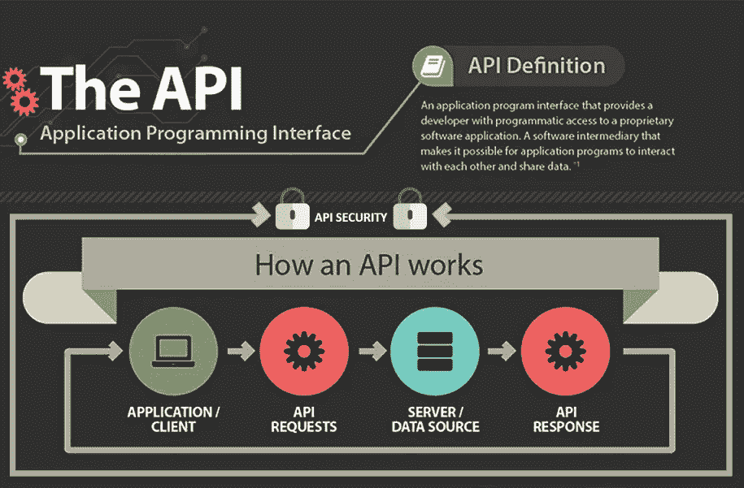

本文中提到的所有信息都是我个人的，并不是我过去或现在的雇主的意见。

API 安全测试——根据我个人的经验，对于一个笔式测试人员来说，这是一个有点复杂的领域。尽管通过彻底理解 API 文档可以简化整个测试。在真实的场景中，pen tester 团队完成活动的时间跨度是有限的。虽然每个公司都不一样。

[](https://www.datadriveninvestor.com/2019/02/25/6-alternatives-to-the-yahoo-finance-api/) [## 雅虎财经 API |数据驱动投资者的 6 种替代方案

### 长期以来，雅虎金融 API 一直是许多数据驱动型投资者的可靠工具。许多人依赖于他们的…

www.datadriveninvestor.com](https://www.datadriveninvestor.com/2019/02/25/6-alternatives-to-the-yahoo-finance-api/) 

什么是 API？

API 代表 ***应用编程接口***

如果你想了解 API 是如何工作的，请记住你在赛百味的订单。在那里你可以选择你自己的面包，你的配料等，并根据菜单点菜。类似地，API 列出了开发人员可以使用的操作数量，并描述了这些操作可以做什么。

API 是让开发人员的生活变得简单的所有手段。它控制资源，并控制资源和服务之间的通信。例如，您可能已经多次看到您的 web 浏览器想要知道您的位置。通俗地说，这是一个 API 调用。计算出你的 GPS 位置和目的地是由应用程序完成的。

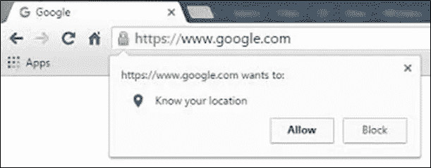

现在，大多数 Pen 测试人员都对 API 和 Web 服务心存疑虑。API 和 Web 服务测试是相同的还是不同的？

两者都是通信手段，当其 Web 服务时，通信发生在互联网上。你可以说所有的 web 服务安全测试都是 API 安全测试，但是所有的 API 安全测试都不是 web 服务安全测试。

API 通信发生在应用程序之间，它可能通过内部网或互联网。所以通常你会发现测试用例是一样的，我们用来访问的工具(通常是 POSTMAN)也是一样的。

现在让我们关注 API 调用中的安全缺陷。
有两种 API。一种是休息，另一种是肥皂。你可以说 REST 是新的，而 SOAP 是旧的。外行来说，SOAP 比 REST 复杂。更多关于这两者的东西来满足你的技术好奇心。

**SOAP** —简单对象访问协议

**静止** —表象状态转移

从它的缩写，你现在知道 SOAP 是一个协议，而 REST 是一个架构。

从安全的角度来看，我们将只讨论主要的区别，而不是全部。

SOAP API 是由官方标准组成的，而 REST API 不是。这实际上使得 REST API 易于使用和部署。

**REST** 用途:HTTP、JSON、URL 和 XML

**SOAP** 用途:主要是 HTTP 和 XML

由于这些原因，REST 比 SOAP 更受开发人员的欢迎。还有一个原因是“REST APIs 用 JavaScript 更方便”。尽管 SOAP 与 JavaScript 兼容，但它对大型实现的支持是有限的。所以，现在你会发现 SOAP 大部分都是遗留应用程序。

从安全分析师的角度来看，我有点偏向于 SOAP，因为它为黑客提供了较少的入口点。为什么会有这种想法？因为它只支持一种输出类型 XML，而 REST 支持 XML、JSON，有时还支持 CSV。

除此之外，是什么让 SOAP 比 REST 更安全呢？

这两种格式都支持安全套接字层，用于传输过程中的数据保护，但 SOAP 也支持 WS-Security，用于企业级保护。它现在可能已经回答了你的问题。

当您处理像银行账号这样的重要私人信息时，使用 SOAP 更有意义。然而，如果您将当天的天气预报发送到移动应用程序，SOAP 的额外安全性是不必要的。

当涉及到在 REST 和 SOAP 之间进行选择时，我们让开发人员来决定。

现在让我们来看看测试用例以及工具和环境的设置。你可以在这里使用免费和付费版本。免费版本工具对于完成一个彻底的测试也是足够有效的。

**工具**:邮递员和打嗝套件

**OS** : Windows 平台

邮递员:[https://www.getpostman.com/downloads/](https://www.getpostman.com/downloads/)

**打嗝组曲**:[https://portswigger.net/burp](https://portswigger.net/burp)

一旦下载，就像安装普通应用程序一样简单。下面截图请找邮递员。它看起来会像这样。你可以用你的邮件登录，也可以跳过它。

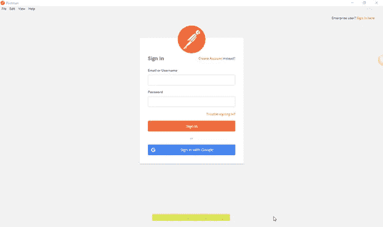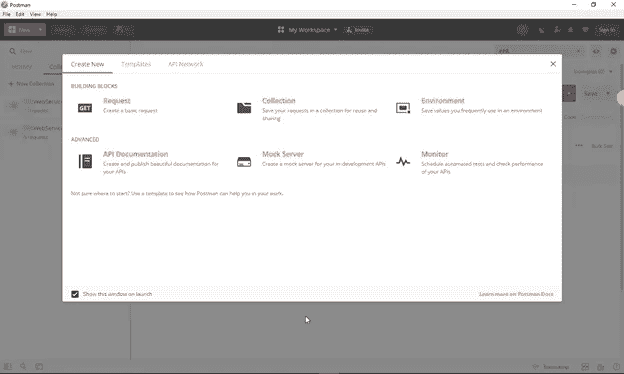

因为这里假设笔测试人员具有笔测试活动的基本知识，所以他/她将熟悉 burp 套件的安装和代理设置。因为这是一篇面向 API 安全性测试的文章，所以只涉及与 API Pen 测试相关的部分。

现在，您可以转到文件选项卡，然后设置，在那里您可以设置您的代理来接受 Burp 中的所有请求，以便于测试。

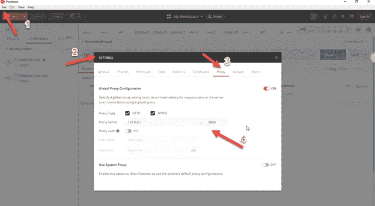

现在，一旦设置完成，我们就可以开始笔测试了。

请记住最重要的一点，API 文档收集和开发团队的演练必须在测试之前进行。否则，我们不会对我们的测试有太多了解。没有 API 文档。一切都将是黑暗中的枪声。

再给你一个提示，如果你能从开发者那里收集样本 API 调用和环境，这将是一件非常容易的事情。

可以简单的导入 API 调用和环境，省去了很多手工。

***导入 API 调用*** :

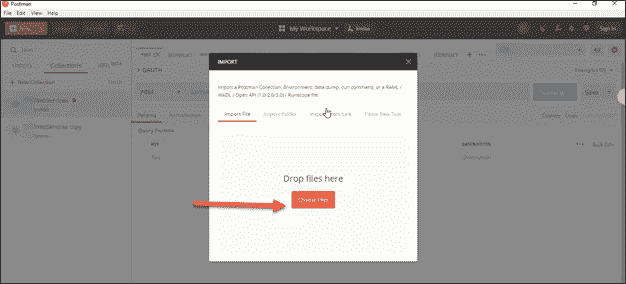

***设置环境变量:***

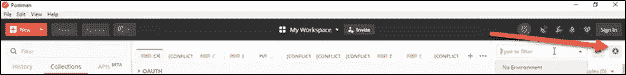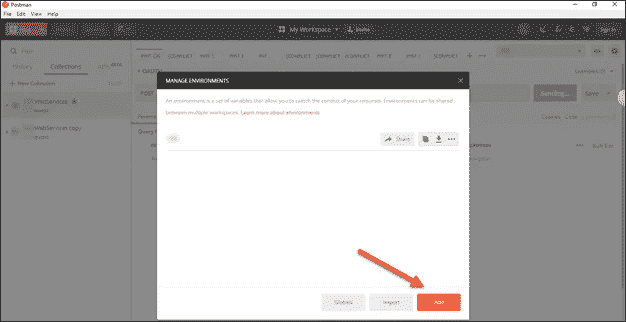

让我们开始吧:

**步骤 1:** 我们知道，如果不登录网络应用程序，我们就无法查看/使用所有功能。同样，API 需要身份验证令牌才能登录。在这种情况下，给出了 json 令牌的例子。

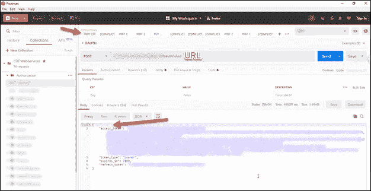

**分析访问令牌**:这里必须完成最重要的漏洞检查之一。

如果你去网站**[**【https://jwt.io/】**](https://jwt.io/)**，在那里你会找到下图:****

****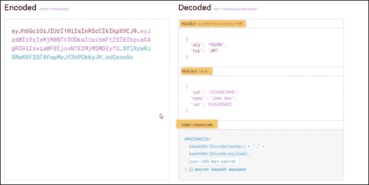****

****这是一个 JSON 标记，是 base64 编码的值。它由报头、有效载荷和签名三部分组成。****

****如果你看上图，你会发现 HEADR 包含算法(alg)和它的类型(typ)。这里的算法是 HS256，类型是 JWT (JSON Web Token)。****

****头是用户名和密码。签名是秘密值的散列值。现在，您可以在这里执行与会话管理相关的测试，即敏感数据暴露测试。****

******第二步:**除了访问令牌，你还会发现一个刷新令牌。它在身份验证后保持用户登录方面起着重要作用。****

****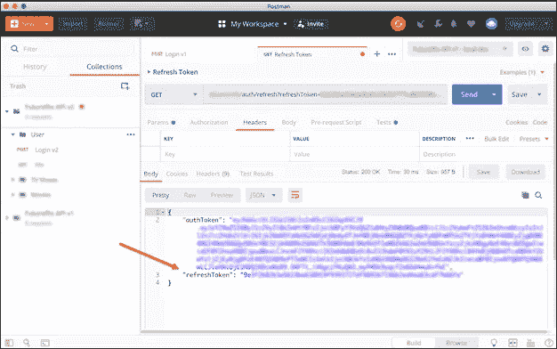****

******什么是刷新令牌，他们为什么来图？******

****刷新令牌表示获取新的访问令牌所必需的信息。在技术术语中，每当需要访问令牌来访问特定资源时，客户端可以使用刷新令牌来获得由认证服务器发布的新的访问令牌。****

******测试用例用** **刷新令牌:******

****因为它也是作为访问令牌进行 base64 编码的，所以您会发现与访问令牌类似的功能。****

****会话管理测试案例和敏感数据暴露测试案例可用作访问令牌。****

****到期日期限至关重要。就其本质而言，刷新令牌比访问令牌寿命长。****

******步骤 3:输入验证测试******

****检查所有注射入口点。****

****测试用荐注入**、** html 注入**、**和 sql 注入。****

****如果应用程序易受注入攻击，紧接着对所有参数、头、URL、cookies、JSON、SOAP 和 XML 数据输入进行彻底的自动化测试。****

****作为一个基本的例子，假设您向一个 API 发送一个请求，在其中一个查询参数中，您有以下命令:`?command=rm -rf /`。如果 API 没有正确整理或验证该参数中的数据，它可能会运行该命令，从而破坏服务器的内容。****

****显然，对于任何 web 服务来说，命令注入都是最有害的漏洞之一(T2)。以下是测试这些漏洞的几种方法:****

******API 请求中的操作系统命令******

****一个好的起点是确定 API 运行的操作系统，通常是 Linux 或 Windows。从那里，尝试在 API 请求中发送将在该操作系统上运行的命令。以下面的情况为例，API 请求通过名称删除文件:****

```
**$fn = $_GET['filename'];system("rm $file")**
```

****如果用户的请求在`filename`参数中发送了一个恶意命令，它将被执行:****

```
**https://example.com/delete?name=file.txt;rm%20/**
```

*****这个例子来自* [*OWASP wiki*](https://www.owasp.org/index.php/Command_Injection)****

****作为一名软件测试人员，熟悉不同的操作系统和命令是有好处的，这样你就可以在这些测试中发挥创造力。****

******第四步:API 认证测试******

****虽然您会发现许多与身份验证相关的问题可以通过令牌分析来解决。必须密切关注用户会话管理问题:****

****用户权限提升测试:例如，一个用户的访问\刷新令牌不应该被另一个用户接受。****

****用户中的“id”参数:他们是顺序的吗？这个问题要边测试边问边答。****

*******续…..*******

****请在[领英](https://in.linkedin.com/in/saumya-prakash-rana-4287b990)上关注我。****