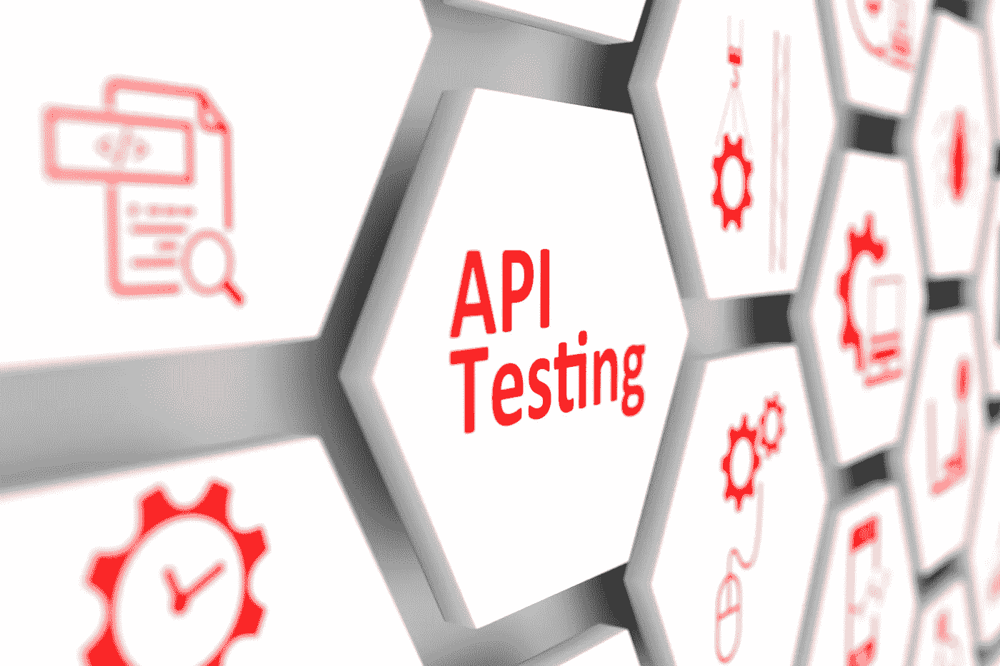

# 面向初学者的 API 测试教程

> 原文：<https://medium.datadriveninvestor.com/api-testing-tutorial-for-beginners-e101d7f38f93?source=collection_archive---------13----------------------->

软件开发的一个重要而又困难的方面是 API 测试，因为它包含了许多我们在开发过程的其他部分不会遇到的元素。在大多数情况下，只测试 API 应该具备的最低要求，但是，在现实中，您负责测试一切以确保它的功能以及所有的安全特性。然而，拥有一个没有故障的值得信赖的 API 会对您的产品产生深远的影响。在我们进入 API 测试的所有细节之前，让我们对这个过程有更多的了解，稍后我们将了解一些用来完成工作的工具。

# 什么是 API 测试？

通俗地说，API 测试就是确保 API 没有任何问题，不会妨碍它正常运行。尽管 API 测试过程既昂贵又耗时，但是发布一个 API 中有缺陷的产品是很危险的，所有的安全漏洞可能会让你付出更大的代价。虽然有许多业务和技术原因需要确保您的 API 一切正常。下面我们列出了公司决定继续这一过程的五个主要原因:

1.  确保功能正常
2.  确保它能够承受工作负载
3.  考虑用户端可能出现的所有问题
4.  验证它是否适用于所有设备
5.  违规可能代价高昂

无论何时你投资于 API 测试过程，它都会产生一个更好的最终产品。如果您知道所有的数据都通过 API，这将使您的测试和遵从过程更加容易，因为只有一个接口。通过确保所有必要的业务规则都在 API 级别上得到遵守，可以在用户界面可用时进行更全面的用户体验测试，而不必在项目的最后阶段关注每个单独的业务规则。

# 如何测试 API

测试您的[软件商业解决方案](https://skywell.software/)的 API 从围绕您的 API 设置必要的环境和正确的测试规则开始，以确保您想要测试的特性会被准确地锁定。这将需要调整数据库和服务器，以满足应用程序运行所需的一切。当测试环境启动并运行时，在开始严格的测试之前，执行一个 API 调用来验证一切都正常工作。现在，您可以开始将从应用程序获得的数据与 API 测试相结合，以确保所有已知输入可能性的功能。请记住，有很多 API 测试:

*   功能测试——验证一切都正常运行
*   可靠性测试—验证 API 每次都产生相同的结果
*   负载测试—验证 API 处理必要数量的调用的能力
*   消极测试——考虑所有可能的错误用户输入，对它们进行测试

最常用的 API 测试软件之一是放心，这在您使用 Java 时非常有用。它可以用来测试基于 HTTP 的服务。它是专门为测试目的而创建的，可以与您已经拥有的任何基于 Java 的自动化框架集成。另一个伟大的工具叫做邮差。这对于一些快速的 API 测试非常有用，而不必总是考虑其他选项可能带来的开销。它的界面比大多数其他 REST 客户端丰富得多，因此非常易于使用。因此，如果您的团队需要测试 API，并且也有一些方便的东西允许他们自动化某些解释性 API 测试过程，这无疑是您的一个很好的选择。

此外，记住没有完美的工具是很重要的。每一个都有自己独特的需求，而且几乎所有的需求都能很好地工作，但是这取决于你的团队的具体需求。

我们希望这篇 API 测试教程向您展示了，尽管测试 API 很复杂，但它肯定是一个可管理的过程，更重要的是，它非常重要。如果测试过程没有正确完成，它会在 API 应用程序中和调用应用程序时产生许多问题。一旦你的 API 已经过测试，并且你已经验证了它能正常工作，那么就把你所有的 API 文档整理好，这样如果有人想和你的平台集成，他们就会知道他们能从你的应用程序的每个特性中得到什么。如果你有一个很棒的 API，你想把它展示给其他开发者，这样他们就可以集成，但是没有必要的文档，任何人都不可能知道他们可以用你的 API 做什么。当你提供糟糕的 API 文档时，它真的会减慢开发过程，这就是为什么你写下所有函数的所有描述以及数据类型的描述是非常重要的。

API 是我们今天使用的应用程序和网站的核心，如果你的应用程序有一个不可靠的 API，它可能会阻止很多用户访问你的应用程序。

*最初发表于*[*sky well . software*](https://skywell.software/blog/api-testing-tutorial-for-beginners/)*。*