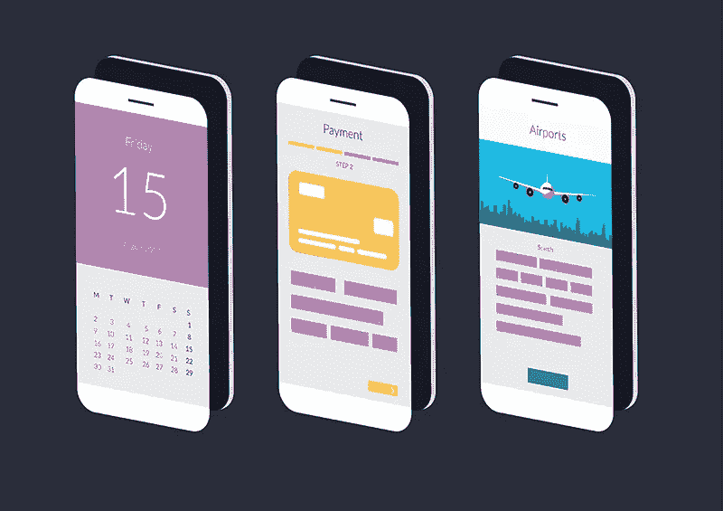
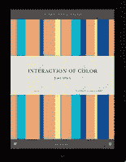
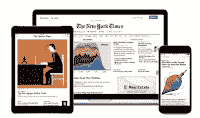
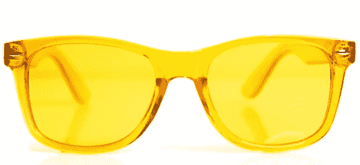
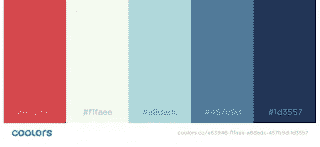
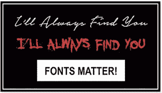
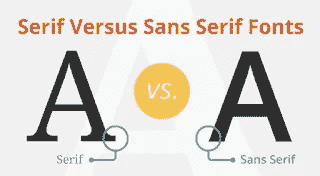
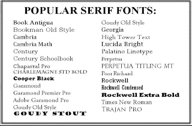
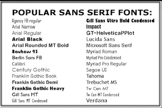

# 应用程序设计很重要

> 原文：<https://medium.datadriveninvestor.com/app-design-matters-749e119b34fc?source=collection_archive---------0----------------------->

像设计师一样思考的开发人员

有超过 200 万个 IOS 应用程序和 380 万个 Android 应用程序可供选择。所以一个优秀的 App 设计至关重要。任何用户只需轻敲 3 下，就可以删除你的应用。如果用户感到沮丧或对应用程序没有情感联系，就会出现这种情况。最重要的是，用户爱上一款应用是因为它的设计和易用性。单靠功能和正确的编码是卖不出一款应用的。

如今，只有少数开发者能够开发出出色的应用。但是开发者的关键是像设计师一样思考。程序员以无视设计而闻名。他们关心代码的美观和特性的数量。

颜色很关键。开发者需要停下来，像设计师一样思考。**设计师考虑色彩和排版**。他们学习颜色的情感。

约瑟夫·艾伯斯，著名画家、教育家，出身于德国艺术学院包豪斯。他在 1963 年写了《颜色的相互作用》。这些文字一直是设计师的艺术设计圣经；一个极好的资源。而且还有一个[交互的颜色](http://yupnet.org/interactionofcolor/) App 教这个东西。开发者应该玩这个 App，学会像设计师一样思考。

设计的下一个基础是排版。你如何选择形式和功能都最好的字体？如何选择可以搭配使用的字体？正确的字体会让你的应用程序或网站吸引人，易于阅读和功能。

应用程序设计中的色彩基调和字体设计

**色彩情绪**

红色代表能量、强度和爱。

黄色代表快乐、幸福和智慧。这是一种引人注目的颜色。这是应用程序商店中应用程序截图的好颜色。

绿色销售安全、食品和增长。在食品和健康应用中使用这些颜色。

蓝色出售稳定、宁静和信任。医疗 app 用蓝色。所以为了让你的应用更值得信赖，使用蓝色

紫色代表女性、皇室和财富。理财应用使用这种颜色。

要组合颜色，拿一个色轮。使用色轮，您可以选择和谐的相邻颜色或互补的相反颜色。色轮对于挑选分割色和三色色(不是扇形)也很有用。单色也在今天使用。所有这些方案都可以用调色板来实现。

但是一个更简单的方法是使用基于原色的 coolors.co。浏览对您的应用程序最有意义的方案。使用看起来和感觉都不错的颜色搭配。寻找可能适用于你的应用程序的最佳或最受欢迎的方案。另一个有用的网站是 [ColorHunt](https://colorhunt.co/) 。

现代应用程序中最流行的调色板之一可以在 [FlatUIColors](http://www.flatuicolors.com/) 上找到。你会惊讶有多少应用程序使用 FlatUIColors。

**排版**

这么多字体，如何为你的 App 挑选合适的字体？有关系吗？

两种最重要的字体是衬线字体和无衬线字体。下图显示了不同之处。衬线字体比较老，字体小。它们来源于石雕。无衬线更适合现代和当代用途。

**衬线字体**分为旧式、过渡、现代、平板衬线、手写体和装饰字体。

由于旧纸的质量差，平板衬线被开发用于报纸印刷。

**无衬线字体**

这些是更现代的字体，它们也被分成不同的类别。

新闻哥特式，怪诞，Helvetica，新怪诞，Arial，人文主义和几何。

那么，为什么所有这些都很重要？这与样式有关，但也与可读性有关。所以让我们开始吃肉吧。

**字体的常用规则。**

**1。Sarif 标题字体和 Sans Serif 正文字体是很好的设计。你也可以反过来也没问题。只是不要把有衬线的标题和有衬线的正文或者没有衬线的标题和没有衬线的正文组合在一起。这是一个糟糕的设计。**

**2。**字体太多不好。一页上尽量不要超过三种字体。

**3。就像颜色一样，字体出售一种情绪。所以不要把不同的字体情绪混在一起。它对大脑是混乱的。保留同一时间内同一页面上显示的字体。**

**4** 。使用字体粗细(如粗体)进行对比。但是不要与多个权重混杂在一起。

**5** 。永远不要使用这些字体:漫画桑，Viner，克里斯汀，纸莎草，Curlz。

像颜色一样，有一些工具可以帮助你选择字体。为 Chrome 或 Firefox 抓取 [WhatFont](http://whatfontapp.com/) 。这个小小的浏览器扩展或应用程序版本，可以让你找到你在网页上看到的字体。所以如果你看到一个网站有漂亮的外观和易读的字体，使用 WhatFont 来找出那些伟大的字体是什么。然后在你自己的应用程序或网络中使用它们。

一个有免费字体供商业使用的流行网站是[字体松鼠](https://www.fontsquirrel.com/)。

另一个在你的应用程序中抓取和测试字体的工具是[天空字体](https://skyfonts.com/)。这让你可以测试来自许多字体库的驱动前端，比如谷歌、Fonts.com、Monotype 和 MyFonts。

感谢阅读。

*Best Camera Apps 不赞助任何评论或提及的产品，也不从中获取收入。*

*原载于 2018 年 8 月 23 日*[*www.bestcameraapps.com*](https://www.bestcameraapps.com/2018/08/app-design-matters.html)*。*