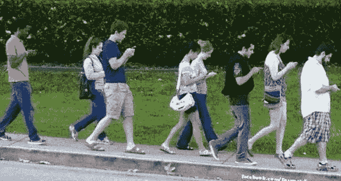

# 苹果:苹果崩溃的 10 大原因

> 原文：<https://medium.datadriveninvestor.com/apple-10-reasons-apple-is-crashing-ddc76dec65ec?source=collection_archive---------14----------------------->

Electronic Zombies

上周，苹果的股东遭受了巨大的打击。他们损失了公司近 10%的价值。考虑到苹果的规模和对市场的意义，这是巨大的。换个角度来看:

> 在昨天令人失望(但不可避免)的苹果收益电话会议之后，该公司的股票在盘后交易中下跌了 8%以上。对于那些在家关注苹果的人来说，这意味着苹果的市值暴跌了 400 多亿美元——相当于网飞的整个市值。

*   苹果股票暴跌抹去 400 亿美元市值——cultofmac.com

苹果责怪谁/什么:

> 蒂姆·库克指责关税导致中国经济放缓。“我们认为，中国的经济环境受到了与美国贸易紧张局势加剧的进一步影响，”库克写道。

基本上，这又一次归结到与唐纳德·特朗普(Donald Trump)对华贸易战有关的政策。我并不是说特朗普的政策没有直接影响，但是我认为美国最伟大的公司之一存在更大的问题。让我们深入探讨一下:

1.  **电子僵尸(eZombies)，它们正在苏醒！**iPhone 是过去 10 多年来一直拥有的手机。他们太不可思议了。这个产品从根本上改变了我们的社会。他们是如此不可思议，他们已经建立了一个电子僵尸“军队”。我记得几年前走过亚特兰大哈特菲尔德杰克逊机场。这是世界上最繁忙的机场之一。我坐在椅背上，看着一群人被他们的手机牵着走。看到这真让人难过。我想人们正在意识到，“这东西控制了我的生活！”我认为人们开始觉醒，重新开始他们的生活，或者对一些年轻人来说更糟。年轻人，没有 iPhone 或电子小工具，你也可以生活。人们只是厌倦了这些东西。
2.  **苹果是 OTP“一招小马”吗:**我觉得他们只是没有人愿意承认真相，包括苹果。平板电脑市场在衰落！这不仅适用于 iPad，也适用于其竞争对手。人们喜欢键盘。此外，我的手机几乎和平板电脑一样大，为什么我需要一个。我喜欢苹果电脑系列，现在专门使用它们。我家里用的那个很棒，已经用了将近 4 年了。我只是不需要新的，我也不打算出去买一个，因为新的没有苹果灯在后面。苹果有一个可行的产品:iPhone。这条产品线的任何销售下滑都会造成伤害。
3.  **苹果:创新多吗？我的苹果 5(不管它是什么:Pro，C，S，LMNOP)很好。它很小，适合我的口袋。效果很好。它足够快，做了我想要它做的一切，除了！它不会游泳。是的，我的 iPhone 不小心掉进池子里了！而那就是我上一部 iPhone 的死亡。所以我去商店看了看。产品变化不大。但是，摄像机约翰。但是约翰…别说了…我 5 号相机上的相机没问题。我最终得到了 XR。不错的手机，但它太大了！我需要三只手来使用它。操作系统基本一样。新的界面肯定更明亮，但我的 5 已经足够好了。我的新 iPhone 会游泳，这很好。除了旧的 iPhone XR 坏了之外，没有什么真正的“必备”功能迫使我购买新的 iPhone XR。**
4.  **苹果有一个坏名声:**苹果被发现故意用补丁拖慢老款设备。这不利于你的声誉，并证明你是一个贪婪的公司，利用其非常忠实的消费者基础。如今人们抗议一切，所以这样做是行不通的。
5.  **国王死了:**史蒂夫·乔布斯走了！休息就是和平。随着他的去世，一位科技英雄也走到了尽头。他创办了苹果，然后离开又被带回来，因为他们需要他。他们仍然需要他，蒂姆·库克不是史蒂夫·乔布斯。史蒂夫·乔布斯在苹果引领真正的创新，拥有狂热的追随者。蒂姆·库克没有错，但他不是史蒂夫·乔布斯。他不得不追随科技界最大的行动。那些是大鞋子。
6.  **耳机接口:**我拿到了 XR！伙计，我想念我的耳机插孔。手机自带的耳塞就是不削。它们从我的耳朵里掉出来。所以，我出去买了两个适配器。我花大价钱买的那个愚蠢的 XR 手机没有适配器！苹果公司在发货时会附带一个耳机适配器。我有我喜欢的 Bose 耳机。它们现在已经没用了。我不喜欢的另一点是，我不能一边听音乐一边给手机充电。我知道，有一个解决办法，但是我不想付钱。
7.  **成本**:新 XR 贵！我放弃了耳机，不能一边听音乐一边充电。我有一个比 iPhone 5 稍好的产品，我花了一大笔钱买了它。花费太大了，我的孩子将不得不接受他所需要的手术。(开玩笑)
8.  **竞争对手**:有很多竞争对手提供其他设备和操作系统。三星有一个伟大的产品，以及许多其他替代产品。苹果最大的竞争对手是二手手机。我可以去易贝，用将近一半的价格买一部二手手机。
9.  苹果会失去很多东西:苹果是第一个万亿美元的公司。保持势头很难。大幅增长是困难的。他们只是自己成功的受害者。
10.  **自作自受**:苹果最近最大的创新之一是“屏幕时间”应用。然而，他们不得不这样做，这对生意不利。这个 app 基本上就是告诉你你对手机上瘾了，告诉你你用了多少时间盯着那该死的东西。是的，这是你应该知道的好数据。这确实让人们意识到他们的行为，并说:“该死，我在这件事上花了太多时间。”让我把它放下，来一次真正的对话。另外，我真的需要给我的食物拍张照，然后发到脸书上吗？由于尴尬的新闻和隐私问题，脸书最近也遭受了巨大的打击。脸书，面对现实吧，社交媒体也是一种瘾。我真的需要在社交媒体上发布我觉得有意义的每一个瞬间的照片吗？不，是苹果自己做的！

我可以继续下去。从面部识别到 home 键都没了！理由很充分。作为人类，我们总是在为我们生活中的大规模毁灭寻找一个变量。苹果的衰落不是一个单一的变量，而是一系列多变量的问题。对不起'从来没有王牌'和'让我们责怪中国'的人。我觉得比特朗普大一点。我认为我们已经厌倦了发短信，在社交媒体上发布图片，以及购买一个非常昂贵的产品，这个产品与我们上一个设备没有什么不同。电子僵尸开始厌倦了！欢迎回来，僵尸们！去看看大自然或者买一只狗吧！:)

伙计。我想念我的翻盖手机！