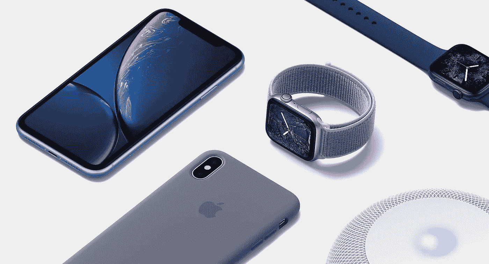
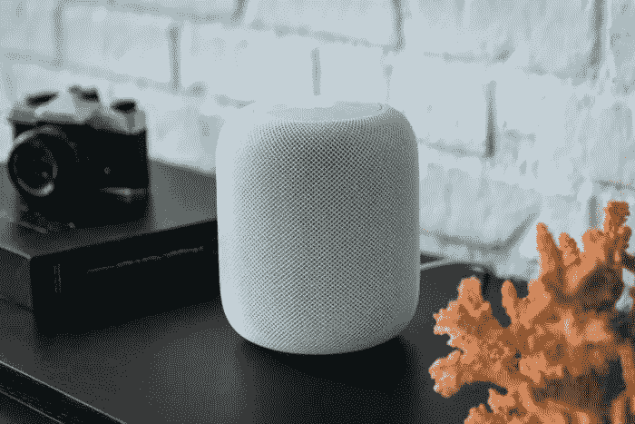
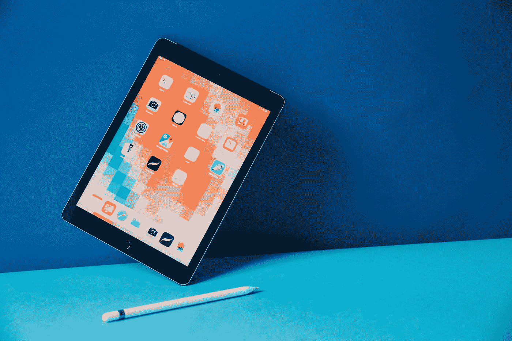
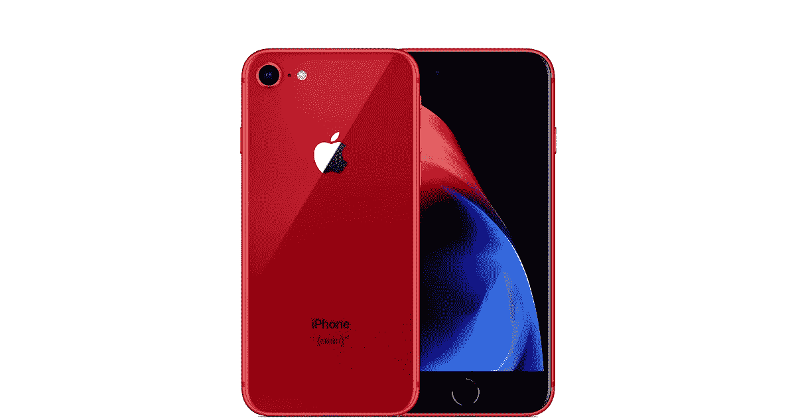
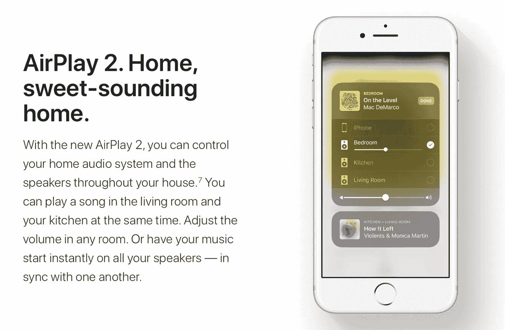
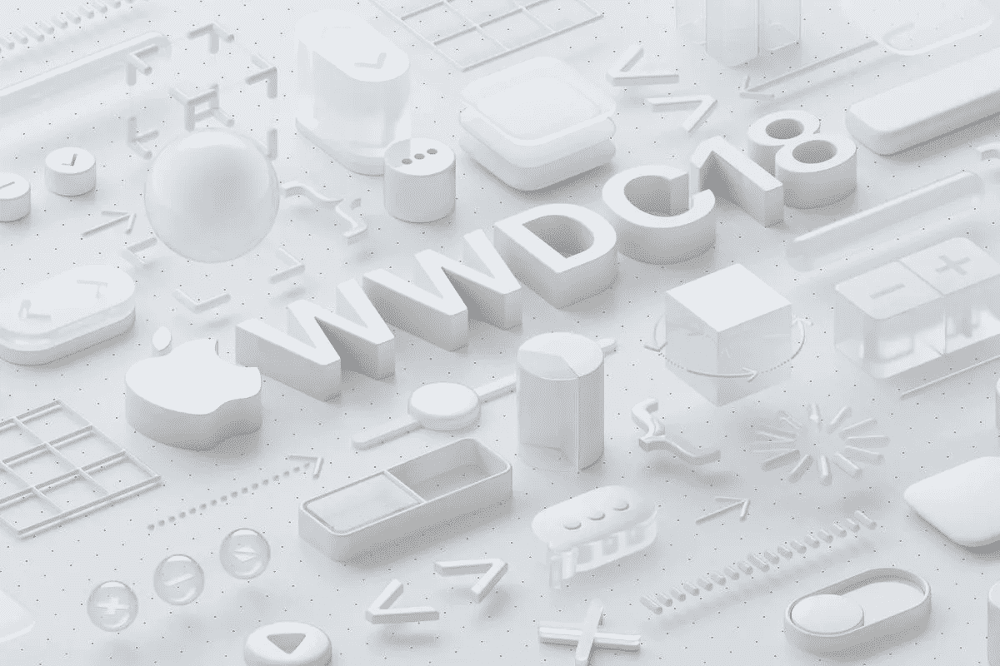
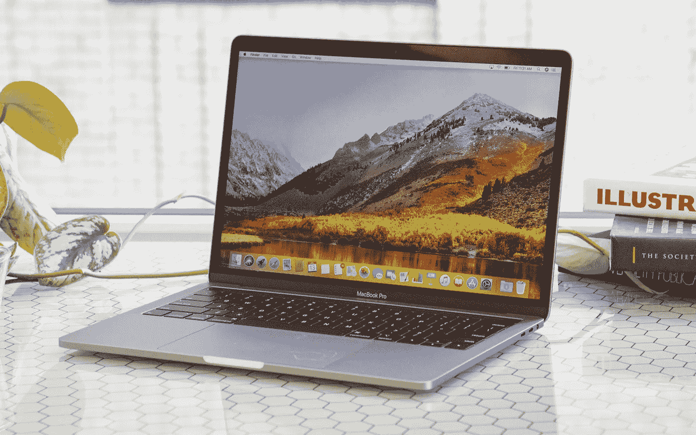
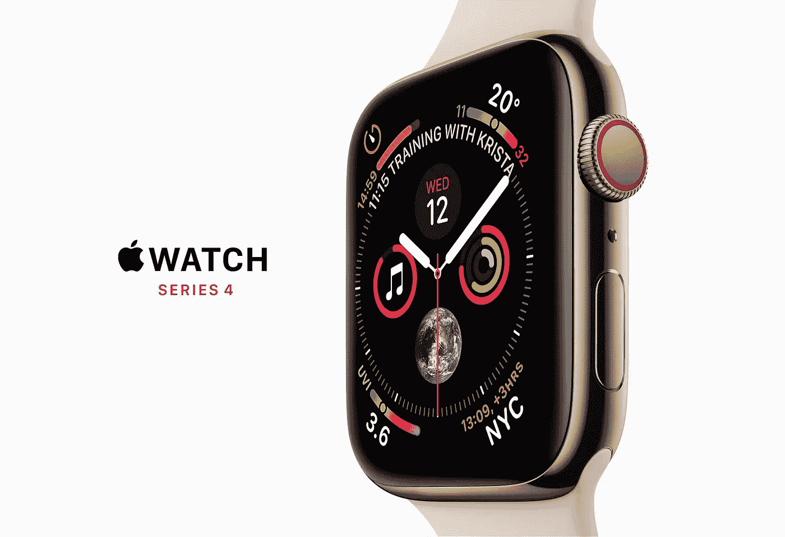
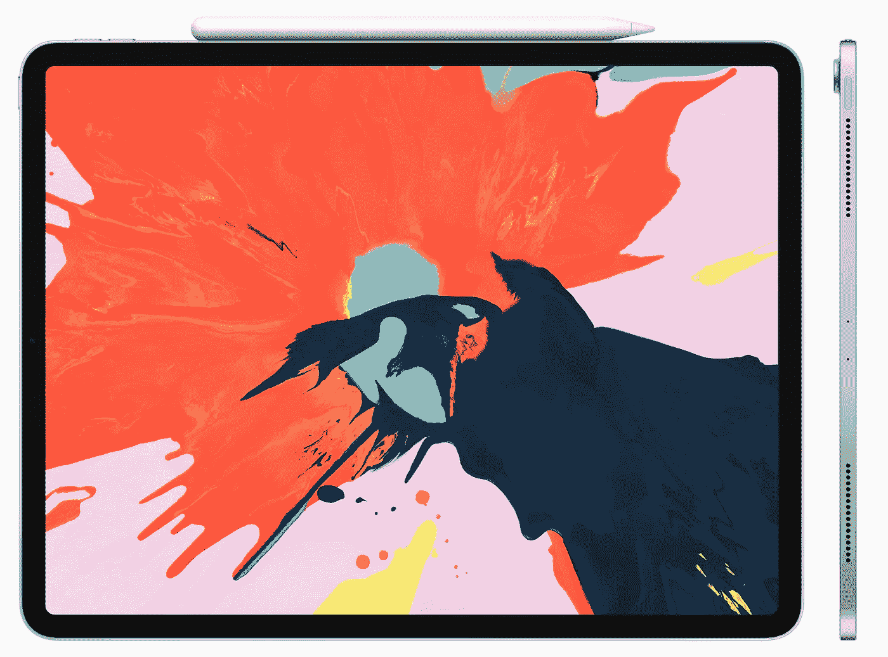
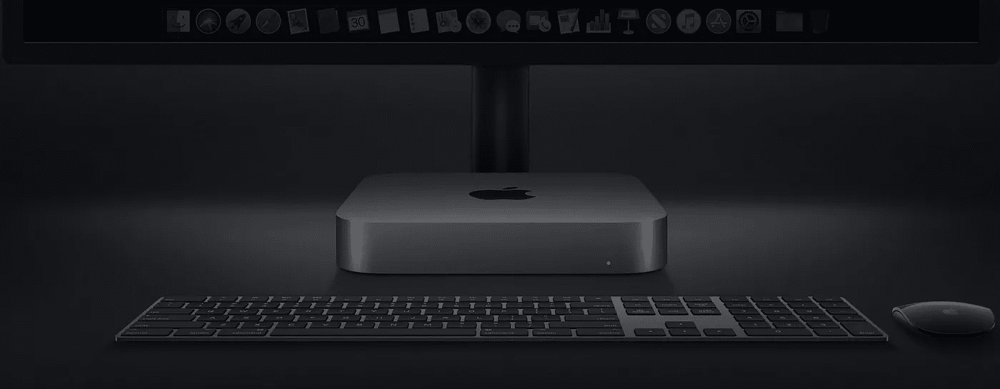

# 苹果为什么在 2018 年苦苦挣扎:回顾

> 原文：<https://medium.datadriveninvestor.com/apple-2018-retrospective-21a06d1f82db?source=collection_archive---------16----------------------->

Photo courtesy of Apple

抛开个人偏见，苹果客观上是当今最重要的科技公司之一。或者至少，肯定是最有影响力的。

如果你怀疑这个事实，想想这个:iPhone 发布后不久，几乎被一致认为是智能手机的黄金标准。因此，许多其他公司都从苹果那里寻找消费者和移动技术可能会成为什么样的线索。通过模仿苹果的产品，这些公司最终强化了苹果对未来的愿景。

简而言之，在我们生活的世界里，我们今天使用的许多产品，不管有没有苹果的标志，都是按照苹果的形象制造的。

但 2018 年对苹果来说并不是最好的一年，尤其是在 iPhone 方面。经过几代相同的外形和令人厌倦的设计，苹果公司推出了 iPhone X，作为 iPhone 的下一次进化。一个最大的特点是取消了 home 键。作为补偿，iOS 获得了一个新的基于手势的用户界面，试图让我们比以往任何时候都更接近全屏幕平板电脑的梦想。

虽然新的手势控制和外形使它一开始有些两极分化，但许多评论称赞 iPhone X，称它为“[未来的智能手机](https://thewirecutter.com/reviews/iphone-x/)”事实上，iPhone X 对智能手机未来的描述令人兴奋不已，以至于在 2018 年初，炒作才刚刚开始消散。

既然我们已经进入了新的一年，是时候回顾一下苹果 2018 年最大的硬件和软件发布会了，特别要注意那些事后看来显而易见的错误，同时也要给苹果的几次成功给予应有的信任。

# 目录

*   [苹果**HomePod**](https://medium.com/@daneoleary/apple-2018-retrospective-21a06d1f82db#0ff7)
*   [**iPad 2018 带铅笔支架**](https://medium.com/@daneoleary/apple-2018-retrospective-21a06d1f82db#aa42)
*   [**产品(红色)iPhone 8&iPhone 8 Plus**](https://medium.com/@daneoleary/apple-2018-retrospective-21a06d1f82db#13ad)
*   [**AirPlay 2**](https://medium.com/@daneoleary/apple-2018-retrospective-21a06d1f82db#0bd0)
*   [**WWDC 2018**](https://medium.com/@daneoleary/apple-2018-retrospective-21a06d1f82db#e155)
*   [MacBook Pro 2018](https://medium.com/@daneoleary/apple-2018-retrospective-21a06d1f82db#9c9d)
*   [**iPhone XS&iPhone XR**](https://medium.com/@daneoleary/apple-2018-retrospective-21a06d1f82db#18c6)
*   [**Apple Watch 系列 4**](https://medium.com/@daneoleary/apple-2018-retrospective-21a06d1f82db#29b8)
*   [iPad Pro 2018](https://medium.com/@daneoleary/apple-2018-retrospective-21a06d1f82db#c01a)
*   [Mac Mini 2018](https://medium.com/@daneoleary/apple-2018-retrospective-21a06d1f82db#a795)
*   [**汇总**](https://medium.com/@daneoleary/apple-2018-retrospective-21a06d1f82db#3f0f)

# 苹果 HomePod(2018 年 2 月)

Photo courtesy of Dan Masaoka/IDG

HomePod 被认为是苹果对亚马逊 Echo 和谷歌 Home 等语音助手驱动的智能扬声器的回应。最初在 2017 年 6 月宣布将于 12 月发布，HomePod 最终被推迟到 2 月份发布。

对苹果来说，不幸的是，一旦 HomePod 发布，它的局限性变得清晰起来，HomePod 就没有 iPhone X 那么受关注了

> 作为一个产品，HomePod 只有在你已经深深扎根于苹果的生态系统中时才会有吸引力。

作为一款产品，HomePod 只对已经深深扎根于苹果生态系统的消费者有吸引力。Siri 是这里唯一提供的语音助手，她一次又一次地被证明远不如谷歌助手和亚马逊的 Alexa。【刚刚读了[苹果的 Siri 是一个尴尬](https://www.forbes.com/sites/kevinmurnane/2018/05/06/siri-is-an-embarrassment/)，*福布斯*发表，如果你不相信我。]

最糟糕的是，HomePod 缺乏竞争对手的高端智能扬声器一直提供的基本功能，这在很大程度上是因为 Siri 的无能。

然而，除了 Siri 在回答问题方面远远超过她的三个主要竞争对手这一事实之外，大多数智能扬声器都允许你同时连接多个单元以获得立体声。虽然这最初被宣传为 HomePod 可以做的事情，但该功能并不是开箱即用的。任何在发布时购买了一个以上 HomePod 单元的人很快发现他们需要 AirPlay 2 来获得立体声和多房间音频。

在 CNET 的一篇评论中，梅根·沃勒顿强调了 HomePod 的另一个主要缺点。

虽然她称赞 HomePod 令人难以置信的音频质量，使其成为音响发烧友的绝佳扬声器，但沃勒顿指出，HomePod 只对苹果自己的流媒体音乐服务 Apple Music 提供原生支持。Spotify、Pandora 和其他流行的音乐流媒体服务——比 Apple Music 更普遍——如果不使用 AirPlay 作为变通方法，就无法使用。

通常情况下，一个不支持你想要的流媒体服务的扬声器会提供一个蓝牙解决方案，但这不是一个选项。为了完全清楚，让我清楚地说明这一点…

苹果 HomePod 没有蓝牙。

出于某种原因，蓝牙 5 实际上被列在 HomePod 的规范中，尽管 Android 和 Windows 设备不能利用蓝牙连接到 HomePod。要使用 HomePod，你*必须有*一个 iOS 设备。

假设你有一部 iPhone，理论上你可以使用 AirPlay 将音乐从 Spotify 或你选择的其他音乐流媒体服务推送到 HomePod，但 349 美元的高昂价格——高于任何亚马逊 Echo 扬声器，但低于谷歌 Home Max——HomePod 充其量只有小众吸引力，只是太有限了，无法真正成为一个*智能*扬声器。

不用说，它没有出现在许多假日愿望清单上。

附注:苹果今年一直在更新 HomePod 的软件。值得一提的是，HomePod 现在提供了与苹果其他产品如苹果电视更好的集成。它现在还提供了将两个 HomePods 与 AirPlay 2 进行立体声配对的能力，与您的日历相集成，以及其他几个功能，老实说，这些功能应该在发布时就已经提供了。]

# 支持 Apple Pencil 的新款 iPad(2018 年 3 月)

Photo courtesy of [Mashable](https://mashable.com/2018/03/30/apple-ipad-2018-review/#B3ine_qclZq0)

事后看来，2018 年 3 月在芝加哥举行的以教育为重点的活动最终成为苹果公司今年最棒的时刻之一，所以我在这里把它包括在内，以给予应有的信任。

然而，真的没什么可说的。在此次活动中，苹果发布了“新 iPad”，揭示了期待已久的 Apple Pencil 支持，这使得 2018 年的 iPad 与教育用途有了新的关联。最棒的是，你可以花 329 美元买到最新的兼容铅笔的 iPad，这是苹果目前硬件系列中价格最低的设备。所以，是的，这无疑是苹果公司这一年的亮点之一。

# 产品(红色)iPhone 8 和 iPhone 8 Plus(2018 年 4 月)

Photo courtesy of Apple

关于 iPhone 8 和 iPhone 8 Plus 的产品(红色)版本的发布，也没有太多可说的，除了苹果令人沮丧的决定不给 iPhone X 产品(红色)待遇。

产品(红色)iPhones 的发布喜忧参半。当然，它们看起来真的很酷，但是漂亮的红色并不意味着要等几个月才能升级。如果你喜欢产品(红色)设备，但不想等待，当产品(红色)版本最终上市时，你可能会再次购买你的设备。

> 推迟产品(红色)发布感觉像是在每个人都专注于下一款之前提高 iPhone 销量的最后努力。

我只能想到一个真正的原因，为什么苹果没有在 iPhone 8 发布的时候发布产品(红色)iPhone 8s。推迟产品(红色)的发布感觉像是苹果公司在每个人都专注于即将到来的下一代之前提高 iPhone 销量的最后努力。

iPhone X 被排除在产品(红色)阵容之外是[提前泄露的](https://www.forbes.com/sites/gordonkelly/2018/04/08/apple-iphone-new-design-iphone-x-upgrade-iphone-x2/#21a1797147f0)，所以虽然这并不真的是一个惊喜，但这是苹果的一个巨大疏忽，更不用说错过了一个机会。

购买每件产品(红色)所得的一部分被捐赠给一个伟大的事业，这可能会把一些 iPhone X 的坚持者推到边缘；然而，由于 iPhone X 的制造成本更高，苹果可能不希望(红色)捐款侵蚀他们的单位收入。

# AirPlay 2(2018 年 5 月)

Photo courtesy of Apple

再次，我想在该表扬的地方给予表扬，期待已久的 AirPlay 2 是 2018 年的一大亮点。

AirPlay 是 Apple 专有的无线技术，用于 Apple 设备之间的流媒体。传统上，AirPlay 是为音乐、视频和游戏而设计的，但存在固有的限制，特别是延迟和普遍缺乏实用性，这限制了 AirPlay 的实用性。

> AirPlay 2 最初打算嵌入 iOS 11，但后来被推迟了，以便苹果可以进一步完善 HomePod 及其多房间音频功能。

AirPlay 2 原本打算融入 iOS 11，但被推迟了，以便苹果可以花更多时间来完善 HomePod 和微调其多房间音频功能。然后，AirPlay 2 终于在 2018 年 5 月发布，这距离 iOS 12 的第一个测试版发布只有几天时间。

当 AirPlay 2 最终发布时，它是一个受欢迎的改进，兑现了自 iOS 11 之前就已经做出的承诺。

【**边注**:如前所述，AirPlay 2 的设计考虑到了 HomePod，因为它允许你同时连接两个 homepod 以获得立体声效果。]

# WWDC(2018 年 6 月)

Photo courtesy of Apple

在硬件方面，苹果在 6 月份的 WWDC 2018 上表现得非常出色。当然，WWDC 是一个以软件为中心的活动，所以苹果借此机会推出软件，为今年剩下的时间铺平道路。

苹果在 WWDC 的报道大多是正面的，尤其是在 iOS、tvOS 和 macOS 上。

在移动端，苹果因 iOS 12 所做的工作而受到普遍称赞。当然，该公司确实需要这场胜利来帮助度过一场相当严重的风暴。

2017 年底，用户发现他们的旧款 iPhones 正在减速，这意味着处理器性能被故意降低。在对[计划淘汰](https://www.forbes.com/sites/adamsarhan/2017/12/22/planned-obsolescence-apple-is-not-the-only-culprit/#36d780943cf2)的指责中——换句话说，故意降低旧手机的速度，这实质上迫使用户购买新设备——苹果公司表示，这样做的目的实际上是为了*维持*用户体验。

据苹果公司称，如果处理器继续最大限度地提高各自的时钟速度，使用旧电池的 iPhones 可能会随机关机。因此，苹果悄悄地降低了这些处理器的性能上限。

事后看来，苹果公司在限制旧款 iPhone 设备处理器速度的做法上不透明，这无疑是让用户感到不快的原因。

然后 iOS 12 就出现了。

行业和消费者都对苹果在 iOS 12 中的表现印象深刻。据报道，该公司为这一版本的 iOS 投入了大量资源，因此它将在旧设备上非常好地运行。突然间，iPhone 5S 和 iPhone 6 等老款 iPhone 获得了新生。

[ **边注:**很有可能——甚至可能 iOS 12 给老款 iphone 带来的性能提升也是 2018 年 iphone 销量低迷的原因之一。]

> 由于同时支持杜比视界和杜比全景声，Apple TV 4K 具有竞争力，是家庭影院设置的理想选择。

虽然它配备了杜比视界支持，但苹果电视 4K 明显缺乏杜比全景声支持。幸运的是，tvOS 12 通过支持杜比视界和杜比全景声纠正了这个疏漏。反过来，Apple TV 4K 在流媒体硬件中变得更具竞争力，对家庭影院鉴赏家尤其有吸引力。

对于 Mac 电脑，苹果发布了 macOS 10.14 Mojave，首次为 macOS 带来了全系统的黑暗模式——这是用户长期以来一直渴望的。除了黑暗模式，还有许多其他的增加和改进；特别是，Mojave 带来了一个改进的应用程序商店，一个新的家庭应用程序，以及几十个受欢迎的生活质量变化。

# MacBook Pro(2018 年 7 月)

Photo courtesy of [LAPTOP](https://www.laptopmag.com/articles/macbook-pro-2018-keyboard-tested)

自 2016 年推出第一款 touch bar-sporting MAC brook Pro 以来，苹果每年都会发布新的 MacBook Pro。我个人认为这是因为 MacBook Pro 是苹果最畅销的个人计算设备之一——尽管我目前没有具体的数据来证实这一点——所以该公司有责任让购买这些超级昂贵的 powerbooks 的人感到满意。

2016 款 MacBook Pro 收到的反应不一。尽管设计和制造质量受到了称赞(这是苹果产品的典型特征)，但 MacBook Pro 2016 失去了所有 I/O，只剩下几个 USB C 端口，迫使买家——主要是专业人士和超级用户，他们可能依赖所有这些端口——适应“加密狗生活”。

还有一个事实是，新款 MacBook Pro 在发布时在技术上已经过时，基于第六代处理器，而竞争对手正在提供更新的第七代英特尔“Kaby Lake”芯片组。

2017 年，苹果通过再次更新 MacBook Pro 来解决这一问题，提供 Kaby Lake 芯片来进一步提高笔记本的功率。所以在 2012 年最后一次刷新 MacBook Pro 之后，我们在 2016 年和 2017 年连续获得了两次更新。

> 苹果开创了 MacBook Pro 年度更新的先例，这可能会使消费者更难购买新的 MacBook Pro，因为更好的型号总是触手可及。

这就是为什么苹果在 2018 年 7 月底再次更新 MacBook Pro*如此令人惊讶。一方面，苹果已经开创了 MacBook Pro 年度更新的先例，因此当它发生在 2019 年时，我们不应该感到惊讶。另一方面，这些年度升级使得购买新的 MacBook Pro 变得更加困难，因为你距离更好的版本永远不会超过 12 个月。MacBook Pro 是一笔不小的投资。*

*在积极的一栏中，MacBook Pro 2018 采用了英特尔第八代处理器，因此对于任何需要移动电源的人来说，它都是更好的选择。具体来说，这款新的 MacBook Pro 非常适合图形设计、视频编辑、音乐制作和其他密集型任务。*

> *MacBook Pro 2018 采用了苹果的 T2 安全芯片。这是苹果第一次将他们自己的定制芯片放在 Mac 电脑中。*

*新款 MacBook Pro 还采用了苹果的 T2 芯片，这是科技史上的一个重要时刻，因为这是苹果首次在 Mac 电脑中使用自己的芯片。*

*诚然，T2 芯片主要通过 TouchID 传感器处理安全和生物认证，所以它不像 2010 年苹果的 A4 芯片那样令人兴奋。但当你考虑到苹果通过生产自己的移动处理器在智能手机性能方面取得的巨大领先优势时，看看苹果需要多长时间才能开始为自己的笔记本电脑和台式机生产处理器将是一件有趣的事情。*

*2018 款 MacBook Pro 增加的其他新功能包括 TrueTone 显示屏和原生 Siri 支持。*

*你可能还记得 TrueTone 首次出现在 iPhone X 上，允许即时重新校准显示器，以适应您环境的色温。那么 Siri 就是……嗯，Siri，但是现在 MacBook Pro 已经像 iPhone 或者 iPad 一样支持“嘿 Siri”了。*

*除了强制性的处理器升级，苹果 T2 芯片的加入，以及一些软件的调整，2018 年的 MacBook Pro 只是 2017 年 MacBook Pro 的略微改进版本。*

*如果规格的提升不会给你的工作流程带来明显的改善——这可能只对视频编辑和其他密集型流程有意义 MacBook Pro 2018 可能对大多数人来说并不那么令人兴奋。*

# *iPhone XS 和 iPhone XR(2018 年 9 月)*

**

*Photo courtesy of Apple*

*和前几年一样，苹果公司在库比蒂诺新园区的史蒂夫·乔布斯剧院举行了该公司的年度 iPhone 活动，拉开了秋季的序幕。*

> *无论苹果计划在 2018 年发布什么，都不可避免地要比 iPhone X 逊色。*

*公平地说，苹果真的没有什么可以超越上一年的 iPhone X。随着 2018 年成为“S”年，这意味着增量升级在很大程度上采用相同的外形，无论苹果计划发布什么，与围绕 iPhone X 的宣传和兴奋相比，都将不可避免地相形见绌。*

*在事件发生前的几个月里，许多泄密事件破坏了这些披露。三款 iPhone 手机的消息已经传开了；其中两款 iPhone 是 iPhone X 的直接继任者，一款采用相同的 5.8 英寸有机发光二极管显示屏，一款采用更大的 6.5 英寸有机发光二极管显示屏。*

*第三款设备是备受期待的廉价版 iPhone X。没有人能确定它会被称为什么，但它被认为在屏幕尺寸方面介于两款 iPhone X 继任者之间，配备 6.1 英寸(可能是 LCD)显示屏。*

*果不其然，在 9 月 12 日的发布会上，苹果推出了 iPhone XS、iPhone XS Max 和 iPhone XR，后者是一款以“新一代 iPhone”为卖点的经济型手机*

*不幸的是，2017 年的涨价在 2018 年还在继续。iPhone XS 在美国的起价和 iPhone X 一样，都是 999 美元。如果你想要更大的版本，起价为 1099 美元，512 GB 存储空间的价格可能高达 1449 美元。相比之下，iPhone XR 似乎很便宜，尽管其 749 美元的起价已经高于 OnePlus 6 等中端安卓手机(529 美元)。*

*2018 年的三款 iPhone 都采用了 iPhone X 首次亮相的无按钮、以 FaceID 为中心的设计，取消了 iPhone 6 首次亮相的设计语言。此外，所有三种型号都采用了相同的令人印象深刻的 A12 仿生处理器，这意味着无论您选择什么价位，都可以获得相同的业界领先的性能。*

*公众对 2018 年的 iPhones 有几个关键问题。首先，是价格攀升。随着整个智能手机行业倾向于追随苹果的脚步，在 iPhone X 之后，智能手机达到甚至超过 1000 美元的价格点正变得令人不安。*

*还有一个事实是，2018 年的 iPhone 都没有 TouchID 指纹传感器，自 2013 年 iPhone 5S 首次亮相以来，这一直是一个受欢迎的 iPhone 功能。TouchID 不仅速度快，而且很熟悉。*

> *苹果至少应该有一个过渡一代的 iPhone，同时提供 TouchID 和 FaceID，而不是立即将 FaceID 的学习曲线强加给买家。*

*在像 iPhone X 这样有意进行实验的设备上，取消指纹传感器以支持面部识别是一回事；然而，如果至少有一代过渡性 iPhone 能够同时提供 TouchID 和 FaceID，而不是从购买者的角度出发，强迫他们学习一种全新的安全方法，那将是明智的。*

*在备受争议地停产 iPhone SE 之后，如果 iPhone XR 没有出师不利，它可能会成为苹果的救星。*

*特别是，iPhone XR 的显示屏 828 x 1792“液态视网膜”液晶显示屏，每英寸 326 像素(PPI)——被大多数评论家和科技记者认为对于 2018 年的旗舰产品来说太低了，几乎与 iPhone XS 和 XS Max 的高成本一样成为潜在买家的交易破坏者。*

*尽管许多技术评论家和评论者一旦接触到 iPhone XR，就会对它及其显示屏大加赞赏，但很可能损害已经造成了。它给用户留下了两个选择:掏钱购买千元 iphone，或者保留他们的上一代 iphone。如果来自苹果供应链的报告有任何暗示的话，很多人选择了后者。*

# *Apple Watch 系列 4(2018 年 9 月)*

**

*Photo courtesy of Apple*

*除了在秋季发布会上发布的新款 iPhones，苹果还推出了可以被视为苹果 2018 年“沉睡者之作”的产品:Apple Watch Series 4。*

*Apple Watch 长期以来一直是可穿戴设备的黄金标准，而且每一代都在变得更好。通过 Series 4，苹果展示了它的肌肉，通过添加一些非常开创性的健康功能，使一个伟大的产品变得更好，更具体地说，甚至更相关。*

*新款 Apple Watch 有一个名为“跌倒检测”的功能，听起来确实如此。如果佩戴手表的人严重溅出，手表将使该人能够轻松呼叫紧急服务。*

*除了跌倒检测，Apple Watch Series 4 还首次将心电图(ECG)功能引入可穿戴设备。它的工作非常出色:只需将手指放在手表的数字表冠上，“闭合电路”，让 Apple Watch 读取你的心律。*

> *Apple Watch Series 4 已经成为合法的医疗诊断设备。*

*理论上，这使得 Apple Watch Series 4 成为合法的[医疗诊断设备](https://support.apple.com/en-us/HT208955)，它将确定你的心律类型，并且在理论上可以检测房颤等疾病。*

*回顾过去，Apple Watch Series 4 可以说是苹果今年最强的产品之一。如果不是可穿戴设备在这一点上已经过时，Apple Watch Series 4 会成为一个更大的卖家。*

# *iPad Pro(2018 年 11 月)*

**

*Photo courtesy of Apple*

*但是等等，还有更多。*

*随着假日季节的临近，苹果公司宣布了下一代 iPad Pro，反应不一。*

*不可否认，新款 iPad Pro 是一款功能强大的设备。凭借轻薄的边框、FaceID 和令人想起 iPhone 5 时代苹果设计的新实用主义设计语言，新款 iPad Pro 无疑是市场上最强大的平板电脑。*

*基准测试显示，2018 年 iPad Pro 中的 A12X 仿生芯片打破了记录，提高了平板电脑能够提供多大功率的标准。而且不仅仅是单核的分数让人印象深刻；iPad Pro 的[多核基准](https://www.macrumors.com/2018/11/01/2018-ipad-pro-benchmarks-geekbench/)甚至可以媲美高端笔记本电脑。*

> *iPad Pro 2018 有两大问题:价格和 iOS 固有的局限性。*

*那么问题出在哪里？嗯，有两个。*

*首先，iPad Pro 受到高成本的拖累。iPad Pro 的起价为 799 美元，相当于一台类似规格的 Windows 笔记本电脑。归结起来就是:谁会为一台平板电脑支付 800 美元或更多？*

*如果你希望 iPad Pro 成为一台生产力机器，你将不得不投入一些现金:Apple Pencil，这是真正发挥 iPad Pro 最大作用的基本必备配件，也获得了第二代产品，价格随之上涨。之前售价 99 美元，第二代 Apple Pencil 零售价为 129 美元。*

*为一台 12.9 英寸、只有 64 GB Wifi 的 iPad Pro 添加一个键盘、外壳和新的 Apple Pencil(因为第一代 Pencil 无法与新的 iPad Pro 兼容)，你的投资将远远超过 1200 美元。为了一个*平板*。*

*但如果你想获得更高的存储选项，你很容易进入 MacBook Pro 的价格领域。甚至不要让我开始谈论新 iPad Pro 无法与第一代 Apple Pencil 兼容的事实；苹果强迫你购买更新的、不必要的更贵的版本。*

*阻碍 iPad Pro 发展的另一个主要问题是 iOS。即使有了行业领先的基准测试，如果操作系统不允许您驾驭这种能力或以有意义的方式利用它，那么所有这些能力都是徒劳的。目前，iPhone 的移动操作系统还不够强大，无法充分利用 iPad Pro 令人难以置信的处理能力。*

*此外，由于缺乏对外部存储设备的支持，一个像样的文件管理系统，以及对桌面级应用程序的支持，iPad Pro 本质上仍然是一个美化的媒体和网络浏览机器。*

*假设有应用程序可以为你提供在 iPad Pro 上真正高效工作所需的功能，那么你支付的费用几乎与价格合理的 MacBook Pro 相同，这有什么意义呢？*

*2018 年的 iPad Pro 最终成为一款功能强大的平板电脑，每个人都想拥有和玩，但很少有人能证明其价格合理。只有少数特殊情况下，购买 iPad Pro 才是合理的；例如，这里有很多插图画家和艺术家喜欢的东西。否则，iPad Pro 就清楚地表明了计算的未来还没有准备好成为我们的现在。*

# *MAC Mini(2018 年 11 月)*

**

*Photo courtesy of Apple*

*这是一个漫长的过程，但苹果公司终于更新了其最低成本的苹果个人电脑。是的，Mac Mini 的价格也上涨了。*

*在 2018 年 11 月之前，苹果上一次展示 Mac Mini love 是在 2014 年。在其 Mac 系列中，Mini 被认为是一种预算友好、低功耗的选择，是家庭服务器、家庭 PC 或要求较低的任务的理想选择。但四年后，Mac Mini 再也跟不上了。*

*新款 Mac Mini 几乎在任何意义上都是一款现代化的入门级台式机。Mini 更新了苹果的 Thunderbolt USB-C 端口和一个可选的 10 千兆以太网端口，可以检查 2019 年最重要的大多数盒子，使小型化的台式机达到竞争对手的水平。*

*在发布会上，新的 Mac Mini 是一个受欢迎的改进，但它也不是没有问题。*

*苹果公司已经使迷你不可升级，这仍然是用户争论的焦点。但苹果给用户扔了一块骨头:升级 Mac Mini 中的 RAM 或 SSD 在技术上是可能的，但必须由离你最近的苹果商店的技术人员来完成。*

> *如果你希望使用 Mac Mini 进行视频编辑、游戏或其他密集型任务，你可能需要一个外部 GPU。*

*如果你希望用 Mini 代替 iMac 来进行视频编辑、游戏或其他密集型任务，请注意 Mac Mini 的 GPU 相当平庸。你可能迟早会购买一个外部 GPU。*

*或许最有争议的举措是提价，这是 2018 年的常见说法。Mac Mini 之前的入门价格为 499 美元，而 2018 年的 Mac Mini 起价为 799 美元，涨幅近 40%。*

*诚然，你所得到的东西并不可怕，但增加的价格使它与更有能力、更强大的硬件如 MacBook Pro 不相上下。因此，如果你打算买一台 Mini，甚至考虑升级它的规格，你可能会更好地跳过 Mini，买一台功能更强的基本型号 MacBook Pro 或 iMac。*

# *摘要*

*很明显，2018 年对苹果整体来说是相当艰难的一年。苹果在 2018 年发布的产品——尤其是硬件——都很棒，但随着价格逐年飙升，苹果需要退一步，真正重新考虑这些设备带来了什么样的*价值*。这样高的成本是否足够？*

*除了乏善可陈的 iPhone 发布和有争议的 HomePod，我们还在等待 AirPower，这是 2017 年 iPhone X 发布会上宣布的无线充电板，最初定于 2018 年发布。我们也仍在等待苹果极受欢迎的 AirPods 的后续产品。*

*但是也有一些胜利。iOS 12 比以往更打磨，更有能力。Apple Watch Series 4 实际上是[拯救生命](https://www.digitaltrends.com/mobile/apple-watch-series-4-saving-lives/)。iPad Pro 2018 正在树立许多笔记本电脑只能梦想达到的基准。*

> *苹果认为买家是理所当然的，未能提供令人信服的理由或激励投资新产品。*

*不幸的是，大多数消费者并不关心这些里程碑式的成就，苹果想当然地认为，印有苹果标志的最新闪亮玩具就足够购买了。对于苹果 2018 年发布的大多数产品来说，问题在于苹果没有为消费者购买新机型提供令人信服的理由或激励，而不是保留他们已经拥有的机型。*

*对于 2019 年，我希望看到苹果控制住价格上涨；这已经到了很难推荐苹果令人难以置信的产品的地步，因为价格是淫秽的，并使大多数人完全放弃购买苹果新产品。此外，我希望看到苹果在 2019 年的 iPhones 上做一些独特的事情，让苹果重新兴奋起来，并重新巩固其在技术前沿的地位。*