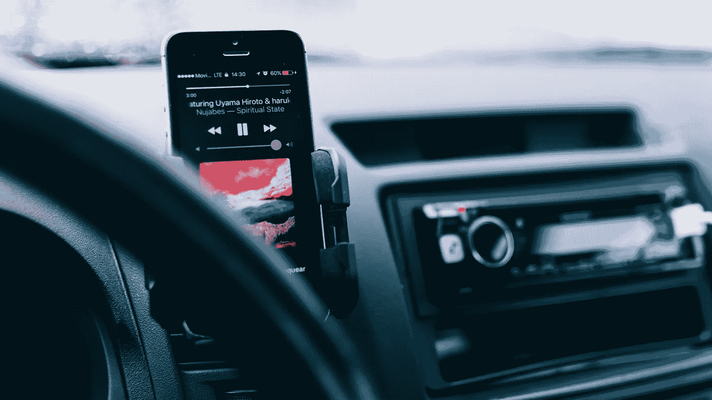

# 苹果和特斯拉还是黑莓和 Leaf？

> 原文：<https://medium.datadriveninvestor.com/apple-and-tesla-or-blackberry-and-leaf-299e83266930?source=collection_archive---------14----------------------->

Can it play music? [Photo: [Humberto Arellano](https://unsplash.com/@bto16180)]

我真的很喜欢我的老黑莓风格 9670 手机。就像一个好朋友的记忆，我的一部分想让它活着。在新的领导下，微软正在技术上卷土重来，也许黑莓也能。

我的 3G 黑莓手机有德州扑克游戏、语音导航和可用的键盘。它还有一个反袖珍拨号功能(不使用时会翻转关闭)。我可以打牌到深夜，在商务旅行时得到指示，并通过文本、语音或电子邮件与朋友和同事交流。当翻盖合上时，它仍然像手表一样显示时间。

我真的不需要什么新东西。那么我为什么要买苹果手机呢？嗯，每个人都有。有很多应用程序。当时，我没有意识到我只需要四个应用程序。我确实喜欢我的 iPod 音乐播放器，这似乎是将两个设备整合为一个的好举措。

另一个相关的问题是，为什么我最初购买了 Nook Color？我想看电子书，但有一些同龄人的压力。一个有 Nook 的朋友总是谈论它。但是这个设备现在被放在一个垃圾抽屉里，就在我的旧黑莓手机旁边。走了，但没有被遗忘。我家现在有 3 台 Kindle paper whites——当它们上市时，我们似乎会多买一台。我的孩子在这些设备上贪婪地阅读图书馆的书籍。它做了我们需要它做的事情，仅此而已——让我的孩子接触写得很差的小说比让他们接触没脑子的应用程序更容易忍受。

我最近没有买特斯拉，[我买了一辆日产聆风](https://medium.com/@randgrey/i-purchased-a-leaf-am-i-an-idiot-803c10e48bfa)。在 2018 年购买日产 Leaf 感觉很像购买 Nook Color——这是一个迟到的早期采用者举动，可能不会选择赢家。但是，它让我尝到了新的热门技术，就像我的 Nook 颜色一样，孩子们将在几年后得到叶子。在我停止使用 Nook Color 几个月后，孩子们喜欢玩 EA 的“大富翁”游戏。在购买 Nook 时，我没有想到这一点，但现在我在购买日产 Leaf 时会想到这一点。

特斯拉太贵了。这个大家都知道。而且苹果 iPhone 很长一段时间都太贵了。人们总是为某样东西付太多的钱。作为一个供应商，如果你绝对搞定它，那么你就可以全身而退。市场相信一个公司将会继续抓住它——他们把钱押在掌舵的产品领导者身上。一个好的产品领导者似乎是公司最有价值的资产。虽然任何人都可以通过倾听客户的意见来发现应该生产什么，但是如果你比他们先知道客户需要什么，你就永远领先。

我不确定苹果最近有没有做到这一点。例证:我的配偶最近需要一部新手机，我们刚刚从 apple.com 的翻新部分购买了“旧”iPhone 7。我一直在用一部 iPhone 7，它工作得很好。就像买一辆好车一样，等待几年似乎比立即停掉最新款的 iPhone 更明智。这可能在短期内无助于苹果的收益预期。

自从苹果公司推出 iPod 以来，他们一直在宣扬“我们是一个伟大的设备，可以在旅途中播放你所有的音乐”。从那以后的一切都只是一个带有应用程序的 iPod 或者一个更好/更大的屏幕。但你看到的每个人耳朵里都有苹果的蓝牙扬声器这一事实意味着大多数人只是用这些设备来听音乐。经过 3 个月的试用，我迷上了苹果音乐。我可以听完整的专辑，因为它们是在原始唱片上播放的。通过 CarPlay，我可以告诉 Siri 播放我想要的任何专辑。对我来说，这是苹果能提供的唯一最有价值的东西。我不需要特斯拉来做这个。我也不需要 iPhone Xs 来做这个。我的 Leaf 和 iPhone 7 就很好地做到了这一点。没有什么比这更能满足我短期的需求了。事实上，在这种情况下，为了钱，我可以有两辆车。把我的 Leaf 和一辆本田 Pilot 配在一起，我的家庭就拥有了短途和长途旅行所需的一切。我们有两个功能重叠的东西，而不是一个优质项目。但是同样的价格，我们有**两个**可以两个人同时使用的东西(而不是只有**一个**)。

我们家里有两台 Chromebooks。经过我的一些欺骗，现在有一个运行 Linux。另一台 Chromebook 是为了旅行而购买的，因为我们无法在飞机、火车和汽车的旅途中携带昂贵而笨重的 MacBook Pro。对付一个弄坏 250 美元机器的孩子比对付一台 1200 美元的机器要容易得多。但是真正区分这两台机器的是一个漂亮的屏幕和一个非常漂亮的触摸板。也许 Chromebooks 的一大进步是可以轻松启动到 Linux 模式。Chromebook 产品设计归谁所有？这个人肯定没有像埃隆·马斯克或史蒂夫·乔布斯那样推销自己。这可能并不重要，Chromebook 不需要成为自切片面包以来最好的东西。我们的只在假期使用。

20 世纪 90 年代英特尔 i486 个人电脑背后的产品领导者是谁？没关系——我可以在彩色屏幕上玩视频游戏，比苹果电脑便宜多了。因为这些个人电脑，我离开苹果 15 年了。在我决定再次为苹果支付溢价之前，微软不得不令人极其沮丧很多年。苹果在 2018 年凭借其非专业版 iPad 的打折版进入了圣诞购物大军——是花哨的钢笔和看起来合理的价格让我们上钩了。

我不认为苹果公司会长期逍遥法外。当一家优秀的音乐服务公司制造出一款能播放音乐、能做手机所做的事情的设备时，人们就会继续前进。我们甚至可能不需要音乐服务来为自己制造设备。像“ [Light Phone 2](https://www.thelightphone.com/home/) ”这样的东西在一种需要帮助远离无意识屏幕时间的文化中胜出。这款手机的早期采用者是要求耳机插孔的。

对于笔记本电脑、手机、电子阅读器或电动汽车，问题在于功能和价值。我们会为那些新的或令人惊叹的东西支付额外费用。但是，如果它们不惊人，不再新颖，那就要小心了。有人有能力把一个有更好愿景的团队组织起来。与此同时，一些大公司除了足够好和更便宜之外没有真正的愿景(三星？)可以获得足够的吸引力，在 10 年内转移消费者。我的旧黑莓手机静静地放在我的抽屉里，但我没有忘记它。有苹果吗？