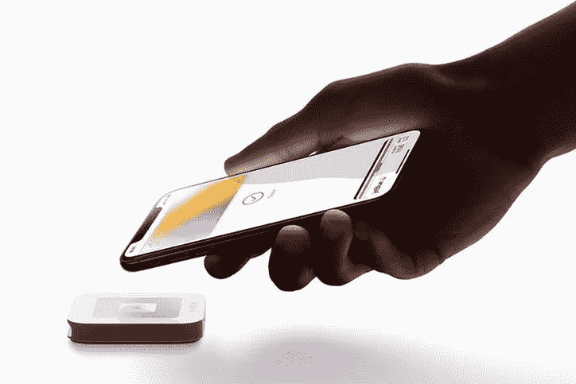

# 苹果银行——金融的未来？

> 原文：<https://medium.datadriveninvestor.com/apple-bank-the-future-of-finance-2722d5bb1bcb?source=collection_archive---------3----------------------->

Credit: Apple

我们生活在这个世界上，变化预测着我们的思想。如果你想一些未来的事情，这很有可能已经发生了。如果你开始采取措施，很可能已经晚了。我相信时间和空间的本质已经发生了变化——我们现在不是生活在物质世界，而是生活在信息宇宙中，时间是扭曲的，空间是流动的，不可定义的。

让我用一个例子来说明这个想法。

在我开始写一篇关于大型科技公司对银行业的影响的小型学术论文的那天，发生了一些事情。苹果宣布推出 Apple card——这是其首款真正的金融产品，据称将重塑银行业的整个未来。

 [## 苹果会成为新的网飞吗？-数据驱动型投资者

### 有可能。然而，该公司肯定会与大公司竞争。许多人不得不看到这一天的到来…

www.datadriveninvestor.com](https://www.datadriveninvestor.com/2019/02/15/will-apple-be-the-new-netflix/) 

了解苹果公司的历史记录，这听起来令人担忧。苹果不是一家小型金融科技公司，你可以通过杀手级收购或强制合作来收购它。它是一家拥有海量数据和忠实用户群的科技巨头。相比之下，2018 年初，苹果号称拥有[13 亿活跃用户](https://www.macrumors.com/2018/02/01/apple-now-has-1-3-billion-active-devices-worldwide/)，而全球资产规模最大的银行(中国工商银行)可以从[“仅仅”5.67 亿个人客户中受益](http://www.icbc-ltd.com/ICBCLtd/Investor%20Relations/Investment%20Highlights/Our%20Advantages)。

华尔街可能会耸耸肩，坚定地认为金融太复杂了，无法结束科技公司的统治。但是，如果苹果能为客户提供大银行几十年来都没有做到的东西呢？

**咬一口苹果**

苹果卡是一种虚拟信用卡。它适用于您的所有设备，您可以在几秒钟内登录。它没有逾期费、年费、国际费或超额费用，只收取低利率。此外，它还提供财务规划服务和每日返现。据称，它还提供了增强的安全性和数据保护，因为它虔诚地发誓不会将您的数据出售给第三方。

还有什么？如果你想要一张实体卡片，苹果可以提供这种印有你的名字和商标的卡片，没有卡号、CVV 或签名！所有这些信息都可以在钱包应用程序中找到(Revolut 去年夏天为高端市场推出的“最小信息”信用卡的相同概念[。老实说，这个小小的改变对我来说意义重大。我一直不太明白为什么你有所有重要的信息，让每个人都可以接触到你的钱，包括恶意的陌生人或报复心强的前任？在那之后，我对这块光滑的小金属产生了强烈的欲望，尽管我原则上反对使用信用卡。](https://www.telegraph.co.uk/money/consumer-affairs/revolut-launches-premium-metal-card-lure-wealthier-users/)

这些功能本身都不是革命性的，但从整体来看，它给人一种印象，即苹果致力于提供完美的信用卡产品，类似于 iPhone——像俘虏一样无缝。凭借其技术过时且高度分散的零售银行系统，它完全有可能成为美国游戏规则的改变者(想象一下[非接触式支付系统今年才开始在美国大规模铺开](https://www.ft.com/content/445a308c-02f3-11e9-9d01-cd4d49afbbe3))。

事实上，这是一个更大趋势的一部分——大型科技平台开始密切关注金融行业，希望利用他们在数字市场上已经拥有的优势，如网络搜索、在线广告、社交媒体和电子商务。

**平台来了**

他们来了，带着数据和技术。他们拥有庞大的客户群，更重要的是，他们比传统银行更清楚客户想要什么，以及如何引导他们的购买决策。行业专家广泛讨论[金融行业从管道到平台模式的转型](http://www3.weforum.org/docs/Beyond_Fintech_-_A_Pragmatic_Assessment_of_Disruptive_Potential_in_Financial_Services.pdf)，这意味着未来银行的角色可能会减少到仅仅是原始“组件”(如流动性)的供应商，或者为管理所有客户互动的技术平台提供后台基础设施。

我们可能会问:‘这真的很糟糕吗？’银行的行为相当令人失望，尤其是在金融危机的背景下，纳税人的钱被用来为他们的错误和肆无忌惮的贪婪买单。也许他们需要换成更好的？

问题在于，出于多种原因，硅谷似乎并不是华尔街的更好选择。

首先，技术平台以捆绑多种服务和使用行为营销让你消费更多而闻名。当你在 Instagram 上花费时间时，这可能看起来无伤大雅，但想象一下，当涉及到信用卡时，这将是一场噩梦。人们最终会在他们不需要和不想要的东西上大量超支，只是因为他们被困在对平台的多重依赖中。请记住，科技巨头没有提供更好的金融服务的动机——他们只是希望人们在他们的平台上花费更多。正如 [CB Insight 分析师指出的](http://fintechnews.ch/fintech/bank-of-amazon-is-disrupting-the-financial-landscape/21954)，“亚马逊正在打造金融服务产品，以增加对亚马逊生态系统的参与”。同样，苹果希望人们通过苹果卡在每笔交易中使用 iPhone 苹果卡不是目的，而是手段。最终，亚马逊或苹果或谷歌可以通过他们自己的支付服务，根据收集到的关于你的数据，让你花更多的钱，这样用户甚至不会注意到就深陷债务之中。

第二，以捆绑产品为目标的用户可能会伴随着纯粹的价格歧视，即你根据之前的订单历史支付更多的费用，或者根据平台对你今天获得了发薪日且余额上升的了解支付更多的费用。提供平等的金融服务可能会成为一个更加难以实现的目标。*平等*并不意味着每个人都得到完全相同的产品。平等意味着每个社会群体都能得到满足他们需求的最优产品，因此最终我们都同样富裕。金融普惠的关键是产品差异化，而不是价格差异化。科技平台能够提供吗？历史表明这不太可能。与所有多边平台一样，一方的用户被提供非常便宜或免费的服务(例如，非常低利率的贷款)，但他们实际上为其他产品支付了更多费用(例如，使用上述贷款从苹果公司购买的产品)——只是因为平台的另一方收取了更高的价格。金融普惠不是这样运作的。金融普惠并不意味着你可以用更便宜的钱购买更贵的产品。

或许，最严重的影响是，与银行不同，进入金融领域的科技平台不受监管。通过采用“中介”的商业模式，他们避免了繁琐的监管，但可以抓住最重要的客户互动，并获得利润流的最大份额。事实上，亚马逊通过 Amazon Cash 向客户提供虚拟现金存款，在失败的情况下，无需政府保险就可以吸引数百万美元的客户资金。阿里巴巴的余额宝基金是全球最大的货币市场基金，管理着 1656 亿美元的资金，其监管仍然宽松。未来，科技公司将积累越来越多的客户资金，并可能成为贷款、存款、保险、投资等一切的“一站式商店”——没有传统银行机构所需的资本要求、会计程序和透明结构。与传统银行相比，这不仅让科技公司处于战略优势，也带来了严重的稳定性问题。我们可能会看到“大到不能倒”的公司，其规模之大在以前是不可想象的。

“大到不能倒”的科技公司及其草率的风险管理策略已经引发了世界各地监管机构的担忧。[中国政府一直威胁要出台法规，不仅针对在线基金，也针对金融控股公司，如阿里巴巴的子公司蚂蚁金服。这些公司将被要求从](https://www.reuters.com/article/us-china-regulation-conglomerates/china-consults-on-rules-for-financial-holding-companies-sources-idUSKBN1O90VJ)[中央银行获得执照并满足资本要求；他们的所有权结构也会受到限制](https://www.forbes.com/sites/sarahsu/2018/05/30/how-will-ant-financial-chinas-fintech-giant-be-impacted-by-new-regulations/#1c1f95263df4)。此举可以提供一个公平的竞争环境，并使 techfin 公司更加谨慎。但是为了有效，它应该在技术平台的总部和活跃的地方实施。

最后，金钱总是与权力联系在一起，无论是经济上还是政治上。信贷机构的重要性是巨大的，因为它们与更广泛的经济体系相互关联。未来，当我们看到资本逐渐向几大平台转移的时候，他们的力量和影响力会变得更加占优势。另一方面，它们的中央集权性质使它们成为控制人们思想和钱包的简单工具。权力集中在少数人手中——这难道不是反垄断法在其发源地美国诞生的原因吗？防止资本从少数人手中转移到更少数人手中，可能是一场永远不会太早开始的战斗。

回到苹果卡。我喜欢吗？是的，我知道。我希望苹果成为数字版的高盛吗？肯定不会。

**金融+初创企业=独角兽银行？**

这个等式中缺少的是具有正确激励的真正创新。我们目睹了金融科技革命第一波的承诺没有兑现。它还没有把金融业的格局改变到现在大型科技威胁的程度。然而，它带来了许多成功的初创企业和商业模式的例子，这些例子实际上让金融变得更好、更便宜、更方便。许多人使用 Revolut、Weswap、肉豆蔻、Moneyfarm、challenger banks(如 Tinkoff 或 Monzo)的产品。问题是，在创新的商业价值流入少数几个池的世界里，如何支持和促进草根创新？

这对公共决策者来说是一个大问题，但我们作为消费者也很重要。正是我们每天的选择，帮助一些公司获得牵引力，却让其他公司失败。我们可以用我们的钱投票支持更多的竞争，更好的金融服务，更多的包容，或者支持少数占主导地位的公司，更差的选择，隐藏的超额收费和放弃我们的数据。这也是我不想用苹果卡的原因之一。我想使用相同或更好的产品，但来自一家与众不同的公司，不会将它与大量其他产品混合和捆绑在一起。该公司将努力为我提供一个最好的产品，并专注于此。