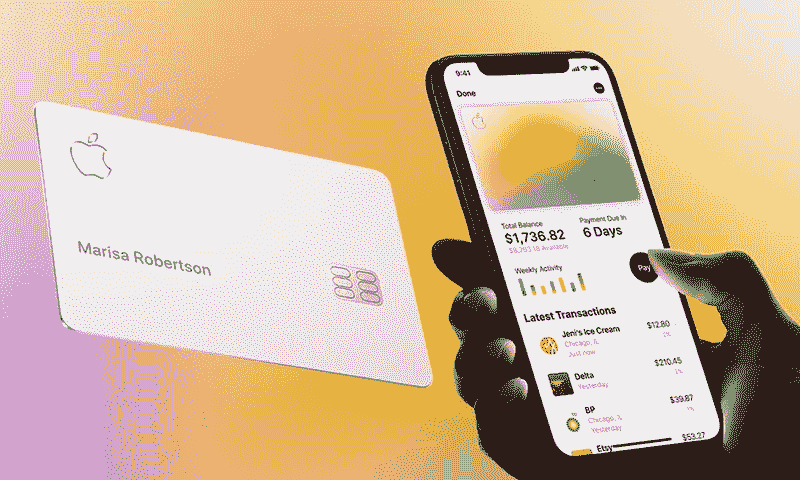
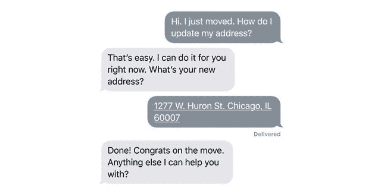

# 苹果卡是一张很棒的监狱卡

> 原文：<https://medium.datadriveninvestor.com/apple-card-is-a-great-jail-card-be3a8a9ba713?source=collection_archive---------6----------------------->

苹果卡终于来了，提供一张浮华的钛卡，在苹果的 logo 旁边刻着你的名字。它是市场上最好的信用卡吗？如果不是，为什么会有如此多的炒作？

首先，让我们聊一会儿它提供了什么。简而言之:这张卡是安全的，因为它应该主要通过 iPhone 上的 Apple Pay 使用，如果你的卡号被盗，你可以得到一张新的，而不用替换你钱包里的矩形。这张卡是**智能的**，因为它显示实时交易以及你使用它的地方的全名和位置；它还提供了你的开支的可视化表示，这样你就知道你在哪些方面花费最多。

该卡宣传**财务责任**，因为它鼓励用户避免支付任何利息，而且它根本没有任何费用。这是对你的隐私的尊重，因为苹果不知道你花了多少钱、花了多少钱、花了多少钱、花了多少钱、花了多少钱(高盛知道，但根据他们与苹果的合同，他们永远不会分享或出售你的数据给第三方用于营销或广告)。最后，该卡提供了一个**分级奖励**系统，每天都给你退款。

 [## 2019 年即将改变世界的技术|数据驱动的投资者

### 很难想象一项技术会像去年的区块链一样受到如此多的关注，但是……

www.datadriveninvestor.com](https://www.datadriveninvestor.com/2019/01/17/the-technologies-poised-to-change-the-world-in-2019/) 

所以，让我们来澄清一下:苹果卡不是市场上最好的卡，但也不差，尤其是对于那些需要一点帮助来负责自己财务的人来说。然而，这款苹果新产品是一只披着羊皮的狼:它是一张旨在推动用户更深入苹果生态系统的卡片。基本就是监狱卡，我们来探究一下原因。

**摩擦改变**

一些国家有信用评分系统，比如美国，一个人的分数用于重要的事情，比如获得贷款或抵押贷款。不鼓励客户不断更换和关闭信用卡，因为这会降低他们的信用评分。出于这个原因，一旦顾客拿到苹果卡，他们可能会保留很长一段时间，在这段时间里自动绑定到 iPhone 上；苹果卡不能用于任何其他手机，因为它需要在每次通过触控 ID 或 Face ID 付款前激活。

如果切换手机生态系统已经很痛苦(迁移联系人、图片、消息等。)，想象一下必须同时考虑转换信用卡的因素。苹果卡在考虑从 iOS 转到 Android 时产生巨大的摩擦；这正是苹果需要的，这样才能让你成为 Apple Music 等货币化服务的潜在客户。

为了有效地做到这一点，苹果只需要提供相对较好的奖励，以便将更换手机的影响提升到与更换信用卡相同的水平。每次使用 Apple Pay(在任何购买类别上)都有 2%的返现是一个很好的选择。

然而摩擦并不止于此。关闭信用卡本身可能是一个挑战，因为要这样做，客户需要直接联系高盛。苹果表示，高盛的员工正在接受使用苹果工具和技术的培训，但目前还不清楚他们处理这种情况的能力如何。

**作为产品的隐私和客户服务**

众所周知，苹果一直在利用最近科技行业的隐私丑闻来推销他们与众不同的理念。在某种程度上，这是事实:苹果没有任何广告业务，他们需要根据用户的兴趣或习惯来锁定用户。正因为如此，他们的产品可以存储关键数据，而不会受到利用这些数据的诱惑。

位置、联系人、消息、电子邮件、电话和现在的购买。所有这些有价值的数据对谷歌或脸书这样的公司来说都是金子，但对苹果来说却不是。这是苹果卡令人耳目一新的好处之一，它受到与高盛公司的合同保护，防止他们向第三方出售你的私人数据。苹果可以吸引很大一部分对隐私敏感的用户，他们厌倦了成为产品。这完全是在将隐私作为一种产品出售。

如果客户在旅行途中收到拒付的款项，会发生什么情况？如果客户想要更新他们的卡信息怎么办？[行使服务条款和选择退出仲裁条款](https://arstechnica.com/information-technology/2019/08/apples-new-credit-card-comes-with-forced-arbitration-heres-how-to-opt-out/)有多容易？苹果公司用他们自己的客户服务高标准来包装高盛，缓解了这些担忧。我甚至可以想象苹果公司强迫银行通过短信提供 24 小时客户服务，作为他们多年合作的一部分。承诺是与苹果卡背后的银行打交道应该像与朋友通过短信聊天一样简单，没有等待音乐，没有令人沮丧的电话。苹果风格的客户服务。

**奖励和福利**

为了将所有这些联系在一起，苹果公司做出了一个重大举措:对在苹果商店(包括 iTunes 或 App Store)购买的任何商品提供 3%的返现。这基本上就像告诉顾客:用苹果卡购买苹果产品，你可以免费获得 3%的折扣。

顾客每购买一件苹果产品，与生态系统的联系就变得更紧密；用户的经济和情感投资都变得更大。因此，投资客户放弃苹果生态系统的可能性变得更小。

苹果正计划将这一奖励等级扩展到更多接受 Apple Pay 的商家。例如，在其推出当天，它宣布任何通过优步和优步 Eats 应用完成的[支付将](https://www.theverge.com/2019/8/20/20813621/apple-card-availability-sign-up-uber-cash-back-launch)有资格获得 3%的返现率。

但是苹果不仅仅用上面解释的返现率来吸引顾客，他们还通过信用卡附带的财务福利功能来吸引顾客。例如，没有多少银行提供易于跟踪的客户如何使用信用卡的可视化报告；Apple Card 使用颜色显示每个类别的费用，并使用滑动轮来表示不同的支付选项以及每种支付的利息。这是如何工作的演示:

尽管 Apple Card 本身的唯一盈利方式是支付利息，但看到苹果优先考虑客户的财务健康还是很好的。这再一次证明了信用卡的监狱效应是多么有价值，以及苹果是如何与客户进行长期博弈的:留住他们并在明天向他们出售服务，比今天获得他们的钱更令人向往。

**临别赠言**

如果你是一个奖励囤积者或金融权力使用者，苹果卡可能对你来说太简单了，或者完全没有必要。但如果你生活在 Apple Pay 随处可见的大城市，并且正在寻找一种回报丰厚的简单信用卡，Apple Card 可能就是你想要的。说到底，别忘了这只是一张高盛的信用卡，包裹着苹果的标准、设计和软件。你只需要考虑你愿意去多深的奇迹洞穴。出去可能没那么容易。

**你喜欢这篇文章吗？** [**订阅**](https://geekonrecord.com/subscribe/) **通过邮件获取新帖。**

*苹果图片*