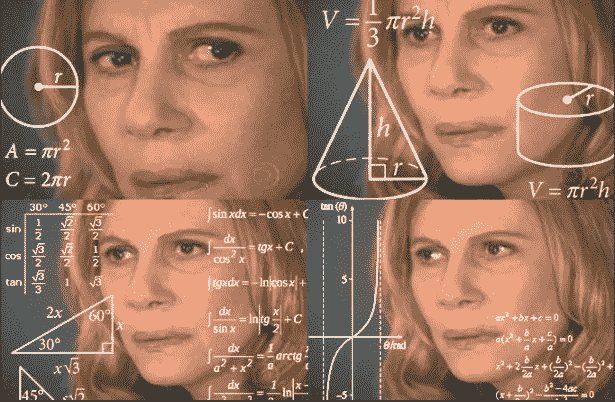
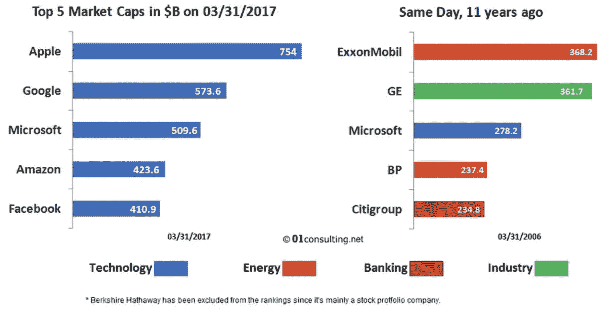
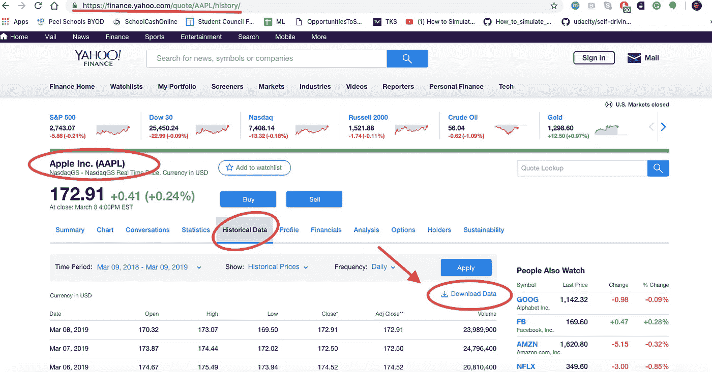
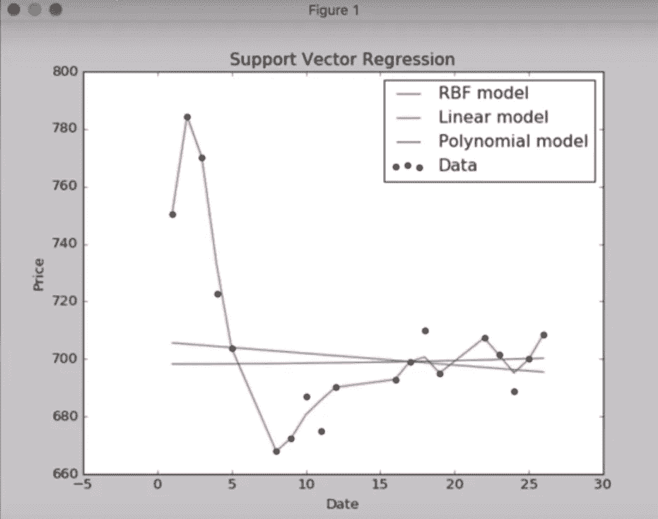
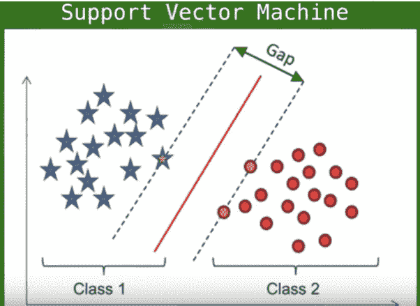

# 我是如何用人工智能预测苹果股票的

> 原文：<https://medium.datadriveninvestor.com/apple-stock-predictor-d1a973d8cfa2?source=collection_archive---------1----------------------->

[](http://www.track.datadriveninvestor.com/1B9E)

## 用支持向量机预测苹果股价

你坐在电脑前，等着股票市场在上午 9 点开盘。你刷新页面，看到**苹果的股票下跌了**，你让**在**股价高得多的时候**购买了**。你心里在想，“要是我多等一天就好了，**多一天**”。**😫**

幸运的是，有一种方法可以避免这个错误。使用一种称为支持向量机的人工智能工具，你可以创建一个模型来绘制苹果股票的趋势，并根据时间，年份和日期，人工智能可以预测结果会是什么。你不需要成为超级人工智能专家来建立这一点，你只需要有动力和激情。



How it may feel trading on the stock market.

# 什么是股市？

对于所有不知道股票市场是什么的人来说，它是一个大平台，在这里你可以购买一家公司的股票，你实际上是这家公司的所有者。例如，如果苹果有 10，0 00 股要购买，而我买了 10 0 股，这意味着从技术上讲，我拥有该公司 1%的股份。虽然，我可能拥有公司 1%的股份，但这并不意味着我对苹果有任何决策权或权力。所以，不要认为你可以走进苹果，要求一部新的 iPhone。😂

[](https://www.datadriveninvestor.com/2019/02/15/will-apple-be-the-new-netflix/) [## 苹果会成为新的网飞吗？-数据驱动型投资者

### 有可能。然而，该公司肯定会与大公司竞争。许多人不得不看到这一天的到来…

www.datadriveninvestor.com](https://www.datadriveninvestor.com/2019/02/15/will-apple-be-the-new-netflix/) 

股票投资经验有限的人要么被普通投资者损失 50%股票价值的恐怖故事吓坏了，要么把太多的现金余额用于投资。**现实**是**投资**股市**有风险**，但是当**以有纪律的方式**接近时，这是**建立你的净资产的最有效的方法之一！**

# 苹果在股票市场的角色

苹果是世界上最富有的公司之一！这是一家完全公开交易的公司，赚了 1 万亿美元！苹果公司在纳斯达克股票交易所交易。在北美，有三个主要的证券交易所，多伦多证券交易所(TSX)，纽约证券交易所(纽约证券交易所)和纳斯达克。

苹果的股票代码是 AAPL，这就是为什么每当你看新闻或者打开手机上的股票应用程序，你会看到一堆公司的缩写，AAPL 是苹果的。



As of March 2017

# 创建股票预测器

像任何代码一样，你需要安装**的依赖项**，以获得所需要的**功能**来执行 **任务**。在这种情况下，有四个****依赖项**需要安装。**

```
pip install csv
pip install numpy
pip install scikit-learn
pip install matplotlib
```

**注意:如果您使用的是 Python 的 3.6 版或更新版本，csv **可能已经与 Python 框架一起安装了**。如果您安装了它并得到一个错误，它已经通过 Python 框架安装好了。您也可以使用 Python IDE，比如 PyCharm，并从那里安装依赖项。**

****从属关系破落:****

*   **`csv`允许我们**从 csv** 文件中读取数据，我们将收集该文件。的。将被收集的 csv 将包含过去 30 天苹果股票的所有价格。**
*   **`numpy`允许我们**对我们的数据**进行计算。这将帮助我们预测明天的股票会是什么样的。**
*   **`scikit-learn`允许实际**建立预测模型。****
*   **`matplotlib`允许我们**创建图表，我们稍后将分析该图表**。就像，画出我们的点并沿着线走。**

**接下来，我们需要收集将要分析的数据集。雅虎！金融让我们很容易做到这一点。**

****

**porn**

**一次，你从雅虎下载数据！财务，您将能够在一个. csv 文件中访问它。确保将该文件保存到桌面上，文件名为 **aapl.csv.****

****后**你**下载了。csv 文件**，好玩的部分到了，**写剧本**！首先，您需要像这样导入库(依赖项):**

```
import csv
import numpy as np
import sklearn.svm import SVR
import matplotlib.pyplot as plt
```

**当我在考虑要导入哪些库时，我选择了这些库，因为结合起来，它们可以很好地一起工作来创建图表(matplotlib)、分析数据(numpy)和从过去的价格中学习(sklearn)。**

**然后，我**定义了** **两个** **命令**，它们专注于组织股票的日期和价格。**

```
def get_data(aapl.csv):
 with open(aapl.csv, 'r') as csvfile:

   csvFileReader = csv.reader(csvfile)
   next(csvFileReader)for row in csvFileReader:
   dates.append(int(row[0].split('appl.csv')[0]))
   prices.append(float(row[1]))return
```

**基本上，这个**命令利用了我从 Yahoo！金融。代码将**跳过文件中列出的名字**直接进入我们需要的数据。日期和价格。本质上，这是一个 **csv 文件阅读器。******

```
def predict_price(dates, prices, x):
 dates = np.reshape(dates,(len(dates), 1)) # converts to a matrix from a vectorsvr_lin = SVR(kernel= 'linear', C= 1e3)
 svr_poly = SVR(kernel= 'poly', C= 1e3, degree= 2)
 svr_rbf = SVR(kernel= 'rbf', C= 1e3, gamma= 0.1) # support vector regression models
 svr_rbf.fit(dates, prices) # data points in the models
 svr_lin.fit(dates, prices)
 svr_poly.fit(dates, prices)plt.scatter(dates, prices, color= 'black', label= 'Data') # plotting the initial datapoints 
 plt.plot(dates, svr_rbf.predict(dates), color= 'red', label= 'RBF model') # RBF kernel
 plt.plot(dates,svr_lin.predict(dates), color= 'green', label= 'Linear model') # linear kernel
 plt.plot(dates,svr_poly.predict(dates), color= 'blue', label= 'Polynomial model') # polynomial kernel
 plt.xlabel('Date')
 plt.ylabel('Price')
 plt.title('Support Vector Regression Apple Stock Model')
 plt.legend()
 plt.show()return svr_rbf.predict(x)[0], svr_lin.predict(x)[0], svr_poly.predict(x)[0]
```

**这个命令使用 sci-kit learn 来分析数据点，然后使用 matplotlib 来创建图形！**

**你看到的所有以`str_`开头的代码都是支持向量机的一部分。我们称之为支持向量回归模型。**

**如果我们预测苹果公司二月份的股价，这就是图表的样子。**

****

**Apple’s stock price for February 2019**

# ****支持向量机****

**除了 sci-kit learn，我还构建了一个支持向量回归模型来**提高**预测**的******准确度**。****

****在 ML 中，支持向量机是带有**学习算法**的**监督学习模型**，它**分析** **数据**用于**分类**和**回归**分析。给定一组训练样本，每个样本属于**两个类别中的**一个**，**一个 SVM 训练算法**建立**一个**模型**，由**将新的样本**分配给一个类别或另一个类别，使其成为一个非概率二元线性分类器。****

**SVM 模型是将示例表示为空间中的**点，绘制成使得单独类别的**示例被尽可能宽的**间隙**分割**。然后，新的示例被映射到那个**相同的空间中，并预测**到**属于**一个**类别**基于它们落入**的间隙的哪一侧。**

简而言之，如果我们对人类身上发现的肿瘤进行分类。我们将它们分为恶性(癌性)或良性(非癌性)，模型可以根据大小、密度、颜色等进行预测。是哪种类型的肿瘤。

我们用 SVM 来预测当天的价格。



The examples would fall closer to the gap than the rest of the examples.

当**数据未标记时，**监督学习是不可能的，需要**非监督学习方法。**现在，SVM 必须尝试找到数据到组的自然聚类，然后将新数据映射到这些形成的组。他们不看物理的、定量的数据，而是看其他东西，比如时间、日期、星期，并据此做出预测。

# 关键要点

*   股票市场是一个大平台，在这里你可以购买一家公司的股票，你就成为了这家公司的所有者。
*   `csv`允许我们从 csv 中读取数据。
*   `numpy`允许我们对数据进行计算。
*   `scikit-learn`允许实际建立预测模型。
*   `matplotlib`允许我们创建图表，稍后我们将进行分析。
*   在 ML 中，支持向量机是**监督学习模型**，具有分析用于分类和回归分析的数据的学习算法。
*   支持向量机被绘制成图表，使得单独类别的例子被尽可能宽的清晰间隙分开。
*   当数据未标记时，监督学习是不可能的，并且需要非监督学习方法。

***如果你喜欢这篇文章，请给它一些掌声——你可以点击这里*** ***阅读更多我的故事，并查看我的 LinkedIn***[***arman Merchant***](https://linkedin.com/in/armaan-merchant-b3bba89a/)***。此外，请查看我的个人网站:***[***https://armaanmerchant.com/***](https://armaanmerchant.com/)***。***